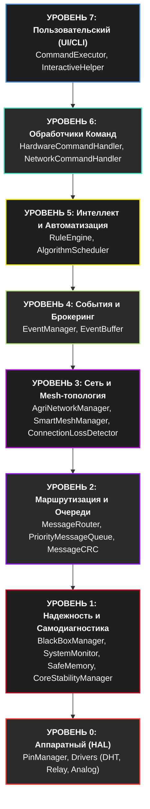
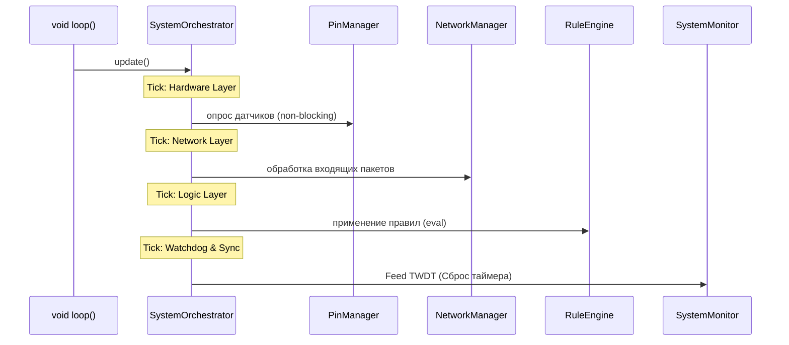
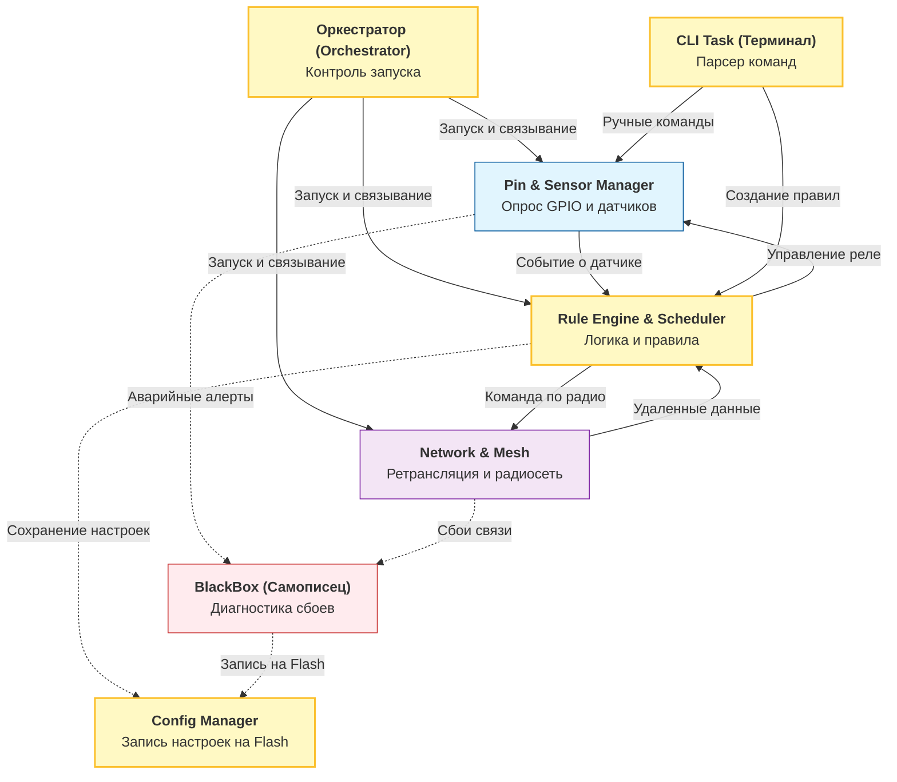

<p align="center">
  <a href="./README.md">◀ Назад к оглавлению</a> | 
  <b>Архитектурный базис</b> | 
  <a href="./02_Working_Principles.md">Вперед к Разделу 1 ▶</a>
</p>

---

# 🏛️ Архитектурный базис и системный дизайн AgriSwarm

Этот документ является фундаментальным описанием архитектуры, паттернов проектирования и потоков данных децентрализованной операционной среды AgriSwarm. Он служит мостом между высокоуровневыми концепциями и низкоуровневой реализацией на C++ для микроконтроллеров ESP32.

---

## 1. Глобальная философия системы

AgriSwarm спроектирован с учетом жестких ограничений встраиваемых систем и непредсказуемой среды эксплуатации (потеря питания, нестабильная связь, аппаратные сбои датчиков). 

**Ключевые инженерные парадигмы:**
1. **Offline-First и Децентрализация:** В системе нет "главного сервера" (Single Point of Failure). Любой узел способен выполнять свои задачи автономно. Если узел теряет связь, он продолжает выполнять локальные правила автоматизации (RuleEngine) на основе локальных датчиков.
2. **Детерминизм и Zero-Allocation в горячих путях:** Использование динамической памяти (`malloc` / `new` / `String`) во время основного цикла (main loop) строго минимизировано для предотвращения фрагментации кучи (Heap Fragmentation) — главной причины падений ESP32 при аптайме в несколько месяцев. Вся необходимая память в идеале выделяется статически при запуске (Static Pools), а неизбежные аллокации сведены к абсолютному минимуму.
3. **Hash-First Архитектура:** Вместо ресурсоемкого сравнения строковых имен узлов, топиков и датчиков используется алгоритм хеширования `FNV-1a` (32-бит). Поиск маршрутов, обработка правил и публикация событий выполняются за время `O(1)`.
4. **Слабая связанность (Loose Coupling) и Менеджеры:** Система разделена на 40+ изолированных менеджеров (классов). Общение между модулями происходит либо через строгие интерфейсы, либо асинхронно через шину событий (`EventManager`).
5. **Defensive Programming и Форензика:** Код пишется с презумпцией, что всё, что может сломаться — сломается. Используются кастомные смарт-указатели (`SafePtr`), аппаратные и программные сторожевые таймеры (Watchdog), а любые падения логируются в RTC-память (`BlackBoxManager`) для последующего расследования (Post-Mortem).

---

## 2. Семиуровневая модель архитектуры

Система разбита на четко определенные уровни абстракции, от работы с "железом" до бизнес-логики пользователя.



### Подробное описание уровней

*   **Уровень 0 (HAL):** Скрывает специфику физических портов ESP32. `PinManager` гарантирует, что два разных процесса не попытаются одновременно настроить один пин на вход и выход. Реализован абстрактный интерфейс драйверов `IPinDriver`.
*   **Уровень 1 (Надежность):** Фундамент выживаемости. Здесь работают подсистемы защиты от переполнений, контроля кучи и `BlackBoxManager`, который сохраняет состояние процессора в RTC Fast Memory за миллисекунды до аппаратного или программного сброса.
*   **Уровень 2 (Маршрутизация):** Сетевой транспортный слой. Обрабатывает пакеты байт. Использует очереди с приоритетами (`PriorityMessageQueue`), чтобы гарантировать, что критическая команда управления реле будет отправлена раньше, чем лог-сообщение.
*   **Уровень 3 (Mesh):** Управляет логикой формирования сети (painlessMesh Wi-Fi Mesh). `SmartMeshManager` выстраивает динамический граф устройств, а `ConnectionLossDetector` отслеживает обрывы связи и инициирует перестроение маршрутов.
*   **Уровень 4 (События):** Шина данных `EventManager`. Реализует паттерн Pub/Sub (Издатель-Подписчик) внутри устройства, позволяя модулям общаться, не зная о существовании друг друга.
*   **Уровень 5 (Интеллект):** Ядро бизнес-логики. `RuleEngine` обрабатывает загруженные JSON-правила, конвертируя их в бинарные AST-деревья (на базе хешей), обеспечивая мгновенную реакцию системы на триггеры от датчиков.
*   **Уровни 6 и 7 (Управление):** Интерфейсы конфигурации через Serial/CLI или сеть, позволяющие администратору управлять узлом.

---

## 3. Паттерны проектирования в ядре системы

Архитектура AgriSwarm использует ряд классических и специализированных паттернов для достижения нужной степени надежности и гибкости.

### 3.1. Singleton & Manager Pattern (Изоляция подсистем)
Все крупные блоки (NetworkManager, RuleEngine, PinManager) реализованы как синглтоны или управляются через центральный фасад.
*   **Зачем:** Предотвращает дублирование инициализации оборудования (например, два экземпляра модуля работы с WiFi вызовут аппаратную ошибку ядра).
*   **Фасад (`SystemOrchestrator`):** Контролирует порядок запуска менеджеров. Например, `BlackBoxManager` обязан стартовать первым, чтобы успеть перехватить логи прошлых падений, а `AgriNetworkManager` — после загрузки конфигурации.

### 3.2. Publisher/Subscriber (Шина событий)
Связь между датчиками (HAL) и логикой (`RuleEngine`, `NetworkManager`) осуществляется через асинхронную событийную модель на базе кольцевых буферов (Ring Buffers) в `EventBuffer`.

```mermaid
graph LR
    subgraph Publisher
        SD[Драйвер DHT22] -->|update()| PM[PinManager]
        PM -->|pushEvent(hash, value)| EB[EventBuffer]
    end

    subgraph Subscriber 1
        EB -->|onEvent()| RE[RuleEngine]
        RE -->|evaluate(hash, value)| Action[Execute Action]
    end

    subgraph Subscriber 2
        EB -->|onEvent()| SP[SensorPublisher]
        SP -->|broadcast()| Mesh[Mesh Network]
    end
```

### 3.3. FNV-1a Hashing (Отказ от строк)
Вместо хранения строковых идентификаторов "topic/greenhouse/sensor1" система использует предварительно вычисленный 32-битный хеш.
*   **Сравнение строк:** `strcmp(a, b)` — медленно, требует динамического выделения памяти для буферов (фрагментация).
*   **Сравнение хешей:** `if (hashA == hashB)` — одна процессорная инструкция (O(1)). Используется повсеместно в маршрутизации и оценке правил.

### 3.4. State Machine (Конечные автоматы)
Жизненные циклы узлов и сетевых подключений управляются через FSM (Finite State Machines). Это предотвращает состояния гонки (Race Conditions) при обрывах связи во время переподключения.

---

## 4. Сетевая топология и маршрутизация (Mesh)

### 4.1. Самоорганизующаяся сеть Wi-Fi (painlessMesh)
В качестве основного протокола передачи используется **painlessMesh** — библиотека, строящая ad-hoc сеть на базе Wi-Fi модулей ESP32, где узлы одновременно выступают как точки доступа (AP) и клиенты (STA).
*   **Преимущества:** Полностью децентрализованная ad-hoc топология, автоматическое построение маршрутов, отсутствие необходимости в центральном роутере.
*   **Маршрутизация (Routing):** `SmartMeshManager` выстраивает динамическое дерево маршрутов, ретранслируя JSON-пакеты от узла к узлу (Multi-hop).
*   **Авто-Дискавери:** Узлы автоматически сканируют Wi-Fi эфир, обнаруживают соседние узлы с тем же SSID/паролем mesh-сети и устанавливают TCP-соединения между собой.

### 4.2. Алгоритм доставки пакета

1. Узел A генерирует команду для узла C (напрямую они не видят друг друга, но оба видят Узел B).
2. Пакет попадает в `PriorityMessageQueue`. Заголовок пакета содержит CRC32, Sender Hash, Target Hash.
3. Очередь передает пакет в `AgriNetworkManager`.
4. Сетевой менеджер проверяет таблицу маршрутов (`Routing Table`) и видит, что путь к C лежит через B.
5. Узел A отправляет Wi-Fi кадр узлу B.
6. `MessageRouter` узла B перехватывает кадр, видит, что `Target Hash != My Hash`, и немедленно перекладывает пакет в свою очередь на отправку узлу C.

---

## 5. Управление памятью и защита от сбоев

### 5.1. The Zero-Alloc Principle в сетевом слое

В условиях аптайма, измеряемого месяцами, главной причиной нестабильности ESP32 является фрагментация кучи. Сетевой слой AgriSwarm спроектирован с упором на минимизацию использования динамической памяти в "горячих путях" обмена телеметрией.

**Статические структуры данных:**
Сетевые пакеты (`NetworkSensorData`, `ActuatorInfo`) конструируются на базе структур с фиксированными массивами `char[]` вместо использования динамических объектов `String`. Сериализация в JSON выполняется поверх статических буферов (`StaticJsonDocument`).

**⚠️ Known Limitation (v4.0.4):**
В текущей версии поиск в кэше доступных ресурсов (`_availableSensors`) выполняется линейным перебором `O(N)`. Также существует риск рассинхронизации хешей, если идентификатор датчика превышает 31 символ (происходит тихое обрезание в буфере, в то время как хеш вычисляется от полной строки).

### 5.2. BlackBox Forensics (Бортовой самописец)
Отличительная особенность AgriSwarm — встроенный механизм диагностики падений.

1. ESP32 падает (например, из-за деления на ноль, разыменования `nullptr` или срабатывания Watchdog-таймера).
2. Вызывается аппаратное прерывание `panic_handler`.
3. В течение нескольких миллисекунд до жесткого ресета `BlackBoxManager` копирует содержимое регистров CPU, Program Counter (PC), последние записи из `EventBuffer` и системное время в **RTC Fast Memory** (область в 8КБ, которая сохраняет заряд при программных перезагрузках).
4. Устройство перезагружается.
5. При старте `BlackBoxManager` инициализируется первым. Он обнаруживает "аварийный след" в RTC-памяти и копирует его в энергонезависимую память (Flash / LittleFS), формируя `crash_log.bin`.
6. Система загружается штатно и отправляет в Mesh-сеть алерт `SYSTEM_CRASH_RECOVERED`. Администратор может выгрузить полный дамп для отладки.

### 5.3. SafeCommandParser и Защита входов
Все данные извне (команды из CLI, полезная нагрузка из Mesh-пакетов) считаются недоверенными (Untrusted Data).
Код не доверяет длине массива, заявленной в заголовке пакета, а проверяет реальную границу буфера. Все математические вычисления на данных с датчиков (например, в движке правил) используют функции из `SafeMath` для предотвращения целочисленных переполнений (Integer Overflows) и `NaN/Inf` состояний.

---

## 6. Цикл обработки данных (Main Loop Workflow)

Для обеспечения детерминизма `SystemOrchestrator` жестко контролирует цикл `update()`:



Каждая фаза (Hardware, Network, Logic) обязана вернуть управление за строго отведенное время. Если функция работает слишком долго, `CoreStabilityManager` может инициировать предупреждение о блокировке потока, а `SystemMonitor` не сбросит Task Watchdog Timer, что приведет к безопасной перезагрузке зависшего модуля или всего устройства.

---
## 7. Модульная архитектура (Справочник подсистем)

Этот раздел описывает внутреннюю структуру агро-контроллера, разделение обязанностей между модулями прошивки, их взаимодействие и логику работы. 

Архитектура построена по принципу **слабой связанности (Loose Coupling)**. Устройство разделено на независимые службы (менеджеры), каждая из которых отвечает за свой узкий круг задач и общается с другими службами асинхронно через шину событий.

### 7.1. Общая схема взаимодействия подсистем



### 7.2. Семь ключевых подсистем

#### 📦 7.2.1. Оркестратор жизненного цикла (SystemOrchestrator)
**Роль:** Главный распределительный центр и диспетчер платы.
*   **Принцип работы:** При включении платы оркестратор инициализирует все остальные менеджеры в строгой последовательности.
*   **Главный цикл:** В постоянном цикле оркестратор по очереди передает кванты времени каждому менеджеру.

#### 📡 7.2.2. Сетевой стек и Mesh-топология (Network & Mesh Manager)
**Роль:** Создание радиосети, выбор маршрутов и доставка сообщений.
*   **Принцип работы:** Автоматически находит соседние платы, обменивается маяками (Keep-Alive) и строит карту.
*   **Адаптивность:** Автоматически выбирает лучшего ретранслятора. При обрыве связи маршрут перестраивается мгновенно.

#### 🔌 7.2.3. Менеджер контактов и драйверов (Pin & Sensor Manager)
**Роль:** Безопасное взаимодействие с физическим оборудованием.
*   **Драйверная модель:** Для каждого типа оборудования изолированный программный драйвер.
*   **Безопасность GPIO:** Защита от конфликта доступов.
*   **Фильтрация шумов:** Для аналоговых датчиков применяется фильтр экспоненциального сглаживания (EMA).
*   **Умное питание (Power Pin):** Подача питания только на время замера.

#### 🧠 7.2.4. Движок правил и планировщик (Rule Engine & Scheduler)
**Роль:** Автономное принятие решений.
*   **Обработка событий:** Получает данные от датчиков через внутреннюю шину. Использует хэш-ключи.
*   **Асинхронность:** Очередь задач, обработка пачками.
*   **Планировщик задач:** Выполнение периодических действий.

#### 💾 7.2.5. Асинхронный менеджер настроек (Config Manager)
**Роль:** Надежная работа с файлами конфигураций во внутренней памяти.
*   **Отложенная запись:** Накапливает изменения в оперативной памяти и записывает их во Flash в фоновом режиме.
*   **Резервное копирование:** Автоматическое восстановление настроек из бэкапа при повреждении файла.

#### 🏥 7.2.6. Контроль стабильности, Рефлексия и Черный ящик (BlackBox, System Monitor & SelfReflectionSystem)
**Роль:** Защита от зависаний, сбоев питания, ведение логов сбоя и профилирование системы.
*   **Watchdog (Сторож):** Инициация безопасного перезапуска при зависании модуля.
*   **Защита памяти:** Очистка сетевых буферов при достижении порога свободной RAM.
*   **Регистратор крашей (BlackBox):** Записывает техническое состояние в энергонезависимую память RTC перед сбоем.
*   **AI-Ассистирование (SelfReflectionSystem):** Встроенный профилировщик реального времени. Анализирует "микрофризы" (задержки `loop()`), утечки памяти и предоставляет администратору отчеты о "бутылочных горлышках" для ручной или автоматической оптимизации.

#### ⌨️ 7.2.7. Терминальный процессор (CLI Task)
**Роль:** Обеспечение интерфейса связи с пользователем.
*   **Изоляция потока:** Вынесено в отдельный поток процессора.

---
*Документ предоставляет полное концептуальное понимание устройства системы. Детальное описание каждого конкретного класса будет представлено в соответствующих файлах в директории `modules/`.*

---

<p align="center">
  <a href="./README.md">◀ Назад к оглавлению</a> | 
  <b>Архитектурный базис</b> | 
  <a href="./02_Working_Principles.md">Вперед к Разделу 1 ▶</a>
</p>
