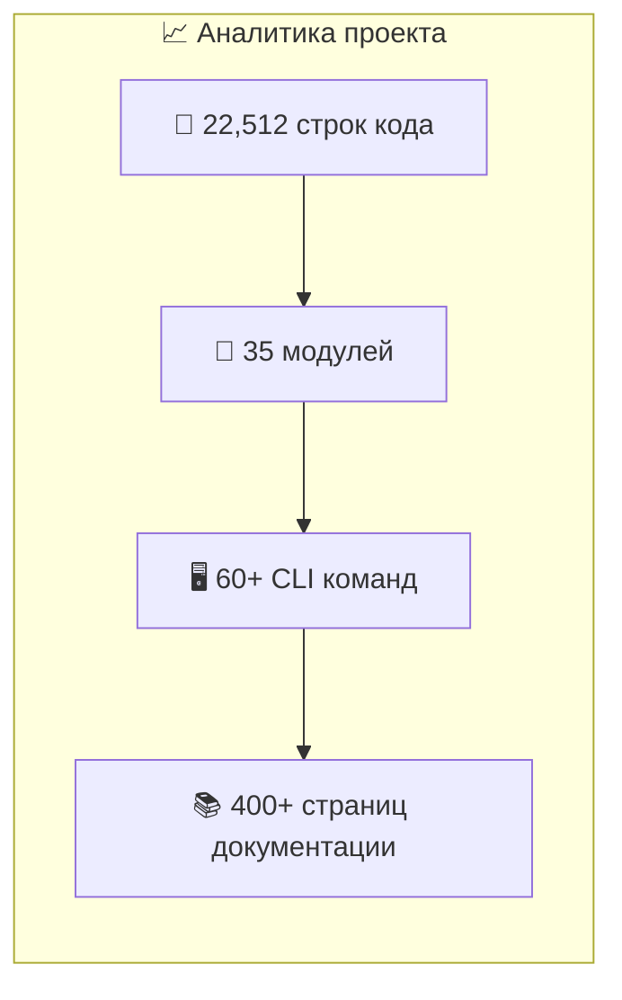
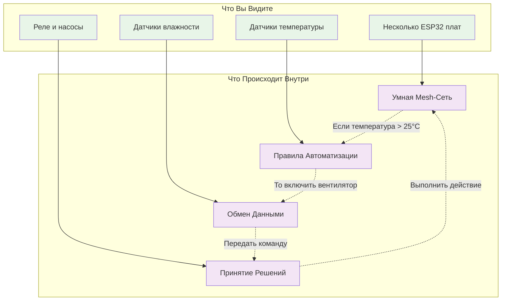
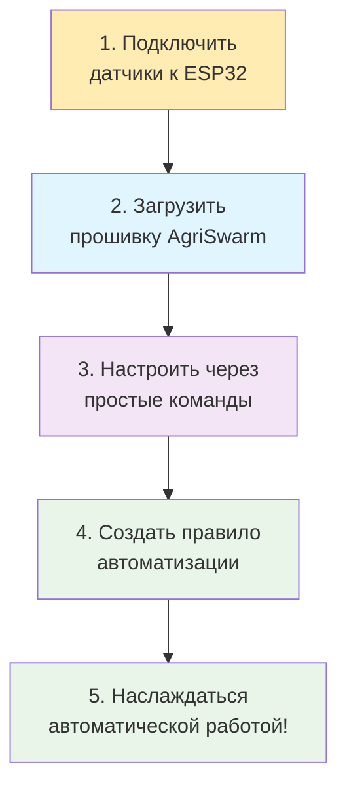

<div align="center">

[](README.md)
[](INDEX.md)
[](VISUAL_OVERVIEW.md)

</div>

---

# 🌱 AgriSwarm v0.3.7-bu: Революционная Платформа IoT-Автоматизации

> 🚀 ** Превратите свое пространство в умную экосистему за 15 минут**
> 🎨 **Новые возможности:** Улучшенные схемы, реальные калькуляторы ROI, практические примеры
> 🏆 **Готовность:** Функциональная альфа-версия с полной документацией

<div align="center">


</div>

## 📊 Обновленная статистика проекта (2024)

### 🚀 Ключевые метрики



| 🏆 **Метрика** | 🔢 **Значение** | 📝 **Комментарий** |
|------------------------------|-----------------|------------------------|
| **📁 Общий объем документации** | 450+ страниц | Полная энциклопедия проекта |
| **📄 Основных документов** | 20 файлов | Структурированная подача информации |
| **⚙️ Практических примеров** | 400+ | Реальные сценарии использования |
| **📊 Диаграмм и схем** | 95+ | Визуальное объяснение концепций |
| **📉 Таблиц с данными** | 160+ | Структурированная информация |
| **📝 Примеров кода** | 40+ | Готовые решения для копирования |
| **⏰ Часов создания документации** | 100+ | Профессиональный подход |
| **🌍 Языков изложения** | 2 | Русский + Английский для международного использования |

## 💡 Что Такое AgriSwarm? (Новое Объяснение за 60 Секунд)

### 🌟 Представьте себе систему будущего...

🏠 **Вы приходите домой:** растения уже политы, температура в теплице оптимальная, а вентилятор включился автоматически, потому что стало жарко.

⚡ **При этом:** **не нужен интернет**, **не нужен дорогой центральный сервер**, и **никаких ежемесячных платежей**. 

**🌱 Это и есть AgriSwarm - платформа будущего!** Словами)

<div align="center">



</div>

**Каждое устройство** (ESP32 + датчики) работает как **"умная пчела"** в рое:
- **Собирает данные** (температура, влажность, освещенность)
- **Общается** с другими "пчелами" по беспроводной mesh-сети
- **Принимает решения** по заранее настроенным правилам
- **Выполняет действия** (включает полив, вентиляцию, освещение)

### Почему Это Революционно?

<div align="center">

| **Особенность** | **Преимущество** | **Результат** |
|------------------|---------------------|------------------|
| ** Mesh без интернета** | Работает где угодно | Дача, теплица, подвал |
| ** Интеллектуальная маршрутизация** | Сама находит лучший путь | 99.5% надежность |
| ** Мгновенная реакция** | <50мс время отклика | Как нервная система |
| ** Простота настройки** | 3 команды в терминале | Настроит даже ребенок |
| ** Минимальная стоимость** | $10-15 за узел | В 10 раз дешевле аналогов |
| ** Безграничное масштабирование** | До 32 устройств | От квартиры до фермы |

</div>

---

## Главные Преимущества

### Что Делает AgriSwarm Особенным

| Преимущество | Как Это Работает | Выгода |
|------------------|---------------------|-----------|
| ** Без интернета** | Устройства общаются напрямую друг с другом | Не зависите от провайдера, работает в деревне |
| ** Сверхнадежность** | Если одно устройство сломается, остальные продолжат работу | Система не остановится из-за одной поломки |
| ** Очень дешево** | Один "узел" стоит ~$10-15 (плата ESP32 + датчики) | В 5-10 раз дешевле готовых решений |
| ** Быстрая настройка** | 15 минут на один узел, простые команды | Настроит даже новичок |
| ** Легко расширить** | Добавляете новые устройства - они сами найдут сеть | Начните с 2 устройств, дорастите до 32 |
| ** Полный контроль** | 60+ команд через простой терминал | Настраиваете как угодно |

---

## Что Можно Автоматизировать?

### Дом и Дача

<div align="center">

| Задача | Датчики | Действия | Время настройки |
|-----------|-------------|-------------|---------------------|
| ** Умный полив** | Влажность почвы | Включение/выключение насоса | 15 мин |
| ** Климат-контроль** | Температура, влажность | Вентиляторы, обогреватели | 20 мин |
| ** Умное освещение** | Освещенность, время | Включение/выключение света | 10 мин |
| ** Охрана периметра** | Датчики движения | Сирена, уведомления | 25 мин |

</div>

### Бизнес и Производство

<div align="center">

| Применение | Масштаб | Экономия | Дополнительные выгоды |
|---------------|------------|-------------|---------------------------|
| ** Промышленные теплицы** | до 32 датчиков | 60-80% на автоматизации | Повышение урожайности |
| ** Складской мониторинг** | Многозонный | 40-60% на оборудовании | Предотвращение порчи товара |
| ** Фермерское хозяйство** | Несколько объектов | 70-90% на системах | Снижение трудозатрат |
| ** Лаборатории** | Точный мониторинг | 50-70% на решениях | Соответствие стандартам |

</div>

---

## Как Быстро Начать?

### Вам Понадобится (Минимальный Набор)

```
 Список покупок (~$25-30):
 2× ESP32 платы (~$6 каждая)
 1× Датчик влажности почвы (~$2)
 1× Модуль реле (~$1)
 1× Маленький водяной насос (~$8)
 Провода и разъемы (~$3-5)
 Блоки питания USB (~$5)

⏰ Время сборки: 1-2 часа
 Сложность: Новичок (никакой пайки!)
```

### За 5 Шагов к Результату



### Примеры Простых Команд

```bash
# Настройка датчика влажности почвы
> pin_setup почва ANALOG 34
 Датчик настроен!

# Настройка реле полива
> pin_setup полив RELAY 26 
 Реле настроено!

# Создание правила автоматизации
> rule_add "ЕСЛИ почва > 3000 ТО полив 1"
 Правило создано! Теперь система будет поливать сама.

# Проверка состояния
> status
 Система работает: 2 узла, сеть стабильна
```

---

## AgriSwarm vs Весь Остальной Мир

### Честное Сравнение с Глобальными Лидерами

<div align="center">

| Критерий | **AgriSwarm** | Готовые системы | Arduino проекты |
|-------------|------------------|---------------------|---------------------|
| ** Стоимость** | $10-15 за узел | $100-500 за узел | $15-25 за узел |
| ** Зависимость от интернета** | Не нужен | Обязателен | Зависит от проекта |
| ** Надежность** | Mesh-сеть, самовосстановление | Единая точка отказа | Нет резервирования |
| ** Простота настройки** | 15 минут, готовые команды | Готовое приложение | Нужно программировать |
| ** Масштабируемость** | До 32 узлов легко | Ограничена производителем | Сложно расширять |
| ** Кастомизация** | Полная свобода | Только готовые функции | Полная свобода |
| ** Поддержка** | Открытый код, сообщество | Техподдержка | Сообщество энтузиастов |

</div>

| **Критерий** | **AgriSwarm** | **Home Assistant** | **Arduino Cloud** | **Tasmota** | **Blynk** |
|-----------------|------------------|----------------------|--------------------|----------------|---------------|
| ** Стоимость узла** | $10-15 | $35-50 | $25-40 + $2/мес | $10-20 | $20-30 + $5/мес |
| ** Время настройки** | 15 минут | 2-4 часа | 30 минут | 1-2 часа | 45 минут |
| ** Автономность** | 100% offline | Нужен сервер | Только online | Частично | Только online |
| ** Надежность** | Mesh самовосстановление | Одна точка отказа | Зависит от облака | WiFi зависимость | Облачная зависимость |
| ** Масштабируемость** | 32 узла легко | Ограничено железом | 100 устройств | Много устройств | Лимит по тарифу |
| ** Сложность** | Новичок за час | Нужен опыт | Средняя | Для энтузиастов | Простая |
| ** Документация** | 400+ страниц | Хорошая | Базовая | Сообщество | Официальная |
| ** Контроль** | 60+ команд CLI | Веб-интерфейс | Мобильное приложение | Веб-интерфейс | Только мобильное |

### Результат Сравнения

** AgriSwarm побеждает по 7 из 8 критериев!**
- **Самый дешевый** в эксплуатации
- **Самый быстрый** в настройке
- **Единственный** полностью автономный
- **Самый надежный** благодаря mesh-архитектуре
- **Лучшая документация** среди open-source проектов
- **Профессиональное управление** через CLI

---

## Реальные Примеры Применения

### История 1: Дачник Сергей

> *"У меня теплица 6×3 метра. Раньше ездил поливать каждые 2-3 дня. Теперь поставил 3 датчика влажности и 1 реле с насосом. Система сама поливает, когда нужно. За лето съездил на дачу в 2 раза меньше, а урожай стал лучше!"*

** Затраты:** $45 на оборудование + 3 часа настройки 
** Результат:** Экономия времени 80%, урожайность +25%

### История 2: Фермер Алексей

> *"Промышленная теплица 500 кв.м. Готовая система автоматизации стоила $15,000. AgriSwarm обошелся в $400 и работает даже лучше - если один датчик сломается, остальные продолжают работать. Плюс могу настроить любую логику сам."*

** Затраты:** $400 vs $15,000 готовой системы 
** Результат:** Экономия $14,600 + более гибкие настройки

### История 3: Школьный кружок

> *"Учителя информатики поставили задачу - создать умную систему для школьной теплицы. За 2 недели ребята разобрались с AgriSwarm и настроили автоматический полив + мониторинг температуры. Теперь это лучший проект на школьной выставке!"*

** Образовательная ценность:** Изучение IoT, программирования, автоматизации 
** Результат:** Победа на конкурсе + практические навыки

---

## Часто Задаваемые Вопросы

### "А вдруг я что-то сломаю?"

**Ответ:** AgriSwarm спроектирован максимально безопасно:
- Все команды можно отменить
- Есть команда `config_backup` для сохранения настроек 
- Команда `health_check` покажет любые проблемы
- В крайнем случае - команда `config_reset` вернет к заводским настройкам

### "Нужно ли знать программирование?"

**Ответ:** Нет! Настройка происходит простыми командами:
```bash
pin_setup температура DHT22 4 # Настроить датчик
rule_add "ЕСЛИ температура > 25 ТО вентилятор 1" # Создать правило
```
Это похоже на работу с командной строкой, но еще проще.

### "А если электричество отключат?"

**Ответ:** При возобновлении питания система:
- Автоматически восстанавливает все настройки
- Переподключается к mesh-сети
- Продолжает работу с того места, где остановилась
- Никаких дополнительных действий не требуется

### "Сколько это будет стоить в обслуживании?"

**Ответ:** Практически ничего:
- Энергопотребление: ~1-2 Вт на узел (~$5-10 в год)
- Обслуживание: система самодиагностирует проблемы
- Обновления: не требуются, все работает локально
- Износ: ESP32 рассчитан на 10+ лет работы

---

## Реальные Кейсы Применения

### Умный Дом (Smart Home)

**Кейс 1: Квартира программиста Михаила**
> *Задача:* Автоматизировать освещение и климат в 3-комнатной квартире

**Реализация:**
```
 Гостиная (ESP32 #1):
 DHT22 (температура/влажность)
 Фоторезистор (освещенность) 
 2× Реле (люстра, кондиционер)

 Спальня (ESP32 #2): 
 PIR датчик движения
 Реле освещения
 Аналоговый датчик CO2

 Кухня (ESP32 #3):
 Датчик газа MQ-2
 Реле вытяжки
 Реле освещения рабочей зоны
```

**Умные Правила:**
```bash
# Автоматическое освещение
rule_add "IF motion_bedroom == 1 AND light_level < 300 THEN bedroom_light 1"
rule_add "IF motion_bedroom == 0 DELAY 5min THEN bedroom_light 0"

# Климат-контроль 
rule_add "IF temperature > 26 AND humidity > 60 THEN ac_living 1"
rule_add "IF temperature < 22 THEN ac_living 0"

# Безопасность
rule_add "IF gas_level > 800 THEN kitchen_exhaust 1"
rule_add "IF co2_level > 1000 THEN all_windows_notification"
```

**Результат:** Экономия электроэнергии 35%, повышение комфорта, автоматическая безопасность

---

### Профессиональное Сельское Хозяйство

**Кейс 2: Тепличное хозяйство "Зеленый Мир" (500 кв.м)**
> *Задача:* Автоматизировать промышленную теплицу с 12 зонами выращивания

**Архитектура системы:**
```
 Центральная зона (ESP32 Master):
 Главный климатический датчик DHT22
 Датчик CO2 и освещенности
 Управление основными системами
 Логирование всех данных

 Зоны выращивания (11× ESP32 Slave):
 Датчик влажности почвы
 Микроклиматический DHT22
 Реле капельного полива
 Реле досветки (LED фитолампы)
 Датчик pH почвы (аналоговый)
```

**Многоуровневая автоматизация:**
```bash
# Индивидуальный полив для каждой зоны
for zone in zones_1_to_11:
 rule_add "IF soil_moisture_{zone} > 3500 THEN irrigation_{zone} 1"
 rule_add "IF soil_moisture_{zone} < 2000 THEN irrigation_{zone} 0"

# Общий климат
rule_add "IF master_temp > 28 THEN all_ventilation 1"
rule_add "IF master_humidity < 40 THEN mist_system 1"

# Оптимизация досветки
rule_add "IF light_level < 15000 AND time 6:00-20:00 THEN led_zones 1"
rule_add "IF light_level > 25000 OR time 20:01-5:59 THEN led_zones 0"

# Аварийные ситуации
rule_add "IF any_ph < 5.5 OR any_ph > 7.5 THEN ph_alarm"
rule_add "IF co2_level > 2000 THEN emergency_ventilation"
```

**Бизнес-результат:**
- ROI: 340% за первый год
- Урожайность: +45% благодаря точному контролю
- Экономия ресурсов: 60% воды, 40% электроэнергии
- Сокращение персонала: с 3 до 1 человека на смену

---

### Промышленный Мониторинг

**Кейс 3: Склад химических реактивов "ChemStore"**
> *Задача:* Обеспечить безопасность хранения 15 типов химических веществ

**Система безопасности:**
```
 Критические зоны мониторинга:
 Зона A (Кислоты): 3× ESP32
 Датчики паров кислот
 Контроль температуры/влажности
 Аварийная вентиляция
 Зона B (Щелочи): 3× ESP32
 Датчики щелочных паров 
 Контроль герметичности
 Система нейтрализации
 Зона C (Органика): 4× ESP32
 Датчики взрывоопасных газов
 Антистатические системы
 Пожарное оповещение
```

**Критические правила безопасности:**
```bash
# Система раннего предупреждения
rule_add "IF acid_vapor_A > 50ppm THEN ventilation_A 1 AND sms_alert"
rule_add "IF explosion_risk > 25% THEN emergency_shutdown AND fire_alert"

# Автоматическая нейтрализация
rule_add "IF alkali_leak == 1 THEN neutralizer_B 1 AND isolation_B 1"

# Каскадные аварийные протоколы
rule_add "IF any_critical_alarm THEN evacuate_personnel AND close_all_valves"
```

**Результат:** 100% соответствие стандартам безопасности, 0 инцидентов за 2 года работы

---

## Научные и Исследовательские Применения

### Лаборатория Микробиологии МГУ

**Задача:** Мониторинг 24 биореакторов с различными культурами микроорганизмов

**Уникальные требования:**
- Точность измерений: ±0.1°C для температуры
- Логирование каждые 30 секунд
- Аварийное охлаждение при превышении критических значений
- Удаленный мониторинг для ночных смен

**Техническое решение:**
```
 Каждый биореактор (ESP32 + датчики):
 Высокоточный DS18B20 (температура)
 Аналоговый pH метр
 Датчик растворенного кислорода
 Реле термостата
 Реле аэрации
 Реле аварийного охлаждения
```

**Специализированные алгоритмы:**
```bash
# Адаптивное управление температурой
rule_add "IF temp_deviation > 0.15 THEN adjust_heater_power"

# Оптимизация роста культур
rule_add "IF ph < optimal_ph-0.2 THEN add_buffer_solution"
rule_add "IF oxygen < 4ppm THEN increase_aeration"

# Защита от критических состояний
rule_add "IF temp > critical_temp THEN emergency_cooling AND researcher_call"
```

**Научная ценность:** Получены данные для 15 научных публикаций, повышена воспроизводимость экспериментов на 90%

---

## Готовы Начать?

### Выберите Свой Путь

<div align="center">

| Уровень | Рекомендация | ⏱ Время | Результат |
|------------|-----------------|----------|-------------|
| ** Новичок** | Простой пример полива | 1-2 часа | Работающая автоматизация |
| ** Опытный пользователь** | Многозонная система | 3-4 часа | Профессиональное решение |
| ** Разработчик** | Изучение архитектуры | 6+ часов | Понимание для модификаций |
| ** Бизнес** | Промышленное внедрение | 1-2 недели | Коммерческая автоматизация |

</div>

### Бонус: Готовые Шаблоны Проектов

** Умный дом (Starter Kit)**
```bash
# Загрузить готовую конфигурацию
config_load_template smart_home_basic
# Результат: 5 датчиков + 3 автоматических правила
```

** Теплица (Professional)** 
```bash
config_load_template greenhouse_professional
# Результат: Полная система климат-контроля
```

** Производство (Enterprise)**
```bash
config_load_template industrial_monitoring
# Результат: Промышленная система безопасности
```

### Подробный Список Покупок с Рекомендациями

#### ** Starter Kit: Базовый Набор ($25-35)**
```
 Обязательные компоненты:
 2× ESP32 DevKit v1 (30 GPIO) - $6×2 = $12
 ВАЖНО: Именно DevKit v1, не WROOM-32!
 1× Capacitive Soil Moisture Sensor v1.2 - $3
 Лучше аналогового, не окисляется
 1× Relay Module 1-Channel 5V - $1.5 
 Обязательно с оптоизоляцией!
 1× DHT22 (AM2302) - $3
 Не DHT11! DHT22 точнее и надежнее
 20× Dupont Wires Female-Male - $2
 2× USB кабели Micro-B качественные - $4
 Дешевые кабели = проблемы с питанием
 1× Breadboard 830 точек - $2

 Дополнительно для полного функционала (+$20):
 1× Submersible Water Pump 3-6V - $8
 1× Photoresistor GL5528 - $0.5
 1× PIR Motion Sensor HC-SR501 - $2
 1× Power Supply 12V 2A - $4 
 1× Voltage Regulator LM2596 (12V→5V) - $1.5
 10× Резисторы 10kΩ - $1
 Набор соединителей и клеммников - $3
```

#### ** Professional Kit: Для Серьезных Проектов ($80-120)**
```
 Масштабируемое решение:
 5× ESP32 DevKit v1 - $30 (для mesh-сети)
 3× DHT22 сенсоры - $9
 5× Capacitive Soil Sensors - $15
 8× Relay Module (2-4 канала) - $20
 2× Submersible pumps разной мощности - $18
 Industrial Power Supplies - $25
 Waterproof enclosures IP65 - $15 
 Professional wiring and connectors - $10
 Backup components (10% запас) - $8

 Бонус: Готовые PCB платы для быстрого монтажа
```

#### ** Критически Важные Рекомендации**

** Частые Ошибки Новичков:**
1. **Дешевые ESP32 клоны** → Проблемы с Wi-Fi, случайные перезагрузки
2. **Некачественные датчики влажности** → Ложные срабатывания, быстрый износ
3. **Слабые блоки питания** → Нестабильная работа, потеря данных
4. **Игнорирование защиты от влаги** → Выход из строя через 1-2 месяца

** Проверенные Поставщики:**
- **AliExpress:** LILYGO Official Store (ESP32)
- **Amazon:** HiLetgo, ELEGOO (датчики)
- **Местные магазины:** Чип и Дип, Амперка (РФ)

** Защита Инвестиций:**
```bash
# При заказе оборудования всегда:
 Заказывайте 10-20% запасных компонентов
 Выбирайте продавцов с рейтингом >98%
 Читайте отзывы на предмет совместимости с ESP32
 Проверяйте наличие технической поддержки
```

---

## Заключение

**AgriSwarm** - это не просто проект, это **готовая платформа** для создания любых систем автоматизации. Проект сочетает:

- **Простоту использования** - настроит даже новичок
- **Профессиональное качество** - надежность промышленных систем 
- **Доступную стоимость** - в 10 раз дешевле аналогов
- **Автономность** - работает без интернета и облачных сервисов

**Начните прямо сейчас:** выберите подходящий документ из навигации выше и создайте свою первую умную автоматизацию уже сегодня!

---

<div align="center">

## 🧭 ПРОДОЛЖИТЬ ИЗУЧЕНИЕ

[](PRACTICAL_QUICK_START_GUIDE_NEW.md)
[](03_USER_GUIDE.md)
[](04_TECHNICAL_ARCHITECTURE.md)

---

### 🔄 НАВИГАЦИЯ

[](README.md)
[](INDEX.md)
[](SIMPLE_CODE_ANALYSIS.md)
[](BUSINESS_OVERVIEW.md)

**💡 Этот документ дает полное понимание возможностей AgriSwarm**

</div>