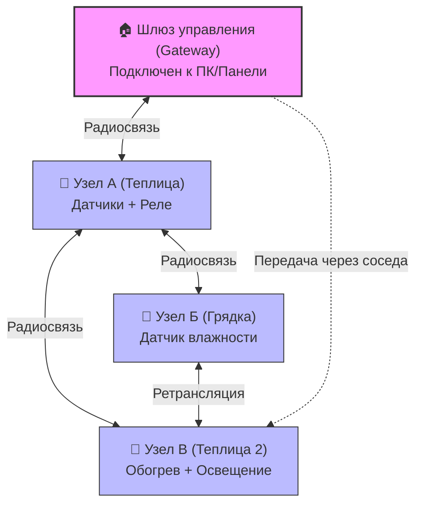
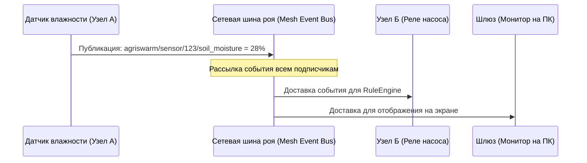
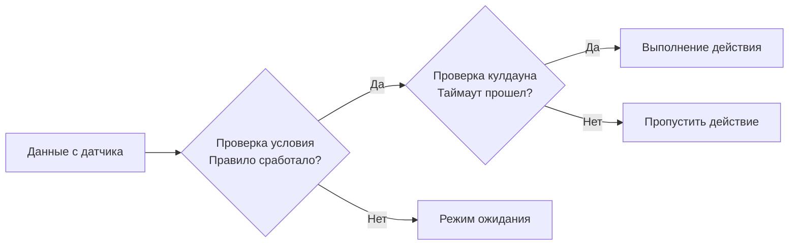

  <a href="./README.md">◀ Назад к оглавлению</a> | 
  <b>Раздел 1: Принципы работы</b> | 
  <a href="./05_Agro_Board_Instructions.md">Вперед к Разделу 2 ▶</a>

---

# ⚙️ Раздел 1: Принципы работы системы AgriSwarm

AgriSwarm — это децентрализованная программно-аппаратная платформа для автоматизации фермерских хозяйств, теплиц и открытых грядок. Основной фокус системы — полная автономность (**Offline-First**), отказоустойчивость оборудования и простота расширения сети.

---

## 1. Децентрализованная сеть роя (Mesh-сеть)

В отличие от классических систем умного дома, AgriSwarm не требует наличия центрального сервера (роутера, интернета или облака). Устройства общаются между собой напрямую по радиоканалу (**P2P**), организуя единую сеть.

### Ключевые свойства сети:
1.  **Самоорганизация и ретрансляция (Multi-hop):** Если Узел В находится слишком далеко от Шлюза, но видит Узел А, данные будут автоматически переданы по цепочке: `Шлюз <-> Узел А <-> Узел В`.
2.  **Самовосстановление (Self-Healing):** Если один из промежуточных узлов отключается (например, из-за пропажи питания), сеть за несколько секунд перестраивает маршруты через другие доступные узлы. Для выбора лучшего соседа система оценивает три фактора:
    *   Качество сигнала (**RSSI**).
    *   Задержка ответа (**Ping**).
    *   Загруженность соседа (количество ретранслируемых им данных).
3.  **Аварийный режим точки доступа (Host AP):** Если узел оказывается в полной изоляции (не видит соседей дольше 60 секунд), он автоматически поднимает собственную беспроводную сеть (`Host Mode AP`). Вы можете подключиться к ней со смартфона или ПК для настройки и ручного управления.
4.  **Безопасность (TrustedNodeManager):** К сети нельзя подключить постороннее устройство. Все узлы проходят проверку по белому списку MAC-адресов. Любые критические команды управления актуаторами (например, открыть заслонку) принимаются только от узлов с подтвержденным уровнем доступа.

---

## 2. Шина событий и обмен данными (Pub/Sub)

Внутри AgriSwarm обмен информацией происходит по модели **Издатель-Подписчик (Publisher/Subscriber)**. Узлы не общаются "напрямую" жесткими вызовами, а отправляют сообщения в общую шину данных под определенными именами (**Топиками**).

*   **Формат топиков:** По умолчанию используется формат `agriswarm/sensor/<ID_платы>/<Имя_датчика>`.
*   **Сбережение трафика (Deadband):** Чтобы не засорять радиоэфир непрерывной отправкой одних и тех же цифр, система отправляет данные в сеть только тогда, когда они **значительно изменились** (например, температура изменилась более чем на 0.5°C, а влажность — более чем на 2.0%). Если данные стабильны, отправляется один контрольный пакет в минуту (Heartbeat) для подтверждения работоспособности.

---

## 3. Автоматизация на месте (RuleEngine)

Каждая плата имеет собственный встроенный "мозг" — движок правил. Вы один раз настраиваете правила автоматизации, и далее плата выполняет их сама, локально, не завися от доступности других узлов или интернета.

### Основные принципы автоматизации:
1.  **Логика сравнения:** Поддерживаются условия: `Больше (>)`, `Меньше (<)`, `Равно (==)`, `Не равно (!=)`, `В диапазоне (BETWEEN)` и `Изменилось (CHANGED)`.
2.  **Защита от дребезга реле (Cooldown):** Чтобы исполнительные механизмы (например, мощные пускатели насосов или вентиляторов) не включались и не выключались каждую секунду при малейших колебаниях температуры около пограничной зоны, для каждого правила задается время блокировки повторного срабатывания (по умолчанию 5 секунд).
3.  **Приоритизация команд (Arbitrage):** Команды управления контактами платы имеют разные уровни приоритета:
    *   `PRIO_RULE` (Низкий) — автоматика правил.
    *   `PRIO_ALGORITHM` (Средний) — сложные сценарии (например, полив по расписанию).
    *   `PRIO_MANUAL` (Высокий) — ручные команды оператора из консоли.
    *   `PRIO_FAILSAFE` (Высший) — защитные экстренные команды.
    Команда с более высоким приоритетом временно блокирует управление от низших приоритетов, что защищает систему от конфликтов (например, когда автоматика пытается выключить свет, а оператор вручную его включил).

### 3.1. Многошаговые алгоритмы (AlgorithmScheduler)
В отличие от `RuleEngine`, который выполняет простые бинарные реакции (IF-THEN), система содержит встроенный модуль `AlgorithmScheduler` для выполнения длительных, многошаговых процессов. 
*   **Сценарии:** Поддерживаются шаблоны сложного полива (`irrigation_control`) с паузами на впитывание воды, алгоритмы ступенчатого обогрева теплицы и т.д.
*   **Исполнение:** Алгоритмы работают асинхронно, не блокируя основной цикл, и могут быть поставлены на паузу или отменены оператором в любой момент (команды группы `algo_...`).

---

## 4. Сторожевой таймер оборудования (Fail-Safe)

Для предотвращения техногенных аварий (например, если плата управления насосом потеряла связь со шлюзом и вода продолжает бесконтрольно заливать теплицу) предусмотрен защитный таймер.

*   Для любого критического выхода (реле, клапан) настраивается параметр `failSafeTimeoutMs` (Таймаут защиты) и `failSafeState` (Безопасное состояние, обычно `0` — выключено).
*   Если плата-исполнитель не получает контрольных подтверждений (Keep-Alive) от управляющего узла в течение заданного таймаута, она считает связь потерянной и **принудительно переводит выход в безопасное состояние**.

---

## 5. Бортовой самописец (BlackBox)

Плата непрерывно контролирует собственное "здоровье" и защищает себя от сбоев питания, перегревов или критических ошибок.

*   **Энергонезависимый буфер (RTC Fast Memory):** При возникновении критического сбоя (зависание программы, просадка напряжения питания ниже критического уровня — Brownout, или программное зависание модуля), процессор перед жестким перезапуском за микросекунды записывает лог последних событий и причину сбоя в специальную защищенную память.
*   **Сохранение отчетов:** При последующей загрузке плата считывает эту информацию и сохраняет её в файл отчета (`crash_log.bin`). Оператор может в любой момент запросить "содержимое самописца" через терминал, чтобы узнать точную причину перезапуска платы.

---

  <a href="./README.md">◀ Назад к оглавлению</a> | 
  <a href="./05_Agro_Board_Instructions.md">Вперед к Разделу 2 (Инструкция по плате) ▶</a>

