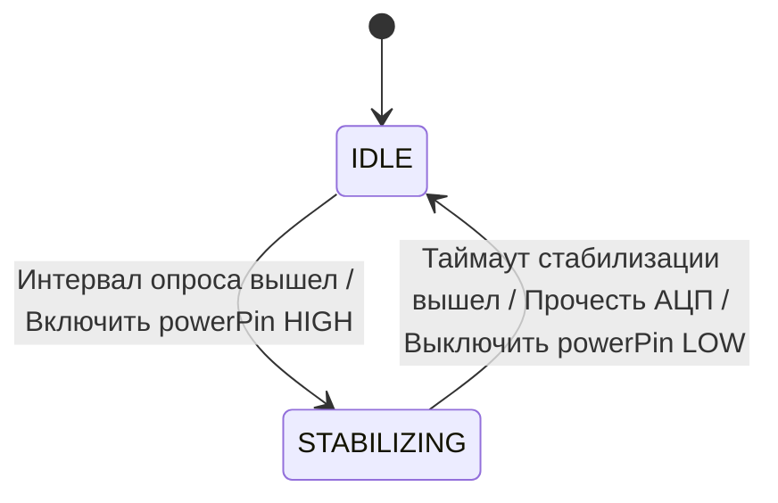

  <a href="./05_Agro_Board_Instructions.md">◀ Назад к Разделу 2</a> | 
  <a href="./README.md">🏠 Оглавление</a> | 
  <b>Раздел 3: HAL и Жизненный цикл</b> | 
  <a href="./04_Mesh_Network_and_Data_Routing.md">Вперед к Разделу 4 (Mesh) ▶</a>

---

# 🔌 Раздел 3: Hardware Interaction and Node Lifecycle

В данном разделе описано взаимодействие прошивки AgriSwarm v4.0.4 с физическим оборудованием и жизненный цикл узла от включения до выхода в сеть.

## 1. Физический уровень и Периферия (Hardware Abstraction)

**Поддерживаемые интерфейсы:**
*   **DHT11 / DHT22**: Температура и влажность (опрос через аппаратный RMT).
*   **ANALOG_IN**: Аналоговые датчики (0-3.3V, 12-bit АЦП). Поддержка `powerPin` для экономии энергии.
*   **DIGITAL_IN**: Кнопки и датчики (Level, Toggle, Momentary с антидребезгом).
*   **RELAY / DIGITAL_OUT**: Силовое управление (0/3.3V).
*   **SERVO**: Сервоприводы с плавной ШИМ-анимацией и Auto-Detach.

### ⚠️ ВНИМАНИЕ: Жесткие лимиты идентификаторов (v4.0.4)
Для обеспечения стабильности памяти (Zero-Alloc) в системе действуют строгие ограничения на длину строк. Нарушение лимитов приведет к отклонению регистрации устройства.

*   **Имя пина (`name` / `sensorId` / `actuatorId`):** Максимум **31 символ**.
*   **Топик маршрутизации (`topic`):** Максимум **63 символа**.

**Поведение:** Если имя датчика в JSON-конфиге или команде `pin_setup` превышает 31 символ, узел выдаст ошибку в лог и датчик **не будет добавлен** в систему.

## 2. Асинхронный опрос датчиков и управление питанием (powerPin)

Для предотвращения коррозии контактов аналоговых датчиков влажности почвы (электролиза) и экономии энергии при батарейном питании в системе реализован неблокирующий механизм управления питанием датчиков через специальный GPIO — `powerPin`.

Опрос датчиков в `AnalogDriver` работает по схеме асинхронного конечного автомата (FSM) со следующими состояниями:

1.  **IDLE (Ожидание):** Драйвер ждет окончания заданного интервала (`intervalMs`). Как только время пришло:
    *   Если `powerPin` настроен (не равен `255`), на этот контакт подается высокий уровень (`HIGH`), переводя датчик в рабочее состояние.
    *   Драйвер переходит в состояние **STABILIZING** и запоминает текущее время. Цикл `loop()` продолжает выполняться без задержек (без блокирующих вызовов `delay`).
2.  **STABILIZING (Стабилизация):** Драйвер ожидает истечения времени `powerStabilizeMs` (обычно от 100 до 1000 мс в зависимости от датчика), необходимого для прогрева электроники датчика и стабилизации напряжения. 
3.  **Считывание и выключение:** По истечении таймера стабилизации драйвер:
    *   Считывает аналоговое напряжение с GPIO-пина датчика.
    *   Мгновенно снимает питание с датчика, переводя `powerPin` в состояние `LOW`, что минимизирует время протекания тока через электроды.
    *   Возвращается в состояние **IDLE**.

### Фильтрация шумов АЦП (EMA-фильтр)
Поскольку встроенный АЦП ESP32 подвержен высокочастотным шумам, полученное аналоговое значение сглаживается с помощью экспоненциального скользящего среднего (**EMA - Exponential Moving Average**):
$$\text{EMA}_{n} = \alpha \cdot \text{Raw} + (1 - \alpha) \cdot \text{EMA}_{n-1}$$
где коэффициент сглаживания $\alpha = 0.3$. Это позволяет подавить случайные скачки напряжения при чтении данных с датчиков без выделения массивов под скользящее среднее в RAM.

## 3. Жизненный цикл узла (Node Lifecycle)

### Boot Sequence (Этапы загрузки)
1.  **Диагностика питания:** Чтение `esp_reset_reason()`.
2.  **Старт ядра:** Инициализация BlackBox (RTC), Watchdog и ConfigManager (LittleFS).
3.  **Сетевой старт:** Активация Mesh-стека и выбор роли (`node_role`).
4.  **Инициализация железа:** Загрузка драйверов пинов из `/pins/`.
5.  **Рабочий цикл:** Переход в `loop()` и "Форсированный поиск" соседей (60 сек).

### Mesh-сопряжение и Безопасность
Сопряжение происходит автоматически при совпадении `MESH_PREFIX` и `MESH_PASSWORD`. 
**Важно:** Управление актуаторами (реле) разрешено только узлам из "белого списка" (`TrustedNodeManager`). 
*   При первом подключении новый узел автоматически добавляется в список с уровнем `ACCESS_LEVEL_BASIC`.
*   Администратор может повысить уровень через CLI: `node_access admin`.

### Автономность (Offline Mode)
AgriSwarm — это **Offline-First** система. При потере связи со шлюзом или другими узлами, устройство продолжает выполнять локальные правила автоматизации (`RuleEngine`), используя физически подключенные к нему ресурсы.

## 4. Fail-Safe механизмы

### 4.1. Сторожевой таймер линка (Keep-Alive)
Для критического оборудования (насосы, нагреватели) используйте параметр `failSafeTimeoutMs`.
*   Если связь с управляющим узлом потеряна на время, превышающее таймаут, узел автоматически переведет пин в `failSafeState`.
*   **Паттерн взаимодействия:** Управляющий узел (шлюз) обязан присылать подтверждающую команду (Keep-Alive) не реже раза в 50-60 секунд для сброса таймера на исполнителе.

### 4.2. Детектор обрыва линии (SensorConnectionMonitor)
Физические датчики, работающие в агрессивной среде (теплицы, грунт), подвержены коррозии проводов и окислению контактов. 
*   Система включает аппаратный монитор `SensorConnectionMonitor`, который на низком уровне анализирует "мертвые" или экстремально запредельные значения с АЦП.
*   При обнаружении физического обрыва или замыкания сенсора, монитор блокирует передачу ложных "нулевых" данных в систему автоматики (чтобы избежать ошибочного включения отопления или полива) и генерирует тревожное событие (Hardware Fault).

---

  <a href="./05_Agro_Board_Instructions.md">◀ Назад к Разделу 2</a> | 
  <a href="./README.md">🏠 Оглавление</a> | 
  <a href="./04_Mesh_Network_and_Data_Routing.md">Вперед к Разделу 4 (Mesh) ▶</a>

