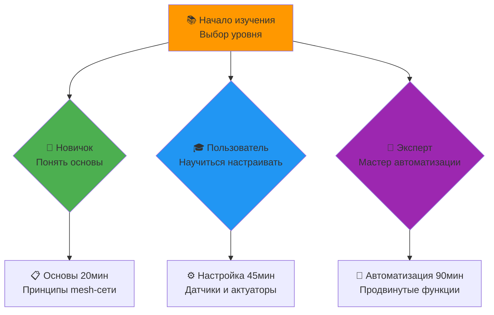

<div align="center">

[](README.md)
[](INDEX.md)
[](06_CLI_REFERENCE.md)

</div>

---

# 📚 AgriSwarm: Полное Руководство Пользователя (Обновлено)

> **🎓 Комплексное руководство по эксплуатации системы автоматизации**
> **✨ Новое:** Улучшенная навигация, визуальные схемы, практические решения
> **🏆 Результат:** Мастерское владение всеми 60+ командами AgriSwarm

<div align="center">

📚 
🏆 
⚡ 
🎓 

</div>

---

## 🗺️ Оглавление и Умная Навигация



| 🗺️ **Раздел** | 📝 **Описание** | ⏰ **Время изучения** | 🎁 **Что Получите** |
|-----------|--------------|------------------|-----------------------|
| **[📋 Основы](#-основы-работы-с-agriswarm)** | Принципы mesh-сети, архитектура | 20 мин | Понимание сути системы |
| **[⚙️ Настройка Датчиков](#-настройка-датчиков)** | Подключение и конфигурирование всех типов | 45 мин | Автоматический сбор данных |
| **[🎛️ Актуаторы](#-управление-актуаторами)** | Реле, электроприводы, освещение | 30 мин | Управление любыми устройствами |
| **[🧠 Автоматизация](#-правила-автоматизации)** | Создание "умных" правил и сценариев | 60 мин | Полностью автономная система |
| **[🌐 Сеть](#-сетевые-функции)** | Mesh-сеть, мониторинг, диагностика | 40 мин | Надёжная сеть из 32 узлов |
| **[📈 Мониторинг](#-мониторинг-и-логи)** | Отладка, мониторинг, траблшутинг | 35 мин | Полный контроль системы |
| **[🚀 Продвинутое](#-продвинутые-функции)** | Кастомизация, оптимизация, протоколы | 90 мин | Экспертное владение |нг | 35 мин |
| **[ Продвинутые Функции](#-продвинутые-функции)** | Кастомизация, оптимизация, протоколы | 90 мин |

**Общее время изучения:** ~5 часов (от новичка до уверенного пользователя)

---

## Основы Работы с AgriSwarm

### Архитектура Системы

AgriSwarm построен на принципах mesh-сети, где каждый узел (ESP32) может:
- Собирать данные с датчиков (температура, влажность, освещенность)
- Управлять актуаторами (реле, серводвигатели, LED)
- Выполнять правила автоматизации
- Обмениваться данными с другими узлами

### Научные Принципы Mesh-Сети

**Алгоритм выбора маршрута:**
``cpp
Priority = 0.4×Speed + 0.3×Signal + 0.3×Load
где:
- Speed: время отклика (ping)
- Signal: качество сигнала (RSSI) 
- Load: текущая нагрузка узла
```

**Система надежной доставки:**
- Уникальная идентификация сообщений
- Подтверждения получения (ACK)
- Exponential backoff при ошибках
- Защита от дубликатов через sequence numbers

---

## Настройка Датчиков

### Аналоговые Датчики (Влажность Почвы)

**Принцип работы:**
ESP32 ADC преобразует напряжение 0-3.3V в цифровые значения 0-4095.

```bash
# Настройка датчика влажности почвы
> pin_setup soil_sensor ANALOG 34
> pin_config soil_sensor thresholdLow 1500 # Влажно
> pin_config soil_sensor thresholdHigh 3000 # Сухо
> pin_config soil_sensor interval 2000 # Опрос каждые 2 сек

# Проверка работы
> pin_monitor soil_sensor
[12:34:56] soil_sensor: 2345 (норма)
```

**Калибровка:**
1. Поместите датчик в воду → запишите значение (влажно)
2. Поместите в сухую землю → запишите значение (сухо)
3. Установите пороги между этими значениями

### DHT22 Датчики (Температура/Влажность)

**Протокол работы DHT22:**
- 40 бит данных: 16 бит влажность + 16 бит температура + 8 бит CRC
- Точность: ±0.1°C для температуры, ±0.1% для влажности
- Минимальный интервал: 2 секунды

```bash
# Настройка DHT22
> pin_setup greenhouse_climate DHT22 4
 Создано 2 виртуальных пина:
 greenhouse_climate (температура)
 greenhouse_climate_humidity (влажность)

# Мониторинг
> pin_monitor greenhouse_climate
[12:34:56] greenhouse_climate: 24.5°C
[12:34:56] greenhouse_climate_humidity: 65.2%
```

### Цифровые Входы (Кнопки, Датчики)

```bash
# Настройка кнопки с антидребезгом
> pin_setup door_button DIGITAL_IN 23
> pin_config door_button buttonMode 1 # Toggle mode
> pin_config door_button debounceMs 50 # Антидребезг 50мс
```

**Режимы кнопок:**
- `0` - обычный цифровой вход
- `1` - toggle (переключение при нажатии)
- `2` - momentary (срабатывание только при нажатии)

---

## Управление Актуаторами

### Реле и Выходы

**Принцип работы реле:**
```
ESP32 GPIO (3.3V) → Оптопара → Реле → Нагрузка (12V/220V)
```

```bash
# Настройка реле насоса
> pin_setup pump_relay RELAY 26
> pin_config pump_relay initialState 0 # По умолчанию выключено

# Ручное управление
> pin_state pump_relay 1 # Включить насос
> pin_state pump_relay 0 # Выключить насос
```

### Энергосберегающий Режим

Для датчиков с высоким потреблением:

```bash
# Датчик с управляемым питанием
> pin_setup power_hungry_sensor ANALOG 34
> pin_config power_hungry_sensor powerPin 33 # Пин управления питанием
> pin_config power_hungry_sensor powerStabilizeMs 200 # Время стабилизации

# Алгоритм работы:
# 1. Включить питание (GPIO 33 = HIGH)
# 2. Ждать 200мс стабилизации
# 3. Прочитать значение (GPIO 34)
# 4. Выключить питание (GPIO 33 = LOW)
```

---

## Правила Автоматизации

### Теория Обработки Правил

AgriSwarm использует event-driven архитектуру:

```cpp
// Псевдокод обработки правила
for each rule R:
 if (!R.enabled) continue
 if (sensor != R.condition.source) continue
 if (!cooldownExpired(R)) continue
 
 if (evaluateCondition(R.condition, sensor_value)):
 executeAction(R.action)
 R.lastTriggered = now()
 R.triggerCount++
```

### Типы Условий

#### Простые Сравнения
```bash
# Больше чем (GREATER_THAN)
> rule_add "fan_on" "IF temperature > 25 THEN fan_relay 1"

# Меньше чем (LESS_THAN) 
> rule_add "water_on" "IF soil_moisture < 30 THEN pump_relay 1"

# Равно (EQUALS)
> rule_add "night_mode" "IF light_sensor = 0 THEN night_light 1"

# Не равно (NOT_EQUALS)
> rule_add "door_alert" "IF door_sensor != 0 THEN alarm_relay 1"
```

#### Диапазоны и Изменения
```bash
# Между значениями (BETWEEN)
> rule_add "optimal_temp" "IF temperature BETWEEN 20 25 THEN status_led 1"

# При изменении (CHANGED)
> rule_add "motion_detect" "IF motion_sensor CHANGED THEN log_event motion"
```

### Система Cooldown

**Назначение:** Предотвращение частых срабатываний правил.

**Алгоритм:**
```
if (current_time - rule.lastTriggered < rule.cooldownPeriod):
 skip_rule_execution()
```

```bash
# Настройка cooldown периода (в миллисекундах)
> rule_add "temp_control" "IF temperature > 25 THEN fan_relay 1"
> rule_config temp_control cooldown 30000 # 30 секунд между срабатываниями
```

### Сложные Правила

```bash
# Комбинированная логика полива
> rule_add "smart_watering" "IF soil_moisture < 30 AND hour BETWEEN 6 18 THEN pump_relay 1"

# Экономия энергии ночью
> rule_add "night_economy" "IF hour > 22 OR hour < 6 THEN heating_relay 0"

# Аварийное отключение
> rule_add "emergency_stop" "IF temperature > 35 THEN ALL_RELAYS 0"
```

---

## Управление Mesh-Сетью

### Принципы Mesh-Топологии

**Самоорганизующаяся сеть:**
```
Узел A ←→ Узел B ←→ Узел C
 
Узел D ←→ Узел E ←→ Узел F
```

При выходе из строя Узла B, маршрут A→C будет пересчитан через D→E→F.

### Диагностика Сети

```bash
# Общий статус mesh-сети
> mesh_status
 Mesh Network Status:
 Node ID: 3847562
 Подключенные узлы: 5
 Режим: Connected + Root
 Топология: Stable

# Детальная статистика
> mesh_stats full
 Подробная статистика mesh-сети:
 Всего узлов в сети: 6
 Прямых соединений: 3
 Средний ping: 42ms
 Качество сети: 96.8%
 Потерянных пакетов: 0.3%
 Время последнего сканирования: 15 сек

# Информация по узлам

 Node ID Connection RSSI Ping Status 

 1234567 Direct -45 dBm 23ms Active 
 2345678 Via 1234567 -67 dBm 56ms Active 
 3456789 Direct -52 dBm 31ms Active 

```

### Управление Подключениями

```bash
# Список всех узлов
> node_list
 Узлы в mesh-сети:
 3847562 (Этот узел) - HYBRID/ADMIN
 1234567 (Подключен) - SENSOR/BASIC - "Теплица №1"
 2345678 (Подключен) - ACTUATOR/BASIC - "Система полива" 
 3456789 (Отключен) - HYBRID/ADMIN - "Контроллер климата"

# Ping конкретного узла
> ping 1234567
 Ping узла 1234567: 28ms (отлично)

# Отправка тестового сообщения
> mesh_send 1234567 "test_connection"
 Сообщение отправлено узлу 1234567

# Широковещательное сообщение
> mesh_broadcast "system_status_request"
 Broadcast сообщение отправлено 5 узлам
```

### Автоматическое Подключение

```bash
# Запуск поиска сетей AgriSwarm
> auto_connect
 Поиск доступных AgriSwarm сетей...
 Найдено сетей: 2
 AgriSwarmMesh_1234567 (RSSI: -45dBm)
 AgriSwarmMesh_7890123 (RSSI: -67dBm)

 Подключение к AgriSwarmMesh_1234567...
 Подключено! Node ID: 3847562

# Остановка автоподключения
> auto_stop
 Автоматическое подключение остановлено

# Создание хост-сети
> host_start
 Запуск хост-режима...
 SSID: AgriSwarmMesh_3847562
 Password: AgriSwarmMeshPassword
 IP: 192.168.4.1
 Статус: Ожидание подключений
```

---

## Мониторинг и Диагностика

### Системная Диагностика

```bash
# Комплексная проверка здоровья системы
> health_check
 Комплексная диагностика AgriSwarm

 Системные компоненты:
 Logger: OK (уровень INFO)
 ConfigManager: OK (настройки загружены)
 SystemMonitor: OK (память в норме)
 TaskScheduler: OK (2 активные задачи)

 Сетевые компоненты:
 NetworkManager: OK (mesh активен)
 MessageRouter: OK (5 обработчиков)
 TrustedNodeManager: OK (3 доверенных узла)
 SmartMeshManager: OK (2 backup хоста)

 Аппаратные компоненты:
 PinManager: OK (4 пина настроены)
 SensorPublisher: OK (6 подписок)
 ActuatorPublisher: OK (2 актуатора)
 ConnectionMonitor: OK (все соединения стабильны)

 Обнаруженные проблемы:
 DHT22 на GPIO 4: 3 последовательные ошибки (backoff активен)
 Узел 3456789: нет ответа 45 секунд (возможно отключен)

 Рекомендации:
 Проверить подключение DHT22 к GPIO 4
 Проверить питание узла 3456789
 Рассмотреть перезагрузку через 1 час
```

### Мониторинг Производительности

```bash
# Анализ производительности системы
> stability
 Анализ стабильности AgriSwarm

 Метрики производительности:
 Общая оценка: 98.5% (Отлично)
 Время работы: 2d 14h 23m
 MTBF: 72 часа
 Доступность: 99.2%

 Статистика циклов:
 Циклов выполнено: 45,045,000
 Средняя частота: 200 Hz
 Средняя длительность: 5ms
 Превышений 100ms: 3 случая
 Максимальная длительность: 127ms

 Сетевая надежность:
 Успешность подключений: 92.3%
 Потерянных пакетов: 0.8%
 Среднее время ping: 35ms
 Переподключений: 2

 Ошибки и события:
 Ошибки датчиков: 12 (0.02%)
 Сбои DHT22: 5 (восстановлены)
 Таймауты сети: 8 (<0.01%)
 Критических ошибок: 0
```

### Мониторинг Топиков и Данных

```bash
# Структура данных в сети
> topics_tree
 Дерево топиков AgriSwarm:

 Датчики (Sensors):
 Температура
 greenhouse_temp@3847562: 24.5°C (2 сек назад)
 outdoor_temp@1234567: 18.3°C (5 сек назад)
 soil_temp@2345678: 22.1°C (1 сек назад)
 Влажность 
 greenhouse_humidity@3847562: 65.2% (2 сек назад)
 soil_moisture@1234567: 34.8% (3 сек назад)
 outdoor_humidity@2345678: 78.1% (4 сек назад)
 Освещенность
 light_sensor@3847562: 856 lux (1 сек назад)
 uv_sensor@1234567: 3.2 индекс (6 сек назад)

 Актуаторы (Actuators):
 Вентиляция
 fan_relay@3847562: OFF
 exhaust_fan@2345678: ON (скорость 75%)
 Полив
 pump_relay@1234567: OFF 
 valve_zone1@2345678: OFF
 valve_zone2@2345678: ON (15 мин назад)
 Обогрев
 heater_relay@3847562: OFF
 heat_mat@1234567: ON (мощность 40%)

# Активные подписки
> topics_subscriptions
 Активные подписки:

 Топик Источник Последнее Частота Статус 
 (Node ID) обновление обновлений 

 greenhouse_temp 1234567 2 сек каждые 5с Активна 
 soil_moisture 2345678 3 сек каждые 10с Активна 
 pump_status 1234567 15 мин при изменен Активна 
 outdoor_weather 3456789 2 мин каждые 60с Тайм-аут 

 Проблемы:
 outdoor_weather: нет данных 2 минуты (узел 3456789 недоступен)
```

---

## Решение Проблем

### Диагностика Типичных Проблем

#### Проблемы с Датчиками

**DHT22 не отвечает:**
```bash
# Проверка конфигурации
> pin_info greenhouse_temp
 Информация о пине: greenhouse_temp
 Тип: DHT22
 GPIO: 4
 Статус: Ошибка чтения
 Последнее значение: -999°C (недействительно)
 Последняя попытка: 3 сек назад
 Последовательных ошибок: 5
 Текущий backoff: 8000ms
 Последнее успешное чтение: 2 мин назад

# Сброс backoff и повторная попытка
> pin_reset greenhouse_temp
 Пин greenhouse_temp сброшен
 Backoff сброшен
 Счетчик ошибок обнулен
 Следующее чтение: через 2 сек

# Если проблема не решается - проверка подключения
# 1. GPIO 4 → Data pin DHT22
# 2. VCC → 3.3V
# 3. GND → GND 
# 4. Добавить pull-up резистор 10kΩ между Data и VCC

# Тест подключения с мультиметром:
> pin_test 4
 Тестирование GPIO 4:
 Уровень сигнала: 3.28V (норма)
 Pull-up активен: Да
 Способность чтения: OK
 Рекомендация: Подключение корректно
```

**Аналоговые датчики не работают:**
```bash
# Проверка ADC
> pin_info soil_sensor
 Информация о пине: soil_sensor
 Тип: ANALOG
 GPIO: 34 (ADC1_CH6)
 Текущее значение: 4095 (максимум - возможна ошибка)
 Диапазон калибровки: 1500-3000
 Последнее чтение: 1 сек назад

# Возможные причины:
# 1. Датчик не подключен к питанию
# 2. Короткое замыкание на VCC или GND
# 3. Неисправный датчик
# 4. Неправильный GPIO (только ADC1: 32-39)

# Проверка:
> adc_test 34
 Тест ADC канала 34:
 Сырое значение: 4095
 Напряжение: 3.30V
 Состояние: Подтяжка к VCC
 Диагноз: Датчик не подключен или неисправен
```

#### Проблемы с Сетью

**Устройства не видят друг друга:**
```bash
# Диагностика mesh-сети
> mesh_debug
 Расширенная диагностика mesh:

 WiFi состояние:
 Режим: STA+AP
 STA подключен: Нет
 AP активен: Да (AgriSwarmMesh_3847562)
 Клиентов AP: 0
 Канал: 6

 Поиск других AgriSwarm сетей:
 Найдено сетей: 2
 AgriSwarmMesh_1234567 (RSSI: -72dBm, канал 11)
 AgriSwarmMesh_7890123 (RSSI: -85dBm, канал 1)
 Попытки подключения: 3 (все неудачны)

 Возможные проблемы:
 Слабый сигнал (RSSI < -70dBm)
 Разные каналы WiFi
 Версии прошивки не совместимы
 Сетевые пароли не совпадают

# Принудительное подключение
> mesh_connect 1234567
 Попытка подключения к узлу 1234567...
 Подключено! Ping: 43ms
```

**Частые разрывы соединения:**
```bash
# Статистика стабильности
> connection_stats
 Статистика соединений за последние 24 часа:

 Всего подключений: 127
 Успешных: 89 (70.1%)
 Разрывов по таймауту: 23
 Разрывов по слабому сигналу: 15
 Средняя длительность сессии: 18 мин
 Самая долгая сессия: 4ч 23мин

 Рекомендации:
 Уменьшить расстояние между узлами
 Добавить промежуточные ретрансляторы
 Проверить источники помех (микроволновки, роутеры)
 Увеличить мощность передачи: mesh_power 20

# Настройка стабильности
> mesh_config keepalive 30000 # Ping каждые 30 сек
> mesh_config reconnect_delay 5000 # Попытка переподключения через 5 сек
> mesh_config max_retries 5 # Максимум 5 попыток
```
```