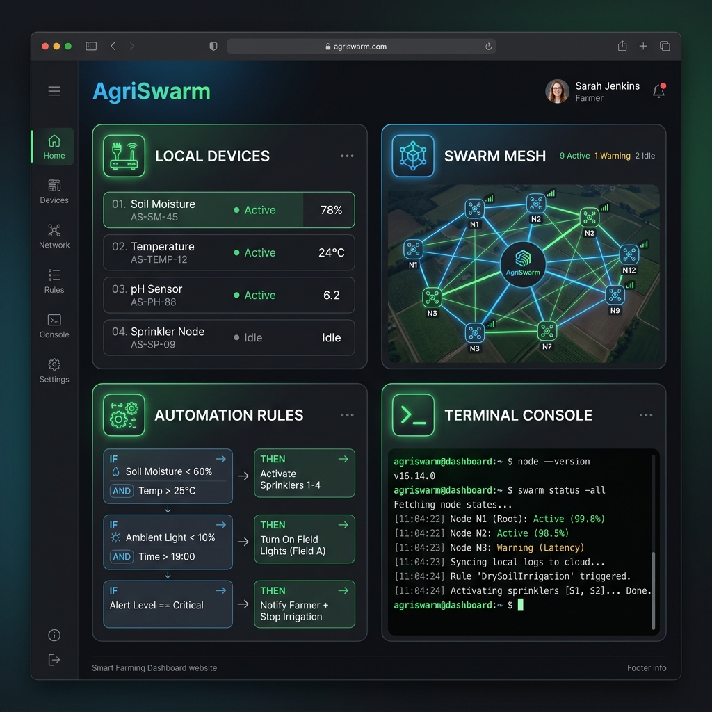
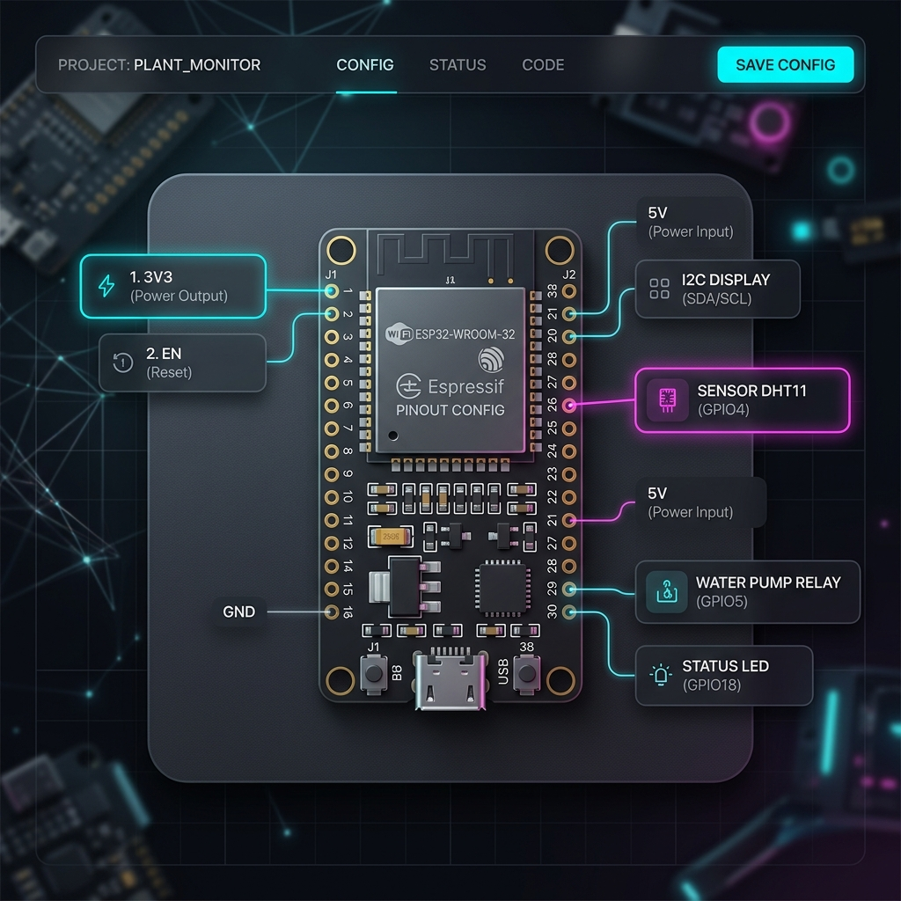

  <a href="./09_Security_and_Constraints.md">◀ Назад к Безопасности</a> | 
  <a href="./README.md">🏠 Оглавление</a> | 
  <b>Раздел 4: Инструкция к Веб-Интерфейсу</b> | 
  <a href="./FAQ.md">Вперед к FAQ ▶</a>

---

# 📱 Раздел 4: Инструкция к Веб-Интерфейсу (Для Пользователей)

Добро пожаловать в панель управления AgriSwarm! Мы сделали всё, чтобы вы могли управлять умной теплицей или фермой прямо со смартфона, не написав ни строчки кода.

В этой визуальной инструкции мы разберем основные разделы сайта и покажем, как настроить систему за пару кликов.

---

## 1. Как зайти в панель управления?

Если вы подключились к Wi-Fi сети платы (обычно она называется `AgriSwarmMesh`), просто откройте браузер на телефоне и введите адрес: **http://10.0.0.1** (или тот IP-адрес, который выдал роутер).

### ☀️ "Полевой режим" (Светлая тема)
По умолчанию панель открывается в стильном темном цвете. Но если вы находитесь в теплице под ярким солнцем, на темном экране ничего не видно. 
Просто нажмите переключатель **"Полевой режим"** в правом верхнем углу, и весь сайт станет белым и высококонтрастным.

---

## 2. Главный экран (Дашборд)

Главный экран разделен на 4 большие карточки. Это ваш пульт управления фермой.

> *Пример того, как выглядит панель управления на планшете или ноутбуке.*

### Карточка 1: Локальные устройства (Датчики и Реле)
Здесь собрано всё физическое железо, которое подключено к вашей плате проводами. 
Внутри карточки есть удобные вкладки (кнопки сверху):
*   **📋 Список:** Показывает текущую температуру, влажность почвы или статус насоса. Здесь же находятся переключатели (кнопки ВКЛ/ВЫКЛ), чтобы вы могли вручную запустить полив.
*   **📊 Аналитика:** Красивые графики истории показаний датчиков (как менялась температура за день).
*   **💾 Бэкап:** Кнопка для скачивания всех настроек в файл. Сохраните его на компьютер перед зимой!

### 🔌 Вкладка "Схема ESP32" (Визуальный настройщик)
Если вы только купили плату и хотите подключить к ней датчик температуры, вам не нужно запоминать сложные команды. Перейдите на вкладку **"Схема ESP32"**.

> *Нажмите на любой свободный "золотой" контакт на картинке, чтобы подключить к нему устройство!*

**Как это работает:**
1. Вы видите картинку вашей зеленой платы со всеми "ножками" (контактами).
2. Вы нажимаете на свободную ножку прямо на экране.
3. Появляется окошко: *"Что вы сюда подключили?"*.
4. Выбираете "Реле (Насос)" или "Датчик температуры".
5. Всё! Система сама сохранит настройки и выведет кнопку управления на главный экран.

---

## 3. Карточка 2: Карта Swarm Mesh (Рой)

Если у вас одна плата — можете пропустить этот раздел.
Но если вы купили 5-10 плат, чтобы покрыть огромный участок, они автоматически объединятся в сеть (Mesh-Рой). 

*   На вкладке **🕸️ Топология** система нарисует красивую паутину: какая плата с какой общается. Вы сразу увидите, если дальняя теплица "отвалилась" или сигнал слишком слабый.
*   На вкладке **📋 Список узлов** можно посмотреть процент заряда батареи и уровень сигнала соседей.

---

## 4. Карточка 3: Умные Правила (Автоматизация)

Вам не нужно быть программистом, чтобы настроить автоматический полив! 
В разделе "Умные Правила" нажмите синюю кнопку **"📋 Менеджер правил"**.

Система позволяет визуально настроить правила автоматизации с помощью интуитивно понятного конструктора:
1. **ЕСЛИ (Триггер):** Выбираем наш *Датчик влажности*.
2. **УСЛОВИЕ:** Выбираем *Упала ниже 30%*.
3. **ТО (Действие):** Выбираем *Насос полива*.
4. **СТАТУС:** Выбираем *Включить*.
5. **ПАУЗА (Кулдаун):** Ставим *300 секунд* (чтобы насос не залил грядку, пока вода впитывается).

Правило сохранится в памяти и будет работать вечно, даже если выключится Wi-Fi или пропадет домашний интернет!

---

## 5. Карточка 4: Терминал (Для продвинутых)

Это черное окошко с зеленым текстом — сердце системы. Оно предназначено для инженеров (и тех самых инструкций, которые мы даем в Разделе 3).
Но мы добавили "быстрые кнопки" (Chips) под терминалом для простых людей:
*   Кнопка `status` — покажет, сколько памяти осталось и всё ли в порядке.
*   Кнопка `blackbox_rtc` — если плата вчера зависла, эта кнопка покажет причину поломки (например, перегрев или скачок электричества).

> [!TIP]
> **Главный совет:** Не бойтесь нажимать кнопки! Все критические настройки спрятаны или требуют подтверждения. А если вы что-то сломали, всегда можно загрузить сохраненный файл на вкладке "Бэкап" и вернуть всё как было за 2 секунды.

---

  <a href="./09_Security_and_Constraints.md">◀ Назад к Безопасности</a> | 
  <a href="./README.md">🏠 Оглавление</a> | 
  <a href="./FAQ.md">Вперед к FAQ ▶</a>

