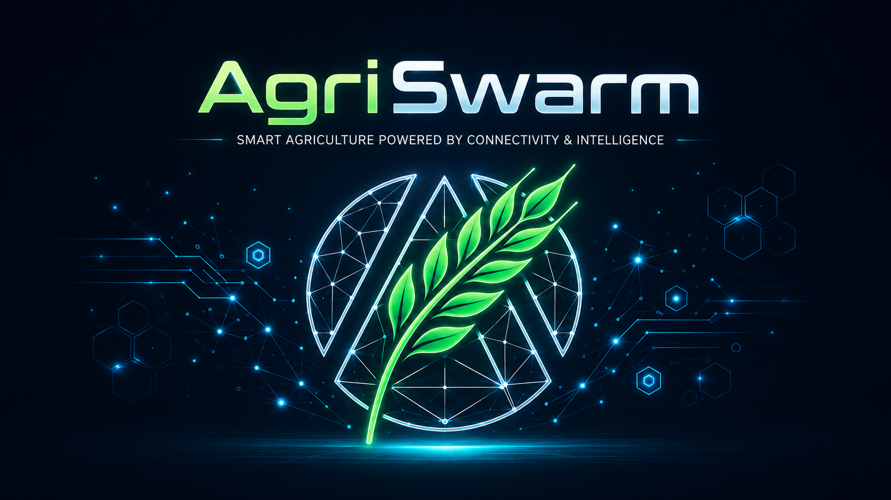
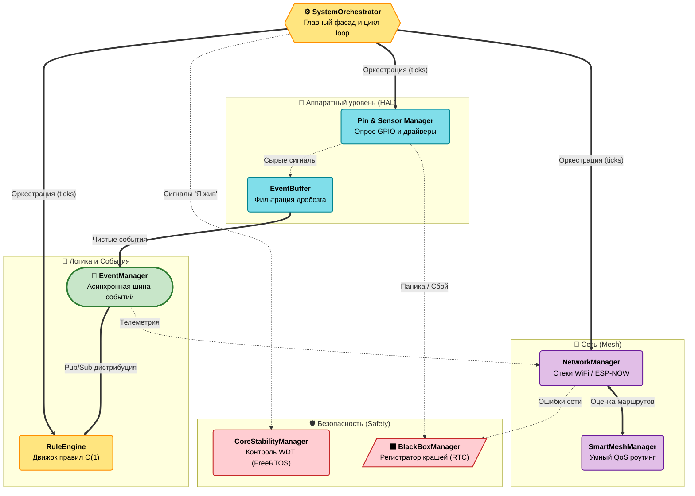
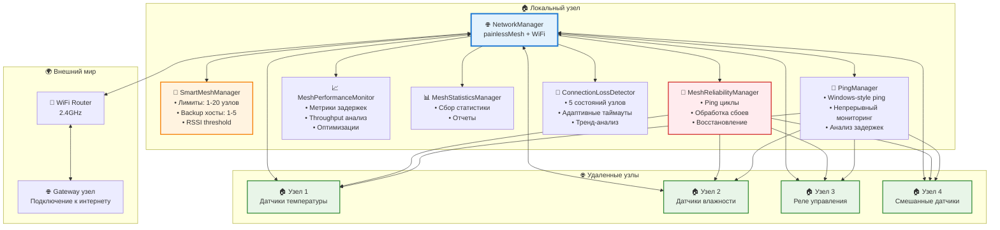

<div align="center">
  
  
  # 🌾 AgriSwarm

  > **Индустриальная децентрализованная Mesh-платформа автоматизации и мониторинга для агро-комплексов на базе микроконтроллеров ESP32 и ОСРВ FreeRTOS.**
  
  <br>

  [](https://github.com/qagent567/esp_progect_PUB)
  [](https://www.espressif.com/en/products/socs/esp32)
  [](#веб-интерфейс-и-режим-standby)
  [](#ключевые-технологические-столпы)
  [](LICENSE)

  <br>

  [📖 Документация](00_Master_Index.md) • [🚀 Быстрый старт](#quickstart) • [📖 FAQ](FAQ.md)

</div>

> [!IMPORTANT]
> **Лицензионное соглашение (EULA):**
> Установка (прошивка) бинарных файлов (.bin) или включение устройства означает акцепт оферты. Продолжая установку, вы принимаете условия [Лицензионного соглашения](LICENSE) (в соответствии со ст. 438 ГК РФ). Пожалуйста, ознакомьтесь с текстом Соглашения до совершения указанных действий. (Согласие также дублируется в веб-интерфейсе при первом запуске).
> 
> [](LICENSE)

---

## 🗺️ Быстрая навигация

<table align="center" width="100%">
  <tr>
    <td align="center" width="25%"><b>🚀 <a href="#quickstart">Быстрый старт</a></b><br>Как запустить за 5 минут</td>
    <td align="center" width="25%"><b>🏗️ <a href="01_Architecture_and_Design.md">Архитектура</a></b><br>Устройство подсистем и Mesh</td>
    <td align="center" width="25%"><b>🌐 <a href="10_Web_Interface_Guide.md">Web Dashboard</a></b><br>Инструкция для смартфона</td>
    <td align="center" width="25%"><b>💻 <a href="06_CLI_Reference.md">CLI & Wizards</a></b><br>Интерактивная настройка</td>
  </tr>
  <tr>
    <td align="center" width="25%"><b>🔌 <a href="03_Hardware_Interaction_and_Node_Lifecycle.md">Периферия и HAL</a></b><br>Датчики, сервоприводы, питание</td>
    <td align="center" width="25%"><b>🛡️ <a href="08_Troubleshooting.md">Отказоустойчивость</a></b><br>WDT, RTC BlackBox</td>
    <td align="center" width="25%"><b>📊 <a href="09_Security_and_Constraints.md">Характеристики</a></b><br>Метрики и ограничения</td>
    <td align="center" width="25%"><b>⚖️ <a href="LICENSE">Правовая информация</a></b><br>Лицензирование и контакты</td>
  </tr>
</table>

---

<a id="quickstart"></a>
## 🚀 Быстрый старт (Мини-демо за 2 минуты)

Краткий ориентир для запуска и понимания идеи AgriSwarm.

### 🧠 Ментальная модель
AgriSwarm — это сеть узлов ESP32. Каждый узел:
- читает сенсоры и публикует данные как топики;
- управляет актуаторами и публикует их возможности;
- подписывается на топики других узлов;
- выполняет правила и алгоритмы локально;
- общается через Mesh и работает автономно.

```
[Sensor] -> [Node A] ==mesh== [Node B] <- control -> [Actuator]
              ^  publish         subscribe ^
              |----------- Rule/Algo --------|
```

### 💾 Загрузка прошивки (Binaries)

> [!TIP]
> **Все файлы прошивки (.bin) и программатор находятся здесь:**  
> 👉 **[📂 Открыть папку «---для загрузки прошивки---»](---для загрузки прошивки---)**

### ⚡ Базовые действия
```bash
# Запуск графического прошивальщика (для загрузки скомпилированной прошивки)
# Windows: запустите готовый файл ---для загрузки прошивки---/flash_firmware.exe
# Кроссплатформенный вариант (Python):
python "---для загрузки прошивки---/flash_firmware.py"

# Подключение к консоли (через любой Serial Monitor на 115200 бод)
# После подключения доступны полезные команды:
help
pin_wizard                # Настройка сенсора/актуатора
pin_monitor <sensor>
rule_wizard               # Правило: IF sensor THEN action

# Если есть 2 узла — покажите сеть
node_list
topics_tree
```

### 🗺️ Топологии внедрения
- **Одна теплица:** 1–3 узла (климат + полив)
- **Несколько грядок:** 3–8 узлов (зоны полива, освещение)
- **Поле/сад:** 10+ узлов (сегменты, шлюз, релейные актуаторы)

---

## 🌟 Ключевые технологические столпы

В отличие от большинства типовых DIY-проектов на Arduino, **AgriSwarm** спроектирован с учетом требований к стабильности промышленных встраиваемых систем (Industrial IoT).

```
 ┌─────────────────────────────────────────────────────────────────────────┐
 │                            AGRISWARM CORE                               │
 └────────────────────┬────────────────────────────────┬───────────────────┘
                      │                                │
        ┌─────────────▼─────────────┐    ┌─────────────▼─────────────┐
        │ Zero-Allocation Hotpaths  │    │  Self-Healing Mesh Рой    │
        │ • Исключены утечки кучи   │    │  • До 20 узлов ESP-NOW    │
        │ • O(1) хэш-маршрутизация  │    │  • Работа без Интернета   │
        └───────────────────────────┘    └───────────────────────────┘
                      │                                │
        ┌─────────────▼─────────────┐    ┌─────────────▼─────────────┐
        │  Standby Web Server SPA   │    │   Crash Forensics RTC     │
        │ • 80% экономия DRAM       │    │  • Запись логов сбоев     │
        │ • PROGMEM GZIP ресурсы    │    │  • Восстановление логов   │
        └───────────────────────────┘    └───────────────────────────┘
```

*   🛡️ **Zero-Allocation Hotpaths (Предсказуемость RAM):** В основном цикле исполнения (`loop`) полностью исключено динамическое выделение памяти (`malloc`/`new`). Все структуры инициализируются при запуске, а маршрутизация событий работает на основе O(1) хэшей FNV-1a. Это полностью предотвращает фрагментацию кучи и зависания.
*   📡 **Децентрализованный Mesh-Рой (Offline-First):** Самоорганизующаяся сеть на базе протокола `painlessMesh` объединяет узлы в единый вычислительный кластер. Сеть функционирует автономно без Wi-Fi роутеров, серверов и координаторов. Потеря части узлов компенсируется автоматической перемаршрутизацией трафика.
*   🔋 **Энергосберегающий HAL (Power-Stabilization Switch):** Поддержка физического отключения питания датчиков через транзисторные ключи (`powerPin`) во время спящего интервала. Прошивка бережно контролирует стабилизацию питания (`powerStabilizeMs`) перед съемом показаний, минимизируя окисление электродов и экономя батарею.
*   🌐 **On-Demand Веб-Интерфейс (Standby Mode):** Полноценное PWA SPA-приложение весом 250 КБ сжато до 46 КБ методом Pre-GZIP в памяти программ Flash (`PROGMEM`), обходя медленную LittleFS. Сервер автоматически засыпает при отсутствии клиентов, экономя драгоценную оперативную память микроконтроллера.
*   ⬛ **Бортовой Самописец (Post-Mortem BlackBox RTC):** При критическом сбое (Kernel Panic, срабатывание Watchdog Timer или просадка питания Brownout) контекст падения мгновенно пишется в защищенную RTC SRAM память. После перезапуска инженер может считать дамп командой `blackbox rtc` для детального анализа причин.

---

## 🌐 Веб-интерфейс и режим Standby

Одной из сложнейших задач при разработке прошивок для ESP32 является совмещение тяжелого сетевого стека, шифрования и веб-сервера в ограниченном объеме оперативной памяти (DRAM). AgriSwarm решает эту проблему с помощью оригинального механизма гибридной активности.

### 🗜️ Пре-компрессия веб-ресурсов (PROGMEM GZIP)
Вместо хранения статических файлов на файловой системе LittleFS, которая нагружает процессор дисковым вводом-выводом и расходует циклы перезаписи Flash, все файлы интерфейса (HTML, JS, CSS, PWA Manifest, Service Worker) предварительно сжимаются с помощью специального скрипта (доступного в составе SDK разработчика) и вшиваются в код как бинарные массивы:
*   Оригинальный размер: **247,6 КБ**
*   Размер GZIP в Flash (`PROGMEM`): **46,2 КБ** (сжатие на ~80%)
*   Браузер получает сжатые данные напрямую, благодаря HTTP-заголовку `Content-Encoding: gzip`. Поддержка `ETag` и жесткого кэширования исключает повторные запросы со стороны браузера.

### 💤 Режим ожидания (Standby Mode)
Веб-интерфейс устройства работает по принципу **On-Demand (по требованию)**:
```
           [Узел Запущен] ──► Режим Standby (Потребление RAM ~0)
                                    │
                                    │ (Запрос браузера на http://IP/)
                                    ▼
       Сервер отдает 1.5 КБ standby_html ──► [Кнопка АКТИВИРОВАТЬ]
                                                      │
                                                      │ (Клик / POST /api/server/start)
                                                      ▼
   Переход в Active Mode ◄────────────────────────────┘
   • Подключение SSE (/events) для логов в реальном времени
   • Регистрация коллбэков датчиков и пинов
   • Запуск API-роутов
        │
        ├─► [Активная работа пользователя в UI]
        │
        └─► (5 минут бездействия / таймаут)
                 │
                 ▼
     Автоматический сброс коллбэков, закрытие SSE, переход в Standby
```
1.  **Standby Mode (По умолчанию):** Запущен только базовый веб-сервер. Тяжелые JSON API, обработчики Server-Sent Events (SSE) и регулярные рассылки метрик отключены. При попытке зайти на сайт отдается минималистичная HTML-страничка весом в 1.5 КБ со спящим интерфейсом и кнопкой пробуждения.
2.  **Active Mode (Активный режим):** При клике на "Активировать" отправляется запрос к `/api/server/start`. Сервер разворачивает полноценное API, подключает SSE-поток `/events` для трансляции логов ядра и мгновенно связывается с коллбэками `PinManager`.
3.  **Авто-засыпание:** Если в течение 5 минут от веб-интерфейса не поступает запросов активности, веб-сервер принудительно засыпает, освобождая дескрипторы сокетов и очищая системные очереди.

### 📲 Web-OTA (Беспроводная прошивка через браузер)
В активном режиме доступен защищенный эндпоинт `/api/update` (HTTP POST). Вы можете скомпилировать бинарный файл (`firmware.bin`) в VS Code/PlatformIO и обновить прошивку любого узла через браузер в 2 клика без физического подключения программатора.

---

## 💻 Интерактивный CLI и мастера настройки

Для локальной отладки и быстрой конфигурации в полевых условиях разработан мощный командный интерфейс (CLI), доступный через Serial Monitor (115200 baud) или через вкладку CLI в веб-интерфейсе. 

CLI поддерживает **98 встроенных команд**, историю ввода (клавиши ↑/↓) и автодополнение по кнопке **Tab**.

### 🧙‍♂️ Встроенные мастера (Wizards)

Вам больше не нужно помнить синтаксис команд. В AgriSwarm добавлены три пошаговых интерактивных мастера:

1.  `wizard first_run` — Мастер первичной настройки. Спросит имя устройства, задаст параметры Mesh-сети (SSID/пароль) и выберет сетевую роль узла.
2.  `pin_wizard` — Конфигуратор железа. Безопасно проведет вас через привязку датчиков, реле или сервоприводов к физическим GPIO ESP32 с проверкой на недопустимые пины.
3.  `rule_wizard` — Визуальный конструктор автоматизации. Позволяет связать датчик с исполнительным устройством логикой IF-THEN, настроить кулдауны срабатывания и пороговые значения (Deadband).

### 🖥️ Пример симуляции настройки датчика и реле

```bash
AgriSwarm CLI > wizard first_run

==================================================
🧙‍♂️ AGRISWARM FIRST-RUN CONFIGURATION WIZARD
==================================================
Шаг 1/3: Задайте уникальное имя узла в Mesh-сети
Имя (например, Greenhouse_Node_1): Node_Tomato_A

Шаг 2/3: Настройка параметров Mesh-сети
Оставить SSID по умолчанию 'AgriSwarmMesh'? (y/n): y
Оставить пароль по умолчанию? (y/n): y

Шаг 3/3: Укажите роль устройства
[1] Node (Сбор данных и автоматика)
[2] Gateway (Шлюз с выходом в Интернет)
Выберите роль (1-2): 1

[AI] Сохранение конфигурации в LittleFS...
[AI] Перезагрузка сетевого стека...
Узел Node_Tomato_A успешно настроен и подключен к Mesh!

AgriSwarm CLI > pin_wizard

==================================================
🔌 AGRISWARM PIN & PERIPHERAL WIZARD
==================================================
Выберите тип создаваемого устройства:
[1] Датчик температуры/влажности (DHT11/DHT22)
[2] Аналоговый датчик (Влажность почвы, освещенность)
[3] Цифровой выход (Реле помпы, вентилятор, нагреватель)
[4] Сервопривод (Регулировка заслонки)
Выберите опцию (1-4): 2

Введите уникальное имя для датчика (латиница): soil_moist
Укажите GPIO пин на плате (рекомендуются: 32, 33, 34, 35, 36, 39): 34
Укажите интервал опроса в мс (рекомендуется: 10000): 15000
Использовать ключ питания датчика (powerPin) для борьбы с окислением? (y/n): y
Укажите GPIO пин управления питанием: 25
Задайте время стабилизации питания в мс (например, 200): 250

[AI] Датчик 'soil_moist' успешно зарегистрирован!
[AI] GPIO 34 (Вход), GPIO 25 (Выход питания, Стабилизация 250мс).
[AI] Конфигурация сохранена.

AgriSwarm CLI > rule_wizard

==================================================
⚡ AGRISWARM AUTOMATION RULE WIZARD
==================================================
Введите название правила: auto_water
Выберите датчик-триггер: soil_moist
Укажите условие срабатывания:
[1] Меньше (<)
[2] Больше (>)
[3] Равно (==)
Выберите условие (1-3): 1
Введите пороговое значение датчика: 35.0
Выберите исполнительное устройство (актуатор): pump_relay
Какое состояние установить при срабатывании? (1 - ВКЛ, 0 - ВЫКЛ): 1
Укажите период кулдауна (блокировки повтора) в секундах: 120

[AI] Создано правило 'auto_water': IF soil_moist < 35.00 THEN pump_relay = 1 (Cooldown: 120s)
[AI] Правило успешно добавлено в движок автоматизации O(1) и сохранено!
```

---

## 🔌 Управление периферией и HAL

Физический слой управления в AgriSwarm абстрагирован от конкретного железа через `PinManager`. Система поддерживает широкий спектр аналогового и цифрового оборудования.

```
                  ┌──────────────────────┐
                  │      PinManager      │
                  └──────────┬───────────┘
                             │
       ┌─────────────────────┼─────────────────────┐
       ▼                     ▼                     ▼
┌──────────────┐      ┌──────────────┐      ┌──────────────┐
│ PIN_TYPE_DHT │      │  PIN_ANALOG  │      │  PIN_SERVO   │
│ • DHT11/22   │      │ • EMA фильтр │      │ • Угол 0-180°│
│ • Авто-сплит │      │ • PowerPin   │      │ • AutoDetach │
└──────────────┘      └──────────────┘      └──────────────┘
```

### 🌡️ Интеллектуальный опрос DHT11 / DHT22
При регистрации одного датчика DHT на одном GPIO, прошивка автоматически регистрирует два виртуальных системных канала: `имя_датчика/temp` и `имя_датчика/hum`. Опрос выполняется асинхронно, предотвращая блокировку FreeRTOS-потоков медленным протоколом 1-Wire.

### ⚡ Аппаратный ключ питания сенсоров (Борьба с окислением)
Популярные аналоговые датчики влажности почвы при постоянном нахождении под напряжением подвергаются процессу электролиза, из-за чего полностью разрушаются за несколько недель. 
*   **Решение в AgriSwarm:** Подключение плюса питания датчика к свободному GPIO (или через MOSFET-ключ).
*   **Логика работы:**
    1.  Запуск таймера опроса (например, каждые 30 минут).
    2.  Подача `HIGH` на `powerPin`.
    3.  Ожидание `powerStabilizeMs` (пока датчик выйдет на рабочий режим после подачи питания).
    4.  АЦП-измерение с наложением экспоненциального сглаживания (EMA-фильтр).
    5.  Подача `LOW` на `powerPin` (полное обесточивание датчика).

### ⚙️ Сервоприводы промышленного класса (`PIN_TYPE_SERVO`)
Для автоматизации вентиляционных заслонок, оконных фрамуг или дозаторов корма внедрена поддержка сервоприводов:
*   Калибровка минимального/максимального углов (0°–180°) и гибкая регулировка скорости движения.
*   **Функция Auto-Detach:** После завершения маневра сервопривод программно отключается от генерации ШИМ (`servoAutoDetach`). Это полностью устраняет раздражающий "зуд" и микровибрации сервопривода под нагрузкой, снижает энергопотребление и продлевает ресурс шестеренок редуктора.

---

## 🏗️ Архитектура системы

Модульная структура прошивки разделена на логические слои. Архитектура построена на базе 7 независимых менеджеров, работающих в рамках приоритетов задач FreeRTOS:


```mermaid
flowchart TD
    classDef core fill:#ffe57f,stroke:#ff8f00,stroke-width:2px,color:#000,rx:5px;
    classDef hw fill:#80deea,stroke:#00838f,stroke-width:2px,color:#000,rx:5px;
    classDef net fill:#e1bee7,stroke:#6a1b9a,stroke-width:2px,color:#000,rx:5px;
    classDef diag fill:#ffcdd2,stroke:#c62828,stroke-width:2px,color:#000,rx:5px;
    classDef bus fill:#c8e6c9,stroke:#2e7d32,stroke-width:3px,color:#000,rx:15px;

    Orch{{"<b>⚙️ SystemOrchestrator</b><br/>Главный фасад и цикл loop"}}:::core

    subgraph Hardware ["🔌 Аппаратный уровень (HAL)"]
        direction TB
        PM["<b>Pin & Sensor Manager</b><br/>Опрос GPIO и драйверы"]:::hw
        EB("<b>EventBuffer</b><br/>Фильтрация дребезга"):::hw
        PM -.->|"Сырые сигналы"| EB
    end

    subgraph Logic ["🧠 Логика и События"]
        direction TB
        EM(["<b>🔄 EventManager</b><br/>Асинхронная шина событий"]):::bus
        RE["<b>RuleEngine</b><br/>Движок правил O(1)"]:::core
        EM ===>|"Pub/Sub дистрибуция"| RE
    end

    subgraph Network ["📡 Сеть (Mesh)"]
        direction TB
        NM["<b>NetworkManager</b><br/>Стеки WiFi / ESP-NOW"]:::net
        SMM("<b>SmartMeshManager</b><br/>Умный QoS роутинг"):::net
        NM <==>|"Оценка маршрутов"| SMM
    end

    subgraph Diagnostics ["🛡️ Безопасность (Safety)"]
        direction TB
        CSM["<b>CoreStabilityManager</b><br/>Контроль WDT (FreeRTOS)"]:::diag
        BB[/"<b>⬛ BlackBoxManager</b><br/>Регистратор крашей (RTC)"/]:::diag
    end

    Orch ===>|"Оркестрация (ticks)"| PM
    Orch ===>|"Оркестрация (ticks)"| NM
    Orch ===>|"Оркестрация (ticks)"| RE
    EB ==>|"Чистые события"| EM
    EM -.->|"Телеметрия"| NM
    Orch -.->|"Сигналы 'Я жив'"| CSM
    PM -.->|"Паника / Сбой"| BB
    NM -.->|"Ошибки сети"| BB

    style Orch color:#000,stroke:#ff8f00
    style PM color:#000,stroke:#00838f
    style NM color:#000,stroke:#6a1b9a
```

### 📡 Топология децентрализованной Mesh-сети

Каждое устройство является ретранслятором данных. Сообщения передаются по цепочке, расширяя радиус покрытия системы до сотен метров.


```mermaid
graph TB
    subgraph Local["🏠 Локальный узел"]
        NET["🌐 NetworkManager<br/>painlessMesh + WiFi"]
        SMART["🧠 SmartMeshManager<br/>• Лимиты: 1-20 узлов<br/>• Backup хосты: 1-5<br/>• RSSI threshold"]
        RELIAB["🔧 MeshReliabilityManager<br/>• Ping циклы<br/>• Обработка сбоев<br/>• Восстановление"]
        PERF["📈 MeshPerformanceMonitor<br/>• Метрики задержек<br/>• Throughput анализ<br/>• Оптимизации"]
        STATS["📊 MeshStatisticsManager<br/>• Сбор статистики<br/>• Отчеты"]
        PING["🏓 PingManager<br/>• Windows-style ping<br/>• Непрерывный мониторинг<br/>• Анализ задержек"]
        CONN["🚨 ConnectionLossDetector<br/>• 5 состояний узлов<br/>• Адаптивные таймауты<br/>• Тренд-анализ"]
    end

    subgraph Remote["🌐 Удаленные узлы"]
        NODE1["🏠 Узел 1<br/>Датчики температуры"]
        NODE2["🏠 Узел 2<br/>Датчики влажности"]
        NODE3["🏠 Узел 3<br/>Реле управления"]
        NODE4["🏠 Узел 4<br/>Смешанные датчики"]
    end

    subgraph Internet["🌍 Внешний мир"]
        ROUTER["📡 WiFi Router<br/>2.4GHz"]
        GATEWAY["🌐 Gateway узел<br/>Подключение к интернету"]
    end

    %% Локальные связи
    NET --> SMART
    NET --> RELIAB
    NET --> PERF
    NET --> STATS
    NET --> PING
    NET --> CONN

    %% Сетевые связи
    NET <--> NODE1
    NET <--> NODE2
    NET <--> NODE3
    NET <--> NODE4
    NET <--> ROUTER
    ROUTER <--> GATEWAY

    %% Диагностические связи
    RELIAB --> NODE1
    RELIAB --> NODE2
    RELIAB --> NODE3
    RELIAB --> NODE4
    PING --> NODE1
    PING --> NODE2
    PING --> NODE3
    PING --> NODE4

    %% Стили
    style NET fill:#e3f2fd,stroke:#1976d2,stroke-width:3px
    style SMART fill:#fff3e0,stroke:#f57c00,stroke-width:2px
    style RELIAB fill:#ffebee,stroke:#d32f2f,stroke-width:2px
    style NODE1 fill:#e8f5e8,stroke:#388e3c,stroke-width:2px
    style NODE2 fill:#e8f5e8,stroke:#388e3c,stroke-width:2px
    style NODE3 fill:#e8f5e8,stroke:#388e3c,stroke-width:2px
    style NODE4 fill:#e8f5e8,stroke:#388e3c,stroke-width:2px
```

---

## 📊 Технические характеристики

### 📐 Системные требования и лимиты
*   **Аппаратная база:** ESP32-WROOM-32D / ESP32-WROVER (240 MHz, Dual-Core).
*   **Память:** Не менее 4 МБ Flash, 520 КБ SRAM.
*   **Дисковая разметка:** LittleFS (раздел под файлы конфигурации JSON не менее 256 КБ).
*   **Максимальное число узлов в Mesh:** 20 (рекомендованная емкость для исключения коллизий — 10 узлов).
*   **Лимиты правил автоматики:** до 32 правил на один узел (ограничено статической хэш-таблицей).

### 📈 Объем кодовой базы
*   **Общий объем кода:** 32,767+ строк (27,278 .cpp + 5,489 .h).
*   **Архитектурных компонентов:** 89 файлов (модули логики, сети, драйверы HAL, утилиты).
*   **Документация проекта:** 31 глубокий технический документ.

---

## 💰 Экономическая эффективность

AgriSwarm предлагает колоссальную экономию бюджета при автоматизации частных теплиц или небольших ферм:

| Параметр | ☁️ Промышленные облачные системы | 🌾 Экосистема AgriSwarm |
|:---|:---|:---|
| **Стоимость оборудования** | От 50 000 до 250 000 руб. | **От 3 000 до 15 000 руб.** (цена плат ESP32 + копеечные датчики) |
| **Абонентская плата** | Ежемесячно (за облачные серверы) | **0 руб.** (полная локальная автономность) |
| **Зависимость от Интернета**| При обрыве связи автоматика падает | **Полный оффлайн**. Сеть работает даже в глухом лесу |
| **Гибкость** | Закрытая экосистема (нельзя менять логику) | **100% открытость**. Простая настройка правил через CLI/UI |
| **Ремонтопригодность** | Заказ редких комплектующих у дилера | Замена сгоревшего узла за 500 рублей на любой ESP32 |

---

## 🛡️ Отказоустойчивость и безопасность

Поскольку физические устройства работают в агрессивных средах (влажность, перепады температур, нестабильное электроснабжение), в AgriSwarm заложены продвинутые оборонительные механизмы:

1.  **Двойной аппаратный WDT:** Независимый сброс зависших задач FreeRTOS. Если задача сети заблокирует ядро более чем на 8 секунд, Stability Manager принудительно перезагрузит устройство.
2.  **Защита по питанию (Brownout Detector):** Отслеживание просадок входного напряжения. При падении напряжения ниже 2.7В система сохраняет критические данные конфигурации и останавливает периферию, предотвращая порчу памяти LittleFS.
3.  **Изоляция сбоев (Safe Wrappers):** Опрос внешних датчиков обернут в безопасные обработчики исключений. Потеря контакта с DHT22 или КЗ на аналоговой линии не вешают операционную систему, узел продолжает маршрутизировать Mesh-трафик.

---

## ⚖️ Лицензия и авторские права

### 📄 Условия использования
*   **Исходный код ядра:** Проприетарный (закрытый). 
*   **Бинарные сборки (.bin):** Распространяются бесплатно исключительно для некоммерческого и образовательного использования.
*   **Коммерческое использование:** Требует обязательного письменного согласования с правообладателем.

### ⚖️ Защита авторских прав
© 2025–2026 AgriSwarm Project. Все права защищены.

Авторские права на проект возникают автоматически с момента создания кода (в соответствии со статьей 1259 Гражданского кодекса РФ). Подробная история коммитов в официальном репозитории GitHub служит верифицированным во времени юридическим доказательством авторства.

### 📞 Контакты для коммерческих запросов и предложений
*   **Разработчик:** jesen9653@gmail.com
*   **GitHub Issues:** [Открыть тикет](https://github.com/qagent567/esp_progect_PUB/issues/new/choose)

---
<div align="center">
  <i>Разработано с любовью к земле и технологиям.</i><br>
  <b>AgriSwarm — автономный агроконтроллер и mesh-платформа.</b>
</div>
