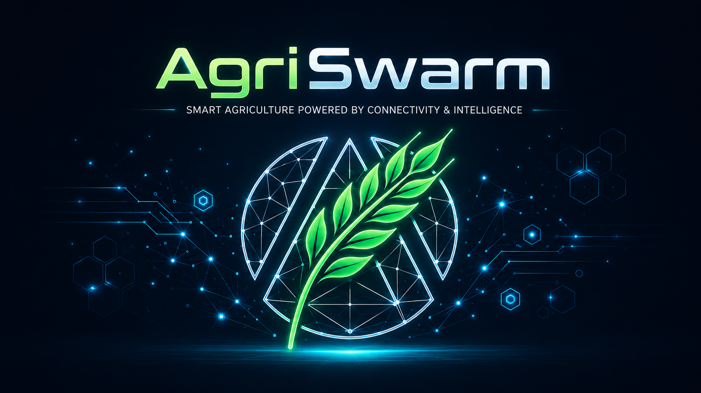
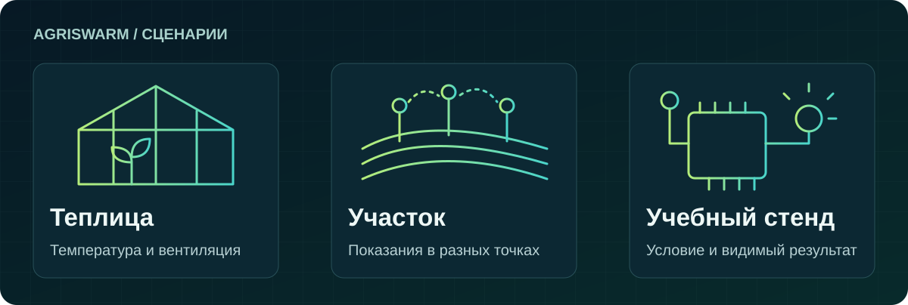

  

<h1 align="center">AgriSwarm</h1>

<strong>Измерять. Принимать решения. Управлять на месте.</strong> 
Автоматика на ESP32 для теплиц, участков и учебных стендов.

  
  
  
  

  <a href="docs/project-overview.md"><strong>О проекте</strong></a> ·
  <a href="docs/demonstration.md"><strong>Демонстрация</strong></a> ·
  <a href="docs/getting-started.md"><strong>Первый запуск</strong></a> ·
  <a href="00_Master_Index.md"><strong>Документация</strong></a>

---

## От показания датчика — к действию

В теплице стало жарко. Датчик передал температуру, плата проверила заданное условие и отправила команду на вентиляцию. Пользователь видит показание и может изменить порог — без переписывания прошивки.

**AgriSwarm объединяет измерения, правила и управление оборудованием в одной системе.** Каждая плата ESP32 может работать с подключёнными устройствами; несколько плат могут обмениваться показаниями и командами по радиосвязи. Уже настроенное локальное правило выполняется на плате без постоянно включённого компьютера и без обязательного облачного сервиса.

> **Главная идея:** начать с одного понятного действия, а затем связать несколько точек измерения и управления. Логика остаётся рядом с оборудованием.

## Познакомьтесь с проектом в своём темпе

<table>
<tr>
<td width="50%" valign="top">
<h3>Для зрителей и жюри</h3>

Задача, идея и наблюдаемый результат.

<a href="docs/project-overview.md"><strong>Обзор за несколько минут →</strong></a>

<a href="docs/use-cases.md">Сценарии применения</a> 
<a href="docs/demonstration.md">Что увидеть на стенде</a> 
<a href="docs/project-roadmap.md">Перспектива развития</a>

</td>
<td width="50%" valign="top">
<h3>Для владельцев устройства</h3>

Подключение, настройка и диагностика.

<a href="docs/getting-started.md"><strong>Подготовить первый стенд →</strong></a>

<a href="03_Hardware_Interaction_and_Node_Lifecycle.md">Датчики и выходы</a> 
<a href="docs/advanced-settings.md">Гибкая настройка</a> 
<a href="06_CLI_Reference.md">Справочник команд</a>

</td>
</tr>
</table>

## Как работает AgriSwarm

1. **Измерение.** Датчик сообщает температуру, влажность или состояние контакта.
2. **Решение.** Плата сравнивает показание с условием, которое настроил пользователь.
3. **Действие.** Выход подаёт сигнал реле, индикатору или приводу.

Если датчик и выход находятся на разных платах, для такого сценария нужна исправная связь между ними. Отсутствие интернета и потеря связи с удалённым датчиком — разные ситуации.

## В чём особенность проекта

<table>
<tr>
<td width="50%" valign="top"><h3>01 · Решения на устройстве</h3>
Условия и действия хранятся на ESP32. Для локального сценария не нужен постоянно работающий внешний сервер.
</td>
<td width="50%" valign="top"><h3>02 · Связь между точками</h3>
Платы объявляют свои датчики и управляемые устройства. Данные можно использовать за пределами одного контроллера.
</td>
</tr>
<tr>
<td valign="top"><h3>03 · Поведение через настройки</h3>
Имена, пороги, правила и параметры меняются через интерфейсы настройки. Для этих задач исходники прошивки не нужны.
</td>
<td valign="top"><h3>04 · Наблюдаемая работа</h3>
Показания, состояния, консоль и журналы помогают понять, что происходит, и проверить результат настройки.
</td>
</tr>
</table>

Отдельные технологии известны и применяются в других системах. **Ценность AgriSwarm — в их объединении для одной задачи:** сделать настраиваемую локальную автоматику с обменом между устройствами. [Подробнее о возможностях](docs/features.md).

## Где это можно применить

| Сценарий | Что делает система | Что получает человек |
|---|---|---|
| **Климат теплицы** | Сравнивает температуру с порогом и управляет выходом вентиляции. | Реакцию на изменение условий по заданному правилу. |
| **Наблюдение за грядками** | Собирает показания совместимых датчиков в нескольких точках. | Данные, по которым можно оценивать условия и готовить автоматику полива. |
| **Учебный стенд** | Связывает кнопку или датчик с индикатором и показывает работу правила. | Наглядный опыт: «измерение → условие → действие». |

Это **варианты применения**, а не перечень завершённых внедрений. Для реальной установки подбираются датчики, питание и механизмы, затем проверяется весь сценарий. [Состав и условия каждого стенда](docs/use-cases.md).

## Что входит в систему

| Возможность | Где узнать больше |
|---|---|
| Цифровые и аналоговые входы, DHT11/DHT22, реле, сервоприводы | [Оборудование](03_Hardware_Interaction_and_Node_Lifecycle.md) |
| Правила по показаниям, интервальные задачи, алгоритмы | [Автоматизация](docs/automation.md) |
| Обнаружение плат, передача показаний и команд | [Связь между устройствами](04_Mesh_Network_and_Data_Routing.md) |
| Консоль USB, мастера настройки и локальная веб-панель | [Команды](06_CLI_Reference.md) · [Веб-панель](10_Web_Interface_Guide.md) |
| Сохранение конфигурации, журналы и чёрный ящик | [Настройки](docs/littlefs-structure.md) · [Диагностика](docs/diagnostics.md) |
| Развиваемые приложения для ПК и Android | [Приложение ПК](12_AgriSwarm_Engine_GUI_Guide.md) · [Android](android/README.md) |

Приложения развиваются отдельно. Доступность функций и совместимость нужно сверять по конкретному комплекту, а не только по виду интерфейса.

## Что показать на демонстрации

**Один датчик. Одно правило. Видимый результат.**

На подготовленном низковольтном стенде измените вход, покажите реакцию индикатора, затем поменяйте условие. Закройте интерфейс, сохранив питание платы, и повторите опыт: так зритель увидит, где выполняется логика.

[Сценарий демонстрации и вопросы жюри →](docs/demonstration.md)

## Сегодня и следующий шаг

**Сегодня — инженерный прототип:** в разработке есть измерения, управление, правила, сетевой обмен, интерфейсы и диагностика. Сценарии конкретной сборки требуют проверки на оборудовании. Новые механизмы аварийного останова и восстановления проходят отдельную проверку и ещё не заявлены как подтверждённая защита.

**Ближайшая цель — воспроизводимый комплект:** прошивка, настройки, схема стенда и результаты испытаний, которые можно повторить. Затем — проверка нескольких зон, совместимости приложений и длительной работы.

Дальность, число устойчиво работающих узлов, экономия ресурсов и промышленная надёжность будут оцениваться по измерениям. [Текущая готовность](docs/project-status.md) · [Программа испытаний](AUDIT_AND_TESTING.md) · [Направления развития](docs/project-roadmap.md).

## Начать знакомство или собрать стенд

**Хочу понять проект:** [обзор](docs/project-overview.md) → [демонстрация](docs/demonstration.md) → [частые вопросы](FAQ.md).

**У меня есть ESP32:** [совместимый комплект прошивки](docs/firmware.md) → [подключение](docs/getting-started.md) → [первое правило](docs/command-examples.md). Для первого опыта используйте низковольтный стенд; [подготовьте питание и подключения](docs/hardware-safety.md).

<strong>Технические руководства и дополнительные материалы</strong>

- [Устройство системы](01_Architecture_and_Design.md) и [принципы работы](02_Working_Principles.md).
- [Гибкая настройка](docs/advanced-settings.md) и [готовые примеры](docs/command-examples.md).
- [Диагностика проблем](08_Troubleshooting.md) и [ограничения защиты](09_Security_and_Constraints.md).
- [Материалы для NotebookLM и презентаций](docs/presentation-kit.md).
- [Полное оглавление](00_Master_Index.md).

---

<strong>AgriSwarm · Данные рядом с растениями. Решения рядом с оборудованием.</strong>

Автор — [qagent567](https://github.com/qagent567). [Вопросы и предложения](https://github.com/qagent567/esp_progect_PUB/issues) · [Поддержка](SUPPORT.md) · [Выпуски](https://github.com/qagent567/esp_progect_PUB/releases).

Исходный код прошивки закрыт. Здесь опубликованы описание проекта и пользовательские материалы; условия использования определяет [лицензия](LICENSE). Обновление документации само по себе не является выпуском новой прошивки.

