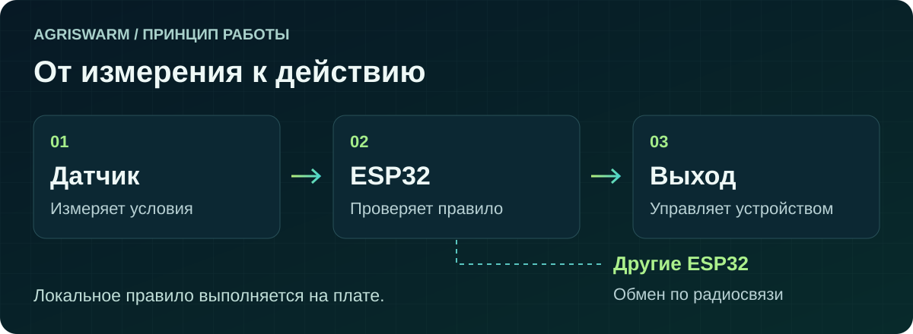

# AgriSwarm

**Система, в которой датчики и устройства работают вместе — даже без интернета.**

AgriSwarm помогает организовать автоматику теплицы, небольшого участка или учебного стенда. Плата ESP32 получает показания датчиков, проверяет заданные пользователем условия и управляет подключённым оборудованием. Несколько плат могут обмениваться данными и командами по радиосвязи.

Например: датчик замечает повышение температуры, а настроенное правило подаёт команду приводу форточки. Решение принимается на устройстве; для локального сценария постоянно включённый компьютер и облачный сервис не нужны.

[Обзор проекта](docs/project-overview.md) · [Возможности](docs/features.md) · [Первый запуск](docs/getting-started.md) · [Статус разработки](docs/project-status.md)

## Что даёт AgriSwarm

| Возможность | Практическая польза |
|---|---|
| **Работа на самой плате** | Локальные правила выполняются без подключения к интернету. |
| **Обмен между платами** | Датчик и управляемое устройство могут находиться на разных узлах. |
| **Настройка без написания прошивки** | Имена устройств, условия и действия задаются через интерфейсы настройки. |
| **Разные способы управления** | Есть консоль по USB и локальная веб-панель; приложения для ПК и телефона развиваются отдельно. |
| **Диагностика** | Можно посмотреть показания, состояние сети, правила и сообщения об ошибках. |
| **Сохранение настроек** | Конфигурация хранится на плате и загружается при следующем включении. |

## Как это устроено

**Узел** — это одна ESP32 с подключёнными датчиками или исполнительными устройствами. **Правило** — условие вида «если температура выше порога, включить вентиляцию». Обмен между узлами расширяет такой сценарий на несколько точек участка.

## Выберите маршрут

| Понять проект | Настроить систему |
|---|---|
| [Обзор для посетителей и жюри](docs/project-overview.md) | [Первое подключение ESP32](docs/getting-started.md) |
| [Сценарии применения](docs/use-cases.md) | [Датчики, реле и сервоприводы](03_Hardware_Interaction_and_Node_Lifecycle.md) |
| [Что показать на демонстрации](docs/demonstration.md) | [Правила, задачи и алгоритмы](docs/automation.md) |
| [Возможности и особенности](docs/features.md) | [Команды и готовые примеры](06_CLI_Reference.md) |
| [Ответы на частые вопросы](FAQ.md) | [Сеть и удалённые устройства](04_Mesh_Network_and_Data_Routing.md) |
| [Текущая готовность](docs/project-status.md) | [Гибкая настройка](docs/advanced-settings.md) и [вся документация](00_Master_Index.md) |

## На каком этапе проект

AgriSwarm находится на стадии **инженерного прототипа**. В текущей разработке реализованы локальные датчики, управление выходами, правила, планирование, сетевой обмен и диагностика. Исправления прошивки прошли сборку; испытания обновлённой версии на физических платах ещё предстоят.

Эта редакция документации подготовлена **19 сентября 2026 года**. Дальность связи, допустимое число узлов и длительная надёжность будут указаны по результатам испытаний. Доступность функций в конкретном комплекте описана в [статусе проекта и сведениях о совместимости](docs/project-status.md).

## Получить прошивку

Проверьте [страницу выпусков](https://github.com/qagent567/esp_progect_PUB/releases) и [инструкцию по установке](docs/firmware.md). Выпуск документации не обязательно содержит прошивку: для установки нужен комплект под конкретную плату. В пакете этой документации бинарные файлы не распространяются.

**Исходный код прошивки закрыт.** Этот репозиторий предназначен для публичной документации, инструкций и информации о выпусках. Пользовательская настройка не требует доступа к исходникам. Условия использования определяет [лицензия](LICENSE).

## Обратная связь

Автор проекта — [qagent567](https://github.com/qagent567). Вопросы, предложения и воспроизводимые ошибки можно оставить в [Issues](https://github.com/qagent567/esp_progect_PUB/issues). [Как подготовить полезное обращение](SUPPORT.md).

Для первого знакомства используйте безопасный низковольтный стенд. Перед подключением механизмов прочитайте [рекомендации по оборудованию](docs/hardware-safety.md).
