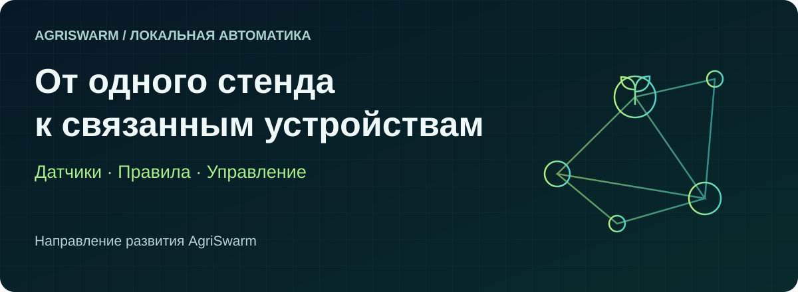
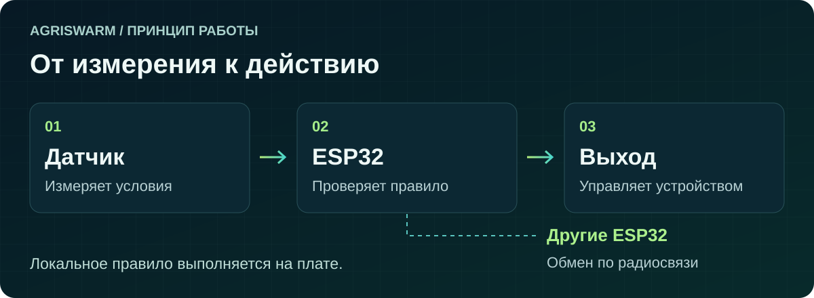
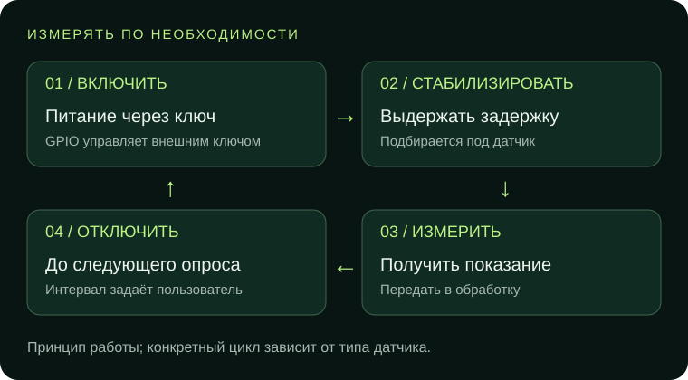
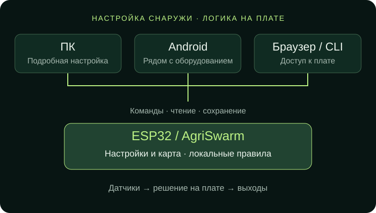
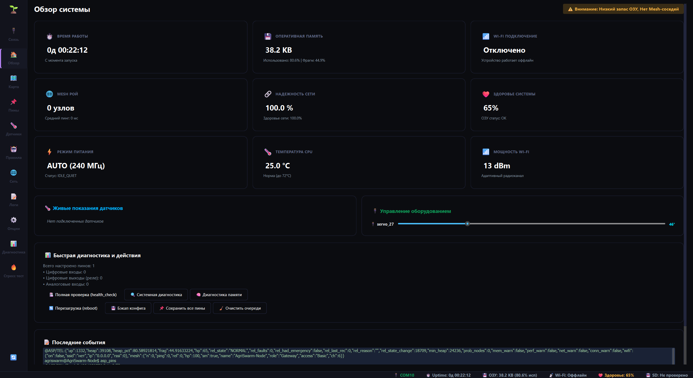
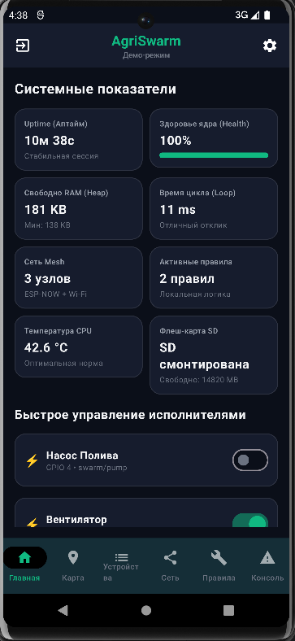

# AgriSwarm — автоматика по вашим правилам

   

**Настройте устройства и правила. Дальше работает плата.**

AgriSwarm — проект локальной автоматизации на ESP32 для теплиц, участков и учебных стендов. Датчики сообщают, что происходит; правила определяют реакцию; выходы управляют индикаторами, реле и сервоприводами. Компьютер и телефон помогают настраивать систему и наблюдать за ней, но уже настроенную локальную логику исполняет сама ESP32.

Главная идея — дать человеку конструктор поведения, а не одну жёстко заданную программу. Назвать датчик, изменить порог, добавить действие или переставить оборудование на карте можно через предусмотренные интерфейсы, без редактирования прошивки в IDE. Начать можно с кнопки и индикатора, а затем перейти к нескольким зонам и связанным платам.

[Интерактивный сайт](https://qagent567.github.io/esp_progect_PUB/) · [Быстрый старт](docs/getting-started.md) · [Все возможности](docs/features.md) · [Интерфейсы](docs/interfaces.md) · [Статус выпуска](#status) · [Полный гид](00_Master_Index.md)

**Впервые здесь?** Начните с [обзора](docs/project-overview.md), затем пройдите [первый безопасный запуск](docs/getting-started.md). В дереве репозитория также видны старые технические карточки, архив и папка с ранее опубликованными бинарниками. Они сохранены как история проекта, но не описывают автоматически текущую сборку и не заменяют [сведения о совместимом выпуске](docs/firmware.md).

## От показания к действию

Например, в мини-парнике стало жарко. Датчик передал температуру, правило сравнило её с выбранным порогом, выход включил вентиляцию. Пользователь может изменить условие, не перепрошивая плату. Для первого опыта вентилятор заменяется безопасным низковольтным индикатором: логика остаётся той же, результат хорошо виден.

Второй мини-парник может иметь свою ESP32, датчики и пороги. Локальные сценарии выполняются на соответствующих платах; обмен между узлами позволяет использовать удалённые данные и команды. Поэтому отключённый интернет не мешает локальному правилу, а потеря связи с удалённым датчиком — отдельная ситуация, которую необходимо учитывать.

Это полезно не только для теплицы. На учебном стенде можно изучать условия и действия, на участке — собирать показания из нескольких точек, в макете — управлять освещением и механизмами. [Примеры применения](docs/use-cases.md).

## Оборудование: от простого входа до управляемой форточки

| Что подключить | Что можно настроить | Пример применения |
|---|---|---|
| Цифровой вход | Режим кнопки, подавление дребезга, имя и тему | Кнопка ручного запуска или контакт состояния |
| Аналоговый датчик | Интервал измерений, пороги; в драйвере есть EMA-сглаживание | Наблюдение за изменением аналогового сигнала |
| DHT11 / DHT22 | Параметры устройства и опроса | Температура и влажность воздуха |
| Цифровой выход | Начальное состояние и команды управления | Индикатор или управляющий вход релейного модуля |
| Сервопривод | Угол, пределы, скорость и поведение сигнала | Модель форточки или заслонки |

Для новичка важны понятное имя и работающий первый сценарий. Для опытного пользователя — интервалы, темы, пороги и поведение конкретного устройства. Доступность отдельных полей зависит от типа устройства и выбранного редактора; подробности собраны в [тонкой настройке](docs/advanced-settings.md).

Сглаживание аналогового сигнала уже выполняется драйвером; его коэффициент сейчас фиксирован. Свободная настройка любого фильтра через приложение не заявляется.

### Измерять, когда это нужно

Для поддерживаемых датчиков предусмотрен управляющий контакт `powerPin` и задержка стабилизации. Через подходящий внешний ключ датчик получает питание перед измерением, а не обязательно постоянно. Это особенно интересно для экспериментов с резистивными датчиками почвы, где длительное питание может способствовать коррозии электродов. Срок службы и экономия энергии требуют отдельного измерения — это не обещанные характеристики проекта.

GPIO здесь управляет ключом, а не заменяет источник питания нагрузки. Насосы, двигатели и сервоприводы требуют подходящего питания и схемы подключения. Отключение управляющих импульсов сервопривода также не означает физического отключения его питания. Начните с [правил безопасности](docs/hardware-safety.md).

## Автоматика без изменения исходников

AgriSwarm предлагает несколько способов описать поведение, чтобы не пытаться решить каждую задачу одним сложным правилом.

- **Правила** связывают показание и действие: температура выше порога — включить выход; кнопка нажата — изменить состояние.
- **Периодические задачи** выполняют действие через заданный интервал. Интервал работы устройства не следует путать с календарным расписанием.
- **Алгоритмы** описывают последовательность действий, условий, пауз и повторений.
- **Ручное управление** позволяет проверить выход отдельно от автоматического сценария.
- **Тест-режим** помогает наблюдать реакцию логики на имитированные показания, не меняя физический датчик.

Для вентиляции можно задать два разных порога: включение выше 28 и выключение ниже 26. Между ними небольшие колебания не заставляют выход постоянно переключаться. Это учебный пример гистерезиса, а не рекомендация по выращиванию конкретной культуры. После настройки проверяют также запуск и отсутствие свежих данных.

**Тест-режим не является песочницей для выходов:** имитированное показание может привести к настоящему движению привода или переключению реле. Первый опыт проводите с индикатором или отключённой рабочей нагрузкой. [Правила, задачи и алгоритмы](docs/automation.md).

## ПК, телефон и плата — разные роли одной системы

### ПК: подробная настройка и наблюдение

Приложение для ПК удобно, когда нужно видеть всю установку: состояние платы, пины, датчики, правила, карту и диагностические сообщения. В текущей разработке доступны настройка интервала опроса, локальные резервные копии, импорт и экспорт карты, явные действия чтения карты с ESP32 и записи обратно.

Снимок показывает реальный вид интерфейса в момент съёмки, включая предупреждение об отсутствии Mesh-соседей. Значения памяти и здоровья системы не являются нормативами производительности или результатами испытания двухузлового стенда.

### Android: быстрый доступ рядом с оборудованием

Телефон удобен для осмотра установки: открыть показатели, найти нужное устройство и перейти к управлению. В клиенте развиваются поиск платы в локальной сети, редакторы пинов и правил, карта оборудования, планировщик, сетевой обзор и просмотр BlackBox. Карта датчиков отделена от топологии сети: соседние платы следует искать в сетевом разделе, а не среди объектов оборудования.

**На этом снимке Android включён демо-режим.** Числа и состояния иллюстрируют интерфейс, а не измеренные характеристики подключённой установки.

### Карта, которую можно забрать с платы

Карта делает установку понятнее: оборудование, зоны, координаты и связи помогают человеку ориентироваться в размещении устройств. В текущей разработке ESP32 умеет хранить JSON карты; клиенты содержат пути её чтения и сохранения. Это основа для сценария «настроил на ПК — открыл другим клиентом».

Но карта и физическая конфигурация — разные данные. Перемещение значка не переназначает GPIO и не создаёт правило. После записи нужно проверить ответ платы и прочитать карту обратно. Совместимость версий клиентов, перенос всех полей и одновременное редактирование ещё требуют сквозных проверок; автоматическое разрешение конфликтов здесь не обещается. [Подробнее об интерфейсах и карте](docs/interfaces.md).

## Браузер и консоль тоже остаются под рукой

Встроенная веб-панель даёт ещё один способ работы с платой, без установки отдельного клиента. Её ресурсы хранятся в прошивке в сжатом виде. Предусмотрен режим Standby и активация панели; веб-интерфейс не обязан оставаться открытым, чтобы локальные правила продолжали работать. Некоторые HTTP-операции доступны только при активной панели.

Веб-путь обновления также предусмотрен, но зависит от разметки памяти и комплекта. Подтверждённый пользовательский сценарий OTA для текущего профиля здесь не заявляется; для первого запуска ориентируйтесь на [установку через USB](docs/firmware.md).

Консоль полезна для первого подключения, диагностики и точной настройки. Мастера ведут по шагам: пользователю не обязательно помнить длинную строку параметров. Для своей сборки начните с `help`: интерфейсы не обязаны предоставлять одинаковый набор действий.

<strong>Команды для знакомства и углублённой работы</strong>

| Задача | С чего начать |
|---|---|
| Узнать команды и состояние | `help`, `status` |
| Создать и проверить устройство | `pin_wizard`, `pin_list`, `pin_info <имя>` |
| Изменить и сохранить параметры | `pin_config <имя>`, `pin_save <имя>` |
| Настроить автоматику | `rule_wizard`, `task_wizard`, `algo_wizard` |
| Проверить сервопривод | `servo_info <имя>`, `servo_set <имя> <угол>` |
| Работать с картой | `map_get`, `map_set`; HTTP: `GET /api/map`, `POST /api/map` |

Это ориентиры, не готовый сценарий для копирования на неизвестную плату. Для команд записи нужны корректные параметры и контроль результата. Порядок работы — в [быстром старте](docs/getting-started.md) и [настройке](docs/advanced-settings.md).

## Связь, сохранение и диагностика

**Сеть.** Платы обмениваются данными через ESP-NOW. Wi-Fi используется для клиентского доступа; способы обнаружения зависят от клиента. Android содержит UDP-поиск и поиск по подсети, прошивка также объявляет сервис mDNS. Наличие объявления не означает, что каждый клиент использует именно его. MQTT-интеграция относится к экспериментальным возможностям.

**Сохранение.** Настройки и карта могут храниться в файловой системе ESP32. Для записи конфигурации предусмотрены временные и резервные файлы с механизмами восстановления. Это не заменяет внешнюю копию: после настройки сохраните данные, проверьте чтение и повторите проверку после перезапуска. Локальные бэкапы ПК помогают вернуться к предыдущему варианту установки.

**Наблюдение.** Диагностика показывает память, время работы, состояние связи и устройств. Журнал событий объясняет последовательность действий, BlackBox помогает разбирать сбои. Поддержка SD и управление режимами через PowerGovernor — дополнительные возможности, зависящие от оборудования и сборки. Их наличие не доказывает сохранность всех событий при любом отключении питания.

Практическая польза этих инструментов — не только увидеть красный индикатор, но и собрать понятный отчёт: версия, подключение, команда, ответ, условия воспроизведения. [Руководство по диагностике](docs/diagnostics.md).

## Первый опыт за пять шагов

1. **Подготовьте плату и совместимый комплект.** Сверьте модель ESP32, прошивку и клиент по [инструкции получения прошивки](docs/firmware.md).
2. **Начните с безопасного подключения.** Один вход и низковольтный индикатор проще проверить, чем сразу насос и привод.
3. **Назовите устройства.** Убедитесь, что показания меняются, а выход работает вручную.
4. **Создайте одно правило.** Проверьте включение, выключение и исходное состояние; только затем добавляйте задачи и карту.
5. **Сохраните и перечитайте.** Проверьте работу после перезапуска. С закрытым приложением повторите локальный опыт — так видно, что решение принимает плата.

Для выступления можно показать изменение порога прямо в интерфейсе: тот же стенд начинает вести себя иначе без новой прошивки. Второй мини-парник добавляет самостоятельную зону и межузловой обмен после отдельной проверки на двух платах. [Сценарий демонстрации](docs/demonstration.md).

## Готовность и совместимость

**На 29 сентября 2026 года AgriSwarm — инженерный прототип.** Эта страница описывает возможности текущей разработки. В коде прошивки указана версия `v4.0.4`; это не подтверждает состав какого-либо скачиваемого архива. Перед установкой сверяйте описание конкретного выпуска и совместимость клиентов. [Статус компонентов](docs/project-status.md) · [План развития](docs/project-roadmap.md).

Реализованный механизм, успешная сборка, снимок интерфейса и аппаратное испытание — разные уровни подтверждения. Здесь не заявляются промышленная сертификация, гарантированная дальность, число узлов, длительный uptime или измеренная экономия ресурсов. Работа с реальными нагрузками требует проверки питания, безопасных состояний, потери связи и восстановления именно вашей установки. [Как проверяем результат](AUDIT_AND_TESTING.md).

## Документация и участие

Этот репозиторий — **главный публичный гид AgriSwarm**, а не исходники закрытой прошивки. Здесь собраны описание возможностей, инструкции, ограничения и маршруты знакомства с проектом. Условия использования определяет [лицензия](LICENSE).

- Новичку: [обзор проекта](docs/project-overview.md), [быстрый старт](docs/getting-started.md), [FAQ](FAQ.md).
- Опытному пользователю: [каталог функций](docs/features.md), [тонкая настройка](docs/advanced-settings.md), [автоматизация](docs/automation.md).
- Для обратной связи: [поддержка](SUPPORT.md), [сообщение о проблеме](CONTRIBUTING.md), [безопасность](SECURITY.md).

Автор проекта — [qagent567](https://github.com/qagent567). AgriSwarm развивается как проект VIS-COMPANY: данные рядом с растениями, решения рядом с оборудованием.
