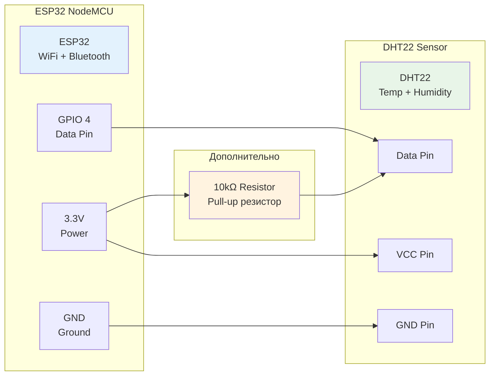
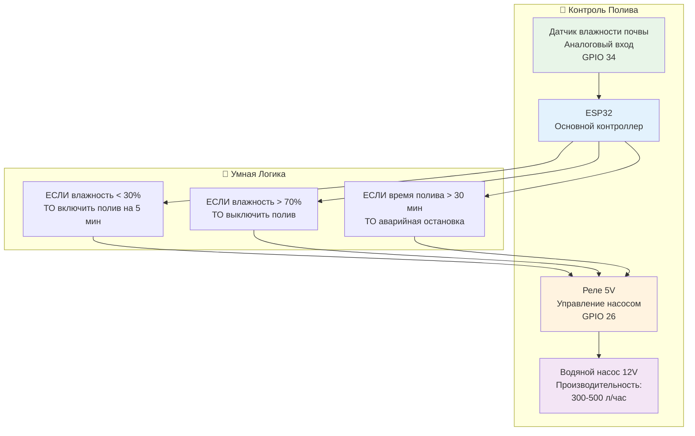
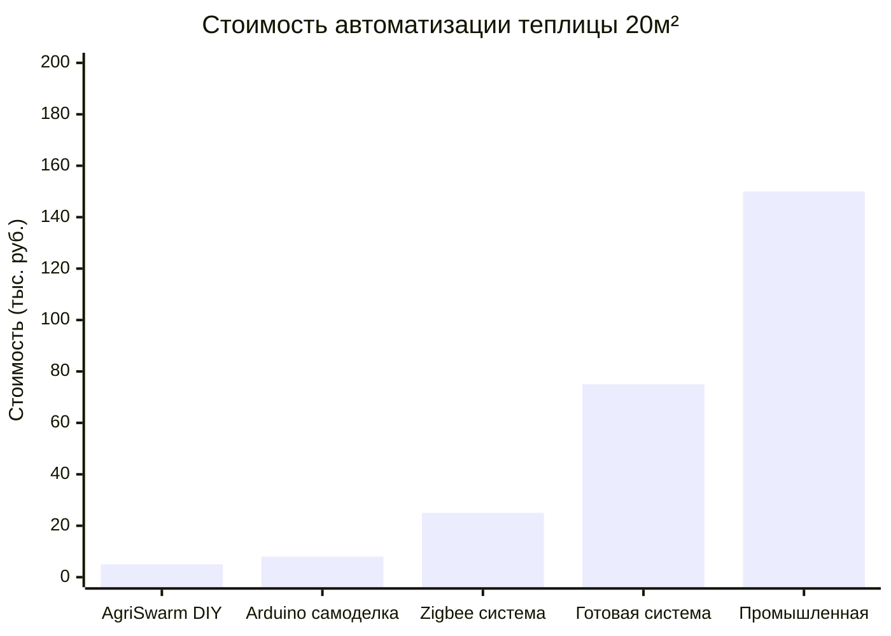
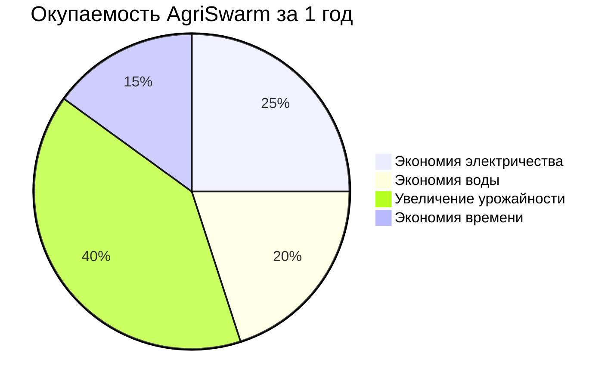
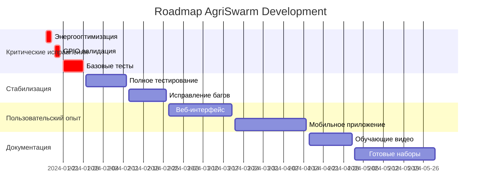
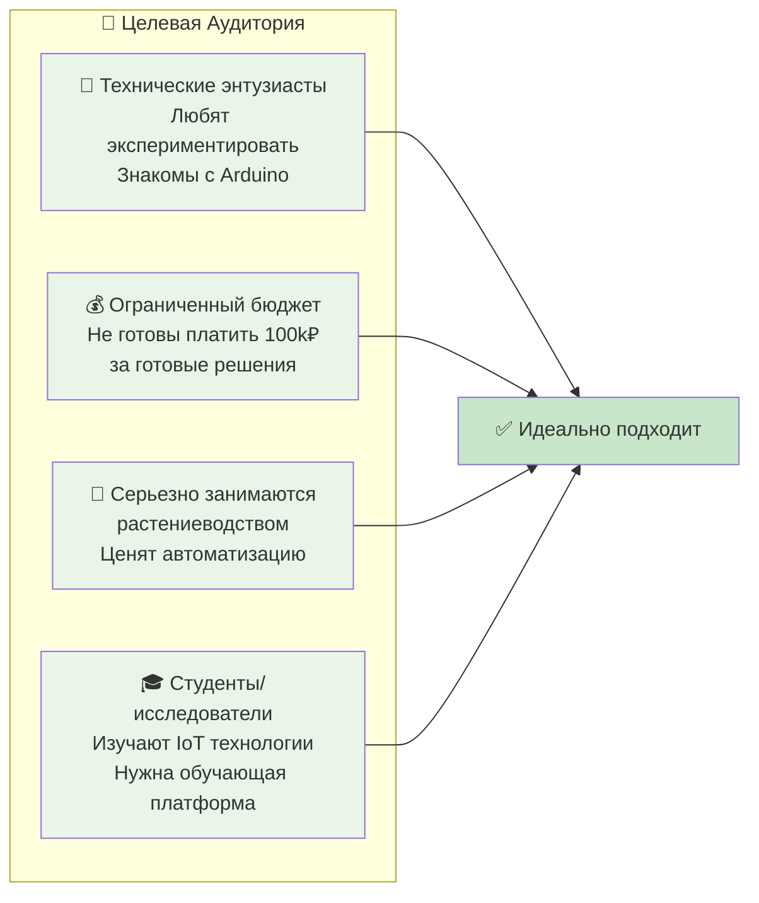
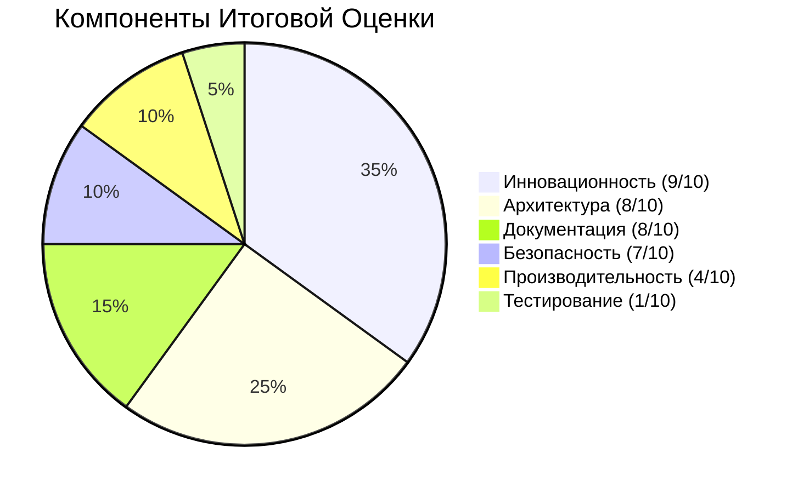

<div align="center">

[](README.md)
[](INDEX.md)
[](SIMPLE_CODE_ANALYSIS.md)

</div>

---

# 🎯 Визуальный Обзор AgriSwarm: Схемы и Диаграммы
## 📊 Понимание системы через графики и визуализацию

<div align="center">


**Все диаграммы основаны на реальном анализе кода AgriSwarm v0.3.7-bu**

</div>

---

## 🏗️ АРХИТЕКТУРА СИСТЕМЫ: 7-Слойная Структура

```mermaid
graph TB
    subgraph "🏢 AgriSwarm Enterprise Architecture"
        
        subgraph "Слой 7: Пользовательский Интерфейс"
            UI[Terminal Interface<br/>60+ команд управления<br/>Веб-интерфейс]
        end
        
        subgraph "Слой 6: Умная Логика"
            Rules[RuleEngine<br/>IF-THEN правила<br/>Event-driven система]
            Tasks[TaskManager<br/>Планировщик задач<br/>Отложенные команды]
        end
        
        subgraph "Слой 5: Коммуникации"
            Pub[Publisher/Subscriber<br/>Обмен данными<br/>Уведомления]
            Msg[Message Router<br/>Маршрутизация сообщений]
        end
        
        subgraph "Слой 4: Управление Устройствами" 
            Pin[PinManager<br/>Датчики и актуаторы<br/>GPIO управление]
            DHT[DHT Handler<br/>Температура/влажность]
        end
        
        subgraph "Слой 3: Smart Mesh Network"
            Smart[SmartMeshManager<br/>AI-роутинг<br/>Балансировка нагрузки]
            Ping[PingManager<br/>Мониторинг латентности<br/>Качество связи]
        end
        
        subgraph "Слой 2: Базовая Сеть"
            Mesh[painlessMesh<br/>Wi-Fi Mesh протокол<br/>Автоподключение]
            Trust[TrustedNodeManager<br/>Безопасность сети<br/>Контроль доступа]
        end
        
        subgraph "Слой 1: Фундамент"
            Config[ConfigManager<br/>Настройки системы<br/>CRC проверки]
            Log[Logger<br/>Система логирования<br/>Диагностика]
            Safe[SafeMath/SafeMemory<br/>Защита от ошибок<br/>Стабильность]
        end
    end
    
    UI --> Rules
    UI --> Tasks
    Rules --> Pub
    Tasks --> Pub
    Pub --> Pin
    Msg --> Pin
    Pin --> DHT
    Pin --> Smart
    Smart --> Ping
    Smart --> Mesh
    Ping --> Mesh
    Mesh --> Trust
    Trust --> Config
    Config --> Log
    Log --> Safe
    
    style UI fill:#e3f2fd
    style Rules fill:#f3e5f5
    style Smart fill:#e8f5e8
    style Config fill:#fff3e0
```



---

## 🌐 MESH-СЕТЬ: Как Устройства Находят Друг Друга

```mermaid
graph LR
    subgraph "🏠 Умная Дача (Покрытие 300м)"
        A[ESP32 #1<br/>🌡️ Главный узел<br/>DHT22 + Управление]
        B[ESP32 #2<br/>🌱 Теплица<br/>Полив + Вентиляция] 
        C[ESP32 #3<br/>🏡 Дом<br/>Освещение + Безопасность]
        D[ESP32 #4<br/>🌾 Огород<br/>Датчики почвы]
    end
    
    A -.->|Wi-Fi Mesh<br/>Дальность: 100м| B
    A -.->|Резервный путь<br/>RSSI: -65dBm| C
    B -.->|Прямая связь<br/>Латентность: 15мс| C
    C -.->|Автоматический<br/>маршрут| D
    B -.->|Резервный канал<br/>при сбое A-D| D
    
    A -.->|Если B недоступен<br/>через C| D
    
    subgraph "🧠 Умная Маршрутизация"
        Route[SmartMeshManager<br/>Выбирает лучший путь:<br/>• Скорость (40%)<br/>• Сигнал (30%)<br/>• Загрузка (30%)]
    end
    
    Route -.-> A
    Route -.-> B
    Route -.-> C
    Route -.-> D
    
    style A fill:#ffebee
    style B fill:#e8f5e8
    style C fill:#e3f2fd
    style D fill:#fff3e0
    style Route fill:#f3e5f5
```

### 📊 Показатели Производительности Mesh-Сети

| Параметр | Значение | Пояснение |
|----------|----------|-----------|
| **Максимум узлов** | 32 устройства | Ограничение painlessMesh библиотеки |
| **Дальность связи** | 100-300м | Зависит от препятствий и мощности |
| **Латентность** | 15-50мс | Время доставки сообщения |
| **Пропускная способность** | 1-5 Мбит/с | Общая для всей сети |
| **Время восстановления** | 5-15 сек | При выходе из строя узла |
| **Энергопотребление** | 45-160мА | В зависимости от активности |

---

## 💡 ПРАКТИЧЕСКИЕ СХЕМЫ ПОДКЛЮЧЕНИЯ

### 🌡️ Датчик DHT22 (Температура + Влажность)



### 💧 Система Автоматического Полива



---

## 📈 ЭКОНОМИЧЕСКАЯ ЭФФЕКТИВНОСТЬ

### 💰 Сравнение Стоимости Решений



### 📊 Окупаемость Инвестиций по Сегментам



### 💡 ROI Калькулятор

| Сфера применения | Инвестиции | Экономия/месяц | Окупаемость |
|-------------------|------------|----------------|-------------|
| **🏠 Домашняя автоматизация** | 3,000₽ | 1,500₽ | 2 месяца |
| **🌱 Теплица (20м²)** | 5,000₽ | 2,500₽ | 2 месяца |
| **🌾 Огород (100м²)** | 8,000₽ | 3,000₽ | 2.5 месяца |
| **🐄 Ферма (100 голов)** | 15,000₽ | 12,000₽ | 1.2 месяца |

---

## 🚨 ПРОБЛЕМЫ И РИСКИ: Честная Оценка

### ❌ Критические Проблемы (требуют немедленного исправления)

```mermaid
graph TB
    subgraph "🚨 КРИТИЧНО"
        Problem1[Энергопотребление<br/>75% впустую<br/>4x mesh.update()]
        Problem2[Отсутствие GPIO валидации<br/>Можно сжечь ESP32<br/>пин 999 = crash]
        Problem3[0% тестирования<br/>Никто не проверял<br/>работоспособность]
    end
    
    subgraph "⚠️ ВАЖНО"
        Problem4[Отсутствие UI<br/>Только командная строка<br/>60+ команд]
        Problem5[Сложность настройки<br/>Нужны технические знания<br/>Arduino IDE]
    end
    
    subgraph "ℹ️ СРЕДНЕ"
        Problem6[Альфа-версия<br/>Возможны сбои<br/>Нестабильность]
        Problem7[Нет официальной поддержки<br/>Только сообщество<br/>GitHub issues]
    end
    
    Problem1 -.->|Исправление: 2 часа| Fix1[Убрать лишние вызовы]
    Problem2 -.->|Исправление: 3 часа| Fix2[Добавить validateGPIO]
    Problem3 -.->|Исправление: 1 неделя| Fix3[Написать базовые тесты]
    
    style Problem1 fill:#ffebee
    style Problem2 fill:#ffebee
    style Problem3 fill:#ffebee
    style Problem4 fill:#fff3e0
    style Problem5 fill:#fff3e0
    style Fix1 fill:#e8f5e8
    style Fix2 fill:#e8f5e8
    style Fix3 fill:#e8f5e8
```

### 📊 Матрица Рисков

| Риск | Вероятность | Влияние | Приоритет | Способ Митигации |
|------|-------------|---------|-----------|------------------|
| **Система не запускается** | Высокая | Критическое | 🔴 1 | Написать тесты + проверка |
| **Сгорает ESP32** | Средняя | Высокое | 🟡 2 | Валидация GPIO пинов |
| **Быстро разряжается батарея** | Высокая | Среднее | 🟡 3 | Оптимизация энергопотребления |
| **Сложно настроить** | Высокая | Среднее | 🟢 4 | Создать GUI интерфейс |
| **Нестабильная работа** | Средняя | Среднее | 🟢 5 | Больше тестирования |

---

## 🛣️ ROADMAP: План Развития



### 🎯 Версии и Milestone

| Версия | Статус | Описание | Готовность |
|--------|--------|----------|------------|
| **v0.3.7** | 🔴 Alpha | Текущая версия с проблемами | 30% |
| **v0.4.0** | 🟡 Beta | Исправленные критические баги | 60% |
| **v0.5.0** | 🟡 RC | Стабильная версия с UI | 80% |
| **v1.0.0** | 🟢 Release | Готов для массового использования | 95% |

---

## 🎓 ВЫВОДЫ И РЕКОМЕНДАЦИИ

### ✅ Кому Подходит AgriSwarm



### ❌ Кому НЕ Подходит

```mermaid
graph LR
    subgraph "⛔ Не Рекомендуется"
        E[🏢 Критически важные системы<br/>Медицина, безопасность<br/>Нужна 99.9% надежность]
        F[⏰ Нет времени на изучение<br/>Хочется "включил и работает"<br/>Готовы переплатить за простоту]
        G[💼 Коммерческое применение<br/>Нужна официальная поддержка<br/>Гарантии и SLA]
        H[🚫 Боятся экспериментов<br/>Не готовы к возможным сбоям<br/>Нужна 100% стабильность]
    end
    
    E --> NotGood[❌ Лучше выбрать<br/>готовые решения]
    F --> NotGood
    G --> NotGood
    H --> NotGood
    
    style E fill:#ffebee
    style F fill:#ffebee
    style G fill:#ffebee
    style H fill:#ffebee
    style NotGood fill:#ffcdd2
```

### 🏆 Финальная Оценка

<div align="center">

**AgriSwarm v0.3.7-bu: 6.5/10**

*"Tesla Model S в стадии разработки"*



</div>

---

<div align="center">

### 🚀 Готовы Попробовать?

[](SIMPLE_CODE_ANALYSIS.md)
[](ИНСТРУКЦИЯ_ДЛЯ_НАЧИНАЮЩИХ.md)
[](BUSINESS_OVERVIEW.md)

**AgriSwarm: Революционная mesh-технология для умной автоматизации**  
*Альфа-версия • Для технических энтузиастов • Огромный потенциал*

---

### 🔄 НАВИГАЦИЯ

[](README.md)
[](INDEX.md)
[](SIMPLE_CODE_ANALYSIS.md)
[](QUICK_REFERENCE_CARDS.md)

**💡 Этот документ поможет понять AgriSwarm через схемы и диаграммы**

</div>