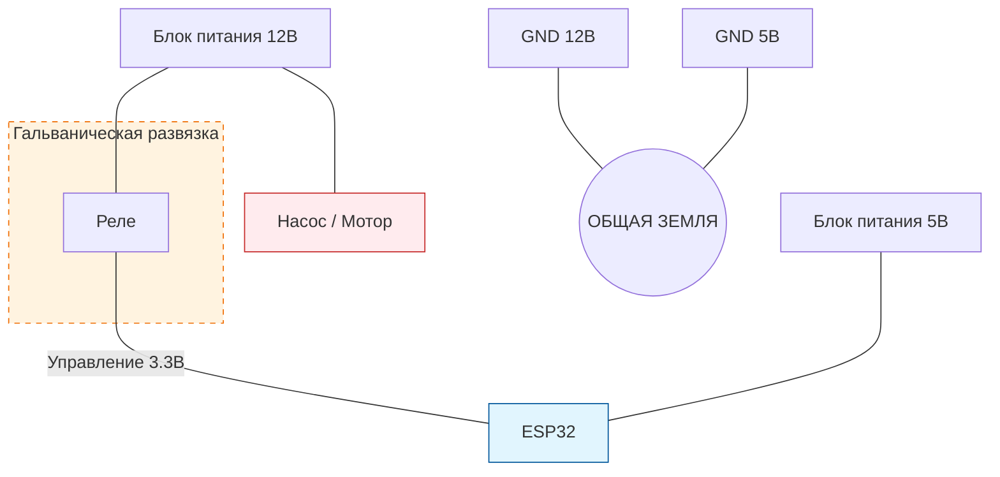

# ⚡ Электробезопасность и Схемы (Hardware Safety)

Ваша плата ESP32 — это низковольтное устройство. Ошибка в подключении может мгновенно сжечь её или привести к нестабильной работе всей сети. Пожалуйста, внимательно изучите эти правила.

---

## 🛑 Главные правила "НЕ"

1.  **НЕ подключайте 5В к пинам ESP32!** Почти все контакты платы работают СТРОГО на **3.3В**. Если вы подадите 5В от датчика напрямую, плата сгорит. Используйте делители напряжения или конвертеры уровней.
2.  **НЕ питайте моторы/насосы от ESP32!** Пин платы может выдать максимум 10-20 мА. Этого хватит только для светодиода. Мотор потребляет в 100 раз больше.
3.  **НЕ забывайте защитный диод на реле!** При выключении катушки реле возникает всплеск напряжения (индуктивный выброс), который может убить транзистор управления или вызвать краш процессора.

---

## 🔋 Правильное Питание

Для надежной работы фермы (особенно в Mesh-сети) критически важно стабильное питание.

*   **Рекомендуемый Блок Питания:** 5В, минимум 2А.
*   **Конденсатор:** Если плата перезагружается при включении реле, добавьте электролитический конденсатор (470-1000 мкФ) параллельно линии питания 5В.

### Схема безопасного питания:

*Важно: Земли (GND) всех блоков питания должны быть соединены вместе!*

---

## 🔌 Подключение датчиков

### 🌡️ Температура и Влажность (DHT22/AM2302)
1. Питание (VCC): 3.3В или 5В (см. даташит конкретной модели).
2. Данные (DATA): К пину ESP32 (например, 4).
3. **ОБЯЗАТЕЛЬНО:** Подтяните DATA к VCC через резистор 4.7кОм - 10кОм. Без него датчик будет выдавать `NaN`.

### 🌱 Влажность почвы (Аналоговый)
Большинство бюджетных резистивных датчиков (с открытыми металлическими контактами) быстро окисляются.
1. Рекомендуется использовать **ёмкостные (Capacitive)** датчики влажности.
2. Подключение к контакту АЦП (например, 34 или 35).
3. **Совет:** Питайте датчик через свободный пин ESP32 (Power Pin в `pin_setup`). Включайте его только в момент замера (100мс) — это продлит срок службы датчика в 10 раз!

---

## 🕹️ Управление реле и моторами

Никогда не подключайте катушку реле напрямую к пину ESP32. Всегда используйте модуль реле с опторазвязкой или транзисторную сборку (например, ULN2003).

### Правильная схема для реле:
1. **Пин ESP32** -> вход **IN** модуля реле.
2. **VCC модуля реле** -> **5В** блока питания.
3. **GND ESP32** -> **GND модуля**.
4. **JD-VCC** (если есть перемычка) -> **отдельный** блок питания 5В (для полной изоляции от помех).

---

## ⚠️ Аппаратное дублирование защиты (Критически важно!)

Ни одна программа, датчик или контроллер не застрахованы на 100% от зависаний, просадок питания, программных ошибок или залипания физических контактов реле. Если ваша автоматика управляет нагревателями, мощными лампами или подачей воды, **вы обязаны использовать независимую аппаратную защиту**:

1.  **Защита от перегрева и пожара:** Подключайте любые нагреватели последовательно через механический термопредохранитель (например, термовыключатель KSD301 на 50–70°C). Если реле заклинит во включенном состоянии или зависнет ESP32, механический терморегулятор физически разорвет цепь питания при превышении безопасной температуры.
2.  **Защита от затопления:** Используйте механические поплавковые клапаны перелива. Для насосов рекомендуется ставить независимые реле времени (таймеры безопасности), отсекающие питание при непрерывной работе насоса дольше 10–15 минут.
3.  **Электрическая защита:** Все силовые цепи 220В должны быть защищены автоматическими выключателями и устройством защитного отключения (УЗО/АВДТ).

---

## 📏 Длина проводов

ESP32 — это высокочастотное устройство. 
*   **I2C датчики:** Длина провода до 2 метров.
*   **DHT22 / 1-Wire:** До 10-15 метров (при использовании качественной витой пары).
*   **Кнопки / Концевики:** До 20-30 метров, но обязательно используйте экранированный провод и конденсатор от помех.

---
💡 **Золотое правило:** Сначала проверьте схему тестером, и только потом подавайте питание. Если плата нагревается — немедленно выключите её!