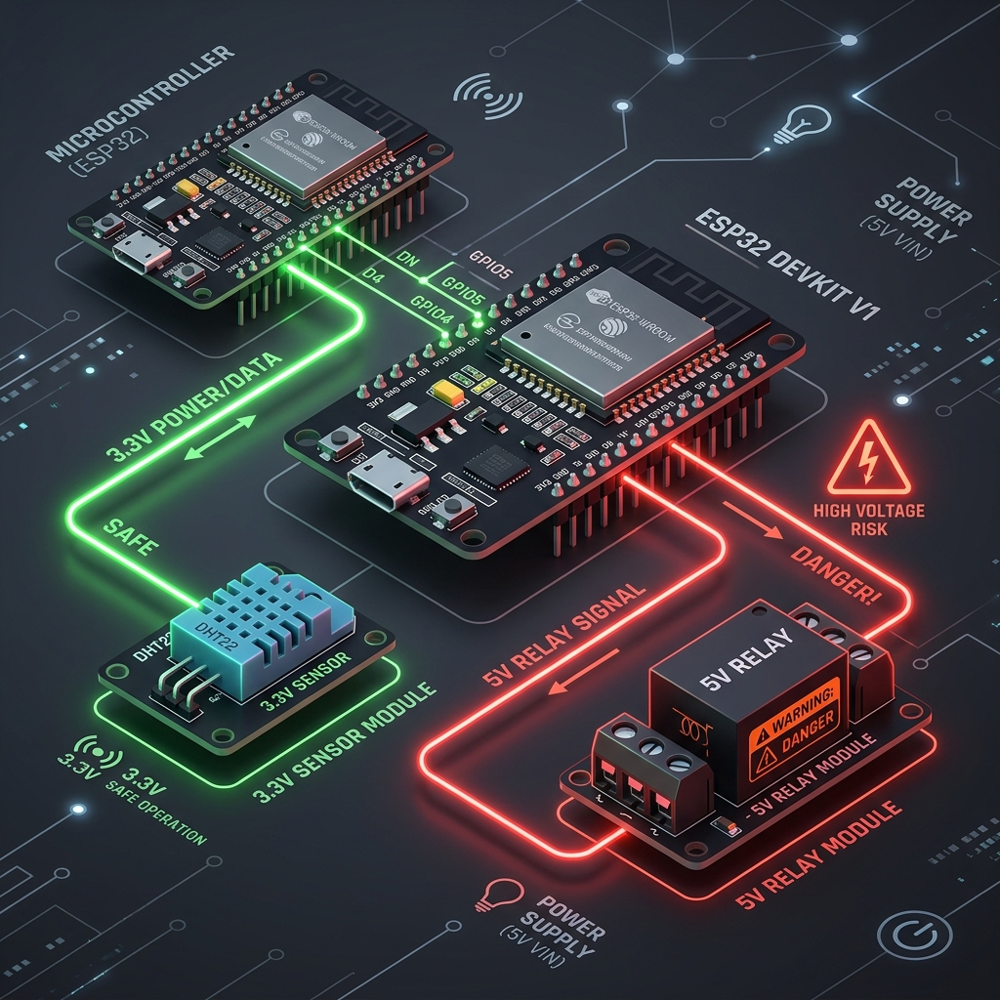

# 🔌 Схемы физического подключения оборудования

Это руководство содержит простые и понятные визуальные схемы для подключения датчиков и реле к плате ESP32. Все подключения ориентированы на безопасное использование и защиту от повреждения портов контроллера.



---


## 1. Цифровой датчик температуры и влажности DHT22

Датчик DHT22 обменивается данными по одному проводу (Single-Bus). Для стабильного чтения показаний требуется подтягивающий (Pull-Up) резистор номиналом **4.7 кОм – 10 кОм** между линиями питания (VCC) и данных (DATA).

### Схема подключения:

```text
       +-----------------------+
       |   Датчик DHT22/AM2302 |
       |                       |
       |   [VCC] [DATA]  [GND] |
       +-----+-----+-----+-----+
             |     |     |
             |     |     +-------------------------+
             |     |                               |
             |     +-------------+                 |
             |                   |                 |
            [+] Резистор 10к    |                 |
             |  (Pull-Up)        |                 |
             +-----+             |                 |
                   |             v                 v
                 [3.3V]       [GPIO 4]           [GND]
             +-----+-------------+-----------------+-----+
             |                                           |
             |             Контроллер ESP32              |
             +-------------------------------------------+
```

> [!TIP]
> Многие готовые модули датчиков (на маленьких платках с 3 контактами) уже имеют встроенный распаянный подтягивающий резистор. Если у вас такой модуль, резистор 10к устанавливать не нужно.

---

## 2. Аналоговый датчик влажности почвы с ключом питания (`powerPin`)

Для защиты металлических контактов аналогового датчика от электролитической коррозии питание подаётся на него только в момент замера через управляющий контакт ESP32 (`powerPin`), после чего датчик обесточивается.

### Схема подключения:

```text
       +------------------------------------+
       |      Датчик влажности почвы        |
       |                                    |
       |   [VCC]       [A0]          [GND]  |
       +-----+----------+--------------+----+
             |          |              |
             |          |              +-----------+
             |          |                          |
             v          v                          v
         [GPIO 25]  [GPIO 34]                    [GND]
       (powerPin)   (Analog In)             (Общая земля)
       +-----+----------+--------------+-----------+-----+
       |                                                 |
       |                Контроллер ESP32                 |
       +-------------------------------------------------+
```

> [!IMPORTANT]
> Для аналогового считывания рекомендуется использовать пины диапазона **GPIO 34-39** (ADC1). Они работают стабильно и не подвержены влиянию высокочастотных помех при передаче Wi-Fi Mesh пакетов, в отличие от контактов группы ADC2 (GPIO 0, 2, 4, 12-15, 25-27).

---

## 3. Силовое реле управления нагрузкой (насос, вентилятор)

Для защиты ESP32 от обратных токов индуктивной нагрузки (моторы, катушки реле) используйте **оптоизолированные модули реле** с питанием логической части от 3.3V или 5V.

### Схема подключения:

```text
                         Низковольтная часть        Силовая часть (220В / 12В)
                       +---------------------+     +--------------------------+
                       |    Модуль Реле      |     |                          |
                       |                     |     |      /                   |
                       | [VCC] [IN]  [GND]   |     |  [NO]   [COM]    [NC]    |
                       +--+-----+-----+------+     +---+-------+-------+------+
                          |     |     |                |       |
      +-------------------+     |     +-------+        |       +---+ Лампа / Насос
      |                         |             |        |           |
      v                         v             v        v           v
    [5V]                    [GPIO 12]       [GND]   [Фаза]     [Нейтраль]
    (или 3.3V)                                      (220В)       (220В)
  +---+-------------------------+-------------+---+
  |                                             |
  |              Контроллер ESP32               |
  +---------------------------------------------+
```

> [!CAUTION]
> **Соблюдайте правила электробезопасности!** Работы с напряжением 220В должны проводиться только при отключенном питании сети. Убедитесь, что все силовые контакты надежно изолированы и помещены в герметичный пластиковый корпус.
