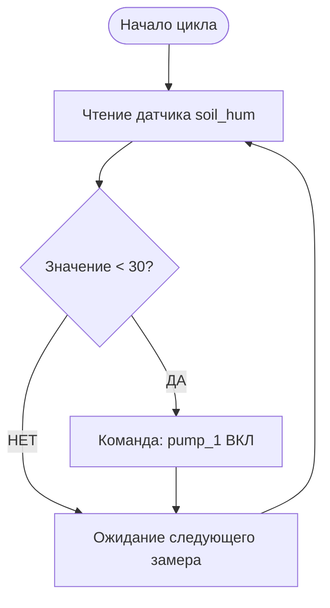

<p align="center">
  <a href="./README.md">◀ Назад к Справочникам</a> | 
  <a href="../README.md">🏠 Главная</a>
</p>

---

# 🛠️ Сборник инструкций (How-To Guides)

В этом разделе собраны пошаговые инструкции (рецепты) для решения типовых задач администрирования децентрализованной сети AgriSwarm.

---

## 1. Как настроить правило автоматизации (RuleEngine)?

**Задача:** Вы хотите, чтобы система автоматически включала реле полива (`pump_1`), если влажность почвы (`soil_hum`) падает ниже 30%.



1. **Зарегистрируйте оборудование:** Сначала убедитесь, что датчик и реле прописаны в системе:
   ```bash
   pin_setup soil_hum ANALOG_IN 34
   pin_setup pump_1 RELAY 25
   ```
2. **Создайте правило:** Используйте движок правил `RuleEngine`.
   Синтаксис: `rule_add <id> <name> <source> <condition> <value> <action> <target>`
   
   Вводим в консоль:
   ```bash
   rule_add rule_pump1 "Автополив" soil_hum < 30 set_pin pump_1 1
   ```
3. **Проверьте статус:**
   ```bash
   rule_info rule_pump1
   ```
   *Готово. Теперь `RuleEngine` будет непрерывно оценивать датчик `soil_hum` и, если значение < 30, отправит асинхронную команду на включение реле `pump_1`.*

---

## 2. Как защитить сеть от подмены узлов?

**Задача:** Настроить `TrustedNodeManager` (Белый список) так, чтобы чужие устройства ESP32 не могли подключиться к вашей теплице и подавать команды.

1. Узнайте **Node ID** и **MAC-адрес** доверенного узла (выполнив команду `status` на том самом узле).
2. На вашем главном контроллере (Gateway) введите команду добавления в Белый список:
   ```bash
   trusted_add 1234567890 AA:BB:CC:DD:EE:FF "Greenhouse_Node" sensor readonly
   ```
   *Где `readonly` — это Уровень Доступа (Access Level).*
3. Убедитесь, что узел появился в списке:
   ```bash
   trusted_list
   ```
   *Теперь любые пакеты от узла 1234567890 с другим физическим MAC-адресом будут автоматически отбрасываться маршрутизатором.*

---

## 3. Как расследовать причину случайной перезагрузки?

**Задача:** Обслуживающий персонал сообщает, что ночью устройство перезагрузилось. Вы хотите понять причину (скачок напряжения, ошибка кода, зависание сети).

AgriSwarm оснащен модулем `BlackBoxManager`, который сохраняет контекст системы в энергонезависимую RTC-память за миллисекунды до падения.

1. Откройте терминал устройства и извлеките данные Чёрного ящика:
   ```bash
   blackbox rtc
   ```
2. Изучите вывод. Обратите внимание на `Reset Reason`. Вы увидите, была ли это проблема с питанием (`Brownout Reset`), ошибка деления на ноль (`Panic / Div by Zero`) или завис какой-то цикл (`WDT Reset`). Также будет показана свободная оперативная память в момент краша.
3. Для просмотра последних 10 системных логов (даже тех, которые не привели к сбою):
   ```bash
   blackbox entries 10
   ```

---

## 4. Как запустить экстренное лечение системы (Self-Healing)?

**Задача:** Сеть работает нестабильно (теряются пакеты), либо монитор показывает сильную фрагментацию кучи, но устройство еще реагирует на команды.

Модуль `SelfReflectionSystem` способен применять терапевтические меры к ядру операционной системы.

1. Запустите принудительный цикл саморефлексии:
   ```bash
   self_reflection force
   ```
   *Система пересчитает индекс здоровья (`Network Health Score`), выполнит Garbage Collection для памяти и, при необходимости, агрессивно пересоздаст Mesh-маршруты.*
2. Чтобы посмотреть отчет о здоровье системы:
   ```bash
   self_reflection report
   ```

---

## 5. Как обновить конфигурацию удаленного узла по радиосети?

**Задача:** Вы находитесь у главного пульта, а вам нужно поменять порог срабатывания или настроить новый датчик на узле, который физически находится в поле.

Используйте команды Mesh-роутинга для пересылки CLI-инструкций:
1. Отправьте команду "через воздух" на целевой Node ID:
   ```bash
   mesh_send 9876543210 "pin_setup heater1 RELAY 22"
   ```
2. (Опционально) Вы можете проверить доставку этой команды, запросив статус `MeshDeliveryTracker`, который подтвердит, что пакет с командой успешно доставлен и подтвержден (ACK).

---

<p align="center">
  <a href="./README.md">◀ Назад к Справочникам</a> | 
  <a href="../README.md">🏠 Главная</a>
</p>