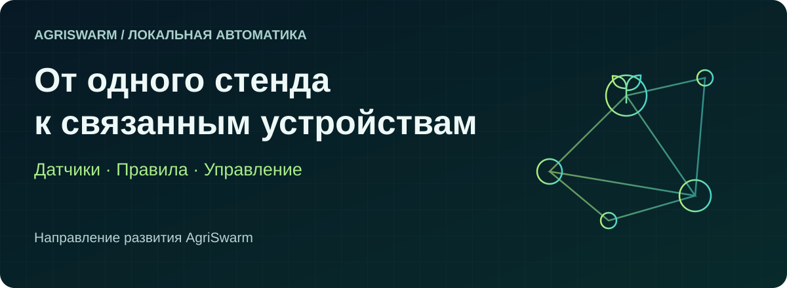

# Куда развивается AgriSwarm

[Главная](../README.md) · [Обзор](project-overview.md) · [Текущая готовность](project-status.md)

**Перспектива проекта — настраиваемая автоматика, которую можно развивать вместе с задачей:** сначала одно измерение и одно действие, затем несколько устройств и зон. Это направление развития, а не обещание уже готовой установки любого размера.

## 01 · Понятный первый результат

Основа уже представлена в разработке: датчики, выходы, локальные правила, интерфейсы настройки и сохранение конфигурации. Следующий результат для пользователя — согласованный комплект со схемой, настройками и примером, который можно повторить.

**Признак готовности:** другой человек собирает указанный стенд, получает ожидаемое действие и проверяет настройки после перезапуска.

## 02 · Предсказуемое поведение при сбое

Сейчас ведётся работа над аварийным остановом, безопасными состояниями выходов и автоматическим восстановлением. Для пользователя важно понимать, что сделает установка при потере данных, связи или перезапуске.

**Признак готовности:** опубликованы условия проверки и результаты отказов; фактические состояния выходов соответствуют настройкам. Наличие защитной функции в программе само по себе не подтверждает защиту установки.

## 03 · Несколько связанных точек

Сетевой обмен позволяет развивать сценарий за пределы одной ESP32: измерять в одной точке и управлять в другой. Следующий шаг — проверенные примеры размещения, обмена и поведения при недоступности второго узла.

**Признак готовности:** для конкретной схемы измерены доставка сообщений, задержки и реакция на потерю связи. Предельное число узлов и дальность определяются испытаниями.

## 04 · Удобное управление всей установкой

Консоль и веб-панель дополняются развиваемыми приложениями для компьютера и Android. Перспектива — видеть устройства и связи между ними, менять настройки и разбирать историю событий в удобном интерфейсе.

**Признак готовности:** приложение и прошивка выпущены как проверенная совместимая пара; изменение в интерфейсе подтверждается состоянием платы.

## Что можно будет оценить на практике

| Вопрос | Что измерять |
|---|---|
| Удобнее ли настраивать? | Время и число действий для первого рабочего сценария. |
| Надёжно ли работает связь? | Команды, подтверждения, реальные действия, задержки и потери. |
| Предсказуемо ли восстановление? | Причину сбоя, состояние выходов, условия и время возврата к работе. |
| Есть ли экономия ресурсов? | Расход воды или энергии в сопоставимых условиях до и после настройки. |

Сроки и количественные результаты здесь не обещаются. Направления MQTT, астрономических сценариев и пользовательских расширений описаны отдельно в [обзоре возможностей](features.md); их наличие в разработке не означает готовность стандартного комплекта.

[Как планируются испытания](../AUDIT_AND_TESTING.md) · [Как предложить улучшение](../CONTRIBUTING.md).
