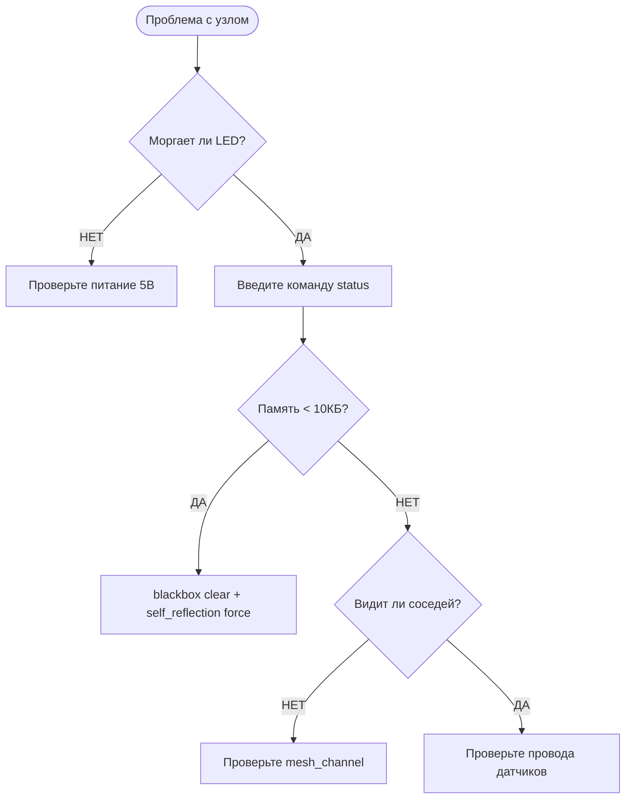

  <a href="./README.md">◀ Назад к Справочникам</a> | 
  <a href="../README.md">🏠 Главная</a>

---

# 🔍 Решение проблем и FAQ (Troubleshooting)

Даже самая надежная система может столкнуться с трудностями. В этом разделе собраны ответы на самые частые вопросы и пошаговые алгоритмы поиска неисправностей.

---

## 🆘 Пошаговый алгоритм: "Что-то не работает"

Если узел ведет себя странно, выполните эти 3 команды в терминале:
1. `status` — проверьте, не закончилась ли память (Free Heap) и какой Node ID у устройства.
2. `health_check` — система сама продиагностирует целостность файлов и стабильность ядра.
3. `blackbox rtc` — узнайте, не перезагружалась ли плата недавно и по какой причине.

---

## 🌐 Проблемы с Mesh-сетью

### ❓ Я не вижу другие узлы в `node_list`
*   **Причина 1: Разные каналы.** Узлы должны работать на одном Wi-Fi канале (по умолчанию 6).
    *   *Решение:* Проверьте канал командой `mesh_channel status`.
*   **Причина 2: Слабый сигнал.** Помехи от стен или других роутеров.
    *   *Решение:* Используйте `mesh_diag scan`, чтобы увидеть загруженность эфира. Попробуйте сменить канал командой `mesh_channel set <номер>`.
*   **Причина 3: Разные пароли.** Убедитесь, что `MESH_PASSWORD` совпадает на всех устройствах.

### ❓ Команды `mesh_send` не доходят или "отваливаются" по таймауту
*   **Решение:** Проверьте задержку связи командой `ping <NodeID>`. Если RTT > 500мс, значит связь крайне нестабильна. Попробуйте переставить узлы ближе друг к другу или используйте команду `mesh_optimize stability`.

---

## 🔌 Проблемы с оборудованием

### ❓ Датчик показывает `0.0`, `NaN` или `-999.0`
*   **Причина 1: Ошибка подключения.** Провод отошел или перебит.
    *   *Решение:* Проверьте статус физической линии командой `sensor_status report`. Если там статус `DISCONNECTED`, проверьте контакты.
*   **Причина 2: Помехи по питанию.** Мощный мотор рядом наводит шум на сигнальный провод.
    *   *Решение:* Используйте экранированные провода или добавьте конденсатор 0.1мкФ между сигналом и землей (GND).

### ❓ Реле щелкает, но прибор не включается
*   **Причина:** Скорее всего, вы пытаетесь питать мощную нагрузку напрямую от ESP32 или через тонкие провода.
    *   *Решение:* Проверьте схему подключения. Логика ESP32 работает на 3.3В, а большинство реле требуют 5В или 12В для катушки. Подробнее см. в [Руководстве по электробезопасности](./hardware-safety.md).

---

## 💾 Проблемы с системой и памятью

### ❓ Плата постоянно перезагружается (Bootloop)
*   **Как проверить:** Введите `blackbox rtc` сразу после загрузки.
*   **Если причина `Brownout Reset`:** Вашему блоку питания не хватает мощности. Когда включается Wi-Fi, происходит скачок тока, напряжение проседает, и плата уходит в ребут. Замените блок питания на более мощный (минимум 2А).
*   **Если причина `WDT Reset`:** Какая-то задача (например, опрос датчика) выполняется слишком долго и блокирует систему. Попробуйте временно отключить этот пин командой `pin_delete <имя>`.

### ❓ Сообщения "Memory Critical" в логах
*   **Решение:** Ваша система перегружена правилами или задачами. Очистите историю логов командой `blackbox clear` и удалите ненужные правила. Если не помогает — выполните `self_reflection force`.

---

## ⌨️ Переводчик ошибок терминала (CLI Survival)

Если вы ввели команду и система ответила текстом на английском — не паникуйте. Вот что это значит:

| Что написала плата | Что это значит на самом деле | Что делать |
| :--- | :--- | :--- |
| `Command not found` | Плата не знает такого слова. | Проверьте опечатку или нажмите **Tab** для подсказки. |
| `Too many arguments` | Вы написали слишком много слов. | Проверьте синтаксис в [Справочнике](./reference.md). |
| `Buffer overflow` | Команда слишком длинная. | Пишите короче, не зажимайте клавиши на клавиатуре. |
| `Unauthorized` | У вас нет прав на эту команду. | Повысьте уровень доступа: `node_access admin`. |
| `Node not found` | Плата с таким номером не видна. | Проверьте, включена ли вторая плата. |

### 💡 Полезные сочетания клавиш:
*   **Клавиша Tab:** Начните писать `pin_` и нажмите Tab — плата сама предложит варианты (`pin_setup`, `pin_list`).
*   **Стрелочки Вверх/Вниз:** Листают ваши прошлые команды. Не нужно писать одно и то же дважды!

---
## 💬 Часто задаваемые вопросы (FAQ)
... (далее по тексту) ...

---

  <a href="./README.md">◀ Назад к Справочникам</a> | 
  <a href="../README.md">🏠 Главная</a>

