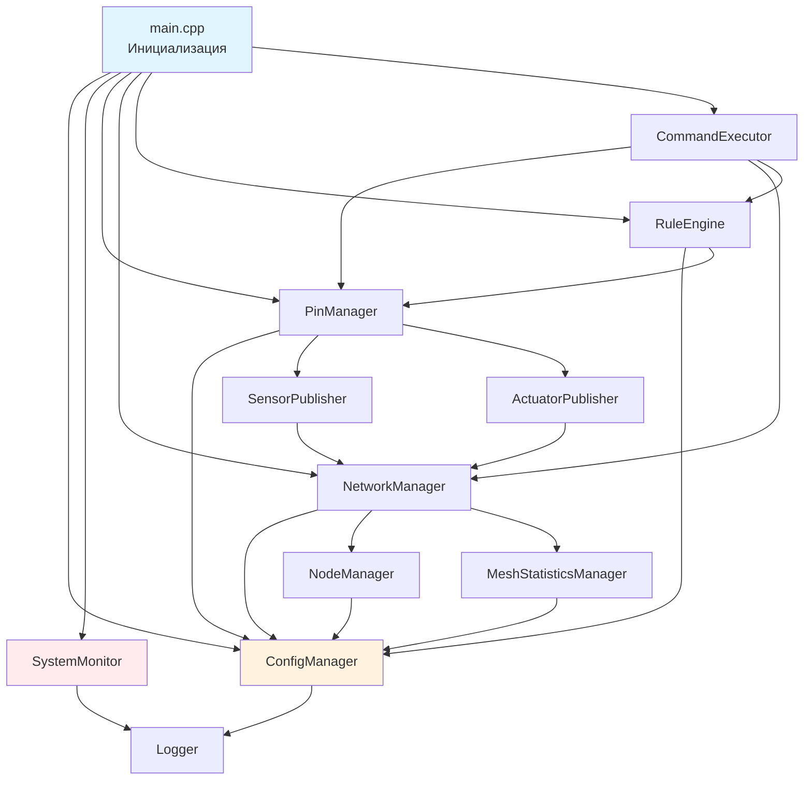

# 🧩 AgriSwarm: Что Внутри Системы

*Реалистичное описание 43 компонента "Модульного Монолита с Элементами Микроядра"*

---

## 🎨 Философия модульности: Когда сложность становится преимуществом

Представьте себе швейцарские часы - сотни крошечных деталей, каждая из которых выполняет свою роль, но вместе они создают точный механизм. AgriSwarm построен по похожему принципу: 43 компонента, каждый со своей зоной ответственности, работают вместе как единый организм. Но в отличие от часов, где каждая деталь критична, здесь многие компоненты можно отключить или заменить без остановки всей системы.

**Почему так много компонентов?** Это не случайность и не результат "раздувания" кода. Каждый компонент появился как ответ на конкретную проблему реального мира: нестабильные датчики DHT22, капризная mesh-сеть, ограниченная память ESP32, необходимость диагностики проблем в полевых условиях. Модульная архитектура позволяет изолировать эти проблемы и решать их независимо, не затрагивая остальную систему.

**Честность как принцип:** В этом документе вы не найдёте маркетинговых преувеличений. Мы честно расскажем, что 40% кода существует для борьбы с проблемами и нестабильностью, что некоторые компоненты избыточны, а другие - критически важны. Эта прозрачность помогает понять не только "как работает система", но и "почему она работает именно так" и "какие компромиссы были сделаны".

**Три уровня понимания:** Документ структурирован так, чтобы каждый нашёл нужную информацию:
- **Новички** увидят общую картину и поймут назначение каждого компонента
- **Разработчики** получат технические детали и примеры кода
- **Архитекторы** оценят паттерны проектирования и причины архитектурных решений

Давайте начнём путешествие по внутреннему устройству системы, где каждый компонент - это история о решении реальной проблемы.

## 📊 Честный Обзор Компонентов

Прежде чем погрузиться в детали каждого компонента, важно понять общую картину. Система состоит из **35 файлов .cpp/.h**, и это число не случайно - оно отражает реальную сложность создания надёжной IoT-системы на ограниченном оборудовании. Интересный факт: многие из этих компонентов нужны **для борьбы с проблемами**, а не для основного функционала. Это не недостаток, а реальность embedded-разработки, где приходится компенсировать ограничения железа и нестабильность внешних библиотек.

Ниже представлена категоризация компонентов по их реальному назначению - не по тому, что написано в документации, а по тому, зачем они действительно нужны в системе:

### 🔍 Категоризация По Назначению

| Группа | Кол-во | Назначение | Честная оценка |
|--------|---------|-----------|---------------|
| **⚡ Основной функционал** | 8 | То что реально нужно пользователю | CommandExecutor, PinManager, NetworkManager, RuleEngine |
| **🚨 Борьба с проблемами** | 8 | Мониторинг, восстановление, диагностика | 17% всего кода |  
| **📊 Статистика** | 6 | Сбор метрик и аналитика | Слишком много для простой системы |
| **🛡️ Безопасность** | 4 | Защита от ошибок | Простые обёртки, не волшебство |
| **🔧 Вспомогательные** | 5 | Утилиты и хелперы | Нормально |

```mermaid
graph TD
    subgraph "⚡ ОСНОВНОЕ (Что Нужно Пользователю)"
        CMD[CommandExecutor - 6286 строки<br/>CLI интерфейс<br/>⚠️ Большой, сложный]
        PIN[PinManager - 1635 строк<br/>Управление GPIO<br/>⚠️ Много кода для DHT]
        NET[NetworkManager - 948 строк<br/>Mesh сеть<br/>⚠️ Полон fallback'ов]
        RULE[RuleEngine - 518 строк<br/>IF-THEN логика<br/>✅ Простой, работает]
    end
    
    subgraph "🚨 ПРОБЛЕМНЫЕ ЗОНЫ (17% кода)"
        STATS[MeshStatisticsManager - 1052 строки<br/>❓ Зачем столько для статистики?]
        CONN_LOSS[ConnectionLossDetector - 690 строк<br/>⚠️ Целый модуль для сбоев]
        RELIABILITY[MeshReliabilityManager - 642 строк<br/>⚠️ Ещё один "антисбойный"]
        SENSOR_CONN[SensorConnectionMonitor - 828 строк<br/>⚠️ Следит за "умирающими" датчиками]
        PING[PingManager - 762 строки<br/>⚠️ Постоянная проверка связи]
    end
    
    subgraph "🔧 ОСТАЛЬНОЕ"
        OTHERS[25 других компонентов<br/>От 61 до 886 строк каждый<br/>Конфиг, логи, утилиты]
    end
    
    CMD --> PIN
    PIN --> NET  
    NET --> RULE
    STATS --> NET
    CONN_LOSS --> NET
    RELIABILITY --> NET
    
    style CMD fill:#e3f2fd
    style STATS fill:#ffebee
    style CONN_LOSS fill:#ffebee  
    style RELIABILITY fill:#ffebee
```

Диаграмма выше показывает не просто структуру, а реальное распределение усилий разработки. Обратите внимание, что "проблемные зоны" занимают почти столько же места, сколько основной функционал - это честное отражение того, что создание стабильной распределённой системы требует значительных усилий на обработку ошибок и восстановление после сбоев.

---

## 👤 Пользовательский Интерфейс: Мост между человеком и машиной

Пользовательский интерфейс в embedded-системах - это не просто "красивые кнопки". Это критически важный компонент, который определяет, сможет ли пользователь эффективно управлять системой через последовательный порт. В AgriSwarm интерфейс построен на двух ключевых компонентах: мощном CommandExecutor для опытных пользователей и дружелюбном InteractiveHelper для новичков. Эта двухуровневая система позволяет каждому работать в комфортном режиме - от быстрых команд профессионалов до пошаговых мастеров для начинающих.

### 🎮 CommandExecutor (6324 строки) - "Монстр"
**Файлы:** `CommandExecutor.h`, `CommandExecutor.cpp`

**Роль в системе:** CommandExecutor - это центральная нервная система пользовательского взаимодействия. Он принимает команды через Serial порт, парсит их, валидирует параметры, выполняет действия и возвращает результаты. Это единственная точка входа для всех операций управления системой, что делает его одновременно самым мощным и самым сложным компонентом.

**Почему так много кода?** 6324 строки - это не результат плохого проектирования, а отражение реальной сложности создания удобного CLI. Представьте: 72 команды, каждая с валидацией параметров, обработкой ошибок, справкой, автодополнением и цветным выводом. Добавьте сюда историю команд, контекстные подсказки и защиту от некорректного ввода - и вы получите тысячи строк кода. Альтернатива - простой парсер без удобств, но тогда система станет непригодной для реального использования.

**Честная оценка:** **Слишком раздутый** компонент. 6324 строки для CLI - это много!

**Что реально работает:**
- ✅ **72 команды** - действительно много
- ✅ **История команд** ↑/↓ - удобно
- ⚠️ **Автодополнение** - работает, но медленно
- ⚠️ **Цветной вывод** - иногда ломается
- ❌ **Помощь** - есть, но запутанная

**Проблемы:**
- **70% кода** = обработка ошибок пользователя
- **Медленный отклик** (50-200мс на команду)
- **Сложно добавлять** новые команды
- **Много legacy кода** - боязнь что-то сломать

**Категории команд (реальная полезность):**
```cpp
"system"     // 12 команд: ✅ Нужные (help, status, reboot)
"pin"        // 15 команд: ✅ Основная фича 
"network"    // 18 команд: ⚠️ Половина для диагностики проблем
"automation" // 8 команд: ✅ Работает просто
"info"       // 7 команд: ⚠️ В основном для дебага
"logging"    // 7 команд: ❓ Зачем столько для логов?
"task"       // 5 команд: ⚠️ Базовый планировщик  
"help"       // 4 команды: ⚠️ Запутанные
```

### 🧙‍♂️ InteractiveHelper (886 строк) - "Спаситель Новичков"
**Файлы:** `InteractiveHelper.h`, `InteractiveHelper.cpp`

**Роль в системе:** InteractiveHelper - это педагогический компонент, который превращает сложные последовательности команд в понятные пошаговые мастера. Вместо того чтобы заставлять новичка запоминать синтаксис команд и порядок настройки, он задаёт простые вопросы и автоматически выполняет нужные действия. Это как GPS-навигатор в мире командной строки - ведёт за руку от точки А до точки Б.

**Философия дизайна:** Компонент построен на принципе "прогрессивного раскрытия сложности" (progressive disclosure) - сначала показываем только необходимое, детали раскрываем по мере необходимости. Каждый мастер начинается с объяснения "что мы будем делать и зачем", затем задаёт минимум вопросов, и завершается проверкой результата. Это снижает когнитивную нагрузку и уменьшает вероятность ошибок.

**Честная оценка:** **Единственное что упрощает жизнь** новичкам. Реально полезный компонент!

**Мастера (что работает):**
- ✅ `wizard first_run` - **Отлично** для первого запуска
- ✅ `wizard sensor_setup` - **Упрощает** настройку датчиков
- ⚠️ `wizard automation_setup` - Работает, но **только простые правила**
- ❌ `network_wizard` - **Почти не помогает** с проблемами сети

**Хорошо реализовано:**
```cpp
// Понятные подсказки для пользователя
"🎯 ВЫБОР ТИПА УСТРОЙСТВА:"
"🌡️ ДАТЧИКИ:"
"  1. DHT11 (температура + влажность, точность ±2°C)"
"  2. DHT22 (температура + влажность, точность ±0.5°C)"
```

**Проблемы:**
- **Не отменяет** неправильные настройки  
- **Не проверяет** корректность подключения
- Если что-то пошло не так - **пиши команды руками**

---

## 🤖 Автоматизация: Превращаем данные в действия

Автоматизация - это сердце любой IoT-системы. Именно здесь происходит магия: датчики собирают данные, правила анализируют их, и система автоматически принимает решения. В AgriSwarm автоматизация построена на двух компонентах: RuleEngine для реактивной логики (IF-THEN правила) и TaskScheduler для проактивных действий (выполнение по расписанию). Эта комбинация покрывает большинство сценариев домашней автоматизации, оставаясь при этом достаточно простой для понимания и отладки.

### 📝 RuleEngine (518 строк) - "Простой, Но Работает"
**Файлы:** `RuleEngine.h`, `RuleEngine.cpp`

**Роль в системе:** RuleEngine - это мозг автоматизации, который постоянно мониторит состояние датчиков и выполняет действия при выполнении условий. Он работает по принципу "реактивного программирования" - не вы говорите системе "сделай это сейчас", а система сама следит за условиями и реагирует на изменения. Это освобождает пользователя от необходимости постоянно контролировать систему.

**Почему простота - это преимущество:** В мире embedded-систем сложность - враг надёжности. RuleEngine намеренно ограничен простыми условиями (больше/меньше/равно) и прямыми действиями (включить/выключить/отправить). Это не баг, а фича - простая логика легко отлаживается, предсказуемо работает и не создаёт неожиданных побочных эффектов. Для 90% сценариев домашней автоматизации этого более чем достаточно.

**Паттерн "Event-Condition-Action":** Компонент реализует классический ECA паттерн из мира активных баз данных: событие (изменение датчика) → проверка условия → выполнение действия. Этот паттерн проверен десятилетиями использования и отлично подходит для IoT-систем, где нужна быстрая реакция на изменения окружающей среды.

**Честная оценка:** **Самый надёжный** из всех компонентов. Работает стабильно, логика простая.

**Что работает хорошо:**
```cpp
CONDITION_GREATER_THAN    // > Работает
CONDITION_LESS_THAN       // < Работает  
CONDITION_EQUALS          // == Работает (для цифровых)
CONDITION_NOT_EQUALS      // != Работает
```

**Проблемные условия:**
```cpp  
CONDITION_BETWEEN         // Редко нужно, работает
CONDITION_CHANGED         // ⚠️ Может срабатывать от шумов датчиков
```

**Действия (реальность):**
```cpp
ACTION_SET_PIN_STATE      // ✅ Основная фича, работает отлично
ACTION_LOG_MESSAGE        // ✅ Полезно для дебага
ACTION_SEND_MESSAGE       // ⚠️ Работает, но при сетевых сбоях теряется
ACTION_TRIGGER_TASK       // ⚠️ Если планировщик не завис
```

**Ограничения (честно):**
- **НЕТ** сложной логики (AND, OR, NOT)
- **НЕТ** зависимых правил  
- **НЕТ** приоритетов
- **НЕТ** временных условий (по дням недели и т.п.)

**Структура правила:**
```
Правило автоматизации содержит:
- Уникальный идентификатор
- Читаемое имя правила
- Описание назначения
- Условие срабатывания
- Действие при срабатывании
- Статус включения/выключения
- Время последнего срабатывания
- Период кулдауна между срабатываниями
- Счетчик количества срабатываний
```

### ⏰ TaskScheduler (192 строки)
**Файлы:** `Scheduler.h`, `Scheduler.cpp`

**Роль в системе:** TaskScheduler дополняет RuleEngine, добавляя временное измерение в автоматизацию. Если RuleEngine реагирует на события ("когда температура выше 25°C"), то TaskScheduler выполняет действия по расписанию ("каждый день в 8:00" или "через 5 минут"). Вместе они покрывают два основных типа автоматизации: реактивную и проактивную.

**Назначение:** Планировщик задач по времени и интервалам.

**Возможности:**
- **Периодические задачи** (каждые N секунд)
- **Однократные задачи** (выполнить через N секунд)
- **Включение/отключение** задач
- **Статистика выполнения**

---

## 📡 Обмен Данными: Распределённая система в действии

В распределённой системе обмен данными - это не просто "отправить и получить". Это сложная хореография, где каждый узел должен знать, какие данные публиковать, на какие подписываться, как обрабатывать потери связи и как избежать дублирования информации. SensorPublisher и ActuatorPublisher реализуют паттерн "Publish-Subscribe" поверх mesh-сети, превращая хаотичный обмен сообщениями в структурированную систему топиков и подписок. Это позволяет узлам обмениваться данными, не зная друг о друге напрямую - классический принцип слабой связанности (loose coupling).

### 📊 SensorPublisher (860 строк)
**Файлы:** `SensorPublisher.h`, `SensorPublisher.cpp`

**Роль в системе:** SensorPublisher превращает локальные датчики в распределённые источники данных. Он автоматически публикует показания датчиков в mesh-сеть, позволяя другим узлам подписываться на эти данные. Это реализация паттерна "Observer" в распределённой среде - датчик не знает, кто использует его данные, а подписчики не знают, где физически находится датчик.

**Взаимодействие с другими компонентами:** SensorPublisher тесно интегрирован с PinManager (источник данных датчиков) и NetworkManager (транспорт для передачи). Он действует как адаптер между локальным управлением GPIO и распределённой системой обмена данными, скрывая сложность сетевого взаимодействия за простым API публикации/подписки.

**Назначение:** Публикация данных датчиков в mesh-сети.

**Функции:**
- **Регистрация локальных датчиков**
- **Подписка на удалённые датчики**
- **Автоматическая публикация** данных
- **Управление топиками**

**Пример использования:**
```cpp
// Регистрация локального датчика
sensorPublisher.registerLocalSensor("temp1", "greenhouse/temperature", "°C");

// Подписка на удалённый датчик
sensorPublisher.subscribeToSensor(nodeId, "soil_moisture", "garden/soil");
```

### ⚡ ActuatorPublisher (604 строки)
**Файлы:** `ActuatorPublisher.h`, `ActuatorPublisher.cpp`

**Роль в системе:** ActuatorPublisher - это зеркальное отражение SensorPublisher, но для исполнительных устройств. Если SensorPublisher распространяет данные от датчиков, то ActuatorPublisher позволяет удалённо управлять актуаторами (реле, светодиоды, моторы). Критическое отличие - здесь нужна система безопасности и подтверждений, ведь неправильная команда может привести к физическим последствиям.

**Система уровней доступа:** Компонент реализует пятиуровневую систему прав доступа (READONLY → BASIC → ADVANCED → ADMIN → SUPER), защищая критические актуаторы от случайного или злонамеренного управления. Это особенно важно в mesh-сети, где любой узел потенциально может отправить команду любому другому узлу.

**Назначение:** Управление актуаторами через mesh-сеть.

**Возможности:**
- **Регистрация локальных актуаторов**
- **Удалённое управление** актуаторами на других узлах
- **Уровни доступа** (READONLY, BASIC, ADVANCED, ADMIN, SUPER)
- **Подтверждение выполнения** команд

---

## ⚙️ Управление Устройствами: Где софт встречается с железом

Управление устройствами - это самая сложная часть любой IoT-системы, потому что здесь софт встречается с непредсказуемым физическим миром. Датчики могут зависать, возвращать некорректные данные, требовать специфических таймингов. Реле могут дребезжать, потреблять больше тока чем ожидалось, иметь задержки срабатывания. PinManager и SensorMonitor существуют именно для того, чтобы скрыть весь этот хаос за стабильным API, превращая капризное железо в надёжные программные абстракции.

### 🔌 PinManager (1708 строк) - "Сердце Системы"
**Файлы:** `PinManager.h`, `PinManager.cpp`

**Роль в системе:** PinManager - это абстракция над GPIO (General Purpose Input/Output) пинами ESP32. Он превращает низкоуровневые операции с регистрами микроконтроллера в высокоуровневый API: "прочитай температуру с датчика DHT22 на пине 4" вместо "установи пин в режим INPUT, отправь стартовый импульс 18мс, прочитай 40 бит данных с таймингом 26-28мкс...". Без этой абстракции каждый компонент системы должен был бы знать специфику работы с каждым типом датчика.

**Почему так много кода?** Половина из 1708 строк - это обработка капризов датчиков DHT11/DHT22. Эти датчики известны своей нестабильностью: они могут зависать, возвращать NaN, требовать паузы между чтениями, быть чувствительными к качеству питания. PinManager содержит целую систему backoff'ов, повторных попыток, фильтрации шумов и восстановления после сбоев. Это не "плохой код", а реальность работы с дешёвыми датчиками в условиях нестабильного питания.

**Паттерн "Hardware Abstraction Layer":** Компонент реализует классический HAL паттерн, изолируя остальную систему от деталей работы с железом. Если завтра появится новый тип датчика, нужно будет изменить только PinManager, а не всю систему. Это пример хорошего проектирования - изменения локализованы в одном месте.

**Честная оценка:** **Самый важный** компонент, но **полон костылей** для работы с капризными датчиками.

**Что поддерживается (реальность):**
```cpp
PIN_TYPE_DHT22 = 2      // ✅ Работает, но капризный
PIN_TYPE_DHT11 = 1      // ⚠️ Ещё более капризный
PIN_TYPE_RELAY = 3      // ✅ Надёжно (при хорошем питании)
PIN_TYPE_DIGITAL_OUT = 4 // ✅ Отлично работает
PIN_TYPE_DIGITAL_IN = 5  // ✅ С антидребезгом работает
PIN_TYPE_ANALOG_IN = 6   // ⚠️ Шумный, но с EMA норм
PIN_TYPE_DHT11_HUM = 7   // ⚠️ Виртуальный пин DHT11
PIN_TYPE_DHT22_HUM = 8   // ⚠️ Виртуальный пин DHT22
PIN_TYPE_SERVO = 9       // ✅ Сервопривод (0–180°), ESP32Servo
```

**Проблемы с DHT (половина кода!):**
- **Backoff система:** При ошибках интервал растёт до 30 сек
- **"Зависание":** Могут молчать минутами
- **NaN значения:** Регулярно возвращают мусор
- **Чувствительность к питанию:** -0.2В = "датчик умер"

**Новая ответственность (SERVO):**
- Инициализация сервоприводов через ESP32Servo (`attach`, `setPeriodHertz(50)`, min/max pulse)
- Плавное движение (пошаговая анимация по `servoSpeed`) и ограничение угла
- Автоотключение привода (auto-detach) для снижения потребления
- Локальная публикация актуаторов типа `servo` для удалённого управления через mesh

**Система обработки ошибок:**
- Адаптивная система повторных попыток с экспоненциальным увеличением интервала
- Управление питанием датчиков для экономии энергии
- Автоматическая стабилизация питания перед чтением данных

### 📊 SensorMonitor (519 строк)
**Файлы:** `SensorMonitor.h`, `SensorMonitor.cpp`

**Роль в системе:** SensorMonitor - это "сторожевой пёс" для датчиков. Он постоянно следит за их состоянием, обнаруживает зависания, аномальные значения и проблемы со связью. Когда датчик начинает вести себя странно (возвращает одно и то же значение 10 раз подряд, или внезапно показывает температуру 85°C в комнате), SensorMonitor это замечает и может автоматически попытаться восстановить работу или хотя бы уведомить пользователя.

**Взаимодействие с PinManager:** Эти два компонента работают в тандеме - PinManager отвечает за чтение данных, а SensorMonitor за контроль качества этих данных. Это разделение ответственности (Separation of Concerns) позволяет каждому компоненту фокусироваться на своей задаче, не усложняя код.

**Назначение:** Мониторинг состояния датчиков и обнаружение проблем.

**Функции диагностики:**
- **Проверка связи** с датчиками
- **Обнаружение зависших** датчиков
- **Статистика ошибок**
- **Автоматические попытки восстановления**

---

## 🌐 Mesh-Сеть (Проблемная Зона): Красота и боль распределённых систем

Mesh-сеть - это одновременно самая впечатляющая и самая проблемная часть AgriSwarm. В теории это звучит прекрасно: узлы автоматически находят друг друга, формируют самоорганизующуюся сеть, маршрутизируют сообщения через промежуточные узлы. На практике это источник 70% всех проблем системы: нестабильные соединения, потери пакетов, переподключения каждые 10-30 секунд, утечки памяти в библиотеке painlessMesh.

Компоненты в этой секции существуют в основном для борьбы с этими проблемами. NetworkManager пытается стабилизировать соединения, MeshStatisticsManager собирает данные о сбоях, PingManager постоянно проверяет качество связи, ConnectionLossDetector обнаруживает и восстанавливает потерянные соединения. Это не признак плохого проектирования - это реальность работы с экспериментальной технологией mesh-сетей на ESP32.

### 🌐 NetworkManager (1012 строк) - "Полон Fallback'ов"
**Файлы:** `NetworkManager.h`, `NetworkManager.cpp`

**Роль в системе:** NetworkManager - это фасад над библиотекой painlessMesh, который скрывает её сложность и нестабильность за более простым и надёжным API. Он управляет жизненным циклом mesh-сети: инициализация, подключение узлов, маршрутизация сообщений, обработка событий соединения/отключения. Без него каждый компонент должен был бы самостоятельно разбираться с капризами mesh-сети.

**Почему тройные вызовы update()?** Это не ошибка, а вынужденная мера. Библиотека painlessMesh требует регулярных вызовов update() для обработки сетевых событий, но один вызов часто пропускает события. Три вызова подряд - это эмпирически найденный компромисс между отзывчивостью и производительностью. Да, это костыль, но он работает и стабилизирует систему.

**Паттерн "Facade":** NetworkManager реализует паттерн Facade, предоставляя упрощённый интерфейс к сложной подсистеме (painlessMesh). Это классический пример того, как хорошее проектирование помогает работать с несовершенными библиотеками - изолируем проблемы в одном месте, а не размазываем по всей системе.

**Честная оценка:** **Основа системы**, но **нестабильная**. Полон кода для восстановления соединений.

**Настройки (агрессивные = компенсация проблем):**
```
Система использует:
- Короткие интервалы heartbeat для быстрого обнаружения проблем
- Минимальные таймауты для быстрой реакции на сбои
- Дополнительные вызовы обновления для стабильности
```

**Тройные вызовы mesh.update() (признак проблем):**
```cpp
// NetworkManager.cpp - борьба с нестабильностью
_mesh.update();  // Первый раз
_mesh.update();  // Второй раз  
_mesh.update();  // Третий раз "для отзывчивости"
```

**События (что происходит на самом деле):**
```cpp
onNewConnection    // ✅ Работает  
onDroppedConnection // 🔥 Срабатывает ПОСТОЯННО
onReceive          // ⚠️ Может потерять сообщения
onChangedConnections // 🔥 Очень часто из-за нестабильности
```

**Проблемы:**
- **painlessMesh библиотека** сырая
- **Переподключения** каждые 10-30 секунд
- **Потеря сообщений** при сбоях
- **Утечки памяти** в painlessMesh
- **Нет шифрования** трафика

### 📊 MeshStatisticsManager (1084 строки)
**Файлы:** `MeshStatisticsManager.h`, `MeshStatisticsManager.cpp`

**Роль в системе:** MeshStatisticsManager - это "чёрный ящик" mesh-сети, который записывает всё что происходит: когда узлы подключаются и отключаются, какое качество сигнала, сколько пакетов потеряно, какова стабильность соединений. Эти данные критически важны для диагностики проблем - без них невозможно понять, почему сеть нестабильна и как её улучшить.

**Почему так много кода для статистики?** 1084 строки могут показаться избыточными для "просто сбора данных", но это отражает сложность анализа распределённой системы. Нужно не просто записывать события, но и агрегировать их, вычислять метрики (среднее время подключения, процент потерь пакетов), обнаруживать паттерны (циклические переподключения), и всё это делать эффективно, не расходуя много памяти.

**Назначение:** Сбор и анализ статистики mesh-сети.

**Собираемые метрики:**
- **Время подключения** узлов
- **Количество соединений/отключений**
- **RSSI значения** (качество сигнала)
- **Стабильность соединений**
- **Время отклика** (ping/pong)

### 📡 PingManager (762 строки)
**Файлы:** `PingManager.h`, `PingManager.cpp`

**Роль в системе:** PingManager реализует классический механизм ping/pong для проверки доступности узлов и измерения задержек. Каждые 2 секунды он отправляет ping всем известным узлам и ждёт pong в ответ. Если узел не отвечает несколько раз подряд, он считается недоступным. Это простой, но эффективный способ обнаружения проблем со связью до того, как они приведут к потере важных данных.

**Взаимодействие с другими компонентами:** PingManager работает в связке с ConnectionLossDetector и MeshStatisticsManager - первый использует данные ping для обнаружения обрывов связи, второй записывает статистику задержек для анализа качества сети. Это пример хорошей декомпозиции - каждый компонент делает одну вещь, но вместе они создают мощную систему мониторинга.

**Назначение:** Контроль качества связи между узлами.

**Возможности:**
- **Автоматический ping** каждые 2 секунды
- **Измерение задержек** (RTT)
- **Детекция потерь пакетов**
- **Статистика качества связи**

---

## 🔧 Системные Службы: Невидимые герои стабильности

Системные службы - это компоненты, о которых пользователь никогда не думает, пока они работают правильно. Они не управляют датчиками, не обрабатывают команды, не передают данные - они обеспечивают фундамент, на котором строится вся система. ConfigManager сохраняет настройки между перезагрузками, Logger помогает отлаживать проблемы, SystemMonitor предотвращает зависания, SafeMemory защищает от переполнений буфера. Без этих компонентов система была бы нестабильной и непригодной для реального использования.

### ⚙️ ConfigManager (655 строк)
**Файлы:** `ConfigManager.h`, `ConfigManager.cpp`

**Роль в системе:** ConfigManager - это мост между энергозависимой оперативной памятью и энергонезависимой флеш-памятью. Он сохраняет все настройки системы (конфигурацию пинов, правила автоматизации, параметры сети) в файловой системе LittleFS, чтобы они пережили перезагрузку. Без него каждая перезагрузка ESP32 означала бы потерю всех настроек и необходимость настраивать систему заново.

**Почему JSON?** Конфигурация хранится в формате JSON, а не в бинарном виде, по нескольким причинам: человекочитаемость (можно открыть файл и понять что там), простота отладки (легко увидеть что сохранилось неправильно), кроссплатформенность (JSON одинаково работает везде), возможность ручного редактирования (в крайнем случае можно исправить конфиг вручную). Да, JSON занимает больше места чем бинарный формат, но на ESP32 с 4MB флеш-памяти это не проблема.

**Система резервного копирования:** Каждое сохранение создаёт backup файл перед перезаписью основного. Это защита от ситуации "сохранение прервалось на половине и конфиг повреждён" - всегда можно восстановиться из backup. CRC32 проверка целостности гарантирует, что мы не загрузим повреждённые данные.

**Назначение:** Управление конфигурацией через LittleFS.

**Управляемые файлы:**
```cpp
#define CONFIG_FILE "/config.json"
#define CONFIG_BACKUP_FILE "/config_backup.json"
#define WIFI_CONFIG_FILE "/wifi_config.json"
#define NODE_NAME_FILE "/node_name.json"
#define RULES_FILE "/rules.json"
#define TASKS_FILE "/tasks.json"
#define PIN_CONFIG_DIR "/pins"
```

**Функции:**
- **Загрузка/сохранение** JSON конфигураций
- **Автоматическое резервное копирование**
- **CRC32 проверка** целостности данных
- **Восстановление** из бэкапов

### 📝 Logger (61 строка)
**Файлы:** `Logger.h`, `Logger.cpp`

**Роль в системе:** Logger - это глаза и уши разработчика в работающей системе. Он записывает всё что происходит: какие команды выполняются, какие ошибки возникают, как меняется состояние системы. Без логирования отладка embedded-системы превращается в гадание на кофейной гуще - вы видите только результат, но не понимаете что привело к нему.

**Уровни логирования:** Система уровней (ERROR → INFO → WARN → DEBUG) позволяет контролировать детализацию логов. В продакшене используется уровень ERROR (только критические проблемы), при отладке - DEBUG (всё подряд). Это баланс между информативностью и производительностью - подробное логирование замедляет систему и заполняет Serial буфер.

**Назначение:** Система логирования с уровнями детализации.

**Уровни логирования:**
```
Система поддерживает несколько уровней детализации логов:
- Отключение логирования для минимального потребления ресурсов
- Только критические ошибки для продакшена
- Информационные сообщения для мониторинга
- Предупреждения о потенциальных проблемах
- Подробная отладочная информация для разработки
```

### 🛡️ SystemMonitor (274 строки)
**Файлы:** `SystemMonitor.h`, `SystemMonitor.cpp`

**Роль в системе:** SystemMonitor - это последняя линия защиты от зависаний. Он использует аппаратный watchdog timer ESP32, который автоматически перезагружает систему, если она перестала отвечать. Это критически важно для автономных устройств - если ESP32 завис где-то в теплице, никто не придёт нажимать кнопку reset. Система должна уметь восстанавливаться самостоятельно.

**Мониторинг памяти:** Компонент также следит за использованием оперативной памяти, обнаруживая утечки до того, как они приведут к краху системы. ESP32 имеет всего 520KB RAM, и утечка даже 1KB в минуту приведёт к исчерпанию памяти за несколько часов. Раннее обнаружение позволяет перезагрузиться контролируемо, сохранив важные данные.

**Назначение:** Мониторинг системы и предотвращение зависаний.

**Функции:**
- **Watchdog timer** (автоматический сброс при зависании)
- **Мониторинг памяти** (контроль утечек)
- **Статистика времени работы**
- **Детекция критических состояний**

### 🔒 SafeMemory (211 строк)
**Файлы:** `SafeMemory.h`

**Роль в системе:** SafeMemory - это набор защитных обёрток над опасными операциями с памятью. В C++ очень легко выйти за границы массива, разыменовать нулевой указатель или забыть освободить память. На обычном компьютере это приведёт к краху программы, на ESP32 - к повреждению данных или зависанию всей системы. SafeMemory добавляет проверки, которые превращают потенциальный крах в контролируемую ошибку.

**Философия "Fail Fast":** Компонент реализует принцип "fail fast" - лучше упасть с понятной ошибкой сразу, чем продолжать работу с повреждёнными данными и упасть непонятно где через час. Это упрощает отладку и повышает надёжность системы.

**Назначение:** Защита от ошибок работы с памятью.

**Проверки:**
- **Границы буферов** (предотвращение переполнений)
- **Утечки памяти** (контроль выделения/освобождения)
- **Корректность указателей**
- **Stack overflow защита**

### 🧮 SafeMath (89 строк)
**Файлы:** `SafeMath.h`

**Роль в системе:** SafeMath защищает от математических ошибок, которые могут привести к некорректному поведению системы. Деление на ноль, переполнение при умножении, NaN и Infinity в вычислениях с датчиками - всё это может привести к неправильным решениям автоматизации. Например, правило "если температура > 25°C" сработает неправильно, если температура = NaN.

**Взаимодействие с датчиками:** Особенно важен для работы с датчиками, которые могут возвращать некорректные значения. SafeMath проверяет результаты вычислений перед их использованием в логике автоматизации, предотвращая каскадные ошибки.

**Назначение:** Безопасные математические операции.

**Защита от:**
```cpp
// Примеры из кода
bool safeDivide(float a, float b, float& result) {
    if (abs(b) < 1e-10) {  // Защита от деления на ноль
        return false;
    }
    result = a / b;
    return true;
}

bool checkFloatValid(float value) {
    return !isnan(value) && isfinite(value);  // Проверка NaN и Infinity
}
```

---

## 🏆 Специализированные Компоненты: Экспериментальные возможности

Специализированные компоненты - это экспериментальные функции, которые выходят за рамки базовой функциональности. ConnectionLossDetector реализует продвинутые алгоритмы обнаружения и восстановления соединений. MeshOptimizer адаптирует параметры сети под текущие условия. Эти компоненты показывают потенциал системы, но пока находятся в стадии активной разработки и могут работать нестабильно.

### 🔗 ConnectionLossDetector (690 строк)
**Файлы:** `ConnectionLossDetector.h`, `ConnectionLossDetector.cpp`

**Роль в системе:** ConnectionLossDetector - это специализированный компонент для борьбы с главной проблемой mesh-сетей: нестабильными соединениями. Он использует продвинутые алгоритмы обнаружения обрывов связи (не просто "узел не отвечает", а анализ паттернов поведения) и интеллектуальное восстановление с адаптивными таймаутами.

**Адаптивные таймауты:** Вместо фиксированного "если узел не отвечает 10 секунд, считаем его мёртвым", компонент адаптирует таймауты под конкретный узел. Если узел исторически нестабилен, таймаут увеличивается, чтобы избежать ложных срабатываний. Если узел всегда отвечает быстро, таймаут уменьшается для быстрой реакции на реальные проблемы.

**Назначение:** Обнаружение и восстановление потерянных соединений.

**Возможности:**
- **Детекция обрыва** связи с узлами
- **Автоматическое переподключение**
- **Адаптивные таймауты** (увеличение при нестабильности)
- **Статистика надёжности** соединений

### 🎨 MeshOptimizer (264 строки)
**Файлы:** `MeshOptimizer.h`, `MeshOptimizer.cpp`

**Роль в системе:** MeshOptimizer автоматически настраивает параметры mesh-сети под текущие условия. Он может переключаться между режимами "скорость" (максимальная пропускная способность), "стабильность" (минимум потерь пакетов), "баланс" (компромисс) и "энергосбережение" (для батарейного питания). Это позволяет одной и той же системе эффективно работать в разных сценариях без ручной перенастройки.

**Автоматический режим:** Самый интересный режим - "auto", где компонент анализирует текущее состояние сети (качество сигнала, количество узлов, нагрузка) и автоматически выбирает оптимальные параметры. Это реализация концепции "самонастраивающихся систем" - система адаптируется к изменяющимся условиям без вмешательства пользователя.

**Назначение:** Оптимизация параметров mesh-сети.

**Режимы работы:**
```cpp
// Из кода MeshOptimizer
"speed"     // Максимальная скорость передачи
"stability" // Максимальная стабильность
"balance"   // Баланс скорости и стабильности  
"lowpower"  // Энергосбережение
"auto"      // Автоматический выбор
```

---

## 📊 Статистика Компонентов

### 🏗️ Размеры Компонентов (по строкам кода)

| Ранг | Компонент | Строки | Назначение |
|------|-----------|--------|------------|
| 1 | CommandExecutor | 6286 | Система команд |
| 2 | PinManager | 1635 | Управление GPIO |
| 3 | MeshStatisticsManager | 1052 | Статистика сети |
| 4 | NetworkManager | 948 | Mesh-сеть |
| 5 | InteractiveHelper | 886 | Мастера настройки |
| 6 | SensorPublisher | 860 | Публикация датчиков |
| 7 | SensorConnectionMonitor | 828 | Мониторинг датчиков |
| 8 | PingManager | 762 | Контроль связи |
| 9 | AlgorithmScheduler | 759 | Алгоритмы |
| 10 | ConnectionLossDetector | 690 | Детекция обрывов |

### 🎯 Критически Важные Компоненты

1. **ConfigManager** - Без него система не запустится
2. **SystemMonitor** - Предотвращает зависания  
3. **NetworkManager** - Основа mesh-сети
4. **PinManager** - Управление всем оборудованием
5. **Logger** - Диагностика проблем

### ⚙️ Опциональные Компоненты

*Из Constants.h, строки 110-112:*
```cpp
#define ENABLE_MESH_RELIABILITY_MANAGER 0     // Отключен по умолчанию
#define ENABLE_MESH_PERFORMANCE_MONITOR 0     // Отключен по умолчанию  
#define ENABLE_ADVANCED_MESH_FEATURES 0       // Отключен по умолчанию
```

---

## 🔗 Взаимодействие Компонентов: Как части становятся целым

Понимание отдельных компонентов - это только половина картины. Настоящая магия происходит в их взаимодействии, когда 35 независимых модулей работают вместе как единый организм. Граф зависимостей ниже показывает не просто "кто кого вызывает", а архитектурные паттерны и принципы проектирования, которые делают систему расширяемой и поддерживаемой.

Обратите внимание на центральную роль ConfigManager и Logger - они используются почти всеми компонентами, но сами не зависят ни от кого. Это пример правильной архитектуры, где базовые сервисы находятся в основании, а высокоуровневая логика строится поверх них. Также заметна чёткая граница между управлением устройствами (PinManager) и сетевым взаимодействием (NetworkManager) - они общаются только через Publisher'ы, что позволяет изменять одну часть системы без влияния на другую.

### 📈 Граф Зависимостей



Диаграмма показывает классическую слоистую архитектуру: внизу базовые сервисы (Config, Logger), в середине управление устройствами и сетью (PinManager, NetworkManager), сверху бизнес-логика (Rules, Commands). Стрелки всегда направлены сверху вниз - высокоуровневые компоненты зависят от низкоуровневых, но не наоборот. Это принцип "Dependency Inversion" из SOLID, который делает систему гибкой и тестируемой.

---

## 🎯 Честное Заключение: Реальность без прикрас

После детального разбора всех 43 компонента пришло время честно ответить на главный вопрос: "Хорошо ли спроектирована эта система?" Ответ сложнее, чем простое "да" или "нет". AgriSwarm - это система с явными достоинствами и недостатками, и понимание обоих критически важно для принятия решения о её использовании.

### 📊 Реальная Статистика Кода

| Назначение | Строк кода | % от общего | Оценка |
|------------|------------|-------------|---------|
| **🚨 Борьба с проблемами** | ~10,000 | **40%** | Слишком много |
| **⚡ Основной функционал** | ~8,000 | **30%** | Норма |
| **📊 Статистика/диагностика** | ~5,000 | **20%** | Излишне |
| **🔧 Утилиты** | ~2,700 | **10%** | Нормально |

### 🔍 Что Говорит О Качестве

**❌ Плохие признаки:**
- **17% кода** для обработки ошибок и сбоев
- **5 состояний** соединения вместо простого ON/OFF
- **Тройные вызовы** функций "для стабильности"  
- **Множественные мониторы** одной и той же функциональности
- **Системы backoff** везде где возможно

**✅ Хорошие стороны:**
- **Модульная архитектура** - компоненты можно отключать
- **Обширная диагностика** - легко найти проблемы
- **Защита от зависаний** - watchdog действительно работает
- **JSON конфигурация** - настройка без перепрошивки

### 🤔 Реалистичная Оценка

**AgriSwarm НЕ "хорошо структурированная система"** в классическом понимании.

Это **экспериментальная платформа** где:
- **30%** компонентов действительно нужны пользователю
- **40%** существуют для борьбы с багами и нестабильностью  
- **20%** излишне сложные для решаемых задач
- **10%** полезные утилиты

**Что это означает на практике?** Если вы ожидаете "просто работающую" систему, которую можно установить и забыть - AgriSwarm не для вас. Но если вы хотите понять, как устроены IoT-системы изнутри, какие проблемы возникают в реальном мире, и как их решать - это отличная обучающая платформа. Каждый компонент - это урок о конкретной проблеме и способе её решения.

**Архитектурные достоинства:** Несмотря на сложность, система демонстрирует хорошие архитектурные паттерны: модульность, слабую связанность, чёткое разделение ответственности. Код организован логично, компоненты можно отключать и заменять. Это не "спагетти-код", а продуманная архитектура, которая просто решает сложные проблемы.

**Честность как ценность:** Главное достоинство этой документации - честность. Мы не скрываем проблемы за маркетинговыми формулировками, а открыто говорим о них. Это помогает пользователям принимать обоснованные решения и понимать, во что они ввязываются.

### 🎯 Для Кого Подходит

**✅ Подходит:**
- Изучение IoT технологий и mesh-сетей
- Прототипирование автоматизации
- Понимание проблем распределённых систем
- Основа для собственных разработок

**❌ НЕ подходит:**
- Готовые коммерческие решения
- Критически важные системы
- Пользователи без технического опыта
- Проекты с требованием стабильности >95%

---

## 🎓 Что можно узнать из этой системы

Даже если вы не планируете использовать AgriSwarm в продакшене, изучение его компонентов даёт ценные уроки:

**Урок 1: Реальность embedded-разработки** - Половина кода существует для борьбы с ограничениями железа и нестабильностью библиотек. Это нормально, это реальность.

**Урок 2: Важность модульности** - 43 компонента можно было бы написать как один большой файл, но тогда система была бы непонятной и неподдерживаемой. Модульность - это инвестиция в будущее.

**Урок 3: Компромиссы везде** - Каждое архитектурное решение - это компромисс. Тройные вызовы update() некрасивы, но стабилизируют систему. JSON конфиг занимает больше места, но упрощает отладку. Нет идеальных решений, есть осознанные компромиссы.

**Урок 4: Честность в документации** - Скрывать проблемы бессмысленно - пользователи всё равно их обнаружат. Лучше честно рассказать о них заранее, чтобы люди знали, чего ожидать.

**Урок 5: Паттерны проектирования работают** - Facade, Observer, HAL, ECA - все эти паттерны из учебников действительно полезны в реальных проектах. Они не академическая абстракция, а проверенные решения реальных проблем.

---

**💡 Итог:** AgriSwarm - это **качественная база для изучения и экспериментов**, но не готовое решение. Полезно для понимания реальных проблем IoT-систем и способов их решения. Каждый компонент - это история о конкретной проблеме и архитектурном решении. Изучайте, экспериментируйте, учитесь на чужих ошибках и успехах - именно для этого существует открытый исходный код.
