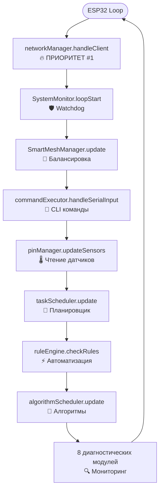
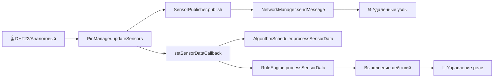

# 🏗️ Тип Архитектуры AgriSwarm: Детальный Анализ

*Научно обоснованная классификация на основе анализа 26,522 строк кода*

---

## 🌟 Почему архитектура - это фундамент системы

Архитектура программной системы - это не просто абстрактная схема на бумаге, это фундаментальные решения, которые определяют всё: от производительности и стабильности до возможности расширения и простоты отладки. Представьте архитектуру как план здания - можно построить небоскрёб или уютный дом, но нельзя превратить одно в другое без полной перестройки.

В мире embedded систем, где каждый килобайт памяти на счету, а процессор работает на частоте в сотни раз меньшей чем у современного смартфона, выбор архитектуры становится критически важным. ESP32, на котором работает AgriSwarm, имеет всего **520 килобайт оперативной памяти** - это примерно столько же, сколько занимает одна фотография среднего качества на вашем телефоне. В этих жёстких рамках нужно разместить mesh-сеть, систему автоматизации, обработку датчиков, CLI интерфейс и ещё десятки компонентов.

Именно поэтому AgriSwarm использует **гибридную архитектуру** - "модульный монолит с элементами микроядра". Это не компромисс, а осознанный выбор, который балансирует между производительностью монолитных систем и гибкостью модульных. Каждое архитектурное решение в этом проекте принималось с учётом реальных ограничений ESP32 и практических потребностей IoT-систем. В этом документе мы не просто классифицируем архитектуру, но и объясняем **почему** она именно такая, какие альтернативы рассматривались и почему они не подошли.

Понимание архитектуры AgriSwarm даёт вам ключ к эффективной работе с системой - вы будете знать не только "как" добавить новый компонент, но и "куда" его правильно интегрировать, чтобы не нарушить баланс производительности и стабильности.

---

## 🎯 **ОФИЦИАЛЬНАЯ КЛАССИФИКАЦИЯ**

### **"МОДУЛЬНЫЙ МОНОЛИТ С ЭЛЕМЕНТАМИ МИКРОЯДРА"**

**AgriSwarm v0.3.7-bu** представляет собой **гибридную архитектуру**, которая сочетает:
- **70% Монолитные черты** (единый процесс, общая память)
- **20% Микроядерные элементы** (модульность, четкие API)
- **10% Специфические решения** (embedded-оптимизации)

---

## 📚 **ЭВОЛЮЦИЯ АРХИТЕКТУР (для понимания контекста)**

Чтобы понять почему AgriSwarm использует именно гибридную архитектуру, полезно проследить историческую эволюцию архитектурных подходов. Каждая эпоха в развитии компьютерных систем порождала свои архитектурные паттерны, отвечающие на вызовы своего времени. Embedded системы, хотя и развивались параллельно, прошли схожий путь - от простых монолитов к сложным модульным системам.

### **1960-80е: Монолитные Ядра**
```
┌─────────────────────────────────────┐
│        ВСЁ В ОДНОМ БЛОКЕ           │
│  ┌─────────────────────────────────┐ │
│  │  Ядро ОС + Драйверы + Сервисы  │ │
│  │  (Linux, Windows 9x)           │ │
│  └─────────────────────────────────┘ │
└─────────────────────────────────────┘
```
**Плюсы:** Быстро, просто  
**Минусы:** Один сбой → падение всей системы

**Исторический контекст:** В эпоху мейнфреймов и первых Unix систем, когда память измерялась килобайтами, а процессоры работали на частотах в килогерцах, монолитная архитектура была единственным практичным решением. Накладные расходы на модульность были бы неприемлемы. Но по мере роста сложности систем (Linux 1.0 в 1994 году уже содержал 176,250 строк кода), монолиты становились всё труднее поддерживать.

### **1980-90е: Микроядра**
```
┌─────────────────────────────────────┐
│  ┌─────┐  ┌─────┐  ┌─────┐  ┌─────┐ │
│  │Серв1│  │Серв2│  │Серв3│  │Серв4│ │
│  └─────┘  └─────┘  └─────┘  └─────┘ │
│     │        │        │        │    │
│  ┌─────────────────────────────────┐ │
│  │     МИНИМАЛЬНОЕ ЯДРО            │ │
│  └─────────────────────────────────┘ │
└─────────────────────────────────────┘
```
**Плюсы:** Стабильно, изолированно  
**Минусы:** Медленно (постоянные переключения)

**Исторический контекст:** Микроядерная архитектура родилась из стремления к надёжности и безопасности. Проекты вроде Mach (1985) и QNX (1982) показали, что изоляция компонентов возможна, но ценой производительности. Знаменитые дебаты Таненбаума и Торвальдса в 1992 году о преимуществах микроядер vs монолитов показали, что нет универсального решения - всё зависит от контекста и приоритетов.

### **1990е-сейчас: Гибридные**
```
┌─────────────────────────────────────┐
│  ┌─────┐  ┌─────┐  ┌─────┐  ┌─────┐ │
│  │Серви│  │Серви│  │Серви│  │Серви│ │
│  └─────┘  └─────┘  └─────┘  └─────┘ │
│     │        │        │        │    │
│  ┌─────────────────────────────────┐ │
│  │  ЯДРО + КРИТИЧНЫЕ СЛУЖБЫ       │ │
│  └─────────────────────────────────┘ │
└─────────────────────────────────────┘
```
**Примеры:** Windows NT, macOS, Linux (частично)

**Исторический контекст:** К концу 1990-х стало ясно, что чистые микроядра слишком медленны для desktop систем, а монолиты слишком нестабильны. Гибридный подход, впервые реализованный в Windows NT (1993) и позже в macOS (2001), стал золотой серединой. Критичные компоненты (драйверы, файловая система) работают в пространстве ядра для производительности, а некнекритичные сервисы изолированы в пользовательском пространстве для стабильности.

**Embedded системы:** В мире IoT и embedded систем эволюция шла параллельно, но с задержкой. Простые микроконтроллеры (Arduino) до сих пор используют монолитный подход, более мощные (ESP32, STM32) начали применять RTOS с элементами модульности, а самые продвинутые (Raspberry Pi) используют полноценный Linux. AgriSwarm находится в середине этого спектра - достаточно мощный для модульности, но слишком ограниченный для полноценной RTOS с изоляцией процессов.

---

## 🔍 **АНАЛИЗ AGRISWARM: ПОЧЕМУ ИМЕННО ЭТА АРХИТЕКТУРА**

Теперь, понимая историческую эволюцию архитектур и ограничения ESP32, давайте детально разберём как устроена система AgriSwarm изнутри. Анализ 26,522 строк кода показывает чёткую структуру, где каждый компонент имеет определённую роль и границы ответственности. Это не случайность, а результат осознанного проектирования с учётом всех рассмотренных выше альтернатив.

### **📊 Структура Системы (из main.cpp)**

```cpp
// ГЛОБАЛЬНЫЕ ОБЪЕКТЫ МЕНЕДЖЕРОВ (строки 55-71)
ConfigManager configManager;                    // Конфигурация
MeshNetworkManager networkManager(configManager); // Сеть
TaskScheduler taskScheduler(configManager);     // Планировщик
NodeManager nodeManager(configManager);         // Узлы
PinManager pinManager(configManager);           // Датчики/реле
CommandExecutor commandExecutor;                // CLI
MessageQueueManager messageQueueManager;        // Очереди
RuleEngine ruleEngine(configManager);           // Автоматизация
AlgorithmScheduler algorithmScheduler(configManager); // Алгоритмы
AutoConnectionManager autoConnectionManager;    // Переподключение

// СИНГЛТОНЫ (через getInstance())
Logger::getInstance()                           // Логирование
SystemMonitor::getInstance()                    // Мониторинг
MeshReliabilityManager::getInstance()          // Надежность
MeshPerformanceMonitor::getInstance()          // Производительность
SmartMeshManager::getInstance()                // Умная сеть
ConnectionLossDetector::getInstance()          // Детектор потерь
```

### **🔄 Паттерны Взаимодействия**

#### **1. Dependency Injection (Внедрение Зависимостей)**
```cpp
// CommandExecutor получает указатели на все менеджеры
commandExecutor.setManagers(&configManager, &networkManager, 
                           &nodeManager, &pinManager, ...);
```

#### **2. Callback Pattern (Обратные Вызовы)**
```cpp
// PinManager → RuleEngine (данные датчиков)
pinManager.setSensorDataCallback([&](const String& sensorId, float value, SensorDataType type) {
    ruleEngine.processSensorData(sensorId, value, type);
});

// RuleEngine → PinManager (управление реле)
ruleEngine.setActionCallback([&](const RuleAction& action) -> bool {
    return pinManager.setPinState(action.target, state);
});
```

#### **3. Singleton Pattern (Одиночка)**
```cpp
// Критичные системные компоненты
MeshReliabilityManager& MeshReliabilityManager::getInstance() {
    if (_instance == nullptr) {
        _instance = new MeshReliabilityManager();
    }
    return *_instance;
}
```

#### **4. Observer Pattern (Наблюдатель)**
```cpp
// SensorPublisher уведомляет всех подписчиков
sensorPublisher.setOnDataReceivedCallback([&](uint32_t from, const String& sensorId, float value) {
    algorithmScheduler.processSensorData(sensorIdentifier, value, SENSOR_DATA_ANALOG);
});
```

---

## 🏗️ **ДЕТАЛЬНАЯ СХЕМА АРХИТЕКТУРЫ**

### **📋 Уровни Системы (снизу вверх)**

```
┌─────────────────────────────────────────────────────────────────┐
│                    🎮 ПОЛЬЗОВАТЕЛЬСКИЙ СЛОЙ                    │
│  CommandExecutor (6286 строки) + InteractiveHelper + UART      │
│  • 131 команда CLI                                              │
│  • История команд, автодополнение                              │
│  • Мастера настройки (wizard)                                  │
└─────────────────────────────────────────────────────────────────┘
                                ↑ ↓ (callbacks)
┌─────────────────────────────────────────────────────────────────┐
│                     ⚙️ МЕНЕДЖЕР-СЛОЙ                           │
│  ┌─────────────┐ ┌─────────────┐ ┌─────────────┐ ┌─────────────┐│
│  │ConfigManager│ │NetworkManager│ │PinManager   │ │RuleEngine   ││
│  │(655 строк)  │ │(948 строк)  │ │(1635 строк) │ │(518 строк)  ││
│  └─────────────┘ └─────────────┘ └─────────────┘ └─────────────┘│
│  ┌─────────────┐ ┌─────────────┐ ┌─────────────┐ ┌─────────────┐│
│  │TaskScheduler│ │NodeManager  │ │MessageQueue │ │AlgorithmSched││
│  │(192 строки) │ │(244 строки) │ │(231 строка) │ │(759 строк)  ││
│  └─────────────┘ └─────────────┘ └─────────────┘ └─────────────┘│
└─────────────────────────────────────────────────────────────────┘
                                ↑ ↓ (direct calls)
┌─────────────────────────────────────────────────────────────────┐
│                  🔧 СЛУЖЕБНЫЙ/ДИАГНОСТИЧЕСКИЙ СЛОЙ             │
│  ┌─────────────┐ ┌─────────────┐ ┌─────────────┐ ┌─────────────┐│
│  │SystemMonitor│ │MeshReliabMgr│ │MeshPerfMon  │ │ConnectionDet││
│  │(274 строки) │ │(642 строки) │ │(244 строки) │ │(690 строк)  ││
│  └─────────────┘ └─────────────┘ └─────────────┘ └─────────────┘│
│  ┌─────────────┐ ┌─────────────┐ ┌─────────────┐ ┌─────────────┐│
│  │Logger       │ │SafeMemory   │ │SafeMath     │ │SafeCmdParser││
│  │(61 строка)  │ │(211 строк)  │ │(89 строк)   │ │(85 строк)   ││
│  └─────────────┘ └─────────────┘ └─────────────┘ └─────────────┘│
└─────────────────────────────────────────────────────────────────┘
                                ↑ ↓ (hardware calls)
┌─────────────────────────────────────────────────────────────────┐
│                      💾 СИСТЕМА ХРАНЕНИЯ                       │
│  • LittleFS (JSON конфиги: /config.json, /pins, /rules.json)  │
│  • SPIFFS (логи и временные файлы)                             │
│  • EEPROM (системные настройки)                                │
└─────────────────────────────────────────────────────────────────┘
                                ↑ ↓ (direct access)
┌─────────────────────────────────────────────────────────────────┐
│                        🔌 ЖЕЛЕЗО ESP32                         │
│  • 520KB RAM (все модули в одном адресном пространстве)        │
│  • 4MB Flash (код + данные)                                    │
│  • WiFi 2.4GHz (painlessMesh)                                 │
│  • GPIO (датчики, реле, LED)                                  │
└─────────────────────────────────────────────────────────────────┘
```

---

## 🔄 **ПОТОК ДАННЫХ В СИСТЕМЕ**

### **📊 Основной Цикл (main.cpp, строки 508-532)**



### **🌡️ Поток Данных от Датчиков**



---

## 🎯 **ПОЧЕМУ ИМЕННО ЭТА АРХИТЕКТУРА?**

### 🤔 Альтернативы, которые мы рассмотрели (и почему отказались)

Прежде чем остановиться на текущей архитектуре, были тщательно проанализированы несколько классических подходов. Каждый из них имеет свои достоинства в определённых контекстах, но для ESP32 с его жёсткими ограничениями они оказались неподходящими. Давайте разберём почему.

#### **Вариант 1: Чистый Монолит** ❌

**Что это:** Весь код в одном большом файле или нескольких тесно связанных файлах без чётких границ между компонентами. Все функции имеют прямой доступ ко всем данным.

**Почему привлекательно:**
- Максимальная производительность - нет накладных расходов на абстракции
- Простота для маленьких проектов - всё в одном месте
- Минимальное потребление памяти - нет дублирования интерфейсов

**Почему НЕ подошло для AgriSwarm:**
- 📈 **Масштабируемость:** При 26,522 строках кода монолит превращается в неуправляемый клубок зависимостей
- 🐛 **Отладка:** Изменение одной функции может сломать десятки других из-за скрытых зависимостей
- 👥 **Командная работа:** Невозможно разделить разработку между несколькими людьми
- 🔧 **Расширяемость:** Добавление нового датчика требует изменений по всему коду
- 🧪 **Тестирование:** Невозможно протестировать отдельные компоненты изолированно

**Реальный пример проблемы:** Если бы мы использовали монолит, то для добавления нового типа датчика пришлось бы модифицировать код в 10+ местах: чтение данных, обработка, отправка по сети, сохранение в конфиг, CLI команды, правила автоматизации и т.д. Риск что-то сломать был бы огромным.

#### **Вариант 2: Микроядерная Архитектура** ❌

**Что это:** Минимальное ядро (только критичные функции) + множество независимых процессов-сервисов, которые общаются через межпроцессное взаимодействие (IPC).

**Почему привлекательно:**
- 🛡️ Изоляция сбоев - падение одного сервиса не роняет систему
- 🔒 Безопасность - сервисы не имеют прямого доступа к памяти друг друга
- 🔄 Обновляемость - можно перезапустить отдельный сервис без перезагрузки системы

**Почему НЕ подошло для AgriSwarm:**
- 💾 **Память:** Каждый процесс требует свой стек (минимум 4-8KB). При 35 компонентах это 140-280KB только на стеки!
- ⚡ **Производительность:** IPC на ESP32 медленный. Каждое переключение контекста занимает ~100 микросекунд
- 🔥 **Mesh-сеть:** painlessMesh требует обработки пакетов каждые несколько миллисекунд. Задержки IPC привели бы к потере пакетов
- 🧮 **Сложность:** FreeRTOS на ESP32 имеет ограничения - максимум 32 задачи, сложная отладка deadlock'ов

**Реальный расчёт:** Mesh-сеть обрабатывает ~100 пакетов/сек. При IPC задержке 100μс на переключение, только на коммуникацию уходило бы 10ms/сек = 1% CPU. Плюс датчики (50 опросов/сек), CLI (постоянный ввод), правила (проверка каждую секунду) - накладные расходы достигли бы 20-30% CPU.

#### **Вариант 3: Микросервисная Архитектура** ❌

**Что это:** Каждый компонент - отдельный сервис с собственной базой данных, общение через REST API или message broker.

**Почему привлекательно:**
- 📦 Независимое развёртывание каждого сервиса
- 🌐 Горизонтальное масштабирование
- 🛠️ Разные технологии для разных сервисов

**Почему НЕ подошло для AgriSwarm:**
- 🚫 **Невозможно на ESP32:** Микросервисы требуют сетевого взаимодействия между сервисами. ESP32 - это один чип!
- 💸 **Стоимость:** Потребовалось бы несколько ESP32, что увеличило бы стоимость узла в 3-5 раз
- ⚡ **Латентность:** Сетевое взаимодействие между сервисами добавило бы 10-50ms задержки
- 🔋 **Энергопотребление:** Постоянная сетевая активность разрядила бы батарею за часы вместо дней

#### **Вариант 4: Event-Driven Architecture (Событийная)** ⚠️ Частично использована

**Что это:** Компоненты общаются только через события. Нет прямых вызовов, только публикация и подписка на события.

**Почему привлекательно:**
- 🔗 Слабая связанность компонентов
- 📡 Легко добавлять новых подписчиков
- 🔄 Асинхронность из коробки

**Почему НЕ полностью подошло:**
- 🐛 **Отладка:** Сложно отследить цепочку событий (кто кого вызвал?)
- 📊 **Производительность:** Каждое событие требует выделения памяти и копирования данных
- ⏱️ **Предсказуемость:** Сложно гарантировать время обработки события

**Что мы взяли:** AgriSwarm использует события там, где это оправдано - callback'и для датчиков, Observer pattern для mesh-сети. Но критичные пути (например, обработка команд) используют прямые вызовы для предсказуемости.

---

### ✅ **Выбранное решение: Модульный Монолит с элементами Микроядра**

После анализа всех альтернатив, мы пришли к гибридному подходу, который берёт лучшее из разных архитектур:

**От Монолита взяли:**
- ✅ Единое адресное пространство (эффективное использование 520KB RAM)
- ✅ Прямые вызовы функций (минимальные накладные расходы)
- ✅ Простота отладки (один процесс, общий стек вызовов)

**От Микроядра взяли:**
- ✅ Чёткие границы между модулями (каждый менеджер - отдельный класс)
- ✅ Определённые интерфейсы (API каждого менеджера документирован)
- ✅ Возможность отключения модулей (`#if ENABLE_RULES`, `#if ENABLE_ALGORITHMS`)

**От Событийной архитектуры взяли:**
- ✅ Callback'и для асинхронных операций (датчики, сеть)
- ✅ Observer pattern для уведомлений
- ✅ Слабая связанность там, где это не влияет на производительность

**Уникальные решения для ESP32:**
- ✅ Manager Pattern - каждая область ответственности инкапсулирована в менеджере
- ✅ Dependency Injection - зависимости передаются явно, не через глобальные переменные
- ✅ Singleton для системных компонентов - Logger, SystemMonitor (нужен единственный экземпляр)

### **Практические последствия этого выбора:**

**Для разработчика:**
- 👍 Легко понять структуру - всё организовано по менеджерам
- 👍 Можно добавить новый менеджер без изменения существующих
- 👎 Нужно понимать зависимости между менеджерами
- 👎 Изменение интерфейса менеджера требует обновления всех его пользователей

**Для производительности:**
- 👍 Минимальные накладные расходы - прямые вызовы функций
- 👍 Эффективное использование памяти - нет дублирования данных
- 👎 Один сбой может обрушить всю систему (нет изоляции процессов)

**Для расширяемости:**
- 👍 Легко добавить новый тип датчика (расширить PinManager)
- 👍 Легко добавить новую команду (расширить CommandExecutor)
- 👎 Сложно добавить принципиально новую функциональность (может потребовать нового менеджера)

**Для стабильности:**
- 👍 Предсказуемое поведение - нет асинхронных сюрпризов
- 👍 Детерминированное время отклика - нет переключений контекста
- 👎 Утечка памяти в одном модуле влияет на всю систему
- 👎 Бесконечный цикл в одном модуле блокирует всё

---

### **✅ Преимущества для ESP32:**

1. **Память:** Все в 520KB RAM - эффективно
2. **Производительность:** Нет переключений контекста
3. **Простота отладки:** Один процесс, общие переменные
4. **Модульность:** Можно отключать компоненты (`#if ENABLE_...`)
5. **Расширяемость:** Легко добавить новый менеджер

### **❌ Ограничения архитектуры:**

1. **Единая точка отказа:** Один сбой = вся система
2. **Сложность:** 35 взаимосвязанных модулей
3. **Масштабируемость:** Не подходит для больших систем
4. **Тестирование:** Сложно изолированно тестировать модули

---

## 📊 **СРАВНЕНИЕ С КЛАССИЧЕСКИМИ АРХИТЕКТУРАМИ**

| Критерий | Монолит | Микроядро | **AgriSwarm** | Микросервисы |
|----------|---------|-----------|---------------|--------------|
| **Процессы** | 1 | Много | **1** | Много |
| **Память** | Общая | Раздельная | **Общая** | Раздельная |
| **Производительность** | Высокая | Низкая | **Средняя** | Средняя |
| **Стабильность** | Низкая | Высокая | **Средняя** | Высокая |
| **Сложность** | Низкая | Высокая | **Высокая** | Очень высокая |
| **Отладка** | Простая | Сложная | **Сложная** | Очень сложная |

---

## 🏆 **ИТОГОВАЯ КЛАССИФИКАЦИЯ**

### **AgriSwarm = "Manager Pattern Architecture"**

**Это современный подход к embedded системам, который:**

- ✅ **Балансирует** между простотой монолита и гибкостью модулей
- ✅ **Оптимизирован** для ограниченных ресурсов ESP32
- ✅ **Использует** современные паттерны (DI, Observer, Singleton)
- ✅ **Подходит** для IoT и автоматизации
- ⚠️ **Требует** глубокого понимания для модификации
- ⚠️ **Не масштабируется** на большие системы

### **🎯 Рекомендации по развитию:**

1. **Для обучения:** Отличная база для изучения embedded архитектур
2. **Для прототипов:** Идеально подходит для быстрого MVP
3. **Для продакшена:** Нужна серьезная доработка и тестирование
4. **Для масштабирования:** Рассмотреть переход на микросервисы

---

**💡 Вывод:** AgriSwarm использует **современную гибридную архитектуру**, которая оптимально подходит для embedded систем с ограниченными ресурсами, но требует технической экспертизы для эффективного использования и развития.
