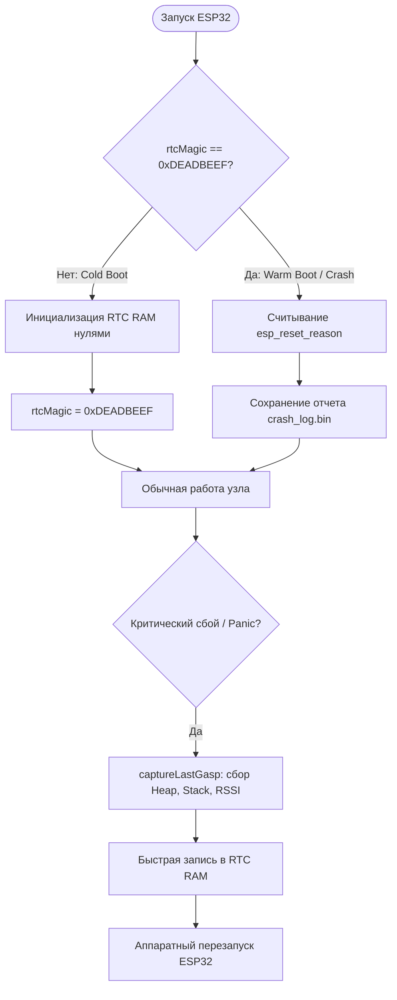

  <a href="./README.md">&#9664; Назад к списку модулей</a> | 
  <a href="../README.md">&#127968; Главная</a>

---

# &#128230; Модуль BlackBoxManager (src/BlackBoxManager.cpp)

## 1. Обзор модуля и его роль в системе
`BlackBoxManager` — это «Бортовой самописец», важнейшая подсистема форензики (Post-Mortem диагностики) в AgriSwarm. В реальных полевых условиях ESP32 часто перезагружаются из-за помех питания (Brownout), падений ядра (Panic) или срабатывания сторожевого таймера (WDT). Без самописца разработчик видит лишь то, что узел перезагрузился, не зная почему.

**Основная роль:**
*   Непрерывная запись критических телеметрических данных и логов (до 50 записей) в **RTC-память** (участок памяти, который сохраняет питание при программном сбросе).
*   Мгновенный дамп состояния системы (`captureLastGasp`) за миллисекунды до того, как микроконтроллер физически перезагрузится.
*   Сохранение накопленных логов в энергонезависимую Flash-память (`LittleFS`) с использованием механизма Wear-Leveling (ротация секторов), чтобы не «сжечь» Flash частыми записями (Гибридный режим).

## 2. Анализ структур данных и RTC-памяти
Модуль использует атрибут `RTC_NOINIT_ATTR`. Это указывает компилятору и загрузчику (bootloader), что эти переменные **нельзя очищать (занулять)** при запуске:
* **Переменные RTC RAM**:
  * `rtcMagic` — проверочная сигнатура (`uint32_t`) для определения холодного/горячего старта.
  * `rtcResetReason` — аппаратная причина перезапуска процессора (`esp_reset_reason_t`).
  * Кольцевой буфер сообщений (максимум `BLACKBOX_MAX_RTC_ENTRIES = 50` записей).

**Структура `BlackBoxEntry` (реальные поля):**

Запись является сжатым снимком контекста системы. Включает:

| Группа | Поля |
| :--- | :--- |
| Идентификация | `sequence` (uint32), `timestamp` (uint32), `level` (uint8), `errorCode` (uint8) |
| Флаги событий | `flags` (uint16) — битовая маска умных триггеров |
| Базовая память | `freeHeap` (uint32), `minFreeHeap` (uint32) |
| Строки | `source[24]` (компонент), `message[64]` (сообщение) |
| Расширенный контекст | `cpuFreq`, `heapSize`, `maxAllocHeap`, `wifiRSSI`, `meshConnections`, `taskCount`, `loopTime`, `cpuTemp`, `stackHighWater`, `dramFree`, `iramFree` |
| Резерв | `reserved[14]` |

> **Примечание:** Поле `message` имеет размер **64 байта** (не 32). Это было исправлено в коде, все ссылки на устаревший размер 32 байта неактуальны.

**Битовые флаги умных триггеров (`flags`):**

| Флаг | Бит | Условие |
| :--- | :--- | :--- |
| `BB_FLAG_HEAP_LOW` | 0x0001 | Свободная heap < 10 KB |
| `BB_FLAG_WIFI_WEAK` | 0x0002 | RSSI < -70 dBm |
| `BB_FLAG_MESH_LOST` | 0x0004 | 0 узлов в mesh |
| `BB_FLAG_LOOP_SLOW` | 0x0008 | Время loop > 100 мс |
| `BB_FLAG_WATCHDOG_ARMED` | 0x0010 | Watchdog был активен |
| `BB_FLAG_BROWNOUT_WARN` | 0x0020 | Напряжение < 3.0V |
| `BB_FLAG_TASK_STACK_LOW` | 0x0040 | Стек < 20% |
| `BB_FLAG_RESTART_PENDING` | 0x0080 | Планируется рестарт |

## 3. Построчный анализ логики (Deep Dive)

### 3.1. Инициализация и проверка целостности (`_initRTC`)
При загрузке (когда устройство включают в розетку), память заполнена мусором.
*   Модуль проверяет `rtcMagic == BLACKBOX_MAGIC (0xDEADBEEF)`.
*   Если не равно — это холодный старт (Cold Boot), вся структура инициализируется нулями.
*   Если равно — это горячий сброс (Warm Boot). Модуль восстанавливает количество крашей (`rtcTotalCrashes`), предыдущее время работы и извлекает причину сброса через `esp_reset_reason()`.

### 3.2. Last Gasp (Последний вздох)
Когда ядро ESP32 ловит Fatal Error, вызывается зарегистрированный через `esp_register_shutdown_handler` метод.
*   Функция `captureLastGasp()` мгновенно блокирует прерывания, собирает текущее состояние кучи, стека и заносит в RTC с уровнем `PANIC`.
*   Вместо использования `delay()` (запрещен в panic-контексте), используется `yield()` цикл на 50 мс для синхронизации кэшей флеш-памяти.
*   `captureLastGasp` доступна как **публичная глобальная функция** (вне класса) для вызова из других модулей при обнаружении критических условий.

### 3.3. Умные триггеры (Smart Triggers)
В `update()` раз в 5 секунд вызывается `_checkSmartTriggers()`.
*   Если `freeHeap` падает ниже 10 КБ, или `wifiRSSI` ниже -70dBm, или цикл `loop` длился больше 100 мс — модуль **автоматически** генерирует WARN-запись в RTC. Пороги настраиваемы через `BlackBoxConfig`.
*   Это помогает отследить деградацию системы *до* того, как произойдет сбой.

### 3.4. Гибридный режим и Wear-Leveling
По умолчанию Flash-память выдерживает около 100 000 циклов записи. Если писать в неё каждую минуту, она сгорит за 2-3 месяца.
*   Решение: Модуль пишет логи только в RTC RAM (которая не изнашивается).
*   В **Гибридном режиме** (`BB_MODE_HYBRID`), раз в час, содержимое RTC дампится в файл на диске (`events_X.bin`).
*   Переменная `_currentFlashSector` крутится от 0 до 3. Файлы ротируются: `events_0.bin`, `events_1.bin` и т.д. Это классический **Wear-Leveling**, который в 4 раза продлевает жизнь конкретного сектора Flash. Метод `calculateLifespan()` высчитывает примерный срок жизни памяти в годах и выводит в консоль.

### 3.5. Настройки и конфигурация (`BlackBoxConfig`)
Поведение модуля гибко настраивается:
*   Режим работы: `BB_MODE_RTC_ONLY` (без износа), `BB_MODE_HYBRID` (рекомендуется), `BB_MODE_FLASH_ONLY` (не рекомендуется).
*   Пороги автозахвата: `heapLowThreshold`, `wifiWeakThreshold` (дBm), `loopSlowThreshold` (мс).
*   Флаги захвата: `captureWarnings`, `captureErrors`, `captureHeapLow`, `captureWiFiWeak`, `captureLoopSlow`.
*   Настройки хранятся в NVS (Non-Volatile Storage) через `Preferences`.

## 4. OOM-Safe Экспорт (Zero-Alloc Streaming)
В прошивке v4.0.4.2 модуль получил обновление механизма экспорта `exportToJson()`. 
Ранее генерация JSON-отчета для 50 записей требовала гигантского буфера `DynamicJsonDocument` в оперативной памяти (более 16 КБ), что часто приводило к вторичному сбою (Out-Of-Memory) прямо в момент попытки прочитать логи падения.
Теперь формирование файла отчета происходит методом **потоковой конкатенации**:
* ОЗУ не используется для построения всего отчета.
* Каждая запись (128 байт) форматируется в локальную `String` или `char[]` и немедленно сбрасывается в файловую систему (`file.print()`).
* Это гарантирует, что даже на системе с 5 КБ свободной памяти можно безопасно сгенерировать и выгрузить мегабайтный краш-лог.

## 5. Вывод
`BlackBoxManager` — это сложнейший и наиболее «железно-зависимый» модуль в системе. Использование `RTC_NOINIT_ATTR` совместно с shutdown-обработчиком дает разработчику инструменты отладки уровня коммерческих авиационных систем. Разделение памяти на неизнашиваемую (RTC) для быстрых логов и Flash для долгосрочного бэкапа (Гибридный режим) решает главную проблему встраиваемых регистраторов: как сохранить всё, не уничтожив флеш-накопитель.

---

  <a href="./README.md">&#9664; Назад к списку модулей</a> | 
  <a href="../README.md">&#127968; Главная</a>

