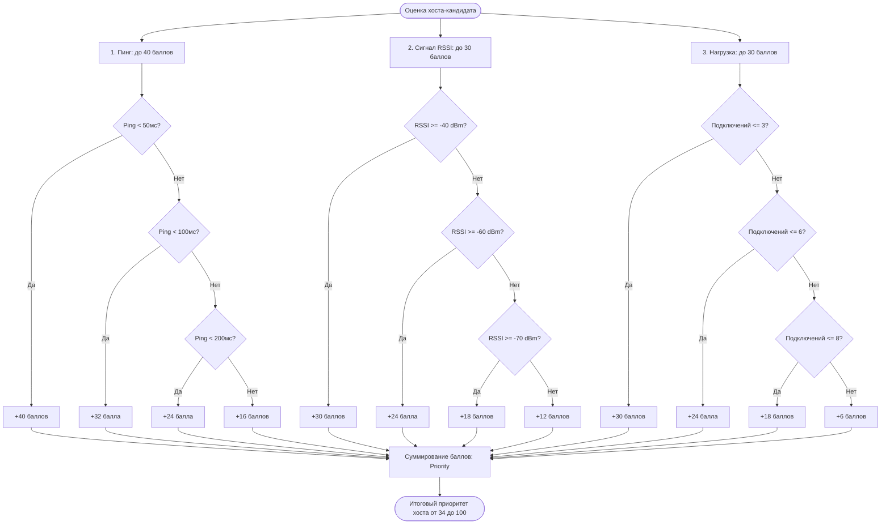

  <a href="./README.md">◀ Назад к списку модулей</a> | 
  <a href="../README.md">🏠 Главная</a>

---

# 🧠 Модуль SmartMeshManager (src/SmartMeshManager.cpp)

## 1. Обзор модуля и его роль в системе
`SmartMeshManager` — это подсистема логической оркестрации топологии Mesh-сети. Если `AgriNetworkManager` отвечает за пересылку байтов и поддержание Wi-Fi соединения, то `SmartMeshManager` отвечает за интеллектуальный алгоритм формирования связей (графа сети), балансировку нагрузки и автоматическое восстановление при обрывах.

**Основная роль:**
*   Мониторинг качества связей (Quality of Service - QoS).
*   Формирование списка "Backup-хостов" для каждого узла.
*   Реализация алгоритма "Умного поиска" (Smart Search) альтернативных путей при потере соседнего узла.
*   Адаптация параметров сети (таймаутов, мощности) к погодным условиям, физическому расстоянию и загрузке (Load Balancing).

## 2. Зависимости (Include Graph)
Класс тесно интегрирован с диагностическими и сетевыми модулями:
*   `NetworkManager` / `ConnectionLossDetector` — для получения триггеров о разрывах связей (`onConnectionLost`).
*   `MeshStatisticsManager` — для получения исторических данных о качестве сигнала (RSSI).
*   `PingManager` — для получения данных о задержках (RTT) в миллисекундах.
*   `LittleFS` и `ArduinoJson` — для сохранения/загрузки конфигурации (`/smart_mesh.json`).

## 3. Анализ структур данных (Memory Efficiency)
В соответствии с философией "Zero-Allocation", данные в модуле предельно сжаты:
*   `BackupHostInfo` (10 байт): Хранит Node ID, RSSI, Ping, нагрузку и рассчитанный "приоритет" для потенциального родительского узла. Вектор ограничен 5 элементами (максимум 50 байт в оперативной памяти).
*   `SmartMeshConfig` (18 байт): Конфигурационный блок без строк. Используются `uint8_t` для флагов (`backupMode`, `reconnectMode`, `weatherMode`) и таймаутов.
*   `SearchStats` (14 байт): Статистика успешных и неудачных попыток перестроения сети.

## 4. Построчный анализ логики и интерфейсов

### 4.1. Алгоритм Умного Поиска (`_performSearch` и `startSmartSearch`)
Алгоритм включается, когда узел теряет связь с сетью или своим родителем (parent node).
1.  **Экспоненциальная задержка:** При неудачных попытках поиска система увеличивает интервал между следующими попытками (от 15 до 120 секунд). Это предотвращает засорение эфира бесполезными запросами (Beacon Storm) и снижает энергопотребление. *Исключение:* в первые 60 секунд после включения работает режим "Быстрого старта" с попытками каждые 3 секунды.
2.  **Сбор кандидатов:** Метод `_getAvailableHosts` собирает список видимых узлов.
3.  **Оценка качества (Scoring):** Метод `_calculateHostPriority` выставляет баллы:
    *   *Ping (Задержка):* 40% веса. Предпочтение отдается узлам с откликом < 50мс.
    *   *RSSI (Уровень сигнала):* 30% веса. Отсекаются узлы с RSSI ниже порога (обычно -65 dBm).
    *   *Load (Нагрузка):* 30% веса. Не выбирается узел, у которого уже много "детей".
4.  **Подключение:** Узел с максимальным Priority становится основным вектором для переподключения, остальные сохраняются как Backup-хосты.

### 4.2. Механизм Backup-хостов (`updateBackupHosts`)
Метод вызывается асинхронно раз в 15 секунд (`BACKUP_UPDATE_INTERVAL`). 
Узел всегда хранит "запасной аэродром" — список из 3-5 альтернативных узлов, к которым он может подключиться мгновенно в случае падения основного канала связи, не тратя время на фазу сканирования сети. 

### 4.3. Балансировка нагрузки (Load Balancing)
Метод `shouldRebalanceHost` анализирует количество подключений к одному узлу. Если оно превышает лимит (по умолчанию 15), `SmartMeshManager` может инициировать команду `requestLoadRebalancing`, заставив часть "детей" переключиться на Backup-хосты, чтобы не допустить перегрузки процессора родительского узла.

### 4.4. Адаптивные режимы
Конфигурация предусматривает флаги `fieldMode`, `distanceMode` и `weatherMode`. 
*Смысл:* Дождь или густая листва (кукуруза/пшеница) сильно гасят сигнал 2.4 ГГц. Логика (на этапе заглушек `_adaptToWeather`) может автоматически менять порог `_config.rssiThreshold`, разрешая узлам цепляться к более слабому сигналу, если идет дождь, так как идеального сигнала получить физически невозможно.

## 5. Выводы
Модуль `SmartMeshManager` реализует алгоритм Mesh-рутинга прикладного уровня, аналогичный протоколам OSPF/B.A.T.M.A.N., но адаптированный под жесткие ограничения ESP32. Оценка пути происходит не только по "палочкам Wi-Fi" (RSSI), но и по реальной задержке передачи данных (Ping) и загрузке процессора соседа (Load), что исключает формирование "бутылочных горлышек" в сети. Экспоненциальные таймауты эффективно берегут эфир при массовых авариях (отключении питания в целом секторе).

---

  <a href="./README.md">◀ Назад к списку модулей</a> | 
  <a href="../README.md">🏠 Главная</a>

