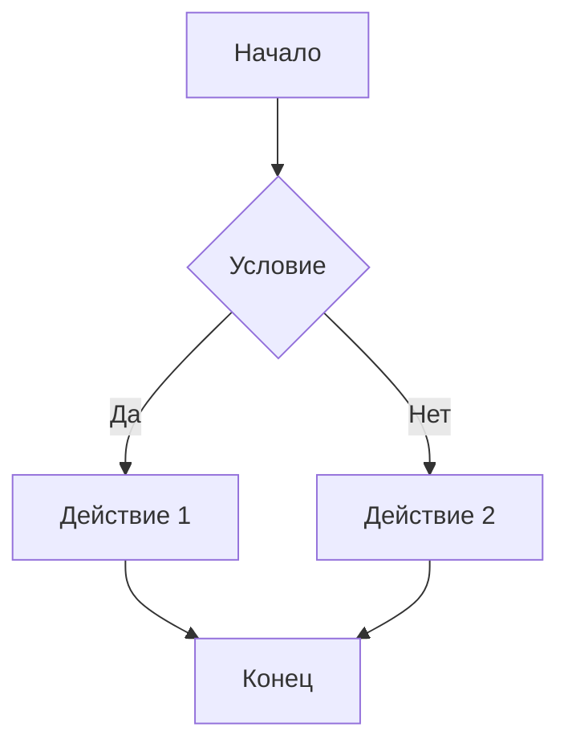

# Руководство по валидации элементов Markdown для GitHub

Этот документ содержит чек-листы и примеры для проверки корректности различных элементов markdown в документации AgriSwarm.

---

## 🎯 Цель

Убедиться, что все элементы markdown корректно отображаются на GitHub и соответствуют требованиям проекта.

---

## 📋 Общий чек-лист проверки

### Для каждого документа проверьте:

#### 1. Структура документа
- [ ] Есть заголовок H1 (один на документ)
- [ ] Заголовки имеют правильную иерархию (H1 → H2 → H3)
- [ ] Нет пропусков уровней заголовков
- [ ] Заголовки информативны и понятны

#### 2. Таблицы
- [ ] Таблицы имеют заголовки
- [ ] Разделители столбцов правильно оформлены (`|---|---|`)
- [ ] Все строки имеют одинаковое количество столбцов
- [ ] Содержимое ячеек читаемо
- [ ] Таблица не слишком широкая (не более 5-6 столбцов)

#### 3. Ссылки и навигация
- [ ] Все внутренние ссылки используют правильный формат
- [ ] Якоря соответствуют заголовкам (lowercase, дефисы вместо пробелов)
- [ ] Внешние ссылки имеют протокол (https://)
- [ ] Ссылки на файлы используют относительные пути
- [ ] Кнопки-гиперссылки оформлены единообразно

#### 4. Блоки кода
- [ ] Указан язык для подсветки синтаксиса
- [ ] Код правильно отформатирован
- [ ] Нет лишних пробелов в начале/конце
- [ ] Длинные строки не выходят за границы

#### 5. Списки
- [ ] Маркированные списки используют `-` или `*`
- [ ] Нумерованные списки начинаются с `1.`
- [ ] Вложенные списки имеют правильные отступы (2 или 4 пробела)
- [ ] Чек-боксы оформлены как `- [ ]` или `- [x]`

#### 6. Визуальные элементы
- [ ] Эмодзи отображаются корректно
- [ ] Badge элементы (если есть) работают
- [ ] Изображения (если есть) загружаются
- [ ] Горизонтальные линии (`---`) отображаются

#### 7. Специальные блоки
- [ ] Цитаты (`>`) отображаются корректно
- [ ] Блоки предупреждений оформлены единообразно
- [ ] Сноски (если есть) работают

---

## 🔍 Детальные проверки по типам элементов

### Таблицы

#### Правильное оформление:
```markdown
| Заголовок 1 | Заголовок 2 | Заголовок 3 |
|-------------|-------------|-------------|
| Ячейка 1    | Ячейка 2    | Ячейка 3    |
| Ячейка 4    | Ячейка 5    | Ячейка 6    |
```

#### Проверьте:
- [ ] Вертикальные линии выровнены (для читаемости в исходном коде)
- [ ] Разделитель содержит минимум 3 дефиса между `|`
- [ ] Нет пустых ячеек (используйте `-` или `—` для пустых значений)
- [ ] Специальные символы экранированы при необходимости

#### Выравнивание в таблицах:
```markdown
| Левое | Центр | Правое |
|:------|:-----:|-------:|
| Текст | Текст | Текст  |
```

---

### Кнопки-гиперссылки

#### Стандартный формат для проекта:
```markdown
[📖 **Название раздела**](путь/к/файлу.md)
```

#### Проверьте:
- [ ] Используется эмодзи для визуальной идентификации
- [ ] Текст ссылки выделен жирным (`**текст**`)
- [ ] Путь корректен и относителен
- [ ] Ссылки группируются логически

#### Примеры кнопок по категориям:
```markdown
[📚 **Документация**](docs/README.md)
[🚀 **Быстрый старт**](быстрый_старт/НАЧАЛО_РАБОТЫ.md)
[🔧 **Инструкции**](инструкции/README.md)
[💡 **Примеры**](примеры/УМНЫЙ_ДОМ.md)
[❓ **FAQ**](справочники/FAQ.md)
```

---

### Mermaid диаграммы

#### Правильное оформление:
````markdown

````

#### Проверьте:
- [ ] Блок начинается с ` ```mermaid `
- [ ] Синтаксис диаграммы корректен
- [ ] Диаграмма рендерится на GitHub
- [ ] Текст в узлах читаем
- [ ] Стрелки и связи логичны

#### Типы диаграмм:
- `graph TD` - граф сверху вниз
- `graph LR` - граф слева направо
- `sequenceDiagram` - диаграмма последовательности
- `classDiagram` - диаграмма классов
- `stateDiagram-v2` - диаграмма состояний

---

### ASCII схемы

#### Правильное оформление:
````markdown
```
┌─────────────┐
│   Компонент │
│             │
└──────┬──────┘
       │
       ▼
┌─────────────┐
│   Модуль    │
└─────────────┘
```
````

#### Проверьте:
- [ ] Схема в блоке кода (без указания языка)
- [ ] Используются Unicode символы для рамок
- [ ] Выравнивание сохраняется
- [ ] Схема читаема на разных размерах экрана

#### Рекомендуемые символы:
```
Рамки: ┌ ┐ └ ┘ ─ │ ├ ┤ ┬ ┴ ┼
Стрелки: → ← ↑ ↓ ↔ ⇒ ⇐ ⇔
Маркеры: ▶ ▼ ◀ ▲ ● ○ ■ □
```

---

### Блоки кода

#### С указанием языка:
````markdown
```python
def hello_world():
    print("Hello, AgriSwarm!")
```
````

#### Проверьте:
- [ ] Язык указан правильно (python, javascript, bash, json, yaml и т.д.)
- [ ] Код правильно отформатирован
- [ ] Отступы корректны
- [ ] Нет лишних пустых строк

#### Поддерживаемые языки:
- `python` - Python код
- `cpp` или `c++` - C++ код
- `bash` или `shell` - Shell команды
- `json` - JSON данные
- `yaml` - YAML конфигурация
- `markdown` - Markdown примеры
- `plaintext` - Обычный текст без подсветки

---

### Списки

#### Маркированные списки:
```markdown
- Элемент 1
- Элемент 2
  - Подэлемент 2.1
  - Подэлемент 2.2
- Элемент 3
```

#### Нумерованные списки:
```markdown
1. Первый шаг
2. Второй шаг
   1. Подшаг 2.1
   2. Подшаг 2.2
3. Третий шаг
```

#### Чек-листы:
```markdown
- [ ] Задача не выполнена
- [x] Задача выполнена
- [ ] Ещё одна задача
```

#### Проверьте:
- [ ] Отступы для вложенных элементов (2 пробела)
- [ ] Пустая строка перед и после списка
- [ ] Единообразие маркеров (`-` или `*`, но не оба)
- [ ] Правильный формат чек-боксов

---

### Визуальные маркеры

#### Рекомендуемые эмодзи для проекта:

**Статусы:**
- ✅ Выполнено, работает
- ❌ Не работает, ошибка
- ⚠️ Предупреждение, внимание
- 🚧 В разработке
- 🔄 В процессе

**Категории:**
- 📚 Документация
- 🚀 Быстрый старт
- 🔧 Инструкции, настройка
- 💡 Примеры, идеи
- ❓ Вопросы, FAQ
- 🐛 Отладка, проблемы
- 📊 Данные, статистика
- 🎯 Цели, задачи
- 🔍 Поиск, исследование
- 💻 Код, разработка

**Действия:**
- ▶️ Запуск, старт
- ⏸️ Пауза
- ⏹️ Остановка
- 🔄 Обновление
- 📥 Загрузка
- 📤 Выгрузка

#### Проверьте:
- [ ] Эмодзи отображаются на GitHub
- [ ] Используются единообразно по всей документации
- [ ] Не перегружают текст
- [ ] Имеют смысловую нагрузку

---

### Внутренние ссылки и якоря

#### Ссылка на заголовок в том же документе:
```markdown
[Перейти к разделу](#название-раздела)
```

#### Ссылка на заголовок в другом документе:
```markdown
[Перейти к разделу](путь/к/файлу.md#название-раздела)
```

#### Правила формирования якорей:
1. Все буквы в нижнем регистре
2. Пробелы заменяются на дефисы
3. Удаляются специальные символы (кроме дефисов)
4. Кириллица поддерживается GitHub

#### Примеры:
```markdown
## Быстрый старт
Якорь: #быстрый-старт

## Установка и настройка
Якорь: #установка-и-настройка

## FAQ (Часто задаваемые вопросы)
Якорь: #faq-часто-задаваемые-вопросы
```

#### Проверьте:
- [ ] Якоря соответствуют заголовкам
- [ ] Ссылки работают при клике
- [ ] Нет битых якорей
- [ ] Относительные пути корректны

---

### Блоки предупреждений и заметок

#### GitHub поддерживает специальные блоки:

```markdown
> **Note**
> Это заметка с полезной информацией.

> **Warning**
> Это предупреждение о потенциальной проблеме.

> **Important**
> Это важная информация, которую нельзя пропустить.
```

#### Альтернативный формат с эмодзи:
```markdown
> ⚠️ **Внимание:** Это важное предупреждение.

> 💡 **Совет:** Полезная рекомендация.

> ❌ **Ошибка:** Описание проблемы.
```

#### Проверьте:
- [ ] Блоки выделяются визуально
- [ ] Используется единый стиль
- [ ] Текст читаем
- [ ] Эмодзи отображаются

---

## 🧪 Тестирование на GitHub

### Локальная проверка перед коммитом:

1. **Проверьте синтаксис:**
   - Используйте markdown linter (например, markdownlint)
   - Проверьте в редакторе с preview (VS Code, Typora)

2. **Проверьте ссылки:**
   - Убедитесь, что все файлы существуют
   - Проверьте относительные пути
   - Проверьте якоря

3. **Проверьте таблицы:**
   - Убедитесь в правильном количестве столбцов
   - Проверьте выравнивание

### Проверка на GitHub:

1. **Создайте тестовую ветку:**
   ```bash
   git checkout -b test-markdown-rendering
   ```

2. **Закоммитьте изменения:**
   ```bash
   git add .
   git commit -m "Test: проверка рендеринга markdown"
   git push origin test-markdown-rendering
   ```

3. **Проверьте на GitHub:**
   - Откройте файлы в веб-интерфейсе
   - Проверьте все элементы
   - Проверьте на мобильном устройстве

4. **Если всё ОК:**
   ```bash
   git checkout main
   git merge test-markdown-rendering
   git push origin main
   ```

---

## 📊 Чек-лист финальной проверки

### Перед публикацией убедитесь:

- [ ] Все заголовки имеют правильную иерархию
- [ ] Все таблицы корректно отформатированы
- [ ] Все ссылки работают (внутренние и внешние)
- [ ] Все якоря соответствуют заголовкам
- [ ] Все блоки кода имеют указание языка
- [ ] Все Mermaid диаграммы рендерятся
- [ ] Все ASCII схемы сохраняют форматирование
- [ ] Все эмодзи отображаются
- [ ] Все списки правильно отформатированы
- [ ] Все блоки предупреждений выделяются
- [ ] Документ читаем на мобильных устройствах
- [ ] Нет орфографических ошибок
- [ ] Терминология согласована с ГЛОССАРИЙ.md

---

## 🔧 Инструменты для проверки

### Рекомендуемые инструменты:

1. **markdownlint** - проверка синтаксиса
2. **markdown-link-check** - проверка ссылок
3. **VS Code** с расширениями:
   - Markdown All in One
   - Markdown Preview Enhanced
   - markdownlint
4. **Typora** - WYSIWYG редактор markdown
5. **GitHub Preview** - встроенный preview на GitHub

---

## 📝 Общие рекомендации

1. **Простота:** Используйте простой и понятный markdown
2. **Единообразие:** Следуйте единому стилю во всех документах
3. **Читаемость:** Пишите для людей, а не для парсеров
4. **Доступность:** Учитывайте мобильные устройства
5. **Тестирование:** Всегда проверяйте на GitHub перед финальным коммитом

---

**Примечание:** Этот документ является руководством для проверки. Используйте его как чек-лист при проверке каждого документа проекта.
