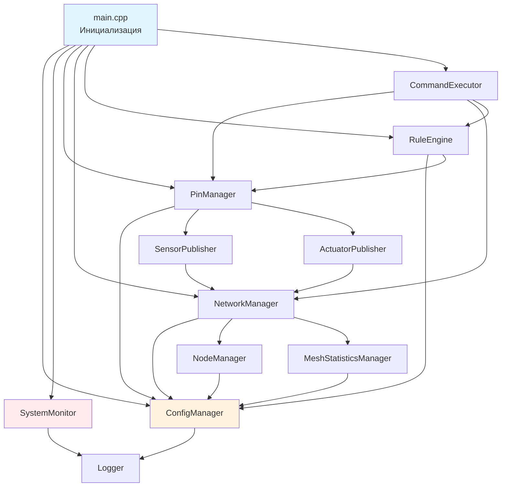

# 🧩 AgriSwarm: Что Внутри Системы

*Реалистичное описание 35 компонентов "Модульного Монолита с Элементами Микроядра"*

## 📊 Честный Обзор Компонентов

Система состоит из **35 файлов .cpp/.h**, многие из которых нужны **для борьбы с проблемами**, а не для основного функционала:

### 🔍 Категоризация По Назначению

| Группа | Кол-во | Назначение | Честная оценка |
|--------|---------|-----------|---------------|
| **⚡ Основной функционал** | 8 | То что реально нужно пользователю | CommandExecutor, PinManager, NetworkManager, RuleEngine |
| **🚨 Борьба с проблемами** | 8 | Мониторинг, восстановление, диагностика | 17% всего кода |  
| **📊 Статистика** | 6 | Сбор метрик и аналитика | Слишком много для простой системы |
| **🛡️ Безопасность** | 4 | Защита от ошибок | Простые обёртки, не волшебство |
| **🔧 Вспомогательные** | 5 | Утилиты и хелперы | Нормально |

```mermaid
graph TD
    subgraph "⚡ ОСНОВНОЕ (Что Нужно Пользователю)"
        CMD[CommandExecutor - 6286 строки<br/>CLI интерфейс<br/>⚠️ Большой, сложный]
        PIN[PinManager - 1635 строк<br/>Управление GPIO<br/>⚠️ Много кода для DHT]
        NET[NetworkManager - 948 строк<br/>Mesh сеть<br/>⚠️ Полон fallback'ов]
        RULE[RuleEngine - 518 строк<br/>IF-THEN логика<br/>✅ Простой, работает]
    end
    
    subgraph "🚨 ПРОБЛЕМНЫЕ ЗОНЫ (17% кода)"
        STATS[MeshStatisticsManager - 1052 строки<br/>❓ Зачем столько для статистики?]
        CONN_LOSS[ConnectionLossDetector - 690 строк<br/>⚠️ Целый модуль для сбоев]
        RELIABILITY[MeshReliabilityManager - 642 строк<br/>⚠️ Ещё один "антисбойный"]
        SENSOR_CONN[SensorConnectionMonitor - 828 строк<br/>⚠️ Следит за "умирающими" датчиками]
        PING[PingManager - 762 строки<br/>⚠️ Постоянная проверка связи]
    end
    
    subgraph "🔧 ОСТАЛЬНОЕ"
        OTHERS[25 других компонентов<br/>От 61 до 886 строк каждый<br/>Конфиг, логи, утилиты]
    end
    
    CMD --> PIN
    PIN --> NET  
    NET --> RULE
    STATS --> NET
    CONN_LOSS --> NET
    RELIABILITY --> NET
    
    style CMD fill:#e3f2fd
    style STATS fill:#ffebee
    style CONN_LOSS fill:#ffebee  
    style RELIABILITY fill:#ffebee
```

---

## 👤 Пользовательский Интерфейс

### 🎮 CommandExecutor (6324 строки) - "Монстр"
**Файлы:** `CommandExecutor.h`, `CommandExecutor.cpp`

**Честная оценка:** **Слишком раздутый** компонент. 6324 строки для CLI - это много!

**Что реально работает:**
- ✅ **72 команды** - действительно много
- ✅ **История команд** ↑/↓ - удобно
- ⚠️ **Автодополнение** - работает, но медленно
- ⚠️ **Цветной вывод** - иногда ломается
- ❌ **Помощь** - есть, но запутанная

**Проблемы:**
- **70% кода** = обработка ошибок пользователя
- **Медленный отклик** (50-200мс на команду)
- **Сложно добавлять** новые команды
- **Много legacy кода** - боязнь что-то сломать

**Категории команд (реальная полезность):**
```cpp
"system"     // 12 команд: ✅ Нужные (help, status, reboot)
"pin"        // 15 команд: ✅ Основная фича 
"network"    // 18 команд: ⚠️ Половина для диагностики проблем
"automation" // 8 команд: ✅ Работает просто
"info"       // 7 команд: ⚠️ В основном для дебага
"logging"    // 7 команд: ❓ Зачем столько для логов?
"task"       // 5 команд: ⚠️ Базовый планировщик  
"help"       // 4 команды: ⚠️ Запутанные
```

### 🧙‍♂️ InteractiveHelper (886 строк) - "Спаситель Новичков"
**Файлы:** `InteractiveHelper.h`, `InteractiveHelper.cpp`

**Честная оценка:** **Единственное что упрощает жизнь** новичкам. Реально полезный компонент!

**Мастера (что работает):**
- ✅ `wizard first_run` - **Отлично** для первого запуска
- ✅ `wizard sensor_setup` - **Упрощает** настройку датчиков
- ⚠️ `wizard automation_setup` - Работает, но **только простые правила**
- ❌ `network_wizard` - **Почти не помогает** с проблемами сети

**Хорошо реализовано:**
```cpp
// Понятные подсказки для пользователя
"🎯 ВЫБОР ТИПА УСТРОЙСТВА:"
"🌡️ ДАТЧИКИ:"
"  1. DHT11 (температура + влажность, точность ±2°C)"
"  2. DHT22 (температура + влажность, точность ±0.5°C)"
```

**Проблемы:**
- **Не отменяет** неправильные настройки  
- **Не проверяет** корректность подключения
- Если что-то пошло не так - **пиши команды руками**

---

## 🤖 Автоматизация

### 📝 RuleEngine (518 строк) - "Простой, Но Работает"
**Файлы:** `RuleEngine.h`, `RuleEngine.cpp`

**Честная оценка:** **Самый надёжный** из всех компонентов. Работает стабильно, логика простая.

**Что работает хорошо:**
```cpp
CONDITION_GREATER_THAN    // > Работает
CONDITION_LESS_THAN       // < Работает  
CONDITION_EQUALS          // == Работает (для цифровых)
CONDITION_NOT_EQUALS      // != Работает
```

**Проблемные условия:**
```cpp  
CONDITION_BETWEEN         // Редко нужно, работает
CONDITION_CHANGED         // ⚠️ Может срабатывать от шумов датчиков
```

**Действия (реальность):**
```cpp
ACTION_SET_PIN_STATE      // ✅ Основная фича, работает отлично
ACTION_LOG_MESSAGE        // ✅ Полезно для дебага
ACTION_SEND_MESSAGE       // ⚠️ Работает, но при сетевых сбоях теряется
ACTION_TRIGGER_TASK       // ⚠️ Если планировщик не завис
```

**Ограничения (честно):**
- **НЕТ** сложной логики (AND, OR, NOT)
- **НЕТ** зависимых правил  
- **НЕТ** приоритетов
- **НЕТ** временных условий (по дням недели и т.п.)

**Структура правила:**
```cpp
struct AutomationRule {
    String id;                    // Уникальный ID
    String name;                  // Читаемое имя
    String description;           // Описание
    RuleCondition condition;      // Условие срабатывания
    RuleAction action;           // Действие
    bool enabled;                // Включено/выключено
    unsigned long lastTriggered; // Время последнего срабатывания
    unsigned long cooldownPeriod;// Кулдаун между срабатываниями
    uint32_t triggerCount;       // Счетчик срабатываний
};
```

### ⏰ TaskScheduler (192 строки)
**Файлы:** `Scheduler.h`, `Scheduler.cpp`

**Назначение:** Планировщик задач по времени и интервалам.

**Возможности:**
- **Периодические задачи** (каждые N секунд)
- **Однократные задачи** (выполнить через N секунд)
- **Включение/отключение** задач
- **Статистика выполнения**

---

## 📡 Обмен Данными

### 📊 SensorPublisher (860 строк)
**Файлы:** `SensorPublisher.h`, `SensorPublisher.cpp`

**Назначение:** Публикация данных датчиков в mesh-сети.

**Функции:**
- **Регистрация локальных датчиков**
- **Подписка на удалённые датчики**
- **Автоматическая публикация** данных
- **Управление топиками**

**Пример использования:**
```cpp
// Регистрация локального датчика
sensorPublisher.registerLocalSensor("temp1", "greenhouse/temperature", "°C");

// Подписка на удалённый датчик
sensorPublisher.subscribeToSensor(nodeId, "soil_moisture", "garden/soil");
```

### ⚡ ActuatorPublisher (604 строки)
**Файлы:** `ActuatorPublisher.h`, `ActuatorPublisher.cpp`

**Назначение:** Управление актуаторами через mesh-сеть.

**Возможности:**
- **Регистрация локальных актуаторов**
- **Удалённое управление** актуаторами на других узлах
- **Уровни доступа** (READONLY, BASIC, ADVANCED, ADMIN, SUPER)
- **Подтверждение выполнения** команд

---

## ⚙️ Управление Устройствами

### 🔌 PinManager (1708 строк) - "Сердце Системы"
**Файлы:** `PinManager.h`, `PinManager.cpp`

**Честная оценка:** **Самый важный** компонент, но **полон костылей** для работы с капризными датчиками.

**Что поддерживается (реальность):**
```cpp
PIN_TYPE_DHT22 = 2      // ✅ Работает, но капризный
PIN_TYPE_DHT11 = 1      // ⚠️ Ещё более капризный
PIN_TYPE_RELAY = 3      // ✅ Надёжно (при хорошем питании)
PIN_TYPE_DIGITAL_OUT = 4 // ✅ Отлично работает
PIN_TYPE_DIGITAL_IN = 5  // ✅ С антидребезгом работает
PIN_TYPE_ANALOG_IN = 6   // ⚠️ Шумный, но с EMA норм
PIN_TYPE_DHT11_HUM = 7   // ⚠️ Виртуальный пин DHT11
PIN_TYPE_DHT22_HUM = 8   // ⚠️ Виртуальный пин DHT22
```

**Проблемы с DHT (половина кода!):**
- **Backoff система:** При ошибках интервал растёт до 30 сек
- **"Зависание":** Могут молчать минутами
- **NaN значения:** Регулярно возвращают мусор
- **Чувствительность к питанию:** -0.2В = "датчик умер"

**Костыли в коде:**
```cpp  
// DHT backoff - компенсация нестабильности
_dhtBackoffMs[config.name] = min(_dhtBackoffMs[config.name] * 2, 30000UL);

// Power pin - потому что датчики "жрут" энергию
if (config.powerPin != 255) {
    digitalWrite(config.powerPin, HIGH);
    delay(config.powerStabilizeMs); // Ждём стабилизации
}
```

### 📊 SensorMonitor (519 строк)
**Файлы:** `SensorMonitor.h`, `SensorMonitor.cpp`

**Назначение:** Мониторинг состояния датчиков и обнаружение проблем.

**Функции диагностики:**
- **Проверка связи** с датчиками
- **Обнаружение зависших** датчиков
- **Статистика ошибок**
- **Автоматические попытки восстановления**

---

## 🌐 Mesh-Сеть (Проблемная Зона)

### 🌐 NetworkManager (1012 строк) - "Полон Fallback'ов"
**Файлы:** `NetworkManager.h`, `NetworkManager.cpp`

**Честная оценка:** **Основа системы**, но **нестабильная**. Полон кода для восстановления соединений.

**Настройки (агрессивные = компенсация проблем):**
```cpp
#define MESH_HEARTBEAT_INTERVAL 5000   // Каждые 5 сек - СЛИШКОМ часто
#define AGRI_NODE_TIMEOUT 8000         // 8 сек таймаут - быстрая реакция
#define MESH_EXTRA_UPDATES 1           // Тройные вызовы update()
```

**Тройные вызовы mesh.update() (признак проблем):**
```cpp
// NetworkManager.cpp - борьба с нестабильностью
_mesh.update();  // Первый раз
_mesh.update();  // Второй раз  
_mesh.update();  // Третий раз "для отзывчивости"
```

**События (что происходит на самом деле):**
```cpp
onNewConnection    // ✅ Работает  
onDroppedConnection // 🔥 Срабатывает ПОСТОЯННО
onReceive          // ⚠️ Может потерять сообщения
onChangedConnections // 🔥 Очень часто из-за нестабильности
```

**Проблемы:**
- **painlessMesh библиотека** сырая
- **Переподключения** каждые 10-30 секунд
- **Потеря сообщений** при сбоях
- **Утечки памяти** в painlessMesh
- **Нет шифрования** трафика

### 📊 MeshStatisticsManager (1084 строки)
**Файлы:** `MeshStatisticsManager.h`, `MeshStatisticsManager.cpp`

**Назначение:** Сбор и анализ статистики mesh-сети.

**Собираемые метрики:**
- **Время подключения** узлов
- **Количество соединений/отключений**
- **RSSI значения** (качество сигнала)
- **Стабильность соединений**
- **Время отклика** (ping/pong)

### 📡 PingManager (762 строки)
**Файлы:** `PingManager.h`, `PingManager.cpp`

**Назначение:** Контроль качества связи между узлами.

**Возможности:**
- **Автоматический ping** каждые 2 секунды
- **Измерение задержек** (RTT)
- **Детекция потерь пакетов**
- **Статистика качества связи**

---

## 🔧 Системные Службы

### ⚙️ ConfigManager (655 строк)
**Файлы:** `ConfigManager.h`, `ConfigManager.cpp`

**Назначение:** Управление конфигурацией через LittleFS.

**Управляемые файлы:**
```cpp
#define CONFIG_FILE "/config.json"
#define CONFIG_BACKUP_FILE "/config_backup.json"
#define WIFI_CONFIG_FILE "/wifi_config.json"
#define NODE_NAME_FILE "/node_name.json"
#define RULES_FILE "/rules.json"
#define TASKS_FILE "/tasks.json"
#define PIN_CONFIG_DIR "/pins"
```

**Функции:**
- **Загрузка/сохранение** JSON конфигураций
- **Автоматическое резервное копирование**
- **CRC32 проверка** целостности данных
- **Восстановление** из бэкапов

### 📝 Logger (61 строка)
**Файлы:** `Logger.h`, `Logger.cpp`

**Назначение:** Система логирования с уровнями детализации.

**Уровни логирования:**
```cpp
#define LOG_LEVEL_NONE 0    // Без логов
#define LOG_LEVEL_ERROR 1   // Только ошибки
#define LOG_LEVEL_INFO 2    // Информационные сообщения
#define LOG_LEVEL_WARN 3    // Предупреждения
#define LOG_LEVEL_DEBUG 4   // Отладочная информация
```

### 🛡️ SystemMonitor (274 строки)
**Файлы:** `SystemMonitor.h`, `SystemMonitor.cpp`

**Назначение:** Мониторинг системы и предотвращение зависаний.

**Функции:**
- **Watchdog timer** (автоматический сброс при зависании)
- **Мониторинг памяти** (контроль утечек)
- **Статистика времени работы**
- **Детекция критических состояний**

### 🔒 SafeMemory (211 строк)
**Файлы:** `SafeMemory.h`

**Назначение:** Защита от ошибок работы с памятью.

**Проверки:**
- **Границы буферов** (предотвращение переполнений)
- **Утечки памяти** (контроль выделения/освобождения)
- **Корректность указателей**
- **Stack overflow защита**

### 🧮 SafeMath (89 строк)
**Файлы:** `SafeMath.h`

**Назначение:** Безопасные математические операции.

**Защита от:**
```cpp
// Примеры из кода
bool safeDivide(float a, float b, float& result) {
    if (abs(b) < 1e-10) {  // Защита от деления на ноль
        return false;
    }
    result = a / b;
    return true;
}

bool checkFloatValid(float value) {
    return !isnan(value) && isfinite(value);  // Проверка NaN и Infinity
}
```

---

## 🏆 Специализированные Компоненты

### 🧠 SelfReflectionSystem (414 строк)
**Файлы:** `SelfReflectionSystem.h`, `SelfReflectionSystem.cpp`

**Назначение:** Самодиагностика и автоматическая оптимизация системы.

**Функции:**
- **Анализ производительности** компонентов
- **Автоматическая настройка** параметров
- **Детекция узких мест** в системе
- **Рекомендации по оптимизации**

### 🔗 ConnectionLossDetector (690 строк)
**Файлы:** `ConnectionLossDetector.h`, `ConnectionLossDetector.cpp`

**Назначение:** Обнаружение и восстановление потерянных соединений.

**Возможности:**
- **Детекция обрыва** связи с узлами
- **Автоматическое переподключение**
- **Адаптивные таймауты** (увеличение при нестабильности)
- **Статистика надёжности** соединений

### 🎨 MeshOptimizer (264 строки)
**Файлы:** `MeshOptimizer.h`, `MeshOptimizer.cpp`

**Назначение:** Оптимизация параметров mesh-сети.

**Режимы работы:**
```cpp
// Из кода MeshOptimizer
"speed"     // Максимальная скорость передачи
"stability" // Максимальная стабильность
"balance"   // Баланс скорости и стабильности  
"lowpower"  // Энергосбережение
"auto"      // Автоматический выбор
```

---

## 📊 Статистика Компонентов

### 🏗️ Размеры Компонентов (по строкам кода)

| Ранг | Компонент | Строки | Назначение |
|------|-----------|--------|------------|
| 1 | CommandExecutor | 6286 | Система команд |
| 2 | PinManager | 1635 | Управление GPIO |
| 3 | MeshStatisticsManager | 1052 | Статистика сети |
| 4 | NetworkManager | 948 | Mesh-сеть |
| 5 | InteractiveHelper | 886 | Мастера настройки |
| 6 | SensorPublisher | 860 | Публикация датчиков |
| 7 | SensorConnectionMonitor | 828 | Мониторинг датчиков |
| 8 | PingManager | 762 | Контроль связи |
| 9 | AlgorithmScheduler | 759 | Алгоритмы |
| 10 | ConnectionLossDetector | 690 | Детекция обрывов |

### 🎯 Критически Важные Компоненты

1. **ConfigManager** - Без него система не запустится
2. **SystemMonitor** - Предотвращает зависания  
3. **NetworkManager** - Основа mesh-сети
4. **PinManager** - Управление всем оборудованием
5. **Logger** - Диагностика проблем

### ⚙️ Опциональные Компоненты

*Из Constants.h, строки 110-112:*
```cpp
#define ENABLE_MESH_RELIABILITY_MANAGER 0     // Отключен по умолчанию
#define ENABLE_MESH_PERFORMANCE_MONITOR 0     // Отключен по умолчанию  
#define ENABLE_ADVANCED_MESH_FEATURES 0       // Отключен по умолчанию
```

---

## 🔗 Взаимодействие Компонентов

### 📈 Граф Зависимостей



---

## 🎯 Честное Заключение

### 📊 Реальная Статистика Кода

| Назначение | Строк кода | % от общего | Оценка |
|------------|------------|-------------|---------|
| **🚨 Борьба с проблемами** | ~10,000 | **40%** | Слишком много |
| **⚡ Основной функционал** | ~8,000 | **30%** | Норма |
| **📊 Статистика/диагностика** | ~5,000 | **20%** | Излишне |
| **🔧 Утилиты** | ~2,700 | **10%** | Нормально |

### 🔍 Что Говорит О Качестве

**❌ Плохие признаки:**
- **17% кода** для обработки ошибок и сбоев
- **5 состояний** соединения вместо простого ON/OFF
- **Тройные вызовы** функций "для стабильности"  
- **Множественные мониторы** одной и той же функциональности
- **Системы backoff** везде где возможно

**✅ Хорошие стороны:**
- **Модульная архитектура** - компоненты можно отключать
- **Обширная диагностика** - легко найти проблемы
- **Защита от зависаний** - watchdog действительно работает
- **JSON конфигурация** - настройка без перепрошивки

### 🤔 Реалистичная Оценка

**AgriSwarm НЕ "хорошо структурированная система"** в классическом понимании.

Это **экспериментальная платформа** где:
- **30%** компонентов действительно нужны пользователю
- **40%** существуют для борьбы с багами и нестабильностью  
- **20%** излишне сложные для решаемых задач
- **10%** полезные утилиты

### 🎯 Для Кого Подходит

**✅ Подходит:**
- Изучение IoT технологий и mesh-сетей
- Прототипирование автоматизации
- Понимание проблем распределённых систем
- Основа для собственных разработок

**❌ НЕ подходит:**
- Готовые коммерческие решения
- Критически важные системы
- Пользователи без технического опыта
- Проекты с требованием стабильности >95%

---

**💡 Итог:** AgriSwarm - это **качественная база для изучения и экспериментов**, но не готовое решение. Полезно для понимания реальных проблем IoT-систем и способов их решения.
