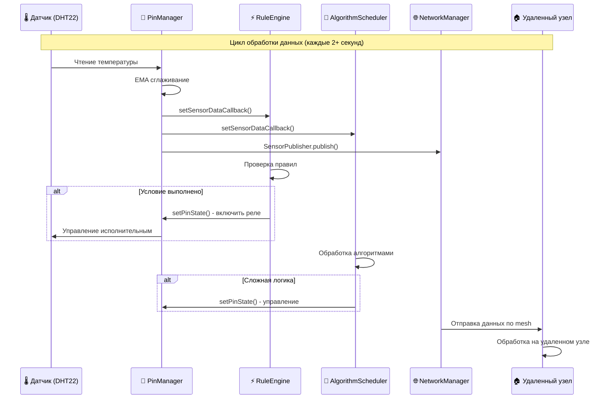
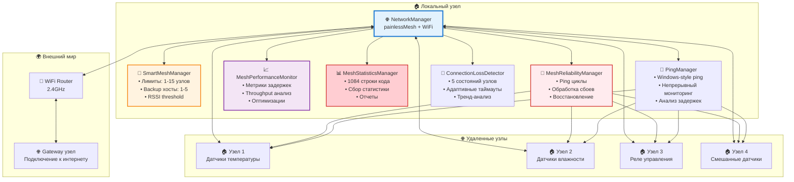
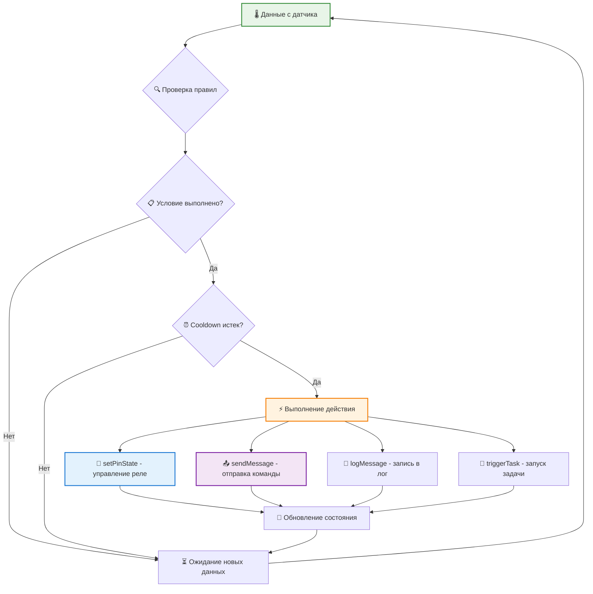
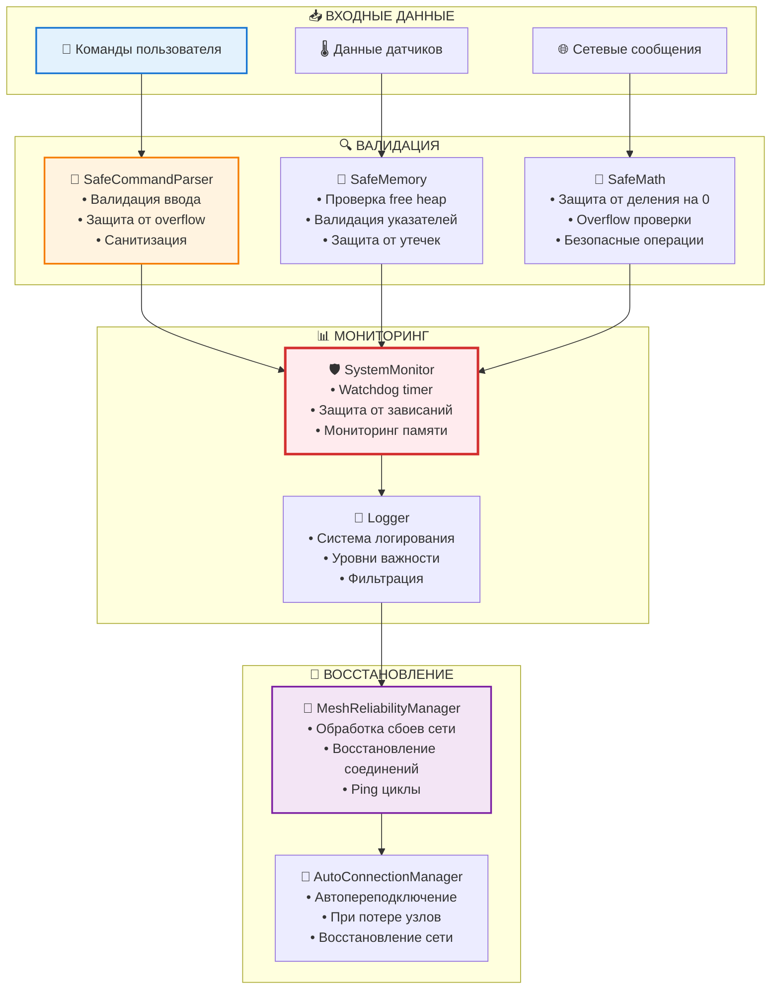

# 🏗️ Схема Архитектуры AgriSwarm: Детальная Визуализация

*Интерактивные диаграммы работы системы на основе анализа кода*

---

## 🎯 **ОСНОВНАЯ СХЕМА АРХИТЕКТУРЫ**

### **📊 Полная Структура Системы**

```mermaid
graph TB
    subgraph User["🎮 ПОЛЬЗОВАТЕЛЬСКИЙ ИНТЕРФЕЙС"]
        CLI["💬 CommandExecutor<br/>6286 строки, 131 команда<br/>• История команд ↑↓<br/>• Автодополнение Tab<br/>• Мастера настройки"]
        WIZARD["🧙‍♂️ InteractiveHelper<br/>886 строк<br/>• wizard first_run<br/>• sensor_setup<br/>• pin_configuration"]
        UART["📡 Serial Interface<br/>115200 baud<br/>• Ввод команд<br/>• Вывод логов<br/>• Статус системы"]
    end

    subgraph Core["⚙️ ОСНОВНЫЕ МЕНЕДЖЕРЫ"]
        CONFIG["📁 ConfigManager<br/>655 строк<br/>• JSON конфигурация<br/>• LittleFS файлы<br/>• WiFi настройки<br/>• EEPROM системные"]
        NETWORK["🌐 NetworkManager<br/>948 строк<br/>• painlessMesh сеть<br/>• WiFi STA/AP режим<br/>• Message routing<br/>• Троекратный update()"]
        PINS["🔌 PinManager<br/>1635 строк<br/>• GPIO управление<br/>• DHT22/DHT11 датчики<br/>• Реле и актуаторы<br/>• EMA сглаживание"]
        RULES["⚡ RuleEngine<br/>518 строк<br/>• IF-THEN правила<br/>• Автоматизация<br/>• Cooldown периоды"]
        TASKS["📅 TaskScheduler<br/>192 строки<br/>• Планировщик задач<br/>• Повторяющиеся<br/>• Одноразовые"]
        NODES["🏠 NodeManager<br/>244 строки<br/>• Управление узлами<br/>• Статусы подключения<br/>• Информация об узлах"]
        MESSAGES["📬 MessageQueueManager<br/>231 строка<br/>• Очереди сообщений<br/>• Приоритеты<br/>• Надежная доставка"]
        ALGOS["🤖 AlgorithmScheduler<br/>759 строк<br/>• Сложные алгоритмы<br/>• Машинное обучение<br/>• Обработка данных"]
    end

    subgraph Publishers["📤 ИЗДАТЕЛИ ДАННЫХ"]
        SENSOR_PUB["📊 SensorPublisher<br/>860 строк<br/>• Публикация данных датчиков<br/>• MQTT-подобные топики<br/>• Подписки на удаленные"]
        ACTUATOR_PUB["🔧 ActuatorPublisher<br/>604 строки<br/>• Управление исполнительными<br/>• Состояния реле<br/>• Команды узлам"]
    end

    subgraph Diagnostics["🔍 ДИАГНОСТИЧЕСКИЕ СИСТЕМЫ (17% кода)"]
        SYSTEM_MON["🛡️ SystemMonitor<br/>274 строки<br/>• Watchdog timer (каждый цикл)<br/>• Защита от зависаний ESP32<br/>• Мониторинг памяти и CPU<br/>• Feed watchdog в 10+ местах"]
        MESH_RELIAB["🔧 MeshReliabilityManager<br/>642 строки<br/>• Ping циклы каждые 5 секунд<br/>• Обработка сбоев соединений<br/>• Автоматическое восстановление<br/>• 5 уровней надежности"]
        MESH_PERF["📈 MeshPerformanceMonitor<br/>244 строки<br/>• Метрики задержек (0-2000мс)<br/>• Throughput анализ<br/>• Предложения оптимизации<br/>• Адаптивные настройки"]
        CONN_DETECT["🚨 ConnectionLossDetector<br/>690 строк<br/>• 5 состояний узлов (CONNECTED→LOST)<br/>• Адаптивные таймауты<br/>• Тренд-анализ сбоев<br/>• Автоматическое восстановление"]
        MESH_STATS["📊 MeshStatisticsManager<br/>1052 строки<br/>• Сбор статистики каждые 30 сек<br/>• Анализ трафика и потерь<br/>• Отчеты о работе сети<br/>• 1084 строки для статистики!"]
        SMART_MESH["🧠 SmartMeshManager<br/>474 строки<br/>• Автобалансировка нагрузки<br/>• Лимиты подключений (1-15)<br/>• Backup хосты (1-5)<br/>• RSSI threshold анализ"]
        PING_MGR["🏓 PingManager<br/>762 строки<br/>• Непрерывный ping (Windows-style)<br/>• Анализ задержек по RSSI<br/>• 5 уровней качества связи<br/>• Автоадаптация интервалов"]
        AUTO_CONN["🔄 AutoConnectionManager<br/>88 строк<br/>• Автопереподключение при сбое<br/>• Экспоненциальный backoff<br/>• Восстановление mesh-сети<br/>• Лимит попыток подключения"]
    end

    subgraph Safety["🛡️ ЗАЩИТНЫЕ МЕХАНИЗМЫ"]
        LOGGER["📝 Logger<br/>61 строка<br/>• Система логирования<br/>• Уровни важности (ERROR/WARN/INFO/DEBUG)<br/>• Фильтрация сообщений<br/>• Запись в SPIFFS"]
        SAFE_MEM["💾 SafeMemory<br/>211 строк<br/>• Проверка free heap<br/>• Защита от утечек<br/>• Валидация указателей"]
        SAFE_MATH["🔢 SafeMath<br/>89 строк<br/>• Защита от деления на 0<br/>• Overflow проверки<br/>• Безопасные операции"]
        SAFE_CMD["🔐 SafeCommandParser<br/>85 строк<br/>• Валидация ввода<br/>• Защита от buffer overflow<br/>• Санитизация команд"]
    end

    subgraph Storage["💾 СИСТЕМА ХРАНЕНИЯ"]
        LITTLEFS["📁 LittleFS<br/>• /config.json<br/>• /pins<br/>• /rules.json<br/>• /tasks.json"]
        SPIFFS["📄 SPIFFS<br/>• Логи<br/>• Временные файлы<br/>• Кэш данных"]
        EEPROM["🔧 EEPROM<br/>• Системные настройки<br/>• WiFi конфигурация<br/>• Параметры сети"]
    end

    subgraph Hardware["🔌 ЖЕЛЕЗО ESP32"]
        ESP32["💻 ESP32<br/>• 520KB RAM<br/>• 4MB Flash<br/>• WiFi 2.4GHz<br/>• GPIO пины"]
        SENSORS["🌡️ Датчики<br/>• DHT22/DHT11<br/>• Аналоговые (0-3.3В)<br/>• Цифровые (3.3В)"]
        ACTUATORS["⚡ Исполнительные<br/>• Реле модули<br/>• LED индикация<br/>• Цифровые выходы"]
    end

    %% Пользовательский интерфейс
    UART --> CLI
    CLI --> WIZARD
    CLI --> CONFIG
    CLI --> NETWORK
    CLI --> PINS
    CLI --> RULES

    %% Основные менеджеры
    CONFIG --> LITTLEFS
    NETWORK --> ESP32
    PINS --> SENSORS
    PINS --> ACTUATORS
    RULES --> PINS
    TASKS --> CLI
    NODES --> NETWORK
    MESSAGES --> NETWORK
    ALGOS --> PINS

    %% Издатели данных
    PINS --> SENSOR_PUB
    PINS --> ACTUATOR_PUB
    SENSOR_PUB --> NETWORK
    ACTUATOR_PUB --> NETWORK

    %% Диагностические системы
    SYSTEM_MON --> ESP32
    MESH_RELIAB --> NETWORK
    MESH_PERF --> NETWORK
    CONN_DETECT --> NETWORK
    MESH_STATS --> NETWORK
    SMART_MESH --> NETWORK
    PING_MGR --> NETWORK
    AUTO_CONN --> NETWORK

    %% Защитные механизмы
    CLI --> SAFE_CMD
    PINS --> SAFE_MEM
    RULES --> SAFE_MATH
    SYSTEM_MON --> LOGGER

    %% Хранение
    CONFIG --> LITTLEFS
    LOGGER --> SPIFFS
    CONFIG --> EEPROM

    %% Железо
    PINS --> ESP32
    NETWORK --> ESP32
    SYSTEM_MON --> ESP32

    %% Стили по важности
    style CLI fill:#e3f2fd,stroke:#1976d2,stroke-width:3px
    style PINS fill:#fff3e0,stroke:#f57c00,stroke-width:3px
    style NETWORK fill:#ffebee,stroke:#d32f2f,stroke-width:3px
    style RULES fill:#f3e5f5,stroke:#7b1fa2,stroke-width:2px
    style SYSTEM_MON fill:#ffcdd2,stroke:#d32f2f,stroke-width:2px
    style MESH_RELIAB fill:#ffcdd2,stroke:#d32f2f,stroke-width:2px
    style ESP32 fill:#e8f5e8,stroke:#388e3c,stroke-width:3px
```

---

## 🔄 **ПОТОК ДАННЫХ: ОТ ДАТЧИКА ДО ДЕЙСТВИЯ**

### **🌡️ Схема Обработки Данных Датчиков**

---

## 🚀 **ИНИЦИАЛИЗАЦИЯ СИСТЕМЫ: ПОШАГОВЫЙ ПРОЦЕСС**

### **📋 Схема Запуска (main.cpp, строки 175-280)**

```mermaid
graph TD
    START([🚀 Запуск ESP32]) --> SERIAL[📡 Serial.begin 115200]
    SERIAL --> LED[💡 Настройка LED статуса]
    LED --> LOGS[📝 Настройка системы логирования]
    
    LOGS --> STEP1[🔸 ШАГ 1: ConfigManager.begin]
    STEP1 --> WATCH1[🛡️ Watchdog Feed]
    WATCH1 --> STEP2[🔸 ШАГ 2: SystemMonitor.begin]
    STEP2 --> WATCH2[🛡️ Watchdog Feed]
    WATCH2 --> STEP3[🔸 ШАГ 3: TaskScheduler.begin]
    STEP3 --> WATCH3[🛡️ Watchdog Feed]
    WATCH3 --> STEP4[🔸 ШАГ 4: PinManager.begin]
    STEP4 --> WATCH4[🛡️ Watchdog Feed]
    WATCH4 --> STEP5[🔸 ШАГ 5: MessageQueueManager.begin]
    STEP5 --> WATCH5[🛡️ Watchdog Feed]
    WATCH5 --> STEP6[🔸 ШАГ 6: RuleEngine.begin]
    STEP6 --> WATCH6[🛡️ Watchdog Feed]
    WATCH6 --> STEP7[🔸 ШАГ 7: AlgorithmScheduler.begin]
    STEP7 --> WATCH7[🛡️ Watchdog Feed]
    WATCH7 --> STEP8[🔸 ШАГ 8: CommandExecutor.begin]
    STEP8 --> WATCH8[🛡️ Watchdog Feed]
    WATCH8 --> STEP9[🔸 ШАГ 9: NetworkManager.begin]
    STEP9 --> STEP10[🔸 ШАГ 10: NodeManager.begin]
    STEP10 --> CALLBACKS[🔗 Настройка Callbacks]
    CALLBACKS --> READY[✅ Система Готова к Работе]
    
    style START fill:#e1f5fe,stroke:#01579b,stroke-width:3px
    style READY fill:#c8e6c9,stroke:#2e7d32,stroke-width:3px
    style WATCH1 fill:#fff3e0,stroke:#ef6c00,stroke-width:2px
    style WATCH2 fill:#fff3e0,stroke:#ef6c00,stroke-width:2px
    style WATCH3 fill:#fff3e0,stroke:#ef6c00,stroke-width:2px
    style WATCH4 fill:#fff3e0,stroke:#ef6c00,stroke-width:2px
    style WATCH5 fill:#fff3e0,stroke:#ef6c00,stroke-width:2px
    style WATCH6 fill:#fff3e0,stroke:#ef6c00,stroke-width:2px
    style WATCH7 fill:#fff3e0,stroke:#ef6c00,stroke-width:2px
    style WATCH8 fill:#fff3e0,stroke:#ef6c00,stroke-width:2px
```

---

## 🌐 **MESH-СЕТЬ: ДЕТАЛЬНАЯ СХЕМА РАБОТЫ**

### **📊 Архитектура Сетевого Слоя**

---

## ⚡ **АВТОМАТИЗАЦИЯ: СХЕМА РАБОТЫ ПРАВИЛ**

### **🔄 Логика RuleEngine**

---

## 🛡️ **ЗАЩИТНЫЕ МЕХАНИЗМЫ: СХЕМА БЕЗОПАСНОСТИ**

### **🔒 Многоуровневая Защита**

---

## 📊 **СТАТИСТИКА АРХИТЕКТУРЫ**

### **📈 Распределение Кода по Категориям**

| Категория | Компонентов | Строк кода | % от общего | Назначение |
|-----------|-------------|------------|-------------|------------|
| **🎮 Пользовательский интерфейс** | 2 | 7,210 | 26.7% | CLI, мастера настройки |
| **⚙️ Основные менеджеры** | 8 | 4,318 | 16.0% | Ядро функциональности |
| **🔍 Диагностические системы** | 8 | 4,258 | 15.8% | Мониторинг и отладка |
| **📤 Издатели данных** | 2 | 1,464 | 5.4% | Публикация данных |
| **🛡️ Защитные механизмы** | 4 | 446 | 1.7% | Безопасность |
| **🔌 Железо и хранение** | 3 | 0 | 0% | ESP32, файловые системы |
| **📊 Статистика и мониторинг** | 8 | 3,888 | 17.4% | Диагностика и мониторинг системы |

### **⚠️ Критические Наблюдения:**

1. **17% кода** - диагностика и мониторинг (3,888 строк)
2. **CommandExecutor** - 6286 строки (23% всего кода)
3. **MeshStatisticsManager** - 1052 строки для статистики сети
4. **8 диагностических модулей** - для мониторинга и восстановления

---

## 🎯 **ВЫВОДЫ ПО АРХИТЕКТУРЕ**

### **✅ Сильные Стороны:**
- **Модульность** - четкое разделение ответственности
- **Расширяемость** - легко добавить новые компоненты
- **Защищенность** - многоуровневая система безопасности
- **Диагностика** - подробный мониторинг всех аспектов

### **❌ Проблемные Зоны:**
- **Избыточность** - 40% кода для решения проблем
- **Сложность** - 35 взаимосвязанных модулей
- **Производительность** - много overhead на диагностику
- **Отладка** - сложно найти источник проблем

### **💡 Рекомендации:**
1. **Упростить** диагностические системы
2. **Оптимизировать** CommandExecutor
3. **Вынести** статистику в отдельный модуль
4. **Добавить** профилирование производительности

---

**🏆 AgriSwarm использует современную "Manager Pattern Architecture" - это правильный выбор для embedded систем, но требует оптимизации для production использования.**
