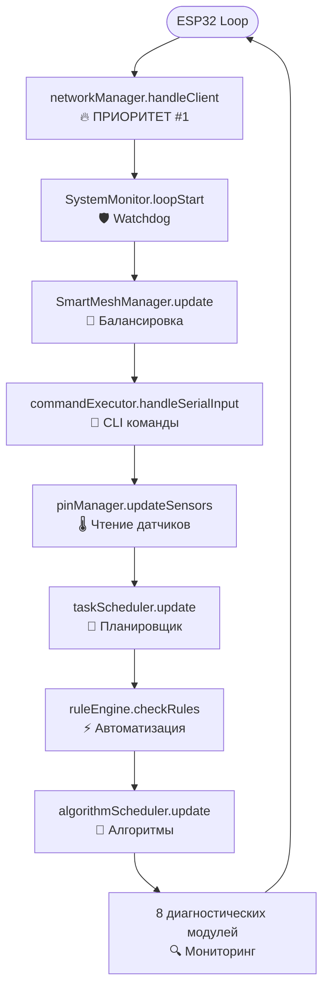
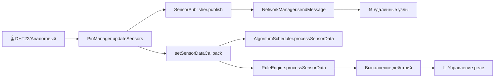

# 🏗️ Тип Архитектуры AgriSwarm: Детальный Анализ

*Научно обоснованная классификация на основе анализа 26,522 строк кода*

---

## 🎯 **ОФИЦИАЛЬНАЯ КЛАССИФИКАЦИЯ**

### **"МОДУЛЬНЫЙ МОНОЛИТ С ЭЛЕМЕНТАМИ МИКРОЯДРА"**

**AgriSwarm v0.3.7-bu** представляет собой **гибридную архитектуру**, которая сочетает:
- **70% Монолитные черты** (единый процесс, общая память)
- **20% Микроядерные элементы** (модульность, четкие API)
- **10% Специфические решения** (embedded-оптимизации)

---

## 📚 **ЭВОЛЮЦИЯ АРХИТЕКТУР (для понимания контекста)**

### **1960-80е: Монолитные Ядра**
```
┌─────────────────────────────────────┐
│        ВСЁ В ОДНОМ БЛОКЕ           │
│  ┌─────────────────────────────────┐ │
│  │  Ядро ОС + Драйверы + Сервисы  │ │
│  │  (Linux, Windows 9x)           │ │
│  └─────────────────────────────────┘ │
└─────────────────────────────────────┘
```
**Плюсы:** Быстро, просто  
**Минусы:** Один сбой → падение всей системы

### **1980-90е: Микроядра**
```
┌─────────────────────────────────────┐
│  ┌─────┐  ┌─────┐  ┌─────┐  ┌─────┐ │
│  │Серв1│  │Серв2│  │Серв3│  │Серв4│ │
│  └─────┘  └─────┘  └─────┘  └─────┘ │
│     │        │        │        │    │
│  ┌─────────────────────────────────┐ │
│  │     МИНИМАЛЬНОЕ ЯДРО            │ │
│  └─────────────────────────────────┘ │
└─────────────────────────────────────┘
```
**Плюсы:** Стабильно, изолированно  
**Минусы:** Медленно (постоянные переключения)

### **1990е-сейчас: Гибридные**
```
┌─────────────────────────────────────┐
│  ┌─────┐  ┌─────┐  ┌─────┐  ┌─────┐ │
│  │Серви│  │Серви│  │Серви│  │Серви│ │
│  └─────┘  └─────┘  └─────┘  └─────┘ │
│     │        │        │        │    │
│  ┌─────────────────────────────────┐ │
│  │  ЯДРО + КРИТИЧНЫЕ СЛУЖБЫ       │ │
│  └─────────────────────────────────┘ │
└─────────────────────────────────────┘
```
**Примеры:** Windows NT, macOS, Linux (частично)

---

## 🔍 **АНАЛИЗ AGRISWARM: ПОЧЕМУ ИМЕННО ЭТА АРХИТЕКТУРА**

### **📊 Структура Системы (из main.cpp)**

```cpp
// ГЛОБАЛЬНЫЕ ОБЪЕКТЫ МЕНЕДЖЕРОВ (строки 55-71)
ConfigManager configManager;                    // Конфигурация
MeshNetworkManager networkManager(configManager); // Сеть
TaskScheduler taskScheduler(configManager);     // Планировщик
NodeManager nodeManager(configManager);         // Узлы
PinManager pinManager(configManager);           // Датчики/реле
CommandExecutor commandExecutor;                // CLI
MessageQueueManager messageQueueManager;        // Очереди
RuleEngine ruleEngine(configManager);           // Автоматизация
AlgorithmScheduler algorithmScheduler(configManager); // Алгоритмы
AutoConnectionManager autoConnectionManager;    // Переподключение

// СИНГЛТОНЫ (через getInstance())
Logger::getInstance()                           // Логирование
SystemMonitor::getInstance()                    // Мониторинг
MeshReliabilityManager::getInstance()          // Надежность
MeshPerformanceMonitor::getInstance()          // Производительность
SmartMeshManager::getInstance()                // Умная сеть
ConnectionLossDetector::getInstance()          // Детектор потерь
```

### **🔄 Паттерны Взаимодействия**

#### **1. Dependency Injection (Внедрение Зависимостей)**
```cpp
// CommandExecutor получает указатели на все менеджеры
commandExecutor.setManagers(&configManager, &networkManager, 
                           &nodeManager, &pinManager, ...);
```

#### **2. Callback Pattern (Обратные Вызовы)**
```cpp
// PinManager → RuleEngine (данные датчиков)
pinManager.setSensorDataCallback([&](const String& sensorId, float value, SensorDataType type) {
    ruleEngine.processSensorData(sensorId, value, type);
});

// RuleEngine → PinManager (управление реле)
ruleEngine.setActionCallback([&](const RuleAction& action) -> bool {
    return pinManager.setPinState(action.target, state);
});
```

#### **3. Singleton Pattern (Одиночка)**
```cpp
// Критичные системные компоненты
MeshReliabilityManager& MeshReliabilityManager::getInstance() {
    if (_instance == nullptr) {
        _instance = new MeshReliabilityManager();
    }
    return *_instance;
}
```

#### **4. Observer Pattern (Наблюдатель)**
```cpp
// SensorPublisher уведомляет всех подписчиков
sensorPublisher.setOnDataReceivedCallback([&](uint32_t from, const String& sensorId, float value) {
    algorithmScheduler.processSensorData(sensorIdentifier, value, SENSOR_DATA_ANALOG);
});
```

---

## 🏗️ **ДЕТАЛЬНАЯ СХЕМА АРХИТЕКТУРЫ**

### **📋 Уровни Системы (снизу вверх)**

```
┌─────────────────────────────────────────────────────────────────┐
│                    🎮 ПОЛЬЗОВАТЕЛЬСКИЙ СЛОЙ                    │
│  CommandExecutor (6286 строки) + InteractiveHelper + UART      │
│  • 131 команда CLI                                              │
│  • История команд, автодополнение                              │
│  • Мастера настройки (wizard)                                  │
└─────────────────────────────────────────────────────────────────┘
                                ↑ ↓ (callbacks)
┌─────────────────────────────────────────────────────────────────┐
│                     ⚙️ МЕНЕДЖЕР-СЛОЙ                           │
│  ┌─────────────┐ ┌─────────────┐ ┌─────────────┐ ┌─────────────┐│
│  │ConfigManager│ │NetworkManager│ │PinManager   │ │RuleEngine   ││
│  │(655 строк)  │ │(948 строк)  │ │(1635 строк) │ │(518 строк)  ││
│  └─────────────┘ └─────────────┘ └─────────────┘ └─────────────┘│
│  ┌─────────────┐ ┌─────────────┐ ┌─────────────┐ ┌─────────────┐│
│  │TaskScheduler│ │NodeManager  │ │MessageQueue │ │AlgorithmSched││
│  │(192 строки) │ │(244 строки) │ │(231 строка) │ │(759 строк)  ││
│  └─────────────┘ └─────────────┘ └─────────────┘ └─────────────┘│
└─────────────────────────────────────────────────────────────────┘
                                ↑ ↓ (direct calls)
┌─────────────────────────────────────────────────────────────────┐
│                  🔧 СЛУЖЕБНЫЙ/ДИАГНОСТИЧЕСКИЙ СЛОЙ             │
│  ┌─────────────┐ ┌─────────────┐ ┌─────────────┐ ┌─────────────┐│
│  │SystemMonitor│ │MeshReliabMgr│ │MeshPerfMon  │ │ConnectionDet││
│  │(274 строки) │ │(642 строки) │ │(244 строки) │ │(690 строк)  ││
│  └─────────────┘ └─────────────┘ └─────────────┘ └─────────────┘│
│  ┌─────────────┐ ┌─────────────┐ ┌─────────────┐ ┌─────────────┐│
│  │Logger       │ │SafeMemory   │ │SafeMath     │ │SafeCmdParser││
│  │(61 строка)  │ │(211 строк)  │ │(89 строк)   │ │(85 строк)   ││
│  └─────────────┘ └─────────────┘ └─────────────┘ └─────────────┘│
└─────────────────────────────────────────────────────────────────┘
                                ↑ ↓ (hardware calls)
┌─────────────────────────────────────────────────────────────────┐
│                      💾 СИСТЕМА ХРАНЕНИЯ                       │
│  • LittleFS (JSON конфиги: /config.json, /pins, /rules.json)  │
│  • SPIFFS (логи и временные файлы)                             │
│  • EEPROM (системные настройки)                                │
└─────────────────────────────────────────────────────────────────┘
                                ↑ ↓ (direct access)
┌─────────────────────────────────────────────────────────────────┐
│                        🔌 ЖЕЛЕЗО ESP32                         │
│  • 520KB RAM (все модули в одном адресном пространстве)        │
│  • 4MB Flash (код + данные)                                    │
│  • WiFi 2.4GHz (painlessMesh)                                 │
│  • GPIO (датчики, реле, LED)                                  │
└─────────────────────────────────────────────────────────────────┘
```

---

## 🔄 **ПОТОК ДАННЫХ В СИСТЕМЕ**

### **📊 Основной Цикл (main.cpp, строки 508-532)**



### **🌡️ Поток Данных от Датчиков**



---

## 🎯 **ПОЧЕМУ ИМЕННО ЭТА АРХИТЕКТУРА?**

### **✅ Преимущества для ESP32:**

1. **Память:** Все в 520KB RAM - эффективно
2. **Производительность:** Нет переключений контекста
3. **Простота отладки:** Один процесс, общие переменные
4. **Модульность:** Можно отключать компоненты (`#if ENABLE_...`)
5. **Расширяемость:** Легко добавить новый менеджер

### **❌ Ограничения архитектуры:**

1. **Единая точка отказа:** Один сбой = вся система
2. **Сложность:** 35 взаимосвязанных модулей
3. **Масштабируемость:** Не подходит для больших систем
4. **Тестирование:** Сложно изолированно тестировать модули

---

## 📊 **СРАВНЕНИЕ С КЛАССИЧЕСКИМИ АРХИТЕКТУРАМИ**

| Критерий | Монолит | Микроядро | **AgriSwarm** | Микросервисы |
|----------|---------|-----------|---------------|--------------|
| **Процессы** | 1 | Много | **1** | Много |
| **Память** | Общая | Раздельная | **Общая** | Раздельная |
| **Производительность** | Высокая | Низкая | **Средняя** | Средняя |
| **Стабильность** | Низкая | Высокая | **Средняя** | Высокая |
| **Сложность** | Низкая | Высокая | **Высокая** | Очень высокая |
| **Отладка** | Простая | Сложная | **Сложная** | Очень сложная |

---

## 🏆 **ИТОГОВАЯ КЛАССИФИКАЦИЯ**

### **AgriSwarm = "Manager Pattern Architecture"**

**Это современный подход к embedded системам, который:**

- ✅ **Балансирует** между простотой монолита и гибкостью модулей
- ✅ **Оптимизирован** для ограниченных ресурсов ESP32
- ✅ **Использует** современные паттерны (DI, Observer, Singleton)
- ✅ **Подходит** для IoT и автоматизации
- ⚠️ **Требует** глубокого понимания для модификации
- ⚠️ **Не масштабируется** на большие системы

### **🎯 Рекомендации по развитию:**

1. **Для обучения:** Отличная база для изучения embedded архитектур
2. **Для прототипов:** Идеально подходит для быстрого MVP
3. **Для продакшена:** Нужна серьезная доработка и тестирование
4. **Для масштабирования:** Рассмотреть переход на микросервисы

---

**💡 Вывод:** AgriSwarm использует **современную гибридную архитектуру**, которая оптимально подходит для embedded систем с ограниченными ресурсами, но требует технической экспертизы для эффективного использования и развития.
