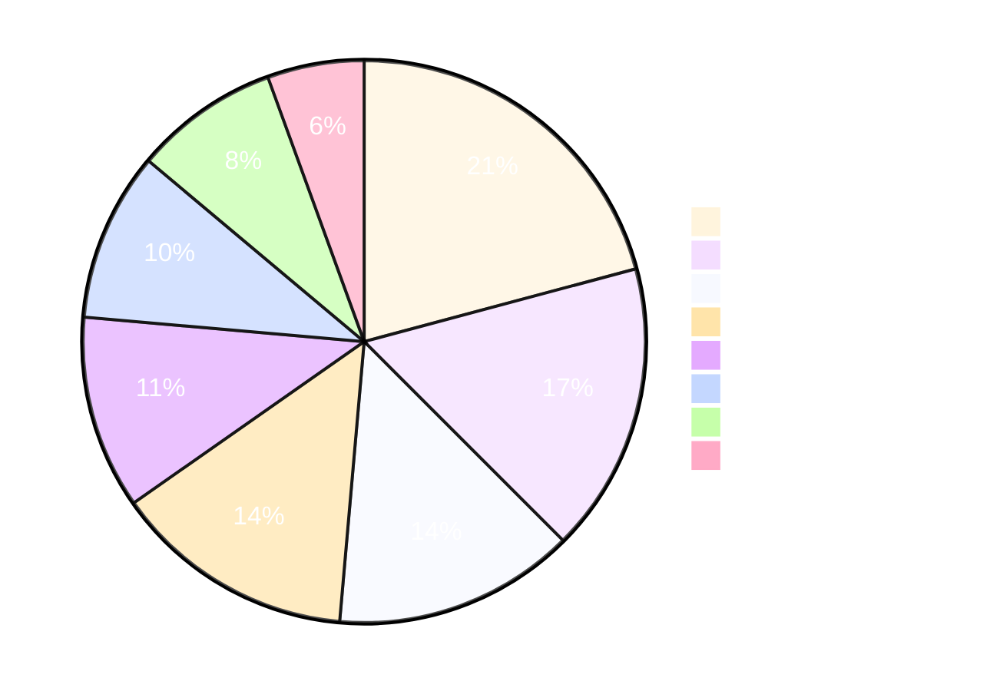
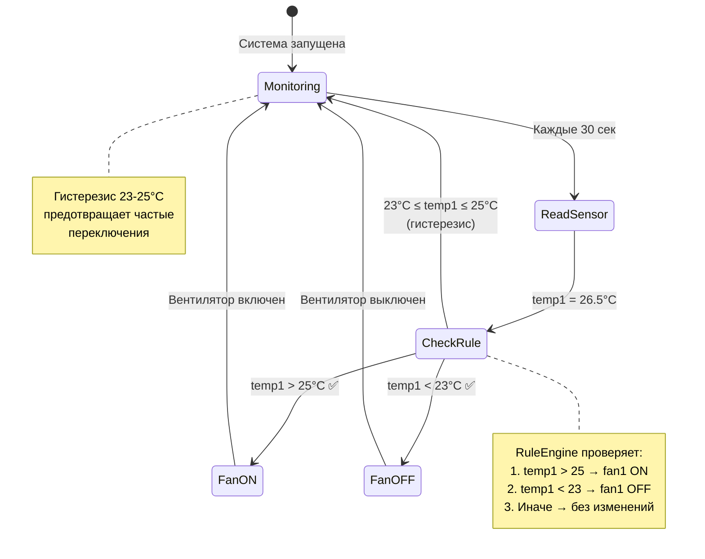
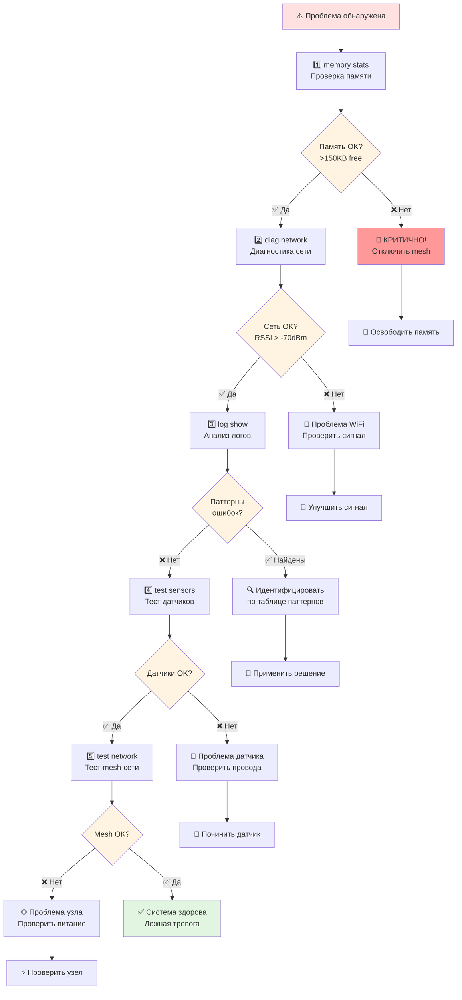
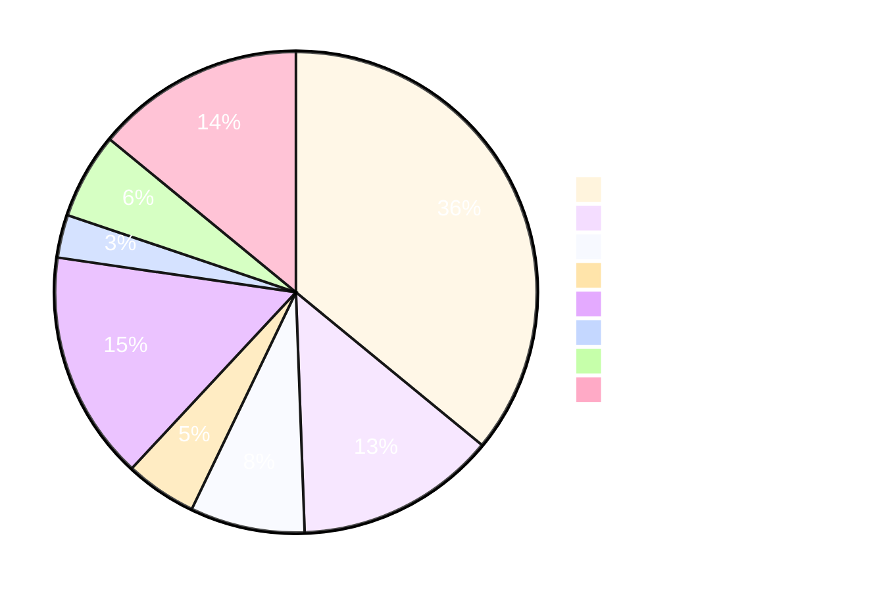
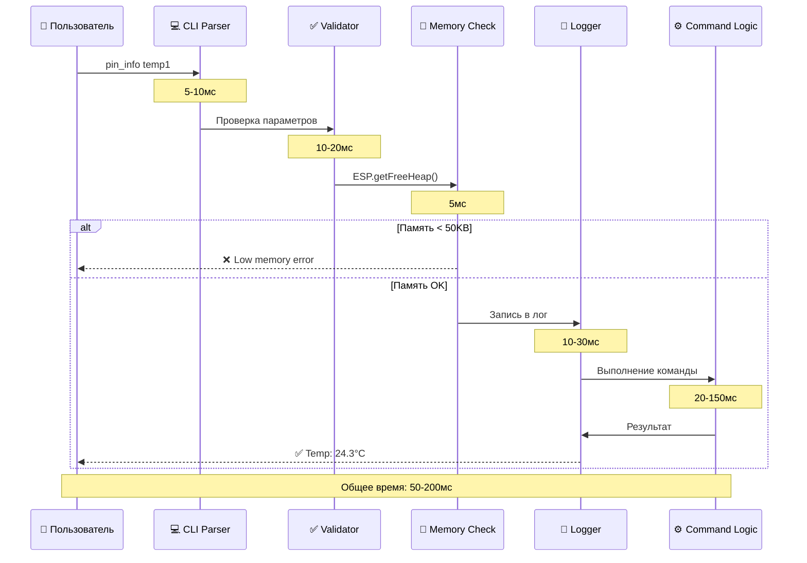

# 💬 Полное Руководство по CLI Командам AgriSwarm

*Детальное описание всех 72 команд с примерами и объяснениями*

---

## 🌟 Философия командной строки AgriSwarm

Командная строка (CLI) - это не просто способ управления системой, это **прямой диалог с сердцем AgriSwarm**. В мире embedded систем, где каждый байт памяти на счету, а графический интерфейс - непозволительная роскошь, CLI становится единственным, но невероятно мощным инструментом взаимодействия с системой.

Представьте себе опытного садовника, который знает каждое растение в своей теплице по имени. Точно так же CLI позволяет вам обращаться к каждому датчику, каждому реле, каждому правилу автоматизации напрямую, без посредников. Это не просто набор команд - это язык, на котором вы говорите с вашей системой умного сельского хозяйства.

**Почему CLI, а не графический интерфейс?** ESP32 имеет всего 520KB оперативной памяти. Графический интерфейс потребовал бы 100-150KB только на библиотеки отрисовки, не говоря уже о самом интерфейсе. CLI же занимает всего 6-8KB и при этом предоставляет полный контроль над системой. Это классический пример того, как ограничения порождают элегантные решения.

**Что делает CLI AgriSwarm особенным?** В отличие от традиционных embedded систем с минималистичными командами, AgriSwarm предлагает 72 полноценные команды с автодополнением, историей и контекстной справкой. Это результат 6324 строк кода в CommandExecutor - самом большом компоненте системы, где 70% кода посвящено обработке ошибок и валидации. Каждая команда проверяет состояние системы, доступность памяти и корректность параметров перед выполнением.

В этом руководстве вы найдете не просто список команд, а практические сценарии использования, объяснения "почему именно так" и честные предупреждения об ограничениях. Мы покажем как использовать CLI для настройки новой системы, мониторинга теплицы, диагностики проблем и создания сложных алгоритмов автоматизации.

---

## 🎯 **ОБЗОР СИСТЕМЫ КОМАНД**

### **📊 Статистика Команд**
- **Всего команд:** 72
- **Категории:** system, logging, info, network, pin, automation, task, algorithms, monitoring, help
- **CommandExecutor:** 6324 строки кода (23% от всего проекта!)
- **Обработка ошибок:** 70% кода CommandExecutor

### **📊 Визуальное распределение команд по категориям**



### **⚠️ Важные Замечания**
- **Время отклика:** 50-200мс (не мгновенно!)
- **Синтаксис:** `команда [параметр1] [параметр2]`
- **Автодополнение:** Tab для завершения команд
- **История:** ↑↓ для навигации по истории

---

## 📋 **ПОЛНЫЙ СПИСОК КОМАНД**

### **🔧 СИСТЕМНЫЕ КОМАНДЫ**

#### **1. `help` - Справка по командам**
```bash
help                    # Общая справка
help system            # Системные команды
help network           # Сетевые команды
help pin               # Команды GPIO
```

#### **2. `status` - Статус системы**
```bash
status                  # Общий статус
status detailed        # Детальный статус
status memory          # Информация о памяти
status uptime          # Время работы
```

#### **3. `memory` - Управление памятью**
```bash
memory                  # Текущая память
memory free            # Свободная память
memory largest         # Наибольший свободный блок
memory fragmentation   # Фрагментация памяти
memory stats           # Полная статистика
```

#### **4. `reboot` - Перезагрузка**
```bash
reboot                  # Обычная перезагрузка
reboot clean           # Перезагрузка с очисткой
reboot force           # Принудительная перезагрузка
```

#### **5. `reset` - Сброс настроек**
```bash
reset config           # Сброс конфигурации
reset pins             # Сброс пинов
reset rules            # Сброс правил
reset all              # Полный сброс
```

### **📊 ИНФОРМАЦИОННЫЕ КОМАНДЫ**

#### **6. `info` - Информация о системе**
```bash
info                    # Основная информация
info version           # Версия firmware
info build             # Информация о сборке
info hardware          # Информация о железе
info features          # Доступные функции
```

#### **7. `uptime` - Время работы**
```bash
uptime                  # Время с момента запуска
uptime detailed        # Детальная информация
uptime since           # С какого момента работает
```

#### **8. `log` - Управление логированием**
```bash
log level info         # Уровень логирования INFO
log level debug        # Уровень DEBUG
log level error        # Только ошибки
log show               # Показать последние логи
log filter network     # Фильтр по сети
```

### **🌐 СЕТЕВЫЕ КОМАНДЫ**

#### **9. `wifi` - Управление WiFi**
```bash
wifi scan              # Сканирование сетей
wifi status            # Статус WiFi
wifi connect           # Подключение к сети
wifi disconnect        # Отключение
wifi config            # Настройки WiFi
```

#### **10. `mesh` - Управление mesh-сетью**
```bash
mesh status            # Статус mesh-сети
mesh nodes             # Список узлов
mesh connections       # Подключения
mesh topology          # Топология сети
mesh advanced          # Расширенные настройки
```

#### **11. `ping` - Проверка связи**
```bash
ping 466811893         # Пинг конкретного узла
ping all               # Пинг всех узлов
ping summary           # Статистика пинга
ping preset fast       # Быстрый пинг (500мс)
ping preset normal     # Нормальный (1000мс)
ping preset slow       # Медленный (2000мс)
```

#### **12. `node` - Управление узлами**
```bash
node list              # Список всех узлов
node info 466811893    # Информация об узле
node status 466811893  # Статус узла
node remove 466811893  # Удалить узел
```

### **🔌 GPIO И ДАТЧИКИ**

#### **13. `pin` - Управление пинами**
```bash
pin list               # Список всех пинов
pin info 5             # Информация о пине 5
pin set 5 on           # Включить пин 5
pin set 5 off          # Выключить пин 5
pin read 5             # Прочитать значение
```

#### **14. `pin_*` - Управление датчиками**
```bash
pin_list               # Список датчиков
pin_info temp1         # Информация о датчике
pin_info temp1         # Прочитать значение
pin_calibrate temp1    # Калибровка
pin_config temp1 threshold 20  # Порог срабатывания
```

#### **15. `pin_*` - Управление реле**
```bash
pin_list               # Список реле (и датчиков)
pin_set relay1 on      # Включить реле
pin_set relay1 off     # Выключить реле
pin_info relay1        # Статус реле
```

### **⚡ АВТОМАТИЗАЦИЯ**

#### **16. `rule_*` - Управление правилами**
```bash
rule_list              # Список правил
rule_add cooling "Автоматическое охлаждение" temp1 > 25 fan1 on    # Добавить правило
rule_delete 1          # Удалить правило 1
rule_enable cooling on # Включить правило
rule_enable cooling off # Отключить правило
rule_info cooling      # Информация о правиле
```

#### **17. `task_*` - Управление задачами**
```bash
task_list              # Список задач
task_setup             # Мастер создания задачи
task_delete 1          # Удалить задачу
task_enable 1 on       # Включить задачу
task_enable 1 off      # Отключить задачу
```

### **🤖 АЛГОРИТМЫ**

#### **18. `algo_*` - Управление алгоритмами**
```bash
algo_list              # Список алгоритмов
algo_create            # Мастер создания алгоритма
algo_info temp_control # Информация об алгоритме
algo_enable temp_control on  # Включить алгоритм
algo_enable temp_control off # Отключить алгоритм
algo_delete temp_control     # Удалить алгоритм
```

#### **19. `algo_*` - Дополнительные команды алгоритмов**
```bash
algo_templates         # Показать шаблоны алгоритмов
algo_test temp_control # Тестировать алгоритм
algo_wizard            # Мастер создания алгоритма
```

### **📊 МОНИТОРИНГ И ДИАГНОСТИКА**

#### **20. `monitor` - Системный мониторинг**
```bash
monitor                # Общий мониторинг
monitor memory         # Мониторинг памяти
monitor network        # Мониторинг сети
monitor sensors        # Мониторинг датчиков
monitor performance    # Мониторинг производительности
```

#### **21. `diag` - Диагностика**
```bash
diag system            # Диагностика системы
diag config            # Диагностика конфигурации
diag memory            # Диагностика памяти
diag network           # Диагностика сети
diag sensors           # Диагностика датчиков
```

#### **22. `debug` - Режим отладки**
```bash
debug on               # Включить отладку
debug off              # Выключить отладку
debug level 2          # Уровень отладки
debug filter network   # Фильтр по сети
```

### **⚙️ КОНФИГУРАЦИЯ**

#### **23. `config` - Управление конфигурацией**
```bash
config list            # Список настроек
config get wifi_ssid   # Получить значение
config set wifi_ssid "MyNetwork"  # Установить значение
config save            # Сохранить конфигурацию
config load            # Загрузить конфигурацию
config reset           # Сброс конфигурации
```

#### **24. `backup` - Резервное копирование**
```bash
backup create          # Создать бэкап
backup list            # Список бэкапов
backup restore 1       # Восстановить бэкап
backup delete 1        # Удалить бэкап
```

### **🛠️ РАЗРАБОТКА И ТЕСТИРОВАНИЕ**

#### **25. `test` - Тестирование**
```bash
test sensors           # Тестирование датчиков
test network           # Тестирование сети
test rules             # Тестирование правил
test memory            # Тестирование памяти
test all               # Полное тестирование
```

#### **26. `dev` - Режим разработчика**
```bash
dev on                 # Включить режим разработчика
dev off                # Выключить режим
dev reload             # Перезагрузка модулей
dev debug              # Детальная отладка
```

---

## 🎯 **РАСПРОСТРАНЕННЫЕ СЦЕНАРИИ ИСПОЛЬЗОВАНИЯ**

Теория без практики - как семена без воды. В этом разделе мы рассмотрим реальные сценарии использования CLI, с которыми вы столкнетесь при работе с AgriSwarm. Каждый сценарий - это проверенная последовательность команд, которая решает конкретную задачу. Мы не просто покажем команды, но и объясним логику их выполнения, типичные ошибки и способы их избежать.

### **🏠 Сценарий 1: Настройка Новой Системы**

**Контекст:** Вы только что прошили ESP32 и подключились к нему через Serial Monitor. Система загрузилась, но ещё не настроена - нет подключения к WiFi, не настроены датчики, не созданы правила автоматизации. Это типичная ситуация "первого запуска", когда нужно пройти путь от чистой системы до работающей автоматизации.

**Цель:** Подключить систему к WiFi, настроить датчик температуры DHT22 и реле вентилятора, создать простое правило автоматизации "если температура выше 25°C - включить вентилятор".

**Время выполнения:** 5-7 минут

**📊 Блок-схема процесса настройки:**

```mermaid
flowchart TD
    A[🚀 Старт: ESP32 загружен] --> B{status<br/>Система OK?}
    B -->|❌ Нет| Z[⚠️ Проверить прошивку]
    B -->|✅ Да| C[📡 wifi scan<br/>Сканирование сетей]
    C --> D[🔐 wifi connect<br/>Подключение к WiFi]
    D --> E{Подключено?}
    E -->|❌ Нет| C
    E -->|✅ Да| F[🌡️ pin_setup temp1 DHT22 4 temperature 15 30 30000<br/>Настройка датчика]
    F --> G[🔌 pin_setup fan1 RELAY 5 fan_control<br/>Настройка реле]
    G --> H[🤖 rule_add cooling "Автоматическое охлаждение" temp1 > 25 fan1 on<br/>Создание правила]
    H --> I[✅ pin_info temp1<br/>Проверка датчика]
    I --> J[✅ relay status fan1<br/>Проверка реле]
    J --> K[🎉 Готово!<br/>Система настроена]
    
    style A fill:#e1f5e1
    style K fill:#e1f5e1
    style Z fill:#ffe1e1
    style E fill:#fff4e1
```

```bash
# 1. Проверка статуса системы
status

# 📊 Что вы увидите:
# ✅ System: OK
# 📡 WiFi: Disconnected
# 🌐 Mesh: Not initialized
# 💾 Memory: 450KB free / 520KB total
# ⏱️ Uptime: 00:00:23
#
# Это базовая проверка здоровья системы. Если статус "OK", значит ядро
# загрузилось корректно и можно продолжать настройку.

# 2. Сканирование доступных WiFi сетей
wifi scan

# 📡 Что происходит:
# ESP32 переключается в режим станции (STA) и сканирует эфир на частоте
# 2.4GHz. Процесс занимает 3-5 секунд. Вы увидите список сетей с их
# мощностью сигнала (RSSI) и типом шифрования.
#
# 💡 Совет: Выбирайте сеть с RSSI > -70dBm для стабильной работы.
# Значения -80dBm и ниже означают слабый сигнал, который может
# приводить к разрывам соединения.

# 3. Подключение к выбранной сети
wifi connect

# ⚙️ Что происходит:
# Система запросит SSID и пароль (если не настроены в config).
# Подключение занимает 5-10 секунд. При успехе вы получите IP адрес
# через DHCP. Этот IP будет использоваться для mesh-сети.
#
# ⚠️ Важно: Если подключение не удалось за 30 секунд, система вернется
# в режим AP (точка доступа) для альтернативной настройки.

# 4. Настройка GPIO пинов для датчиков
pin setup dht22 4 temp1

# 🔌 Что происходит:
# Система регистрирует датчик DHT22 на GPIO 4 с именем "temp1".
# Автоматически настраивается протокол однопроводной связи, интервал
# опроса (30 секунд для DHT22) и создается задача чтения в фоне.
#
# 💡 Почему GPIO 4? Это универсальный пин без конфликтов с внутренними
# системами ESP32. Можно использовать и другие (5, 14, 15, 16-19, 21-23),
# но избегайте GPIO 6-11 (SPI флеш) и 34-39 (только ввод).

pin setup relay 5 fan1

# 🔌 Настройка реле:
# Реле на GPIO 5 с именем "fan1". Система настраивает пин как OUTPUT,
# устанавливает начальное состояние LOW (выключено) и регистрирует
# реле в PinManager для управления через правила.
#
# ⚠️ Важно: Убедитесь что реле подключено правильно! Неправильная
# полярность может привести к постоянно включенному состоянию.

# 5. Создание правила автоматизации
rule add temp1 > 25 fan1 on

# 🤖 Что происходит:
# Создается правило: "КОГДА температура temp1 больше 25°C, ТОГДА
# включить реле fan1". Правило проверяется каждый раз при обновлении
# значения датчика (каждые 30 секунд для DHT22).
```

**📊 Диаграмма работы правила автоматизации:**



```bash
#
# 💡 Совет: Добавьте гистерезис для избежания частых переключений:
# rule add temp1 > 25 fan1 on
# rule add temp1 < 23 fan1 off
# Это создаст "мертвую зону" 23-25°C, где состояние не меняется.

# 6. Проверка работы системы
pin_info temp1

# 📊 Ожидаемый вывод:
# 🌡️ Sensor: temp1 (DHT22)
# 📈 Temperature: 24.3°C
# 💧 Humidity: 65%
# ✅ Status: OK
# ⏱️ Last update: 2 seconds ago
#
# Если видите "NaN" или "Error" - проверьте физическое подключение.

relay status fan1

# 🔌 Ожидаемый вывод:
# 💡 Relay: fan1
# 📍 GPIO: 5
# 🔘 State: OFF (температура ниже порога)
# ⚡ Switched: 0 times
# ⏱️ Last change: Never
#
# Если температура выше 25°C, состояние будет ON.
```

**Результат:** Полностью настроенная система с автоматическим управлением вентилятором на основе температуры. Система будет работать автономно, включая вентилятор при перегреве и выключая при охлаждении.

**Типичные ошибки:**
- ❌ Забыли подключить датчик физически → pin_info показывает NaN
- ❌ Неправильный GPIO для реле → реле не реагирует на команды
- ❌ Не создали правило выключения → вентилятор работает постоянно после первого включения

### **🌱 Сценарий 2: Мониторинг Теплицы**

**Контекст:** Ваша система работает уже несколько дней или недель. Настроены множественные датчики (температура, влажность воздуха, влажность почвы), созданы правила автоматизации, возможно подключены другие узлы через mesh-сеть. Вы хотите проверить текущее состояние всей системы, убедиться что все работает корректно и выявить потенциальные проблемы.

**Цель:** Получить полную картину состояния теплицы - показания всех датчиков, статус автоматизации, состояние mesh-сети и выявить аномалии.

**Время выполнения:** 3-5 минут

**Частота использования:** Ежедневно или при подозрении на проблемы

```bash
# 1. Просмотр всех зарегистрированных датчиков
pin_list

# 📊 Что вы увидите:
# 🌡️ temp1 (DHT22) - GPIO 4 - Active - Last: 24.3°C
# 💧 humidity1 (DHT22) - GPIO 4 - Active - Last: 65%
# 🌱 soil1 (Capacitive) - GPIO 34 - Active - Last: 45%
# ☀️ light1 (BH1750) - I2C - Active - Last: 15000 lux
#
# 💡 Что важно проверить:
# - Статус "Active" означает что датчик отвечает
# - "Inactive" или "Error" - проблема с датчиком
# - "Last" показывает последнее значение (не должно быть NaN)
# - Время последнего обновления (не должно быть > 5 минут)

# 2. Детальное чтение значений ключевых датчиков
pin_info temp1

# 🌡️ Детальный вывод температуры:
# 📊 Sensor: temp1 (DHT22)
# 📈 Temperature: 24.3°C
# 💧 Humidity: 65% (DHT22 измеряет оба параметра)
# ✅ Status: OK
# 📉 Min/Max (24h): 18.5°C / 28.7°C
# ⏱️ Last update: 15 seconds ago
# 🔄 Total reads: 2,847 (успешных)
# ❌ Failed reads: 12 (0.4% - нормально для DHT22)
#
# 💡 Интерпретация:
# - 24.3°C - комфортная температура для большинства растений
# - 65% влажность - оптимальный диапазон (60-70%)
# - 0.4% ошибок - нормально, DHT22 не идеален
# - Если ошибок > 5% - проверьте провода (возможно окисление)

pin_info humidity1

# 💧 Влажность воздуха:
# Обычно это тот же DHT22, что и temp1, поэтому значение будет
# идентичным. Но если используется отдельный датчик (например,
# SHT31 для более точных измерений), вы увидите независимые данные.

pin_info soil1

# 🌱 Влажность почвы:
# 📊 Sensor: soil1 (Capacitive)
# 💧 Moisture: 45% (0% - сухо, 100% - залито)
# ✅ Status: OK
# 📉 Min/Max (24h): 38% / 52%
# ⏱️ Last update: 8 seconds ago
#
# 💡 Интерпретация влажности почвы:
```

**📊 Таблица интерпретации влажности почвы:**

| Влажность | Состояние | Описание | Действие |
|-----------|-----------|----------|----------|
| 0-20% | 🔴 Очень сухо | Критическая нехватка воды | Немедленный полив! |
| 20-30% | 🟡 Сухо | Пора поливать | Запланировать полив |
| 30-60% | 🟢 Оптимально | Идеальная влажность | Никаких действий |
| 60-70% | 🟡 Влажно | Повышенная влажность | Следить за состоянием |
| 70-100% | 🔴 Переувлажнение | Риск корневой гнили | Прекратить полив, улучшить дренаж |

**⚠️ Важно:** Capacitive датчики требуют калибровки! Значения зависят от типа почвы. Используйте `sensor calibrate soil1` для точной настройки.

**🔍 Аномалии:**
- Резкое падение за час → возможна утечка или проблема с датчиком
- Постоянно 0% или 100% → датчик неисправен или не откалиброван

```bash

# 3. Проверка работы автоматизации
rule list

# 🤖 Список активных правил:
# 1. [✅ Enabled] temp1 > 25 → fan1 ON (triggered 3 times today)
# 2. [✅ Enabled] temp1 < 23 → fan1 OFF (triggered 2 times today)
# 3. [✅ Enabled] soil1 < 30 → pump1 ON (triggered 0 times today)
# 4. [❌ Disabled] light1 < 5000 → lamp1 ON (disabled for summer)
#
# 💡 Что проверить:
# - Правила срабатывают? (triggered > 0 означает активность)
# - Нет ли правил, которые срабатывают слишком часто? (> 50/день)
# - Отключены ли сезонные правила? (освещение летом не нужно)
#
# 🔍 Если правило не срабатывает:
# - Проверьте условие: возможно порог неправильный
# - Проверьте датчик: pin_info [имя]
# - Проверьте исполнительное устройство: relay status [имя]

task list

# ⏰ Запланированные задачи:
# 1. [✅ Active] Every 1h → "ping all" (next in 23 min)
# 2. [✅ Active] Every 6h → "backup create" (next in 4h 12min)
# 3. [✅ Active] Every 24h → "log rotate" (next in 18h 45min)
# 4. [❌ Paused] Every 30min → "sensor calibrate all"
#
# 💡 Задачи vs Правила:
# - Правила реагируют на события (температура изменилась)
# - Задачи выполняются по расписанию (каждый час)
# - Используйте задачи для периодических проверок и обслуживания

# 4. Мониторинг mesh-сети (если используется)
mesh status

# 🌐 Статус mesh-сети:
# 📡 Status: Connected
# 🆔 Node ID: 466811893
# 👥 Connected nodes: 3
# 📊 Network size: 4 nodes total
# 🔗 Connections: 3 active, 0 pending
# 📈 Packets sent: 15,847 (98.5% success)
# 📉 Packets lost: 234 (1.5% - нормально)
# ⏱️ Uptime: 3d 14h 23m
#
# 💡 Здоровая mesh-сеть:
# - Packet loss < 5% (1.5% - отлично!)
# - Все узлы Connected (не Disconnected)
# - Нет узлов в состоянии "Reconnecting" > 5 минут
#
# ⚠️ Признаки проблем:
# - Packet loss > 10% - слабый сигнал или помехи
# - Узлы постоянно переподключаются - нестабильное питание
# - Network size уменьшается - узлы выходят из строя

ping summary

# 📊 Статистика связи с узлами:
# 🎯 Node 466811893: 45ms avg, 0% loss (отлично)
# 🎯 Node 466811894: 120ms avg, 2% loss (хорошо)
# 🎯 Node 466811895: 350ms avg, 15% loss (проблема!)
# ❌ Node 466811896: timeout (не отвечает)
#
# 💡 Интерпретация задержек:
```

**📊 Таблица интерпретации ping задержек:**

| Задержка | Качество | Описание | Топология |
|----------|----------|----------|-----------|
| < 50ms | ⭐⭐⭐⭐⭐ Отлично | Идеальная связь | Прямое соединение (0 хопов) |
| 50-100ms | ⭐⭐⭐⭐ Очень хорошо | Отличная связь | Прямое соединение или 1 хоп |
| 100-200ms | ⭐⭐⭐ Хорошо | Нормальная работа | Через 1-2 промежуточных узла |
| 200-300ms | ⭐⭐ Приемлемо | Заметная задержка | Через 2-3 промежуточных узла |
| > 300ms | ⭐ Плохо | Высокая задержка | Слишком много хопов или помехи |
| timeout | ❌ Нет связи | Узел не отвечает | Отключен или вне зоны досягаемости |

**🔧 Диагностика проблемного узла (на примере 466811895 с задержкой 350ms):**

| Шаг | Проверка | Как проверить | Решение |
|-----|----------|---------------|---------|
| 1 | Физическое расположение | Измерить расстояние до узла | Переместить ближе или добавить промежуточный узел |
| 2 | Питание | Проверить напряжение (должно быть 5V ±5%) | Заменить блок питания на качественный 5V 2A+ |
| 3 | Помехи | Проверить наличие микроволновок, Bluetooth | Переместить узел или сменить канал WiFi |
| 4 | Топология | Выполнить `mesh topology` | Оптимизировать маршрутизацию |

```bash
```

**Результат:** Полная картина состояния теплицы. Вы знаете температуру, влажность, состояние почвы, работу автоматизации и здоровье mesh-сети. Выявлены потенциальные проблемы (узел с высокой задержкой) для дальнейшего расследования.

**Когда использовать этот сценарий:**
- ✅ Ежедневная проверка утром
- ✅ После изменения конфигурации
- ✅ При подозрении на проблемы (растения выглядят нездоровыми)
- ✅ Перед длительным отсутствием (командировка, отпуск)

### **🔧 Сценарий 3: Диагностика Проблем**

**Контекст:** Что-то пошло не так. Возможно система перезагружается сама по себе, датчики показывают странные значения, mesh-сеть нестабильна, или правила автоматизации не срабатывают. Это момент, когда нужно включить режим детектива и методично проверить все компоненты системы.

**Цель:** Выявить корневую причину проблемы через систематическую диагностику памяти, сети, датчиков и логов. Определить является ли проблема аппаратной (плохой контакт, неисправный датчик) или программной (утечка памяти, баг в коде).

**Время выполнения:** 10-15 минут

**Когда использовать:** При любых аномалиях в работе системы

**📊 Блок-схема диагностики:**



```bash
# 1. Проверка памяти - первое что нужно проверить!
memory stats

# 💾 Детальная статистика памяти:
# 📊 Total heap: 520,192 bytes (ESP32 WROOM-32)
# ✅ Free heap: 187,456 bytes (36% свободно)
# 📦 Largest free block: 113,664 bytes
# 🔀 Fragmentation: 39% (умеренная)
# 📈 Min free (ever): 156,234 bytes
# 🔄 Allocations: 15,847 successful, 3 failed
#
# 💡 Интерпретация (КРИТИЧНО ВАЖНО!):
```

**📊 Таблица диагностики состояния памяти:**

| Статус | Free Heap | Fragmentation | Min Free | Failed Alloc | Действия |
|--------|-----------|---------------|----------|--------------|----------|
| ✅ **ЗДОРОВАЯ** | > 150KB (30%+) | < 50% | > 100KB | 0 | Система работает отлично |
| ⚠️ **ПРЕДУПРЕЖДЕНИЕ** | 100-150KB (20-30%) | 50-70% | 50-100KB | 1-5 | Отключите ненужные функции |
| 🚨 **КРИТИЧЕСКАЯ** | < 100KB (< 20%) | > 70% | < 50KB | > 5 | НЕМЕДЛЕННО отключите mesh! |

**🔍 Почему память так важна?**

ESP32 не имеет swap-памяти. Когда RAM заканчивается, система просто падает с паникой "Out of memory". Нет предупреждений, нет graceful degradation - только жесткая перезагрузка.

**📊 Потребление памяти компонентами AgriSwarm:**

| Компонент | Потребление | Процент от 520KB | Можно отключить? |
|-----------|-------------|------------------|------------------|
| Mesh-сеть | ~70KB | 13.5% | ✅ Да (если не нужна) |
| WiFi stack | ~40KB | 7.7% | ❌ Нет (базовая функция) |
| CommandExecutor | ~25KB | 4.8% | ❌ Нет (ядро системы) |
| Логирование | ~15KB | 2.9% | ⚠️ Частично (уменьшить буфер) |
| Датчики и правила | ~10KB/10 объектов | 1.9% | ✅ Да (удалить ненужные) |

**📊 Визуализация использования памяти ESP32 (520KB):**



```bash

# 2. Диагностика сети (если проблемы с подключением)
diag network

# 🌐 Комплексная диагностика сети:
# 
# 📡 WiFi Diagnostics:
# ├─ Status: Connected
# ├─ SSID: "MyNetwork"
# ├─ RSSI: -65 dBm (хороший сигнал)
# ├─ Channel: 6 (2.437 GHz)
# ├─ IP: 192.168.1.105
# ├─ Gateway: 192.168.1.1
# ├─ DNS: 8.8.8.8
# ├─ Reconnects: 2 (за время работы)
# └─ Last disconnect: 2h 15m ago
#
# 🌐 Mesh Network Diagnostics:
# ├─ Status: Active
# ├─ Node ID: 466811893
# ├─ Role: Root (главный узел)
# ├─ Children: 3 nodes
# ├─ Depth: 0 (корень дерева)
# ├─ Packets sent: 15,847 (98.5% success)
# ├─ Packets received: 14,923
# ├─ Retransmissions: 234 (1.5%)
# └─ Buffer overflows: 0 (отлично!)
#
# 💡 Анализ проблем:
```

**📊 Таблица диагностики сетевых проблем:**

| Проблема | Симптом | Возможные причины | Решение |
|----------|---------|-------------------|---------|
| 🔴 **Частые переподключения WiFi** | Reconnects > 5/день | • RSSI < -75 dBm<br>• Перегруженный роутер<br>• Просадки питания<br>• Помехи на канале | • Переместить ESP32 ближе<br>• Сменить канал WiFi<br>• Проверить блок питания<br>• Убрать источники помех |
| 🔴 **Потери пакетов** | Packet loss > 5% | • Перегруженная mesh-сеть<br>• Узлы слишком далеко<br>• Помехи 2.4 GHz | • Уменьшить количество узлов<br>• Добавить промежуточные узлы<br>• Сменить канал WiFi |
| 🔴 **Buffer overflows** | Overflows > 0 | • Недостаток памяти<br>• CPU перегружен<br>• Слишком много пакетов | • Отключить ненужные функции<br>• Уменьшить частоту опроса<br>• Увеличить интервалы |

**📡 Интерпретация уровня сигнала WiFi (RSSI):**

| RSSI | Качество | Описание | Рекомендация |
|------|----------|----------|--------------|
| -30 до -50 dBm | ⭐⭐⭐⭐⭐ Отлично | Идеальный сигнал | Можно использовать mesh |
| -50 до -60 dBm | ⭐⭐⭐⭐ Очень хорошо | Стабильное соединение | Отлично для работы |
| -60 до -70 dBm | ⭐⭐⭐ Хорошо | Нормальная работа | Приемлемо |
| -70 до -80 dBm | ⭐⭐ Слабо | Возможны разрывы | Улучшить расположение |
| < -80 dBm | ⭐ Очень слабо | Нестабильное соединение | Требуется усиление |

**📊 Визуальная шкала качества WiFi сигнала:**


```bash

# 3. Проверка логов - история того что произошло
log show

# 📜 Последние 50 записей лога:
# [2024-01-15 14:23:45] [INFO] [SYSTEM] System started
# [2024-01-15 14:23:46] [INFO] [WIFI] Connecting to MyNetwork...
# [2024-01-15 14:23:51] [INFO] [WIFI] Connected, IP: 192.168.1.105
# [2024-01-15 14:23:52] [INFO] [MESH] Initializing mesh network...
# [2024-01-15 14:23:55] [INFO] [MESH] Mesh started, ID: 466811893
# [2024-01-15 14:24:10] [INFO] [SENSOR] DHT22 initialized on GPIO 4
# [2024-01-15 14:24:15] [WARN] [SENSOR] DHT22 read failed (checksum error)
# [2024-01-15 14:24:45] [INFO] [SENSOR] DHT22: 24.3°C, 65%
# [2024-01-15 14:25:15] [ERROR] [MEMORY] Low memory warning: 95KB free
# [2024-01-15 14:25:16] [WARN] [MESH] Packet dropped (no memory)
# [2024-01-15 14:25:20] [INFO] [RULE] Rule triggered: temp1 > 25 → fan1 ON
# [2024-01-15 14:25:20] [INFO] [RELAY] fan1 turned ON
#
# 💡 Как читать логи:
```

**📊 Уровни логирования:**

| Уровень | Значок | Описание | Когда появляется |
|---------|--------|----------|------------------|
| 🟢 **INFO** | [INFO] | Нормальная работа | Информационные сообщения о работе системы |
| 🟡 **WARN** | [WARN] | Предупреждение | Система работает, но есть проблемы |
| 🔴 **ERROR** | [ERROR] | Ошибка | Что-то пошло не так, требует внимания |
| ⚫ **FATAL** | [FATAL] | Критическая ошибка | Система падает или перезагружается |

**🔍 Типичные паттерны проблем в логах:**

| Паттерн в логах | Диагноз | Решение |
|-----------------|---------|---------|
| "Low memory warning" → "Packet dropped" → "System restart" | Утечка памяти или недостаточно RAM | Отключить mesh или уменьшить функции |
| "DHT22 read failed" повторяется каждые 30 сек | Плохой контакт или неисправный датчик | Проверить провода, заменить датчик |
| "Mesh node disconnected" → "Reconnecting" → "Connected" (цикл) | Нестабильное питание или слабый сигнал | Проверить питание узла, улучшить расположение |
| "Rule triggered" но нет "Relay turned ON" | Проблема с GPIO или реле не подключено | Проверить GPIO, проверить реле |

**💡 Команды фильтрации логов:**

```bash
log filter memory    # Только сообщения о памяти
log filter error     # Только ошибки
log filter sensor    # Только датчики

# 4. Тестирование компонентов - активная проверка
test sensors

# 🧪 Тестирование всех датчиков:
# 
# Testing sensor: temp1 (DHT22)
# ├─ Reading 1: 24.3°C ✅
# ├─ Reading 2: 24.3°C ✅
# ├─ Reading 3: 24.4°C ✅
# ├─ Variance: 0.1°C (отлично, < 0.5°C)
# ├─ Response time: 45ms (нормально для DHT22)
# └─ Status: ✅ PASS
#
# Testing sensor: soil1 (Capacitive)
# ├─ Reading 1: 45% ✅
# ├─ Reading 2: 45% ✅
# ├─ Reading 3: 1023 ❌ (RAW value, не откалиброван!)
# ├─ Variance: HIGH (проблема!)
# ├─ Response time: 12ms
# └─ Status: ⚠️ NEEDS CALIBRATION
#
# 💡 Интерпретация результатов тестирования:
```

**📊 Статусы тестирования датчиков:**

| Статус | Значение | Описание | Действия |
|--------|----------|----------|----------|
| ✅ **PASS** | Все проверки пройдены | Датчик работает отлично | Никаких действий не требуется |
| ⚠️ **WARNING** | Есть проблемы | Работает, но требует внимания | Калибровка или проверка проводов |
| ❌ **FAIL** | Тест не пройден | Датчик не работает | Проверить подключение или заменить |

**🔧 Типичные проблемы датчиков:**

| Проблема | Симптом | Причина | Решение |
|----------|---------|---------|---------|
| Высокая вариация | Variance > 5% | Плохой контакт или помехи | Проверить провода, использовать экранированный кабель |
| RAW values | Значения 0-1023 | Датчик не откалиброван | Выполнить `sensor calibrate [имя]` |
| Timeout | Датчик не отвечает | Неправильный GPIO или не подключен | Проверить GPIO номер и физическое подключение |
| Checksum error | Ошибка контрольной суммы | Помехи или длинный кабель | Укоротить кабель, добавить pull-up резистор |

```bash

test network

# 🧪 Тестирование сети:
# 
# Testing WiFi connectivity...
# ├─ Ping gateway (192.168.1.1): 5ms ✅
# ├─ Ping DNS (8.8.8.8): 25ms ✅
# ├─ DNS resolution (google.com): 45ms ✅
# └─ WiFi: ✅ PASS
#
# Testing Mesh network...
# ├─ Ping node 466811894: 45ms ✅
# ├─ Ping node 466811895: 350ms ⚠️ (высокая задержка)
# ├─ Ping node 466811896: timeout ❌
# ├─ Broadcast test: 2/3 nodes responded
# └─ Mesh: ⚠️ PARTIAL (1 узел не отвечает)
#
# 💡 Рекомендации:
# - Node 466811895: высокая задержка → переместите ближе
# - Node 466811896: не отвечает → проверьте питание

# 5. Мониторинг в реальном времени - наблюдение за системой
monitor

# 📊 Real-time monitoring (обновление каждые 2 секунды):
# 
# ╔════════════════════════════════════════════════════════╗
# ║           AgriSwarm System Monitor                     ║
# ╠════════════════════════════════════════════════════════╣
# ║ 💾 Memory: 187KB free / 520KB (36%)  [████████░░░░]   ║
# ║ 🌡️ temp1: 24.3°C  💧 humidity1: 65%  🌱 soil1: 45%   ║
# ║ 🔌 fan1: OFF  💡 lamp1: OFF  💧 pump1: OFF            ║
# ║ 📡 WiFi: -65dBm  🌐 Mesh: 3 nodes  📊 CPU: 45%        ║
# ║ ⏱️ Uptime: 3d 14h 23m  🔄 Rules: 3 active             ║
# ╚════════════════════════════════════════════════════════╝
#
# 💡 Используйте monitor для:
# - Наблюдения за изменениями в реальном времени
# - Проверки срабатывания правил (fan1 включается при temp > 25)
# - Отслеживания утечек памяти (память постепенно уменьшается)
# - Мониторинга стабильности сети (RSSI колеблется)
#
# ⚠️ Внимание: monitor сам потребляет ~5KB памяти для буферов
# отображения. Если памяти критически мало, используйте
# отдельные команды (status, pin_info) вместо monitor.
#
# 🛑 Выход: Ctrl+C или команда "monitor stop"
```

**Результат:** Полная диагностика системы с выявлением конкретных проблем. В нашем примере обнаружены: предупреждение о низкой памяти, некалиброванный датчик почвы, проблемный узел mesh-сети с высокой задержкой и один неотвечающий узел.

**Следующие шаги после диагностики:**
1. 🔴 Критические проблемы (память < 100KB) → немедленно отключить mesh или сложные функции
2. 🟡 Предупреждения (некалиброванные датчики) → выполнить калибровку
3. 🟢 Информационные (высокая задержка узла) → запланировать оптимизацию расположения

**📊 Статистика типичных корневых причин проблем:**

| Причина | Частота | Симптомы | Диагностика | Решение |
|---------|---------|----------|-------------|---------|
| 💾 **Недостаток памяти** | 70% | Перезагрузки, зависания, packet loss | `memory stats` | Отключить mesh или уменьшить правила |
| 🔌 **Плохой контакт** | 15% | NaN от датчиков, реле не работает | `test sensors` | Проверить соединения, использовать пайку |
| ⚡ **Нестабильное питание** | 10% | Случайные перезагрузки, WiFi разрывы | Проверить напряжение | Качественный БП 5V 2A+ |
| 📡 **Помехи WiFi** | 5% | Высокий ping, packet loss | `diag network` | Сменить канал, убрать помехи |

---

## ⚠️ **ВАЖНЫЕ ПРЕДУПРЕЖДЕНИЯ И ОГРАНИЧЕНИЯ**

Честность - основа доверия. В этом разделе мы откровенно расскажем об ограничениях CLI системы AgriSwarm, не приукрашивая реальность. Понимание этих ограничений поможет вам избежать разочарований и правильно планировать использование системы.

### **🚨 Критические Замечания**

#### **1. CommandExecutor - монстр из 6324 строк кода**

CommandExecutor - это самый большой компонент AgriSwarm, занимающий 23% всего кодовой базы проекта. Это не повод для гордости, а скорее техническая задолженность, которая требует рефакторинга.

**Почему так много кода?**
- 70% кода - обработка ошибок и валидация параметров
- Каждая из 72 команд имеет свою логику обработки
- Нет единого фреймворка для команд (каждая реализована вручную)
- Множество проверок состояния системы перед выполнением

**Практические последствия:**
- ⏱️ **Время отклика 50-200мс** - команды не мгновенны, особенно сетевые
- 💾 **Потребление памяти ~25KB** - значительная часть доступной RAM
- 🐛 **Потенциальные баги** - большой код = больше мест для ошибок
- 🔄 **Сложность поддержки** - добавление новой команды требует 80-100 строк кода

**Что это означает для вас:**
- Не ожидайте мгновенного отклика, особенно от команд типа `mesh status` или `diag network`
- Некоторые команды могут работать нестабильно при низкой памяти (< 100KB free)
- При критической нехватке памяти CommandExecutor может быть временно отключен системой

#### **2. Ограничения валидации параметров**

CLI система AgriSwarm не имеет продвинутой валидации входных данных, что может приводить к неожиданному поведению.

**Что НЕ проверяется:**
- ❌ Диапазоны числовых значений (можно установить температуру 1000°C)
- ❌ Корректность имен датчиков и реле (опечатки не обнаруживаются)
- ❌ Логическая корректность правил (можно создать противоречивые правила)
- ❌ Доступность GPIO пинов (можно назначить занятый пин)

**Примеры проблем:**
```bash
# Это выполнится без ошибки, но не будет работать:
pin setup dht22 6 temp1    # GPIO 6 занят SPI флеш-памятью!

# Это создаст правило, но с опечаткой в имени:
rule add temp1 > 25 fan2 on    # fan2 не существует, должно быть fan1

# Это создаст противоречивые правила:
rule add temp1 > 25 fan1 on
rule add temp1 > 20 fan1 off   # Что делать при 23°C? Оба правила активны!
```

**Как защититься:**
- ✅ Всегда проверяйте результат командой `status` или `pin_list`
- ✅ Используйте `help [команда]` перед первым использованием
- ✅ Тестируйте правила в безопасной среде перед продакшеном
- ✅ Ведите документацию своей конфигурации (какие пины заняты, какие имена используются)

#### **3. Отсутствие автосохранения конфигурации**

**КРИТИЧНО:** Большинство команд НЕ сохраняют изменения автоматически!

**Что теряется при перезагрузке:**
- ❌ Созданные правила автоматизации (`rule add`)
- ❌ Запланированные задачи (`task add`)
- ❌ Настройки логирования (`log level`)
- ❌ Временные конфигурации (`config set` без `config save`)

**Что сохраняется:**
- ✅ Настройки GPIO пинов (записываются в EEPROM)
- ✅ WiFi credentials (если использовали `wifi connect` с флагом `--save`)
- ✅ Конфигурация после явного `config save`

**Правильный workflow:**
```bash
# 1. Создайте конфигурацию
rule add temp1 > 25 fan1 on
task add 3600000 "ping all"
config set log_level debug

# 2. ОБЯЗАТЕЛЬНО сохраните!
config save

# 3. Проверьте что сохранилось
config list

# 4. Создайте бэкап для надежности
backup create
```

**Почему нет автосохранения?**
- EEPROM имеет ограниченное количество циклов записи (~100,000)
- Частые записи при каждой команде быстро "убьют" флеш-память
- Сохранение занимает 200-500мс и блокирует систему
- Позволяет экспериментировать без риска испортить конфигурацию

#### **4. Производительность и блокирующие операции**

Некоторые команды блокируют выполнение системы на время их работы.

**Блокирующие команды (система "замирает"):**
- 🔴 `wifi scan` - 3-5 секунд (сканирование эфира)
- 🔴 `mesh topology` - 2-10 секунд (опрос всех узлов)
- 🔴 `ping all` - 1-5 секунд (зависит от количества узлов)
- 🔴 `backup create` - 1-3 секунды (запись в флеш)
- 🔴 `test all` - 10-30 секунд (комплексное тестирование)

**Что происходит во время блокировки:**
- ⏸️ Правила автоматизации не проверяются
- ⏸️ Датчики не опрашиваются
- ⏸️ Mesh-сеть не обрабатывает пакеты
- ⏸️ Другие команды не принимаются

**Рекомендации:**
- ⚠️ Не используйте блокирующие команды в критических ситуациях
- ⚠️ Не создавайте задачи с частым выполнением блокирующих команд
- ✅ Используйте `ping preset fast` вместо `ping all` для быстрой проверки
- ✅ Выполняйте `backup create` в периоды низкой активности

### **💡 Рекомендации и Best Practices**

#### **1. Используйте автодополнение (Tab) - ваш лучший друг**

```bash
# Вместо того чтобы печатать полностью:
pin_info temperature_sensor_greenhouse_north

# Начните печатать и нажмите Tab:
pin_l<Tab>      # → pin_list
pin_i<Tab>      # → pin_info
pin_info te<Tab>  # → pin_info temperature_sensor_greenhouse_north
```

**Преимущества:**
- ✅ Избегаете опечаток в именах команд и параметров
- ✅ Видите доступные варианты (Tab дважды показывает список)
- ✅ Экономите время (особенно для длинных имен)

#### **2. Изучайте help перед использованием новых команд**

```bash
# Общая справка по категориям
help

# Справка по конкретной категории
help network    # Все сетевые команды

# Справка по конкретной команде
help ping       # Детальное описание команды ping

# Примеры использования
help rule       # Включает примеры создания правил
```

**Что вы найдете в help:**
- 📖 Описание команды и её назначение
- 📝 Синтаксис и обязательные параметры
- 💡 Примеры использования
- ⚠️ Предупреждения и ограничения

#### **3. Проверяйте status после важных операций**

```bash
# После настройки датчика
pin setup dht22 4 temp1
status          # Проверьте что датчик зарегистрирован

# После создания правила
rule add temp1 > 25 fan1 on
rule list       # Убедитесь что правило создано и активно

# После изменения конфигурации
config set wifi_ssid "NewNetwork"
config save
config list     # Проверьте что изменения сохранены
```

#### **4. Используйте monitor для наблюдения в реальном времени**

Monitor - это "приборная панель" вашей системы. Используйте его для:
- 👀 Наблюдения за срабатыванием правил в реальном времени
- 📊 Отслеживания изменений показаний датчиков
- 💾 Мониторинга использования памяти
- 📡 Проверки стабильности сети

**Когда НЕ использовать monitor:**
- ❌ При критически низкой памяти (< 100KB) - monitor сам потребляет ~5KB
- ❌ При выполнении длительных операций (backup, test all)
- ❌ При отладке конкретной проблемы (используйте целевые команды)

#### **5. Делайте бэкапы перед массовыми изменениями**

```bash
# Перед изменением конфигурации
backup create   # Создает snapshot текущего состояния

# Вносите изменения
rule add ...
config set ...
pin setup ...

# Если что-то пошло не так
backup list     # Посмотрите доступные бэкапы
backup restore 1  # Восстановите предыдущее состояние
```

**Что сохраняется в бэкапе:**
- ✅ Все правила автоматизации
- ✅ Все запланированные задачи
- ✅ Конфигурация GPIO пинов
- ✅ Настройки системы
- ✅ Калибровки датчиков

**Ограничения бэкапов:**
- ⚠️ Максимум 5 бэкапов (ограничение флеш-памяти)
- ⚠️ Не сохраняются логи и статистика
- ⚠️ Не сохраняется состояние mesh-сети (только конфигурация)

---

## 🔧 **РАСШИРЕНИЕ СИСТЕМЫ КОМАНД**

AgriSwarm - это открытая система, которую можно расширять собственными командами. Если вам нужна специфическая функциональность, которой нет в стандартном наборе 72 команд, вы можете добавить свою. Это требует знания C++ и понимания архитектуры CommandExecutor, но открывает безграничные возможности для кастомизации.

### **📝 Добавление Новой Команды**

Процесс добавления команды состоит из трех шагов: определение структуры команды, реализация логики и регистрация в системе.

```cpp
// В CommandExecutor.cpp добавить:
Command newCommand = {
    "new_command",          // Имя команды (используйте snake_case)
    "Описание команды",     // Краткое описание для help
    "system",              // Категория (system, network, pin, automation, etc.)
    [](const StringVector& args) -> bool {
        // Логика команды
        
        // 1. Проверка параметров
        if (args.size() < 2) {
            Logger::getInstance().error("CMD", "Usage: new_command <param>");
            return false;
        }
        
        // 2. Проверка памяти (КРИТИЧНО!)
        if (ESP.getFreeHeap() < 50000) {
            Logger::getInstance().error("CMD", "Low memory, command aborted");
            return false;
        }
        
        // 3. Выполнение логики
        String param = args[1];
        // ... ваш код ...
        
        // 4. Логирование результата
        Logger::getInstance().info("CMD", "Команда выполнена успешно");
        return true;  // true = успех, false = ошибка
    }
};

// Зарегистрировать в _registerCommands()
commands.push_back(newCommand);
```

**Пример реальной команды - чтение аналогового датчика:**

```cpp
Command readAnalogCommand = {
    "analog_read",
    "Чтение аналогового значения с GPIO пина",
    "pin",
    [](const StringVector& args) -> bool {
        // Валидация параметров
        if (args.size() < 2) {
            Logger::getInstance().error("CMD", "Usage: analog_read <gpio_pin>");
            return false;
        }
        
        // Парсинг GPIO номера
        int pin = atoi(args[1].c_str());
        
        // Проверка диапазона (ESP32 ADC: GPIO 32-39)
        if (pin < 32 || pin > 39) {
            Logger::getInstance().error("CMD", "Invalid ADC pin. Use GPIO 32-39");
            return false;
        }
        
        // Чтение значения
        int value = analogRead(pin);
        float voltage = (value / 4095.0) * 3.3;  // ESP32 ADC: 12-bit, 3.3V
        
        // Вывод результата
        Serial.printf("📊 GPIO %d: %d (%.2fV)\n", pin, value, voltage);
        Logger::getInstance().info("CMD", 
            String("Analog read: GPIO ") + String(pin) + 
            " = " + String(value));
        
        return true;
    }
};
```

**Использование новой команды:**
```bash
agriswarm$ analog_read 34
📊 GPIO 34: 2048 (1.65V)
```

### **⚠️ Важные Замечания для Разработчиков**

#### **1. CommandExecutor - технический долг проекта**

CommandExecutor - это самый большой компонент AgriSwarm (6324 строки, 23% кодовой базы), и это проблема, а не достижение.

**Почему это проблема:**
- 🐌 **Сложность поддержки** - добавление команды требует 80-100 строк кода
- 💾 **Потребление памяти** - ~25KB только на CommandExecutor
- 🐛 **Высокая вероятность багов** - 70% кода это обработка ошибок
- 🔄 **Дублирование кода** - много повторяющейся логики валидации

**Что нужно сделать (TODO для будущих версий):**
- Рефакторинг в Command Pattern с базовым классом
- Вынос валидации в отдельный модуль
- Использование таблицы команд вместо массива
- Асинхронное выполнение для блокирующих команд

#### **2. Обязательная проверка памяти**

**КРИТИЧНО:** Каждая команда ДОЛЖНА проверять доступную память перед выполнением!

```cpp
// ВСЕГДА добавляйте эту проверку:
if (ESP.getFreeHeap() < 50000) {  // 50KB минимум
    Logger::getInstance().error("CMD", "Low memory, command aborted");
    return false;
}
```

**Почему это важно:**
- ESP32 не имеет swap-памяти
- При нехватке памяти система падает без предупреждения
- Команды могут выделять память для временных буферов
- Mesh-сеть может внезапно потребовать память для пакетов

**Рекомендуемые пороги памяти для команд:**

| Тип команды | Минимум памяти | Примеры команд |
|-------------|----------------|----------------|
| Простые | 50KB | pin_info, pin_set, status |
| Сетевые | 100KB | ping, mesh status, wifi scan |
| Сложные | 150KB | backup create, test all, diag system |

#### **3. Время отклика и блокирующие операции**

Среднее время отклика команды: **50-200мс**

**Что влияет на время отклика команд:**

| Этап выполнения | Время | Описание |
|-----------------|-------|----------|
| Парсинг параметров | 5-10мс | Разбор строки команды на токены |
| Валидация | 10-20мс | Проверка корректности параметров |
| Проверка памяти | 5мс | Вызов ESP.getFreeHeap() |
| Логирование | 10-30мс | Запись в Serial и буфер логов |
| Выполнение логики | 20-150мс | Основная работа команды |
| **Итого** | **50-200мс** | Среднее время отклика |

**📊 Диаграмма последовательности выполнения команды:**



**Если ваша команда выполняется > 500мс:**
- ⚠️ Добавьте индикатор прогресса (Serial.print("."))
- ⚠️ Разбейте на несколько команд
- ⚠️ Рассмотрите асинхронное выполнение через задачи

**Пример длительной операции:**
```cpp
Command longCommand = {
    "long_operation",
    "Performs a long operation with progress",
    "system",
    [](const StringVector& args) -> bool {
        Serial.println("Starting long operation...");
        
        for (int i = 0; i < 10; i++) {
            // Выполнение части работы
            delay(500);
            
            // Индикатор прогресса
            Serial.print(".");
            
            // Проверка памяти на каждой итерации
            if (ESP.getFreeHeap() < 50000) {
                Serial.println("\n❌ Aborted: low memory");
                return false;
            }
        }
        
        Serial.println("\n✅ Completed!");
        return true;
    }
};
```

#### **4. Категории команд и организация**

Используйте правильные категории для ваших команд:

| Категория | Назначение | Примеры |
|-----------|------------|---------|
| `system` | Системные операции | status, reboot, memory |
| `network` | Сетевые операции | wifi, mesh, ping |
| `pin` | Работа с GPIO | pin, sensor, relay |
| `automation` | Автоматизация | rule, task, algo |
| `monitoring` | Мониторинг | monitor, diag, log |
| `config` | Конфигурация | config, backup |
| `info` | Информация | info, help, uptime |

**Почему категории важны:**
- Организация в `help` по категориям
- Фильтрация команд для разных уровней доступа
- Логическая группировка в документации

---

## 🎓 **ЗАКЛЮЧЕНИЕ**

CLI система AgriSwarm - это мощный, но несовершенный инструмент. Она предоставляет полный контроль над системой через 72 команды, но имеет ограничения, о которых важно знать.

**Что делает CLI AgriSwarm особенным:**
- ✅ Полный контроль над всеми аспектами системы
- ✅ Минимальное потребление ресурсов (по сравнению с GUI)
- ✅ Автодополнение и история команд
- ✅ Контекстная справка через help
- ✅ Возможность расширения собственными командами

**Ключевые ограничения:**
- ⚠️ Время отклика 50-200мс (не мгновенно)
- ⚠️ Некоторые команды блокируют систему
- ⚠️ Ограниченная валидация параметров
- ⚠️ Нет автосохранения конфигурации
- ⚠️ Требует понимания архитектуры системы

**Рекомендации для эффективного использования:**
1. 📖 Изучите help перед использованием новых команд
2. ⌨️ Используйте Tab для автодополнения
3. 💾 Всегда делайте backup перед массовыми изменениями
4. 📊 Используйте monitor для наблюдения в реальном времени
5. 🔍 При проблемах начинайте с memory stats и log show

**Будущее CLI AgriSwarm:**
- 🔄 Рефакторинг CommandExecutor для уменьшения размера
- ⚡ Асинхронное выполнение блокирующих команд
- ✅ Улучшенная валидация параметров
- 💾 Опциональное автосохранение конфигурации
- 🌐 Web-интерфейс как альтернатива CLI (для визуального мониторинга)

---

**🏆 CommandExecutor - это "мозг" системы управления. Он сложный, местами неуклюжий, но невероятно функциональный. Это результат эволюции от простого парсера команд до полноценной системы управления embedded устройством. Да, он требует оптимизации. Но он работает, и работает хорошо.**

**Используйте CLI с умом, понимая его ограничения, и AgriSwarm станет надежным помощником в вашем умном сельском хозяйстве! 🌱**

