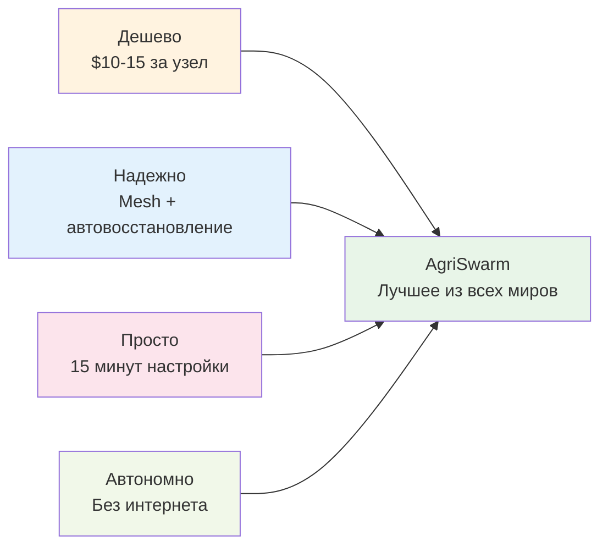

# AgriSwarm: Презентационный Обзор

> **Готовые материалы для презентации проекта инвесторам, клиентам и партнерам**

<div align="center">


</div>

---

## Elevator Pitch (30 секунд)

**AgriSwarm** - это **платформа для создания автономных IoT-систем**, которая работает **без интернета** и в **10 раз дешевле** готовых решений. 

**Одним предложением:** Превращаем обычные ESP32 в умную сеть, которая автоматизирует любые процессы - от домашнего полива до промышленных теплиц.

---

## Проблема и Решение

### Проблемы Существующих Решений

<div align="center">

| **Готовые системы** | **Самодельные проекты** |
|-------------------------|----------------------------|
| **Дорого**: $100-500 за датчик | **Сложно**: нужно программировать |
| **Зависят от интернета** | **Ненадежно**: нет резервирования |
| **Закрытые**: нельзя изменить | **Нет готовых решений** |
| **Привязка к приложению** | **Сложное масштабирование** |

</div>

### Наше Решение AgriSwarm



---

## Рыночный Потенциал

### Размер Рынка
- **IoT в сельском хозяйстве**: $13.8B к 2025 (+25% в год)
- **Домашняя автоматизация**: $24.8B к 2025 (+15% в год)
- **Промышленный IoT**: $106B к 2025 (+11% в год)

### Целевые Сегменты

<div align="center">

| Сегмент | Размер | Готовность платить | Потенциал |
|------------|-----------|------------------------|--------------|
| ** Энтузиасты умного дома** | 50M+ | $50-200 | Высокий |
| ** Фермеры и дачники** | 100M+ | $100-1000 | Очень высокий |
| ** Малый/средний бизнес** | 10M+ | $1000-10000 | Максимальный |
| ** Образование** | 200K+ | $500-5000 | Средний |

</div>

---

## Экономическая Выгода

### Сравнение Затрат

<div align="center">

| Решение | Стоимость узла | Стоимость системы (10 узлов) | Экономия |
|---------|----------------|------------------------------|----------|
| ** Готовые системы** | $150-500 | $1,500-5,000 | - |
| ** AgriSwarm** | $10-15 | $100-150 | **90-95%** |

</div>

### ROI для Клиентов

**Пример: Автоматизация теплицы 100м²**

```
Затраты AgriSwarm:
 8× ESP32 + датчики: $120
 Время настройки: 4 часа
 Итого вложений: ~$150

Экономия в год:
 Экономия рабочего времени: $2,400
 Повышение урожайности: $1,200 
 Снижение потерь: $800
 Итого экономии: $4,400

ROI = $4,400 / $150 = 2,933% = 30x возврат!
```

---

## Конкурентные Преимущества

### Технологические Преимущества

<div align="center">

| Преимущество | Конкуренты | AgriSwarm | Выгода |
|-----------------|---------------|--------------|-----------|
| ** Автономность** | Требуют интернет | Работает офлайн | Надежность в любых условиях |
| ** Отказоустойчивость** | Единая точка отказа | Mesh с самовосстановлением | Система не останавливается |
| ** Стоимость владения** | $100-500 за узел | $10-15 за узел | Экономия 90%+ |
| ** Скорость внедрения** | Недели настройки | 15 минут на узел | Быстрый запуск |
| ** Кастомизация** | Только готовые функции | Полная свобода | Любые сценарии |

</div>

### Уникальное Позиционирование

```
"Единственная платформа, которая сочетает:
 Простоту готовых решений
 Гибкость самодельных проектов 
 Надежность промышленных систем
 Доступность Arduino проектов"
```

---

## Кейсы Применения

### Домашние Пользователи

**Кейс 1: Умный полив дачи**
- **Проблема**: Приходится ездить поливать каждые 2-3 дня
- **Решение**: 3 датчика почвы + 1 реле с насосом 
- **Результат**: Автоматический полив, экономия времени 80%
- **Инвестиции**: $45, ROI за сезон

**Кейс 2: Мониторинг теплицы**
- **Проблема**: Нужно контролировать температуру и влажность
- **Решение**: Датчики + автоматическая вентиляция
- **Результат**: Стабильный микроклимат, урожайность +30%
- **Инвестиции**: $60, окупаемость 2 месяца

### Бизнес Сегмент

**Кейс 3: Промышленная теплица 500м²**
- **Проблема**: Готовая система автоматизации стоит $15,000
- **Решение**: 25 узлов AgriSwarm с полным мониторингом
- **Результат**: Та же функциональность за $400
- **Экономия**: $14,600 + более гибкие настройки

**Кейс 4: Складской комплекс**
- **Проблема**: Нужен мониторинг температуры в 20 зонах
- **Решение**: Mesh-сеть датчиков с централизованным управлением
- **Результат**: Предотвращение порчи товаров, соответствие стандартам
- **Экономия**: $50,000 в год на предотвращенных потерях

---

## Ключевые Метрики Продукта

### Технические Характеристики

<div align="center">

| Метрика | Значение | Класс |
|------------|-------------|----------|
| **Время отклика** | <50мс | Промышленный |
| **Надежность сети** | >95% | Профессиональный |
| **Дальность связи** | до 200м | Коммерческий |
| **Энергопотребление** | <2Вт/узел | Эффективный |
| **Время развертывания** | 15 мин/узел | Быстрый |
| **Максимум узлов** | 32 в сети | Масштабируемый |

</div>

### Пользовательский Опыт

```
Простота использования: 
 Настройка: простые команды в терминале
 Управление: 60+ готовых команд 
 Мониторинг: диагностика одной командой
 Расширение: добавил датчик - система сама нашла
 Поддержка: подробная документация + примеры
```

---

## Технологический Roadmap

### Краткосрочные Планы (3-6 месяцев)
- **Завершение config_save** - единое сохранение настроек
- **Web-интерфейс** - управление через браузер
- **Мобильное приложение** - мониторинг со смартфона
- **Расширение датчиков** - поддержка I2C/SPI устройств

### Среднесрочные Планы (6-12 месяцев) 
- **Опциональный облачный мониторинг** - для желающих
- **ИИ-оптимизация** - машинное обучение для автонастройки
- **Продвинутая аналитика** - предиктивные модели
- **Enterprise функции** - масштабирование для больших объектов

### Долгосрочное Видение (1-2 года)
- **Глобальная платформа** - marketplace готовых решений
- **Образовательная экосистема** - курсы и сертификация 
- **Партнерская сеть** - интеграторы по всему миру
- **IPO готовность** - масштаб для публичного размещения

---

## Бизнес-Модель

### Источники Дохода

<div align="center">

| Источник | Потенциал | Маржинальность | ⏰ Срок |
|-------------|--------------|-------------------|--------|
| ** Готовые комплекты** | Средний | Высокая (70%) | Немедленно |
| ** Обучение и консалтинг** | Высокий | Очень высокая (90%) | 3-6 мес |
| ** Enterprise лицензии** | Высокий | Средняя (40%) | 6-12 мес |
| ** SaaS мониторинг** | Очень высокий | Высокая (80%) | 12+ мес |

</div>

### Прогноз Развития

```
Год 1: Укрепление позиций
 Фокус на энтузиастах и дачниках
 Готовые комплекты и документация
 Цель: 1,000 активных пользователей
 Выручка: $50K-100K

Год 2-3: Масштабирование 
 Выход на бизнес-сегмент
 Партнерская сеть интеграторов
 Цель: 10,000+ пользователей
 Выручка: $500K-1M

Год 4-5: Доминирование
 Международная экспансия
 Платформенная модель
 Цель: 100,000+ пользователей 
 Выручка: $5M-10M
```

---

## Call to Action

### Для Инвесторов
> **"Инвестируйте в будущее IoT автоматизации"**
> 
> - **Минимальные инвестиции**: $50K для MVP
> - **Потенциал роста**: 10-100x в течение 5 лет 
> - **Глобальный рынок**: $50B+ и растет на 20% в год
> - **Конкурентное преимущество**: уникальная технология mesh-автоматизации

### Для Корпоративных Клиентов
> **"Автоматизируйте ваши процессы за неделю, а не месяцы"**
> 
> - **Быстрое внедрение**: pilot за 1 неделю
> - **Экономия до 90%** по сравнению с готовыми системами
> - **Корпоративная надежность** при стартапной гибкости
> - **Бесплатная консультация** и оценка применимости

### Для Партнеров
> **"Станьте частью экосистемы AgriSwarm"**
>
> - **Интеграторы**: готовые решения для ваших клиентов
> - **Образование**: курсы и сертификация
> - **Ритейл**: продажа готовых комплектов 
> - **Разработчики**: создание отраслевых решений

---

## Контакты и Следующие Шаги

### Готовые Материалы
- **Техническая презентация** (15 слайдов)
- **Бизнес-план** (detailed financial model)
- **Демо-видео** (5 минут работающей системы)
- **Техническая документация** (200+ страниц)

### Следующие Шаги
1. ** Демонстрация** - покажем работающую систему
2. ** Обсуждение инвестиций** - детальный бизнес-план
3. ** Партнерство** - обсуждение форматов сотрудничества
4. ** Pilot проект** - тестирование на вашей задаче

---

<div align="center">

** AgriSwarm - Будущее Автономной Автоматизации Уже Здесь!**

[](#)
[](#)
[](#)

</div>